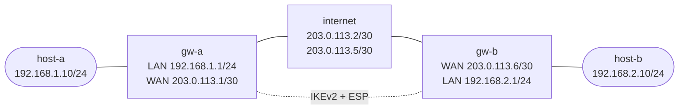

# IPsec Site-to-Site Tunnel — Practice Lab

Build a policy-based IKEv2 site-to-site IPsec tunnel between two native VyOS
gateways. You will establish one IKE security association (SA), protect the two
private LANs with one child SA, prove encryption from both counters and a WAN
capture, and use layer-specific evidence to recover from an opaque negotiation
failure.

**Lab type:** Build

## Outcome

By the end, you can build and verify an IKEv2/ESP tunnel, explain why traffic
selectors do not replace routing, distinguish an underlay failure from an IKE
or child-SA failure, and repair a proposal mismatch without saving broken
state.

## Prerequisites

- ContainerLab and Docker
- `vyos:local`, built from a VyOS ISO as described in the
  [VyOS platform notes](../../docs/platforms/vyos.md)
- `ops-lab:local` for the incidental hosts and transit router:

  ```bash
  docker build -t ops-lab:local images/ops-lab/
  ```

`labs/ipsec-basics/Dockerfile` is retained as the build context for the separate
`flexvpn-basics` lab. This lab does not use `ipsec-lab:local`.

## Preconfigured state

Both gateways start with only interfaces, addressing, public-peer routes, and
remote-private routes. The hosts have addresses and default routes. The
transit node forwards public traffic and ESP but drops clear-text packets with
private sources or destinations. No startup file contains IKE, ESP,
authentication, peer, or selector configuration.

## Topology



| Link | Subnet | Endpoints |
|------|--------|-----------|
| Site A LAN | `192.168.1.0/24` | `host-a eth1 .10` ↔ `gw-a eth1 .1` |
| West WAN | `203.0.113.0/30` | `gw-a eth2 .1` ↔ `internet eth1 .2` |
| East WAN | `203.0.113.4/30` | `internet eth2 .5` ↔ `gw-b eth1 .6` |
| Site B LAN | `192.168.2.0/24` | `gw-b eth2 .1` ↔ `host-b eth1 .10` |

| Node | Role | Platform | What is preconfigured |
|------|------|----------|-----------------------|
| `gw-a` | Learned Site A gateway | Native `vyos:local` | Addresses and explicit routes to the peer WAN and remote LAN |
| `gw-b` | Learned Site B gateway | Native `vyos:local` | Addresses and explicit routes to the peer WAN and remote LAN |
| `internet` | Incidental public transit | `ops-lab:local` Linux | WAN addresses, forwarding, public/ESP permit rules, private-source and private-destination drops |
| `host-a` | Incidental endpoint | `ops-lab:local` Linux | Address and default route to `gw-a` |
| `host-b` | Incidental endpoint | `ops-lab:local` Linux | Address and default route to `gw-b` |

The gateway startup configurations contain no IPsec answer. The explicit
remote-private routes provide a valid forwarding decision; once installed,
the IPsec policies intercept the selected packets. The transit drops prove
that those routes cannot carry private traffic in clear text.

## How to use this lab

This is a **practice lab**, not a tutorial. Each task gives you an
**objective** and **hints** — your job is to produce the configuration.

- **Predict before you configure.** When a task asks for a prediction,
  commit to an answer before touching the CLI. Being wrong and finding out
  why is the point.
- **Open the hints before the solution.** The solution toggle is the answer
  key — use it to check your work or when genuinely stuck, not as step one.
- **Verify like an operator.** After each task, prove the state is what you
  think it is with `show` commands before moving on.

## Deploy

From the repository root:

```bash
./scripts/lab.sh deploy ipsec-basics
./scripts/lab.sh cli ipsec-basics gw-a
```

Use a second terminal for the other gateway or an endpoint when a task asks
for simultaneous evidence:

```bash
./scripts/lab.sh cli ipsec-basics gw-b
./scripts/lab.sh bash ipsec-basics host-a
```

## Task 1 — Establish the routed before-state

**Objective:** Prove local LAN and public underlay reachability, then show that
the remote LAN remains unavailable with no security associations. Identify
which evidence belongs to routing and which belongs to IPsec.

**Predict first:** The gateways already have routes to the remote private
LANs. Will a host-to-host ping cross the transit network in clear text, and
will either gateway have an IKE or child SA?

<details markdown="1">
<summary>Hints</summary>

- From `gw-a`, compare the route to `192.168.2.0/24` with a ping to the remote
  public endpoint `203.0.113.6`.
- From each host, test its local gateway and the opposite host.
- Inspect both `show vpn ike sa` and `show vpn ipsec sa` before configuring.

</details>

<details markdown="1">
<summary>Solution</summary>

```bash
./scripts/lab.sh cmd ipsec-basics host-a ping -c2 -W2 192.168.1.1
./scripts/lab.sh cmd ipsec-basics host-a ping -c2 -W2 192.168.2.10
./scripts/lab.sh cli ipsec-basics gw-a
show ip route 192.168.2.0/24
ping 203.0.113.6 count 2
show vpn ike sa
show vpn ipsec sa
```

Repeat the SA inspection on `gw-b`.

</details>

<details markdown="1">
<summary>Check your work</summary>

The local-gateway and remote-public pings succeed. The remote-private route is
present, but host-to-host traffic fails and both SA tables are empty. Routing
therefore reaches the peer WAN; it does not create protection. The transit
node drops packets whose source or destination is in `192.168.0.0/16`, so the
unprotected selected flow cannot leak across it.

</details>

## Task 2 — Build one matching IKEv2 tunnel

**Objective:** Configure matching IKEv2, ESP, authentication, peer, and
traffic-selector state on both gateways. Make `gw-a` the initiator and `gw-b`
passive so the pair forms exactly one IKE SA and one child SA per gateway.

**Predict first:** Which mismatches prevent the IKE SA itself from forming,
and which are evaluated only when the child SA is negotiated?

<details markdown="1">
<summary>Hints</summary>

- Build an `ike-group` with IKEv2 and proposal 10, then an `esp-group` in
  tunnel mode with its own proposal 10.
- The peer needs local and remote WAN identities, a shared PSK reference, the
  two groups, and a numbered local/remote prefix pair.
- Use `connection-type initiate` only on `gw-a`; the valid passive value on
  this VyOS release is `none`.
- Mirror addresses, identities, and selectors carefully on `gw-b`.

</details>

<details markdown="1">
<summary>Solution</summary>

On `gw-a`:

```vyos
configure
set vpn ipsec ike-group SITE-TO-SITE key-exchange 'ikev2'
set vpn ipsec ike-group SITE-TO-SITE proposal 10 encryption 'aes256'
set vpn ipsec ike-group SITE-TO-SITE proposal 10 hash 'sha256'
set vpn ipsec ike-group SITE-TO-SITE proposal 10 dh-group '14'
set vpn ipsec esp-group SITE-TO-SITE mode 'tunnel'
set vpn ipsec esp-group SITE-TO-SITE proposal 10 encryption 'aes256'
set vpn ipsec esp-group SITE-TO-SITE proposal 10 hash 'sha256'
set vpn ipsec authentication psk LAB-PSK id '203.0.113.1'
set vpn ipsec authentication psk LAB-PSK id '203.0.113.6'
set vpn ipsec authentication psk LAB-PSK secret 'LabSecret123'
set vpn ipsec site-to-site peer GW-B remote-address '203.0.113.6'
set vpn ipsec site-to-site peer GW-B authentication mode 'pre-shared-secret'
set vpn ipsec site-to-site peer GW-B authentication local-id '203.0.113.1'
set vpn ipsec site-to-site peer GW-B authentication remote-id '203.0.113.6'
set vpn ipsec site-to-site peer GW-B connection-type 'initiate'
set vpn ipsec site-to-site peer GW-B local-address '203.0.113.1'
set vpn ipsec site-to-site peer GW-B ike-group 'SITE-TO-SITE'
set vpn ipsec site-to-site peer GW-B default-esp-group 'SITE-TO-SITE'
set vpn ipsec site-to-site peer GW-B tunnel 1 local prefix '192.168.1.0/24'
set vpn ipsec site-to-site peer GW-B tunnel 1 remote prefix '192.168.2.0/24'
commit
save
```

On `gw-b`:

```vyos
configure
set vpn ipsec ike-group SITE-TO-SITE key-exchange 'ikev2'
set vpn ipsec ike-group SITE-TO-SITE proposal 10 encryption 'aes256'
set vpn ipsec ike-group SITE-TO-SITE proposal 10 hash 'sha256'
set vpn ipsec ike-group SITE-TO-SITE proposal 10 dh-group '14'
set vpn ipsec esp-group SITE-TO-SITE mode 'tunnel'
set vpn ipsec esp-group SITE-TO-SITE proposal 10 encryption 'aes256'
set vpn ipsec esp-group SITE-TO-SITE proposal 10 hash 'sha256'
set vpn ipsec authentication psk LAB-PSK id '203.0.113.1'
set vpn ipsec authentication psk LAB-PSK id '203.0.113.6'
set vpn ipsec authentication psk LAB-PSK secret 'LabSecret123'
set vpn ipsec site-to-site peer GW-A remote-address '203.0.113.1'
set vpn ipsec site-to-site peer GW-A authentication mode 'pre-shared-secret'
set vpn ipsec site-to-site peer GW-A authentication local-id '203.0.113.6'
set vpn ipsec site-to-site peer GW-A authentication remote-id '203.0.113.1'
set vpn ipsec site-to-site peer GW-A connection-type 'none'
set vpn ipsec site-to-site peer GW-A local-address '203.0.113.6'
set vpn ipsec site-to-site peer GW-A ike-group 'SITE-TO-SITE'
set vpn ipsec site-to-site peer GW-A default-esp-group 'SITE-TO-SITE'
set vpn ipsec site-to-site peer GW-A tunnel 1 local prefix '192.168.2.0/24'
set vpn ipsec site-to-site peer GW-A tunnel 1 remote prefix '192.168.1.0/24'
commit
save
```

The repository helper applies the same complete answer idempotently:

```bash
./labs/ipsec-basics/solution.sh
```

</details>

<details markdown="1">
<summary>Check your work</summary>

On each gateway, `show vpn ike sa` reports exactly one `up` IKEv2 SA using
`AES_CBC_256`, `HMAC_SHA2_256_128`, and `MODP_2048`, with NAT-T `no`.
`show vpn ipsec sa` reports one up child named `GW-B-tunnel-1` on `gw-a` or
`GW-A-tunnel-1` on `gw-b`, using `AES_CBC_256/HMAC_SHA2_256_128`. Both
host-to-host directions now work.

IKE proposal, identity, or PSK incompatibility prevents the IKE SA. ESP or
selector incompatibility is encountered while building the child SA. The two
tables identify the failed layer before you inspect configuration.

</details>

## Task 3 — Prove policy ownership and encrypted forwarding

**Objective:** Correlate the VyOS connection and policy views with Linux XFRM
state, generate traffic in both directions, and capture the WAN to prove the
private packet is carried as outer ESP rather than visible ICMP.

**Predict first:** Which addresses should be visible on `internet eth1`, and
should a capture there expose either private address or the inner ICMP type?

<details markdown="1">
<summary>Hints</summary>

- Compare `show vpn ipsec connections` and `show vpn ipsec policy` with
  `sudo ip -s xfrm state` and `sudo ip -s xfrm policy`.
- Record packet counters, send traffic in both directions, then look again.
- A bounded repository helper captures only enough packets to prove the outer
  protocol and exits on its own.

</details>

<details markdown="1">
<summary>Solution</summary>

On both gateways, use the corresponding views:

```vyos
show vpn ipsec connections
show vpn ipsec policy
sudo ip -s xfrm state
sudo ip -s xfrm policy
```

Generate and grade bidirectional traffic, then capture the public link:

```bash
./scripts/lab.sh cmd ipsec-basics host-a ping -c3 -W2 192.168.2.10
./scripts/lab.sh cmd ipsec-basics host-b ping -c3 -W2 192.168.1.10
./labs/ipsec-basics/capture.sh
./labs/ipsec-basics/check.sh
```

</details>

<details markdown="1">
<summary>Check your work</summary>

Each gateway owns policies for the exact `192.168.1.0/24` ↔
`192.168.2.0/24` selector pair, two directional ESP states, and increasing
inbound and outbound counters. The bounded capture shows only public
`203.0.113.1` ↔ `203.0.113.6` ESP packets. It contains neither private
address nor readable ICMP, which is direct evidence that ESP protects the
selected flow.

</details>

## Task 4 — Diagnose an opaque negotiation outage

**Objective:** Arm one controlled fault, preserve evidence without inspecting
the helper or configuration, and determine whether routing, IKE, or the child
SA is the first failed layer.

**Predict first:** If remote-public reachability survives but both SA tables
empty, which layer should you investigate first? What log evidence would
distinguish proposal negotiation from packet loss?

<details markdown="1">
<summary>Hints</summary>

- Begin only from a passing Task 3 checker, then run
  `./labs/ipsec-basics/break.sh` once.
- Preserve remote-public ping, both SA tables, and recent IPsec log evidence
  before looking at any active configuration.
- Search recent `journalctl` output for the negotiation result. Do not infer a
  route failure from the host symptom alone.

</details>

<details markdown="1">
<summary>Solution</summary>

```bash
./labs/ipsec-basics/break.sh
./scripts/lab.sh cli ipsec-basics gw-a
ping 203.0.113.6 count 2
show vpn ike sa
show vpn ipsec sa
exit
docker exec clab-ipsec-basics-gw-a journalctl --no-pager -n 200 | grep NO_PROPOSAL_CHOSEN
```

The fault changes only `gw-b`'s live IKE proposal hash from `sha256` to
`sha512`, then explicitly resets `gw-a`'s peer. It never saves the broken
state. `gw-a` still reaches the remote public endpoint, but there is no IKE SA,
no child SA, and no private-LAN forwarding. `NO_PROPOSAL_CHOSEN` identifies an
IKE proposal mismatch, not an underlay outage.

</details>

<details markdown="1">
<summary>Check your work</summary>

The public ping succeeds while both SA tables have no up entry and both
host-to-host directions fail. The initiating gateway logs
`NO_PROPOSAL_CHOSEN`. That evidence localizes the first failure to IKE
negotiation: a child SA and encrypted data plane cannot exist until IKE is up.

</details>

## Task 5 — Repair the minimum failed layer

**Objective:** Restore only the mismatched live proposal value, force a clean
renegotiation, and re-run the complete evidence sequence. Keep the saved
healthy configuration unchanged.

**Predict first:** After the IKE proposal matches again, which state should
return first: remote-public routing, the IKE SA, the child SA, or private-LAN
traffic?

<details markdown="1">
<summary>Hints</summary>

- Compare the live IKE proposal with the saved healthy reference on `gw-b`.
- Change only the mismatched leaf and reset the initiating peer.
- Recheck the layers in dependency order: underlay → IKE → child SA → data
  plane → outer-only capture.

</details>

<details markdown="1">
<summary>Solution</summary>

Use the idempotent minimal repair:

```bash
./labs/ipsec-basics/repair.sh
```

The equivalent native changes are:

```vyos
# gw-b
configure
set vpn ipsec ike-group SITE-TO-SITE proposal 10 hash 'sha256'
commit
exit

# gw-a operational mode
reset vpn ipsec site-to-site peer GW-B
```

Do not save during the repair: the fault was live-only and the saved state is
already the healthy reference.

</details>

<details markdown="1">
<summary>Check your work</summary>

The underlay never needed recovery. The IKE SA returns first, the child SA is
then installed, and selected private traffic resumes. Run the checker and
bounded capture again; a complete recovery restores the exact healthy grade,
positive counters in both directions, and outer-only ESP evidence.

</details>

## Verification

Run this complete lifecycle from the repository root:

```bash
./labs/ipsec-basics/solution.sh
./labs/ipsec-basics/check.sh
./labs/ipsec-basics/capture.sh
./labs/ipsec-basics/break.sh

# Preserve public reachability, empty SA tables, and NO_PROPOSAL_CHOSEN first.

./labs/ipsec-basics/repair.sh
./labs/ipsec-basics/check.sh
./labs/ipsec-basics/capture.sh
```

A healthy result requires one IKE SA and one child SA per gateway, exact
algorithms/identities/selectors, matching saved configuration, two-way private
traffic, positive XFRM counters, deterministic transit policy, and a bounded
outer-only ESP capture.

## Troubleshooting

| Symptom | Likely layer/cause | Focused action |
|---------|--------------------|----------------|
| Remote public WAN is unreachable | Addressing, link, or static underlay route | Repair WAN reachability before inspecting IPsec |
| Public WAN works; no IKE SA; `NO_PROPOSAL_CHOSEN` | IKE encryption/hash/DH mismatch | Compare the IKE proposals and change only the mismatch |
| IKE is up; no child SA | ESP proposal or selector mismatch | Compare ESP groups and mirrored local/remote prefixes |
| Both SAs are up; one private flow is absent | Route, selector ownership, or host default route | Compare route lookup, `show vpn ipsec policy`, and `ip -s xfrm policy` |
| Traffic works but the capture shows UDP/4500 instead of native ESP | NAT-T is active in the path | Verify NAT placement and treat UDP/4500 as ESP encapsulation, not clear text |
| `break.sh` refuses to arm | Pre-existing fault or unhealthy prerequisite | Run the minimal repair or full solution, then require a passing checker |

## Challenge questions

No answers are provided; reason from the state and evidence you built.

1. You add a third protected subnet at each site. Which routing and selector
   changes are required, and how would you prove no new flow can cross in clear
   text during the change?
2. A deployment has an up IKE SA but repeatedly fails child-SA negotiation.
   Rank the three most useful evidence sources from this lab and justify the
   order.
3. Compare policy-based IPsec with a route-based VTI design for carrying a
   dynamic routing protocol. Which operational boundary changes, and what new
   failure mode appears?
4. Insert NAT between the peers. Predict the observable protocol/port changes,
   identify what remains encrypted, and design a capture that proves both.

## Cleanup

```bash
./scripts/lab.sh destroy ipsec-basics
```

Confirm no `clab-ipsec-basics-*` containers remain before deploying another
lab.

## Extensions

- Replace the shared secret with certificate authentication and compare
  identity evidence and failure scope.
- Rebuild the protected path as route-based IPsec with VTIs, then run a
  routing protocol across it.
- Add a NAT node deliberately and validate native ESP-to-UDP/4500 transition
  without changing the inner selectors.
