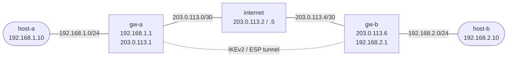

# IPsec Site-to-Site Tunnel — VyOS Practice Lab

Build an IKEv2 site-to-site IPsec tunnel between two VyOS gateways. IP addressing and basic routing are pre-configured; your task is to add the IPsec policy and verify encrypted LAN-to-LAN reachability.

## Topology



| Node | Interface | Address | Role |
|------|-----------|---------|------|
| host-a | eth1 | 192.168.1.10/24 | LAN A client |
| gw-a | eth1 | 192.168.1.1/24 | LAN A gateway / IPsec peer |
| gw-a | eth2 | 203.0.113.1/30 | WAN side |
| internet | eth1 | 203.0.113.2/30 | Simulated internet |
| internet | eth2 | 203.0.113.5/30 | Simulated internet |
| gw-b | eth1 | 203.0.113.6/30 | WAN side |
| gw-b | eth2 | 192.168.2.1/24 | LAN B gateway / IPsec peer |
| host-b | eth1 | 192.168.2.10/24 | LAN B client |

## Deploy and Access

```bash
# Build the VyOS image first if you do not already have it
docker build -t vyos:local -f Dockerfile.vyos .

./scripts/lab.sh deploy ipsec-basics

./scripts/lab.sh cli ipsec-basics gw-a
./scripts/lab.sh cli ipsec-basics gw-b
./scripts/lab.sh bash ipsec-basics host-a
```

## What Is Preconfigured

- `host-a` and `host-b` have IP addressing and default routes.
- `gw-a` and `gw-b` have LAN/WAN addressing and default routes.
- `internet` is forwarding between the two WAN segments.
- Cross-LAN traffic does not work until you build the IPsec tunnel.

Verify the base state before configuring IPsec:

```bash
./scripts/lab.sh cmd ipsec-basics host-a ping -c2 192.168.1.1
./scripts/lab.sh cmd ipsec-basics host-b ping -c2 192.168.2.1
./scripts/lab.sh cmd ipsec-basics host-a ping -c2 192.168.2.10
```

The first two pings should succeed. The last one should fail.

## Configure gw-a

Open a VyOS CLI on `gw-a`:

```bash
./scripts/lab.sh cli ipsec-basics gw-a
```

Apply this configuration:

```vyos
configure

set vpn ipsec ike-group SITE-TO-SITE key-exchange 'ikev2'
set vpn ipsec ike-group SITE-TO-SITE proposal 10 encryption 'aes256'
set vpn ipsec ike-group SITE-TO-SITE proposal 10 hash 'sha256'
set vpn ipsec ike-group SITE-TO-SITE proposal 10 dh-group '14'

set vpn ipsec esp-group SITE-TO-SITE mode 'tunnel'
set vpn ipsec esp-group SITE-TO-SITE proposal 10 encryption 'aes256'
set vpn ipsec esp-group SITE-TO-SITE proposal 10 hash 'sha256'

set vpn ipsec authentication psk LAB-PSK id '203.0.113.1'
set vpn ipsec authentication psk LAB-PSK id '203.0.113.6'
set vpn ipsec authentication psk LAB-PSK secret 'LabSecret123'

set vpn ipsec site-to-site peer GW-B remote-address '203.0.113.6'
set vpn ipsec site-to-site peer GW-B authentication mode 'pre-shared-secret'
set vpn ipsec site-to-site peer GW-B authentication local-id '203.0.113.1'
set vpn ipsec site-to-site peer GW-B authentication remote-id '203.0.113.6'
set vpn ipsec site-to-site peer GW-B connection-type 'initiate'
set vpn ipsec site-to-site peer GW-B local-address '203.0.113.1'
set vpn ipsec site-to-site peer GW-B ike-group 'SITE-TO-SITE'
set vpn ipsec site-to-site peer GW-B default-esp-group 'SITE-TO-SITE'
set vpn ipsec site-to-site peer GW-B tunnel 1 local prefix '192.168.1.0/24'
set vpn ipsec site-to-site peer GW-B tunnel 1 remote prefix '192.168.2.0/24'

commit
save
exit
```

## Configure gw-b

Open a VyOS CLI on `gw-b`:

```bash
./scripts/lab.sh cli ipsec-basics gw-b
```

Apply the mirrored configuration:

```vyos
configure

set vpn ipsec ike-group SITE-TO-SITE key-exchange 'ikev2'
set vpn ipsec ike-group SITE-TO-SITE proposal 10 encryption 'aes256'
set vpn ipsec ike-group SITE-TO-SITE proposal 10 hash 'sha256'
set vpn ipsec ike-group SITE-TO-SITE proposal 10 dh-group '14'

set vpn ipsec esp-group SITE-TO-SITE mode 'tunnel'
set vpn ipsec esp-group SITE-TO-SITE proposal 10 encryption 'aes256'
set vpn ipsec esp-group SITE-TO-SITE proposal 10 hash 'sha256'

set vpn ipsec authentication psk LAB-PSK id '203.0.113.1'
set vpn ipsec authentication psk LAB-PSK id '203.0.113.6'
set vpn ipsec authentication psk LAB-PSK secret 'LabSecret123'

set vpn ipsec site-to-site peer GW-A remote-address '203.0.113.1'
set vpn ipsec site-to-site peer GW-A authentication mode 'pre-shared-secret'
set vpn ipsec site-to-site peer GW-A authentication local-id '203.0.113.6'
set vpn ipsec site-to-site peer GW-A authentication remote-id '203.0.113.1'
set vpn ipsec site-to-site peer GW-A connection-type 'initiate'
set vpn ipsec site-to-site peer GW-A local-address '203.0.113.6'
set vpn ipsec site-to-site peer GW-A ike-group 'SITE-TO-SITE'
set vpn ipsec site-to-site peer GW-A default-esp-group 'SITE-TO-SITE'
set vpn ipsec site-to-site peer GW-A tunnel 1 local prefix '192.168.2.0/24'
set vpn ipsec site-to-site peer GW-A tunnel 1 remote prefix '192.168.1.0/24'

commit
save
exit
```

## Verify

On either VyOS gateway:

```bash
show vpn ike sa
show vpn ipsec sa
show configuration commands | match vpn\ ipsec
```

Healthy output should show:

- an established IKE SA between `203.0.113.1` and `203.0.113.6`
- a child SA protecting `192.168.1.0/24 <-> 192.168.2.0/24`

Test end-to-end reachability:

```bash
./scripts/lab.sh cmd ipsec-basics host-a ping -c3 192.168.2.10
./scripts/lab.sh cmd ipsec-basics host-b ping -c3 192.168.1.10
```

## Packet Capture

Capture on the simulated internet node to see the encrypted WAN traffic:

```bash
./scripts/lab.sh capture ipsec-basics internet eth1 'udp port 500 or udp port 4500 or esp'
```

You should see:

- UDP/500 or UDP/4500 during IKE negotiation
- ESP after the tunnel is up and traffic is flowing

The protected LAN traffic itself is not visible on the WAN capture because it is encrypted inside ESP.

## Cleanup

```bash
./scripts/lab.sh destroy ipsec-basics
```
