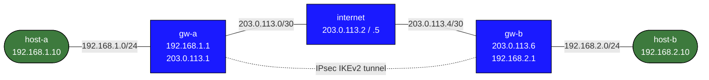

# IPsec Site-to-Site Tunnel — Practice Lab

Build an IKEv2 IPsec tunnel between two sites using StrongSwan.
IP addressing and routing are pre-configured. You write the IPsec config.

---

## Topology



| Node     | Interface | Address          | Role                        |
|----------|-----------|------------------|-----------------------------|
| host-a   | eth1      | 192.168.1.10/24  | LAN A client                |
| gw-a     | eth1      | 192.168.1.1/24   | LAN A gateway / IPsec peer  |
| gw-a     | eth2      | 203.0.113.1/30   | WAN (public) side           |
| internet | eth1      | 203.0.113.2/30   | Simulated internet          |
| internet | eth2      | 203.0.113.5/30   | Simulated internet          |
| gw-b     | eth1      | 203.0.113.6/30   | WAN (public) side           |
| gw-b     | eth2      | 192.168.2.1/24   | LAN B gateway / IPsec peer  |
| host-b   | eth1      | 192.168.2.10/24  | LAN B client                |

---

## Deploy and access

```bash
# Build the custom image first (only needed once)
docker build -t ipsec-lab:local labs/ipsec-basics/

# Deploy the lab
./scripts/lab.sh deploy ipsec-basics

# Open a shell on any node
./scripts/lab.sh bash ipsec-basics gw-a
./scripts/lab.sh bash ipsec-basics host-a
```

---

## Before you start — verify connectivity

Before configuring IPsec, confirm the pre-configured IP addressing works.

```bash
# From gw-a — can you reach gw-b's public IP through the internet node?
./scripts/lab.sh cmd ipsec-basics gw-a ping -c2 203.0.113.6

# From host-a — can you reach gw-a?
./scripts/lab.sh cmd ipsec-basics host-a ping -c2 192.168.1.1
```

Cross-LAN pings (host-a → host-b) will fail until the IPsec tunnel is up — that's expected.

---

## Step 1 — Configure the IPsec tunnel on gw-a

<details>
<summary>Show configuration</summary>

Open a shell on gw-a:
```bash
./scripts/lab.sh bash ipsec-basics gw-a
```

</details>

### /etc/ipsec.conf

```
config setup
    charondebug="ike 1, knl 1, cfg 0"

conn site-to-site
    auto=start
    keyexchange=ikev2
    type=tunnel
    authby=secret

    # This side (Site A)
    left=%defaultroute
    leftid=203.0.113.1
    leftsubnet=192.168.1.0/24

    # Remote side (Site B)
    right=203.0.113.6
    rightid=203.0.113.6
    rightsubnet=192.168.2.0/24

    # Cipher suites
    ike=aes256-sha256-modp2048!
    esp=aes256-sha256!

    dpdaction=restart
```

### /etc/ipsec.secrets

```
203.0.113.1 203.0.113.6 : PSK "LabSecret123"
```

### Start StrongSwan

```bash
ipsec start
```

---

## Step 2 — Configure the IPsec tunnel on gw-b

<details>
<summary>Show configuration</summary>

Open a shell on gw-b:
```bash
./scripts/lab.sh bash ipsec-basics gw-b
```

</details>

### /etc/ipsec.conf

```
config setup
    charondebug="ike 1, knl 1, cfg 0"

conn site-to-site
    auto=start
    keyexchange=ikev2
    type=tunnel
    authby=secret

    # This side (Site B)
    left=%defaultroute
    leftid=203.0.113.6
    leftsubnet=192.168.2.0/24

    # Remote side (Site A)
    right=203.0.113.1
    rightid=203.0.113.1
    rightsubnet=192.168.1.0/24

    # Cipher suites
    ike=aes256-sha256-modp2048!
    esp=aes256-sha256!

    dpdaction=restart
```

### /etc/ipsec.secrets

```
203.0.113.6 203.0.113.1 : PSK "LabSecret123"
```

### Start StrongSwan

```bash
ipsec start
```

---

## Step 3 — Verify the tunnel

### On either gateway

```bash
# Check tunnel status — look for INSTALLED, TUNNEL, ESTABLISHED
ipsec status

# Full details including SA lifetimes and traffic counters
ipsec statusall

# Show installed kernel XFRM states (the actual encryption SAs)
ip xfrm state

# Show installed kernel XFRM policies (traffic selectors)
ip xfrm policy

# Show routes — StrongSwan installs routes for the remote subnet
ip route show
```

A healthy tunnel shows:
- `ipsec status` reports the connection as `ESTABLISHED` and `INSTALLED`
- `ip xfrm state` shows two SAs (one for each direction) with `aes_cbc` / `hmac_sha256`
- `ip route show` has a route for `192.168.2.0/24` (on gw-a) or `192.168.1.0/24` (on gw-b) via `eth2`

### End-to-end ping

```bash
# From host-a to host-b through the tunnel
./scripts/lab.sh cmd ipsec-basics host-a ping -c3 192.168.2.10

# Or from a shell on host-a
ping 192.168.2.10
```

A successful ping means:
- IKE negotiated a Security Association (IKEv2 exchange visible in charon.log)
- ESP is encrypting traffic between gw-a (203.0.113.1) and gw-b (203.0.113.6)
- StrongSwan installed kernel policies matching 192.168.1.0/24 ↔ 192.168.2.0/24

---

## Useful commands reference

### StrongSwan

```bash
ipsec start                   # Start the daemon and bring up `auto=start` connections
ipsec stop                    # Stop the daemon
ipsec restart                 # Reload config and restart

ipsec status                  # Connection summary
ipsec statusall               # Full details (SAs, ciphers, traffic)
ipsec up   site-to-site       # Manually initiate the connection
ipsec down site-to-site       # Tear down the connection

tail -f /var/log/syslog       # Live StrongSwan logs (charon output)
```

### Kernel XFRM (IPsec state machine)

```bash
ip xfrm state                 # SAs: encryption keys, SPI, lifetime
ip xfrm policy                # Policies: which traffic is encrypted
ip xfrm state flush           # Clear all SAs (forces re-keying)
ip xfrm monitor               # Watch SA/policy events in real time
```

### Traffic inspection

```bash
# Watch encrypted ESP traffic on the WAN interface
tcpdump -i eth2 esp

# Watch decrypted traffic on the LAN interface
tcpdump -i eth1 icmp
```

---

## Troubleshooting

**Tunnel stuck in CONNECTING**
- Verify gw-a can reach gw-b's WAN IP: `ping 203.0.113.6` from gw-a
- Check that `ipsec start` was run on both gateways
- Check logs: `tail -50 /var/log/syslog`

**PSK mismatch / AUTH_FAILED**
- The `leftid` / `rightid` in ipsec.conf must match exactly what's in ipsec.secrets
- The PSK string must be identical on both sides

**Tunnel ESTABLISHED but pings fail**
- Check `ip xfrm policy` on both gateways — policies for 192.168.1.0/24 ↔ 192.168.2.0/24 should be present
- Check `ip route show` — a route for the remote subnet should be installed
- Run `tcpdump -i eth2 esp` on a gateway to confirm ESP packets are flowing

**ipsec command not found / charon not starting**
- Check the image was built correctly: `docker run --rm ipsec-lab:local ipsec version`

**Tunnel drops after a few seconds**
- Possibly a DPD or rekey issue; try `dpdaction=none` to disable dead peer detection while debugging
