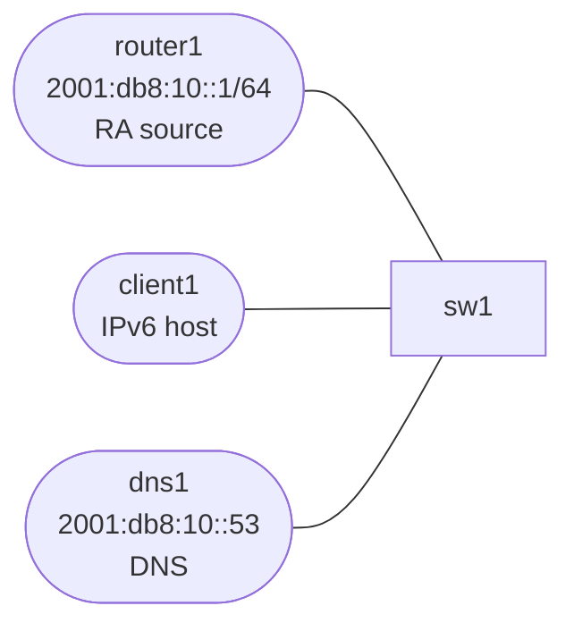

# ipv6-access-services

This lab shifts IPv6 coverage from routing protocols to host behavior:

- router advertisements
- SLAAC
- default gateway learning
- DNS over IPv6

## Topology



## Build and Deploy

```bash
docker build -t ops-lab:local images/ops-lab/
sudo containerlab deploy -t labs/ipv6-access-services/topology.clab.yml
```

## What Is Prebuilt

- L2 access segment
- router IPv6 address on the LAN
- DNS server at `2001:db8:10::53`
- no router advertisements running yet

## Tasks

### 1. Start router advertisements

On `router1`:

```bash
docker exec clab-ipv6-access-services-router1 radvd -C /etc/radvd.conf
```

### 2. Verify client SLAAC behavior

```bash
docker exec clab-ipv6-access-services-client1 ip -6 addr show dev eth1
docker exec clab-ipv6-access-services-client1 ip -6 route
```

You should see:

- a global address from `2001:db8:10::/64`
- a default route learned from the router advertisement

### 3. Test IPv6 DNS directly

```bash
docker exec clab-ipv6-access-services-client1 dig @2001:db8:10::53 app6.internal.lab AAAA
docker exec clab-ipv6-access-services-client1 ping -6 -c 2 2001:db8:10::53
```

## What This Lab Teaches

- host IPv6 behavior begins with RA, not with an IGP
- SLAAC success and DNS success are separate checks
- IPv6 operational work often starts at the access edge, not the core
