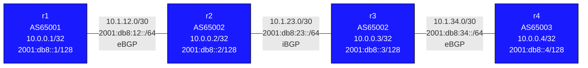

# Lab: ipv6-bgp

## Purpose
Learn IPv6 BGP (MP-BGP for IPv6 unicast, RFC 4760). Understand the two approaches to carrying
IPv6 routes: native IPv6 BGP sessions, and IPv4 sessions with IPv6 NLRI using the extended
next-hop capability. Explore dual-stack BGP peering and how iBGP next-hop handling differs
for IPv6.

## Topology



| Link | IPv4 Subnet | IPv6 Subnet | Left | Right | Session |
|------|------------|-------------|------|-------|---------|
| r1:Ethernet1 -- r2:Ethernet1 | 10.1.12.0/30 (.1/.2) | 2001:db8:12::/64 (::1/::2) | r1 | r2 | eBGP 65001-65002 |
| r2:Ethernet2 -- r3:Ethernet1 | 10.1.23.0/30 (.1/.2) | 2001:db8:23::/64 (::1/::2) | r2 | r3 | iBGP 65002 |
| r3:Ethernet2 -- r4:Ethernet1 | 10.1.34.0/30 (.1/.2) | 2001:db8:34::/64 (::1/::2) | r3 | r4 | eBGP 65002-65003 |

| Node | IPv4 Loopback | IPv6 Loopback | AS |
|------|--------------|---------------|----|
| r1   | 10.0.0.1/32  | 2001:db8::1/128 | 65001 |
| r2   | 10.0.0.2/32  | 2001:db8::2/128 | 65002 |
| r3   | 10.0.0.3/32  | 2001:db8::3/128 | 65002 |
| r4   | 10.0.0.4/32  | 2001:db8::4/128 | 65003 |

## Deploy / Destroy

```bash
sudo containerlab deploy -t topology.clab.yml
sudo containerlab destroy -t topology.clab.yml
```

Access a node:
```bash
docker exec -it clab-ipv6-bgp-r1 Cli
```

## What You Configure

All IP addresses are pre-configured. Choose one of the two approaches below (or try both):

---

### Approach A: IPv4 sessions + extended next-hop for IPv6

This is the most common enterprise/ISP approach. BGP sessions run over IPv4, but also carry
IPv6 prefixes. In EOS, when an IPv4 BGP neighbor is activated in `address-family ipv6`, EOS
automatically negotiates the extended next-hop capability (RFC 5549). No explicit capability
command is needed.

On **r1** (AS65001):
```
r1# configure
r1(config)# router bgp 65001
r1(config-router-bgp)# bgp router-id 10.0.0.1
r1(config-router-bgp)# neighbor 10.1.12.2 remote-as 65002
r1(config-router-bgp)# address-family ipv4
r1(config-router-bgp-af)# neighbor 10.1.12.2 activate
r1(config-router-bgp-af)# network 10.0.0.1/32
r1(config-router-bgp-af)# exit
r1(config-router-bgp)# address-family ipv6
r1(config-router-bgp-af)# neighbor 10.1.12.2 activate
r1(config-router-bgp-af)# network 2001:db8::1/128
r1(config-router-bgp-af)# end
r1# write memory
```

On **r2** (AS65002, eBGP to r1, iBGP to r3):
```
r2# configure
r2(config)# router bgp 65002
r2(config-router-bgp)# bgp router-id 10.0.0.2
r2(config-router-bgp)# neighbor 10.1.12.1 remote-as 65001
r2(config-router-bgp)# neighbor 10.1.23.2 remote-as 65002
r2(config-router-bgp)# address-family ipv4
r2(config-router-bgp-af)# neighbor 10.1.12.1 activate
r2(config-router-bgp-af)# neighbor 10.1.23.2 activate
r2(config-router-bgp-af)# neighbor 10.1.23.2 next-hop-self
r2(config-router-bgp-af)# network 10.0.0.2/32
r2(config-router-bgp-af)# exit
r2(config-router-bgp)# address-family ipv6
r2(config-router-bgp-af)# neighbor 10.1.12.1 activate
r2(config-router-bgp-af)# neighbor 10.1.23.2 activate
r2(config-router-bgp-af)# neighbor 10.1.23.2 next-hop-self
r2(config-router-bgp-af)# network 2001:db8::2/128
r2(config-router-bgp-af)# end
r2# write memory
```

On **r3** (AS65002, iBGP to r2, eBGP to r4):
```
r3# configure
r3(config)# router bgp 65002
r3(config-router-bgp)# bgp router-id 10.0.0.3
r3(config-router-bgp)# neighbor 10.1.23.1 remote-as 65002
r3(config-router-bgp)# neighbor 10.1.34.2 remote-as 65003
r3(config-router-bgp)# address-family ipv4
r3(config-router-bgp-af)# neighbor 10.1.23.1 activate
r3(config-router-bgp-af)# neighbor 10.1.23.1 next-hop-self
r3(config-router-bgp-af)# neighbor 10.1.34.2 activate
r3(config-router-bgp-af)# network 10.0.0.3/32
r3(config-router-bgp-af)# exit
r3(config-router-bgp)# address-family ipv6
r3(config-router-bgp-af)# neighbor 10.1.23.1 activate
r3(config-router-bgp-af)# neighbor 10.1.23.1 next-hop-self
r3(config-router-bgp-af)# neighbor 10.1.34.2 activate
r3(config-router-bgp-af)# network 2001:db8::3/128
r3(config-router-bgp-af)# end
r3# write memory
```

On **r4** (AS65003):
```
r4# configure
r4(config)# router bgp 65003
r4(config-router-bgp)# bgp router-id 10.0.0.4
r4(config-router-bgp)# neighbor 10.1.34.1 remote-as 65002
r4(config-router-bgp)# address-family ipv4
r4(config-router-bgp-af)# neighbor 10.1.34.1 activate
r4(config-router-bgp-af)# network 10.0.0.4/32
r4(config-router-bgp-af)# exit
r4(config-router-bgp)# address-family ipv6
r4(config-router-bgp-af)# neighbor 10.1.34.1 activate
r4(config-router-bgp-af)# network 2001:db8::4/128
r4(config-router-bgp-af)# end
r4# write memory
```

---

### Approach B: Native IPv6 BGP sessions

Sessions run over IPv6 link-local or global IPv6 addresses. Only IPv6 prefixes are carried.

On **r1**:
```
r1# configure
r1(config)# router bgp 65001
r1(config-router-bgp)# bgp router-id 10.0.0.1
r1(config-router-bgp)# neighbor 2001:db8:12::2 remote-as 65002
r1(config-router-bgp)# address-family ipv6
r1(config-router-bgp-af)# neighbor 2001:db8:12::2 activate
r1(config-router-bgp-af)# network 2001:db8::1/128
r1(config-router-bgp-af)# end
r1# write memory
```

On **r2**:
```
r2# configure
r2(config)# router bgp 65002
r2(config-router-bgp)# bgp router-id 10.0.0.2
r2(config-router-bgp)# neighbor 2001:db8:12::1 remote-as 65001
r2(config-router-bgp)# neighbor 2001:db8:23::2 remote-as 65002
r2(config-router-bgp)# address-family ipv6
r2(config-router-bgp-af)# neighbor 2001:db8:12::1 activate
r2(config-router-bgp-af)# neighbor 2001:db8:23::2 activate
r2(config-router-bgp-af)# neighbor 2001:db8:23::2 next-hop-self
r2(config-router-bgp-af)# network 2001:db8::2/128
r2(config-router-bgp-af)# end
r2# write memory
```

(Continue similarly for r3 and r4 with their respective IPv6 peer addresses.)

## Verification Commands

```
# Session state across all address families
show bgp summary

# Session state for IPv4 AF
show bgp ipv4 unicast summary

# Session state for IPv6 AF
show bgp ipv6 unicast summary

# Full IPv6 BGP table (routes with IPv6 next-hops)
show bgp ipv6 unicast

# Specific prefix
show bgp ipv6 unicast 2001:db8::4/128

# Installed routes
show ipv6 route bgp

# Ping test (IPv6 end-to-end)
ping ipv6 2001:db8::4

# Check neighbor capability negotiation (shows extended-nexthop if Approach A)
show bgp neighbors 10.1.12.2
```

## Concepts

### MP-BGP (Multiprotocol BGP, RFC 4760)

Standard BGP only carries IPv4 prefixes. MP-BGP extends BGP to support multiple address
families (AFIs) and sub-address families (SAFIs):

```
AFI  1 = IPv4
AFI  2 = IPv6
SAFI 1 = Unicast
SAFI 2 = Multicast
SAFI 4 = Labeled Unicast (BGP-LU)
SAFI 128 = L3VPN (VPNv4/VPNv6)
```

IPv6 unicast = AFI 2, SAFI 1. It is negotiated during BGP OPEN via the
Multiprotocol Extensions capability.

### Approach A: Extended Next-Hop

When using IPv4 sessions to carry IPv6 prefixes, there's a problem: the BGP next-hop
attribute is an IPv4 address, but IPv6 prefixes need an IPv6 next-hop.

RFC 5549 (extended next-hop) allows an IPv4 BGP session to carry an IPv6 next-hop in the
MP_REACH_NLRI attribute. In EOS, when an IPv4 BGP neighbor is activated under
`address-family ipv6`, EOS automatically negotiates this capability — no explicit
`capability extended-nexthop` command is needed.

This approach is popular because:
- Existing IPv4 peering infrastructure is reused
- Single session carries both IPv4 and IPv6 NLRI

### Approach B: Native IPv6 Sessions

Sessions run over IPv6 addresses. No special capabilities needed. Simpler in pure
IPv6 environments, but requires separate IPv6 management plane.

### iBGP Next-Hop Self for IPv6

Same as IPv4: when r2 learns an IPv6 route from eBGP peer r1 (with r1's IPv6 address
as next-hop), it must change the next-hop for iBGP peers who cannot reach r1 directly.
Use `next-hop-self` on iBGP sessions.

### IPv6 Forwarding

IPv6 routing is enabled via `ipv6 unicast-routing` in each node's startup-config
(pre-configured).

## Challenge Exercises

1. Compare the BGP next-hop in `show bgp ipv6 unicast` for Approach A vs Approach B.
   In Approach A, what IPv6 address appears as the next-hop?

2. Configure only the IPv6 AF (omit IPv4 unicast AF entirely) and verify IPv4 routes
   are NOT exchanged. Does ping to IPv4 loopbacks still work?

3. Add route-maps to set communities on IPv6 prefixes. Use `show bgp ipv6 unicast`
   to verify community values are carried.

4. Try using link-local IPv6 addresses (fe80::) as BGP peer addresses in Approach B.
   What additional configuration is needed? (`update-source Ethernet1`)

5. Enable both Approach A and Approach B simultaneously on the same router (different
   neighbors). Can a router maintain both session types at the same time?
