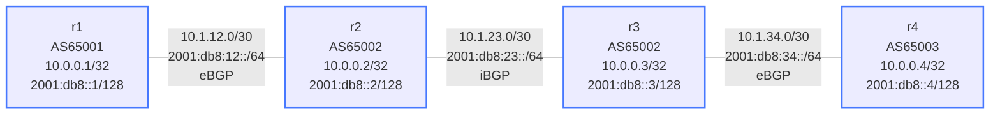

# IPv6 BGP (MP-BGP) — Practice Lab

There are two ways to carry IPv6 routes in BGP: native IPv6 sessions, and
the more common trick of reusing an IPv4 session to also carry IPv6 NLRI
with an IPv6 next-hop (RFC 5549 extended next-hop). In this lab you build
one of them across a three-AS chain, then deliberately compare the
next-hop behavior of both — which is where the real understanding lives.

## Topology



| Link | IPv4 Subnet | IPv6 Subnet | Session |
|------|------------|-------------|---------|
| r1 -- r2 | 10.1.12.0/30 | 2001:db8:12::/64 | eBGP 65001-65002 |
| r2 -- r3 | 10.1.23.0/30 | 2001:db8:23::/64 | iBGP 65002 |
| r3 -- r4 | 10.1.34.0/30 | 2001:db8:34::/64 | eBGP 65002-65003 |

| Node | IPv4 Loopback | IPv6 Loopback | AS |
|------|--------------|---------------|----|
| r1   | 10.0.0.1/32  | 2001:db8::1/128 | 65001 |
| r2   | 10.0.0.2/32  | 2001:db8::2/128 | 65002 |
| r3   | 10.0.0.3/32  | 2001:db8::3/128 | 65002 |
| r4   | 10.0.0.4/32  | 2001:db8::4/128 | 65003 |

All IP addressing and `ipv6 unicast-routing` are pre-configured.

## How to use this lab

This is a **practice lab**, not a tutorial. Each task gives you an
**objective** and **hints** — your job is to produce the configuration.

- **Predict before you configure**, **open hints before the solution**,
  and **verify** with `show bgp ipv6 unicast` after each step.

## Background — MP-BGP

Standard BGP carries only IPv4. MP-BGP (RFC 4760) adds address families:
IPv6 unicast is AFI 2 / SAFI 1, negotiated in the OPEN message. The two
designs:

- **Extended next-hop (RFC 5549):** an IPv4-peered session also activated
  in `address-family ipv6` carries IPv6 prefixes with an IPv6 next-hop.
  EOS negotiates the capability automatically — no explicit command. Reuses
  existing IPv4 peering; one session for both families.
- **Native IPv6 sessions:** peer over IPv6 addresses, carry only IPv6.
  Simpler conceptually, separate management plane.

`next-hop-self` matters for IPv6 iBGP exactly as it does for IPv4.

---

## Task 1 — Carry IPv6 over the IPv4 sessions (extended next-hop)

**Objective:** Build eBGP/iBGP IPv4 sessions along the chain, activate each
neighbor in **both** the ipv4 and ipv6 address families, advertise each
loopback in its family, and apply `next-hop-self` on the AS65002 iBGP
sessions. Success: `ping ipv6 2001:db8::4` works from r1.

**Predict first:** the BGP session to r1 is built on the IPv4 address
10.1.12.x. When r2 receives 2001:db8::1/128 over that session, what will
the **next-hop** be — an IPv4 address, or an IPv6 one? How can an
IPv4-transport session even express an IPv6 next-hop?

<details markdown="1">
<summary>Hints</summary>

- Define neighbors with IPv4 `remote-as`, then activate them under *both*
  `address-family ipv4` and `address-family ipv6`.
- IPv6 prefixes go in as `network 2001:db8::X/128` under the ipv6 AF.
- Apply `next-hop-self` in *each* AF on r2/r3's iBGP session — it's
  per-family.
- EOS auto-negotiates RFC 5549; no capability command needed.

</details>

<details markdown="1">
<summary>Solution</summary>

On **r1** (r4 mirrors; r2/r3 add their iBGP neighbor + next-hop-self):
```text
router bgp 65001
   bgp router-id 10.0.0.1
   neighbor 10.1.12.2 remote-as 65002
   address-family ipv4
      neighbor 10.1.12.2 activate
      network 10.0.0.1/32
   address-family ipv6
      neighbor 10.1.12.2 activate
      network 2001:db8::1/128
```

On **r2** (the iBGP next-hop handling, both families):
```text
router bgp 65002
   bgp router-id 10.0.0.2
   neighbor 10.1.12.1 remote-as 65001
   neighbor 10.1.23.2 remote-as 65002
   address-family ipv4
      neighbor 10.1.12.1 activate
      neighbor 10.1.23.2 activate
      neighbor 10.1.23.2 next-hop-self
      network 10.0.0.2/32
   address-family ipv6
      neighbor 10.1.12.1 activate
      neighbor 10.1.23.2 activate
      neighbor 10.1.23.2 next-hop-self
      network 2001:db8::2/128
```

(r3 is symmetric — iBGP to r2, eBGP to r4; r4 is like r1.)

</details>

<details markdown="1">
<summary>Check your work</summary>

`show bgp ipv6 unicast 2001:db8::1/128` on r2 shows an **IPv6** next-hop
even though the session runs over IPv4 — that's RFC 5549 at work: the
MP_REACH_NLRI attribute carries an IPv6 next-hop independent of the
session's transport address. `show bgp neighbors 10.1.12.2` confirms the
extended-nexthop capability was negotiated. One session, both families,
and the next-hop the *data plane* needs (IPv6) rather than the one the
*control plane* used (IPv4).

</details>

---

## Task 2 — Forget next-hop-self in the IPv6 AF

**Objective:** On r2, remove `next-hop-self` from the iBGP IPv6 session to
r3 only (leave the IPv4 AF intact), and diagnose from r3.

**Predict first:** which prefixes break on r3 — IPv4, IPv6, or both? And
will the IPv4 reachability survive because you left its next-hop-self
alone?

<details markdown="1">
<summary>What you should observe</summary>

Only the **IPv6** routes learned via r2 from the eBGP peer r1 go
inaccessible on r3: they now carry r1's IPv6 link address as next-hop,
which r3 (inside AS65002) has no route to. IPv4 keeps working — the two
address families are configured and resolved independently, so a fix or a
mistake in one doesn't touch the other. The trap in dual-stack BGP is
exactly this: people copy their IPv4 policy mentally and forget that
`next-hop-self`, route-maps, and activation are all *per-AF*. Restore it
and re-verify.

</details>

---

## Task 3 — Prove the families are independent

**Objective:** Confirm that IPv4 and IPv6 reachability are carried
separately by examining the per-AF tables.

<details markdown="1">
<summary>Hints</summary>

- `show bgp ipv4 unicast summary` vs `show bgp ipv6 unicast summary` —
  same neighbors, separate prefix counts.
- `show bgp ipv6 unicast` and `show ipv6 route bgp`.

</details>

<details markdown="1">
<summary>Check your work</summary>

Each neighbor appears in both summaries with its own accepted-prefix
count; the IPv6 table has IPv6 next-hops, the IPv4 table IPv4 ones. The
session is shared, the NLRI is not. This is why you can run IPv6-only on
some peers and dual-stack on others over identical infrastructure — the
capability negotiation per AF decides what each session carries.

</details>

---

## Verification Commands

```text
show bgp summary                        # all AFs
show bgp ipv6 unicast summary           # IPv6 session/prefix state
show bgp ipv6 unicast                   # IPv6 table with next-hops
show bgp ipv6 unicast 2001:db8::4/128   # one prefix
show ipv6 route bgp                      # installed IPv6 routes
ping ipv6 2001:db8::4                     # end-to-end
show bgp neighbors 10.1.12.2             # capability negotiation (extended-nexthop)
```

---

## Challenge questions

No answers provided — reason them through.

1. In Task 1 an IPv4-transport session carried an IPv6 next-hop. Argue
   the operational case *for* RFC 5549 (one session, reuse IPv4 infra)
   and *against* it (debugging, vendor support, what happens the day you
   want to turn off IPv4). Which would you pick for a greenfield network?
2. Approach B uses native IPv6 sessions, often on **link-local**
   (`fe80::`) peer addresses. What extra neighbor config does link-local
   peering require, and what failure does using link-local *avoid*
   compared to global-address peering?
3. A dual-stack peer reports "IPv4 is fine, IPv6 routes missing." Give an
   ordered checklist of the per-AF things that could be wrong (activation,
   next-hop-self, route-map, capability) and the single show command that
   tests each.
4. SAFI values include unicast (1), labeled-unicast (4), and L3VPN (128).
   Explain how the same MP-BGP machinery you used here generalizes to
   VPNv6, and why "one BGP, many address families" is considered one of
   the most important design decisions in the protocol's history.

## Reference — Native IPv6 sessions (Approach B)

If you'd rather peer over IPv6 directly, define neighbors by their IPv6
address and activate only the ipv6 AF:

<details markdown="1">
<summary>Example (r1 ↔ r2)</summary>

```text
! r1
router bgp 65001
   neighbor 2001:db8:12::2 remote-as 65002
   address-family ipv6
      neighbor 2001:db8:12::2 activate
      network 2001:db8::1/128
! r2
router bgp 65002
   neighbor 2001:db8:12::1 remote-as 65001
   neighbor 2001:db8:23::2 remote-as 65002
   address-family ipv6
      neighbor 2001:db8:12::1 activate
      neighbor 2001:db8:23::2 activate
      neighbor 2001:db8:23::2 next-hop-self
      network 2001:db8::2/128
```

</details>
