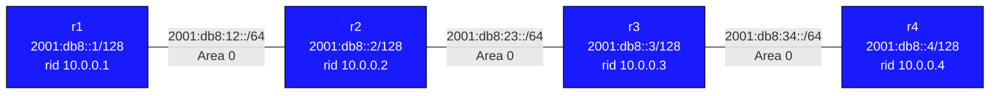

# Lab: OSPFv3 (OSPF for IPv6)

## Overview

This lab teaches OSPFv3 — the version of OSPF that runs natively over IPv6.
While OSPFv2 carries IPv4 prefixes and uses IPv4 transport, OSPFv3 uses IPv6
link-local addresses for all neighbor communication and supports IPv6 topology.

## Topology



All four routers are in OSPFv3 **area 0**.

### Link Addresses

| Link       | Subnet              | r-left  | r-right |
|------------|---------------------|---------|---------|
| r1–r2      | 2001:db8:12::/64    | ::1     | ::2     |
| r2–r3      | 2001:db8:23::/64    | ::1     | ::2     |
| r3–r4      | 2001:db8:34::/64    | ::1     | ::2     |

### Loopbacks

| Router | IPv6 Loopback    | IPv4 (router-id) |
|--------|------------------|------------------|
| r1     | 2001:db8::1/128  | 10.0.0.1/32      |
| r2     | 2001:db8::2/128  | 10.0.0.2/32      |
| r3     | 2001:db8::3/128  | 10.0.0.3/32      |
| r4     | 2001:db8::4/128  | 10.0.0.4/32      |

## Key Differences: OSPFv3 vs OSPFv2

| Feature              | OSPFv2                        | OSPFv3                          |
|----------------------|-------------------------------|----------------------------------|
| Transport            | IPv4                          | IPv6 (link-local next-hops)      |
| Neighbor discovery   | IPv4 hello packets            | IPv6 multicast (ff02::5, ff02::6)|
| Router-ID            | IPv4 address                  | Still 32-bit (IPv4 form)         |
| Authentication       | MD5/plaintext in protocol     | Uses IPsec (AH/ESP)              |
| Configuration        | `network` statements          | Per-interface (`ipv6 ospf6 area`)|
| LSA types            | 1–7                           | Different set (see below)        |

### OSPFv3 Uses Link-Local Addresses

In OSPFv3, hellos and LSAs are exchanged using **fe80::** link-local addresses.
You will see fe80 addresses in neighbor tables even though you configured global
addresses on the interfaces. This is expected and correct.

The global IPv6 prefixes are advertised as reachability information inside LSAs,
but the forwarding next-hop in the routing table will be the neighbor's link-local
address.

### Router-ID Is Still 32-bit

Even though OSPFv3 is for IPv6, the router-id is still a 32-bit value expressed
in dotted-decimal notation (like an IPv4 address). You must either:
- Assign an IPv4 address to the loopback and let OSPFv3 auto-select it, or
- Explicitly set `ospf6 router-id X.X.X.X` in the `router ospf6` block.

This lab uses IPv4 loopbacks (10.0.0.x/32) solely for router-id purposes.

### OSPFv3 LSA Types

| Type | Name                      | Purpose                                      |
|------|---------------------------|----------------------------------------------|
| 1    | Router-LSA                | Per-router link state (no addresses)         |
| 2    | Network-LSA               | DR/BDR info for broadcast segments           |
| 8    | Link-LSA                  | Link-local address + prefixes on the link    |
| 9    | Intra-Area-Prefix-LSA     | IPv6 prefixes associated with a router/link  |
| 3    | Inter-Area-Prefix-LSA     | Summary prefixes from other areas            |
| 5    | AS-External-LSA           | External routes (type E1/E2)                 |

Notice that Router-LSAs in OSPFv3 do NOT contain IP addresses — addressing is
separated into Intra-Area-Prefix-LSAs. This is a major architectural change from OSPFv2.

## Your Task

IP addresses are pre-configured on all interfaces. You need to configure OSPFv3
on each router to bring up adjacencies and exchange routes.

### Step 1: Enable OSPFv3 on interfaces

On each router, in Cli:

```
configure terminal

interface Ethernet1
 ipv6 ospf6 area 0

interface Loopback0
 ipv6 ospf6 area 0
 ipv6 ospf6 passive
```

Transit routers (r2, r3) also need Ethernet2:

```
interface Ethernet2
 ipv6 ospf6 area 0
```

### Step 2: Create the OSPFv3 process

```
router ospf6
 ospf6 router-id 10.0.0.X
```

Replace X with the router number (1 for r1, etc.).

### Step 3: Verify

```
show ipv6 ospf6 neighbor
show ipv6 ospf6 database
show ipv6 route ospf6
ping6 2001:db8::4       (from r1, should reach r4's loopback)
```

## Verification Commands

```
# Neighbor adjacencies (look for FULL state)
show ipv6 ospf6 neighbor

# Full LSDB
show ipv6 ospf6 database

# Only router-LSAs
show ipv6 ospf6 database router

# Intra-area prefix LSAs (where IPv6 prefixes live)
show ipv6 ospf6 database intra-prefix

# Routing table (OSPFv3-learned routes)
show ipv6 route ospf6

# All IPv6 routes
show ipv6 route

# OSPFv3 interface state (DR/BDR election, hello timers)
show ipv6 ospf6 interface

# OSPFv3 areas
show ipv6 ospf6
```

## Expected Results

After full configuration, each router should:
- Have 1–2 OSPFv3 neighbors in FULL state
- See all four loopbacks (2001:db8::1 through ::4) in the IPv6 routing table
- Be able to ping any loopback from any router

End-to-end test from r1:
```
ping6 2001:db8::4
traceroute6 2001:db8::4
```

## Stretch Goals

1. **Change hello/dead timers**: `ipv6 ospf6 hello-interval 1` and observe faster convergence
2. **OSPFv3 stub area**: Convert area 0 to another area and make area 0 stub — observe how
   Intra-Area-Prefix-LSAs change
3. **Redistribute connected**: `redistribute connected` in `router ospf6` and observe AS-External-LSAs
4. **Passive interfaces**: Make Ethernet1 on r1 passive — what happens to the r1-r2 adjacency?
5. **IPsec authentication**: OSPFv3 uses IPsec for security. Research how to configure
   `ipv6 ospf6 authentication ipsec spi` on an interface.

## Troubleshooting

**No neighbors forming:**
- Check that both ends have `ipv6 ospf6 area 0` on the connecting interface
- Verify IPv6 link-local addresses are assigned: `show interface Ethernet1`
- Check that ospf6 is running: `show ip ospf6` in Cli

**Routes missing:**
- Check if loopback has `ipv6 ospf6 area 0`
- Check for passive flag: loopback should be passive, transit interfaces should not

**Router-id not set:**
- OSPFv3 will not start without a router-id. Must be set explicitly if no IPv4 address exists.
- Error: `ospf6 router-id is not set` means you need `ospf6 router-id X.X.X.X`
