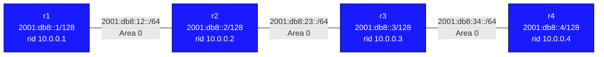

# OSPFv3 (OSPF for IPv6) — Practice Lab

OSPFv3 is OSPF rebuilt for IPv6: same SPF, same areas — but neighbor
traffic rides IPv6 link-local addresses, addressing is split out of the
Router-LSA into new LSA types, and configuration moves from `network`
statements to per-interface enablement. You bring up a four-router chain
and prove each of those differences in the LSDB and routing table.

## Topology



All four routers are in OSPFv3 **area 0**. IP addressing is pre-configured.

### Link Addresses

| Link       | Subnet              | r-left  | r-right |
|------------|---------------------|---------|---------|
| r1–r2      | 2001:db8:12::/64    | ::1     | ::2     |
| r2–r3      | 2001:db8:23::/64    | ::1     | ::2     |
| r3–r4      | 2001:db8:34::/64    | ::1     | ::2     |

### Loopbacks

| Router | IPv6 Loopback    | IPv4 (router-id) |
|--------|------------------|------------------|
| r1     | 2001:db8::1/128  | 10.0.0.1/32      |
| r2     | 2001:db8::2/128  | 10.0.0.2/32      |
| r3     | 2001:db8::3/128  | 10.0.0.3/32      |
| r4     | 2001:db8::4/128  | 10.0.0.4/32      |

## How to use this lab

This is a **practice lab**, not a tutorial. Each task gives you an
**objective** and **hints** — your job is to produce the configuration.

- **Predict before you configure.** When a task asks for a prediction,
  commit to an answer before touching the CLI. Being wrong and finding out
  why is the point.
- **Open the hints before the solution.** The solution toggle is the answer
  key — use it to check your work or when genuinely stuck, not as step one.
- **Verify like an operator.** After each task, prove the state is what you
  think it is with `show` commands before moving on.

## Background — what changed from OSPFv2

| Feature              | OSPFv2                        | OSPFv3                          |
|----------------------|-------------------------------|----------------------------------|
| Transport            | IPv4                          | IPv6 (link-local next-hops)      |
| Neighbor discovery   | IPv4 hello packets            | IPv6 multicast (ff02::5, ff02::6)|
| Router-ID            | IPv4 address                  | Still 32-bit (IPv4 form)         |
| Authentication       | MD5/plaintext in protocol     | Uses IPsec (AH/ESP)              |
| Configuration        | `network` statements          | Per-interface (`ipv6 ospf6 area`)|
| LSA types            | 1–7                           | Different set (see below)        |

| Type | Name                      | Purpose                                      |
|------|---------------------------|----------------------------------------------|
| 1    | Router-LSA                | Per-router link state (**no addresses**)     |
| 2    | Network-LSA               | DR/BDR info for broadcast segments           |
| 8    | Link-LSA                  | Link-local address + prefixes on the link    |
| 9    | Intra-Area-Prefix-LSA     | IPv6 prefixes associated with a router/link  |
| 3    | Inter-Area-Prefix-LSA     | Summary prefixes from other areas            |
| 5    | AS-External-LSA           | External routes (type E1/E2)                 |

The tasks make you find these differences yourself — don't just take the
tables on faith.

## Deploy

```bash
sudo containerlab deploy -t topology.clab.yml
```

---

## Task 1 — Enable OSPFv3 end to end

**Objective:** Configure OSPFv3 on all four routers — every transit
interface and loopback in area 0, loopbacks passive, router-ids set to the
IPv4 loopback values. Success: every router shows `FULL` neighbors and
`ping6 2001:db8::4` works from r1.

**Predict first:** the transit links are IPv6-only, yet the router-id you
must set is `10.0.0.X` — a 32-bit dotted-decimal value. Why does an IPv6
routing protocol still need one, and what happens on a router where you
skip it and no IPv4 address exists?

<details>
<summary>Hints</summary>

- There are no `network` statements in OSPFv3 — area membership is
  per-interface: `ipv6 ospf6 area 0`.
- Loopbacks take an extra `ipv6 ospf6 passive`.
- The process block is `router ospf6` with `ospf6 router-id 10.0.0.X`.
- r2 and r3 have two transit interfaces each (Ethernet1 and Ethernet2).

</details>

<details>
<summary>Solution</summary>

On each router (Ethernet2 additionally on r2 and r3):

```text
configure terminal

interface Ethernet1
 ipv6 ospf6 area 0

interface Ethernet2
 ipv6 ospf6 area 0

interface Loopback0
 ipv6 ospf6 area 0
 ipv6 ospf6 passive

router ospf6
 ospf6 router-id 10.0.0.X     ! X = router number
```

</details>

<details>
<summary>Check your work</summary>

`show ipv6 ospf6 neighbor` shows `FULL` (one neighbor on r1/r4, two on
r2/r3); all four loopbacks appear in `show ipv6 route ospf6`; `ping6
2001:db8::4` from r1 succeeds.

Prediction answer: the router-id is just a 32-bit unique *identifier* —
LSAs are keyed by it, DR election uses it — and the protocol kept the
dotted-decimal form from OSPFv2. It was never really an "address." With
no IPv4 address to borrow and no explicit `ospf6 router-id`, the process
refuses to start (`ospf6 router-id is not set`). On IPv6-only devices,
setting it explicitly is mandatory, not optional hygiene.

</details>

---

## Task 2 — Find the link-local machinery

**Objective:** Prove that OSPFv3 neighbor communication and forwarding
next-hops use `fe80::` link-local addresses, not the global addresses you
see in the topology table.

**Predict first:** in r1's IPv6 routing table, what next-hop will the
route to 2001:db8::4 show — r2's global address `2001:db8:12::2`, or
something else?

<details>
<summary>Hints</summary>

- `show ipv6 ospf6 neighbor` — read the address column.
- `show ipv6 route ospf6` — read the `via` field.
- For the wire truth: from a Linux shell on a node, `tcpdump -i eth1
  ip6 proto 89 -n` and look at source/destination of hellos.

</details>

<details>
<summary>Check your work</summary>

Next-hops and neighbor addresses are all `fe80::...` — and hellos on the
wire go from the sender's link-local address to multicast `ff02::5`.
Global prefixes appear only as *payload* (reachability information inside
LSAs). This separation is deliberate: the adjacency and forwarding hop
work even if global addressing is renumbered, which is exactly the
flexibility IPv6 renumbering was designed around. If you expected
`2001:db8:12::2`, this is the v3 habit to unlearn.

</details>

---

## Task 3 — Where did the addresses go? Dissect the LSDB

**Objective:** Show that in OSPFv3 the Router-LSA carries *no prefixes*,
and find which LSA types actually carry the addressing.

<details>
<summary>Hints</summary>

- `show ipv6 ospf6 database router detail` — look for any 2001:db8
  prefix. You won't find one.
- `show ipv6 ospf6 database intra-prefix` — there they are.
- Also look at `show ipv6 ospf6 database link` (Type-8) for the per-link
  link-local info.

</details>

<details>
<summary>Check your work</summary>

Router-LSAs describe pure topology (who links to whom, at what cost);
Intra-Area-Prefix-LSAs (Type-9) carry the global prefixes; Link-LSAs
(Type-8) carry link-local details. Consequence worth registering: when an
address changes in OSPFv3, only a prefix LSA reflows — the Router-LSA is
untouched, so **no SPF run is needed** on other routers. In OSPFv2 the
same change rewrites the Router-LSA and triggers domain-wide SPF.
Separating topology from addressing was the architectural fix.

</details>

---

## Task 4 — Break it: passive where it shouldn't be

**Objective:** On r2, set `ipv6 ospf6 passive` on Ethernet1 (the link to
r1). Diagnose from **r1**'s perspective, then repair.

**Predict first:** will r1 report the neighbor as down immediately, stuck
in a partial state, or gone after a timeout? And will r1 still have a
route to 2001:db8:12::/64?

<details>
<summary>What you should observe</summary>

Passive means r2 stops sending hellos on that interface but keeps
advertising its prefix. From r1: the neighbor survives until the dead
interval expires, then disappears entirely; routes through r2 vanish with
it. Interestingly the *prefix* 2001:db8:12::/64 is still in r2's LSAs —
reachability info without an adjacency is useless, which is precisely why
"passive" belongs on edge/loopback interfaces only. Repair with `no ipv6
ospf6 passive` on r2's Ethernet1 and watch the adjacency walk back to
FULL.

</details>

---

## Verification

```text
show ipv6 ospf6 neighbor                  # FULL everywhere
show ipv6 ospf6 database                  # full LSDB
show ipv6 ospf6 database intra-prefix     # where IPv6 prefixes live
show ipv6 route ospf6                     # via fe80:: next-hops
show ipv6 ospf6 interface                 # DR/BDR, timers
ping6 2001:db8::4                         # from r1
traceroute6 2001:db8::4                   # from r1
```

Expected end state: 1–2 FULL neighbors per router, all four loopbacks in
every routing table, any-to-any loopback pings.

---

## Challenge questions

No answers provided — reason them through.

1. OSPFv2 carried MD5 authentication inside the protocol; OSPFv3 dropped
   it in favor of IPsec. What did the protocol designers gain by
   delegating security to the IP layer, and what operational pain did
   they create? (Modern routers added Authentication Trailer support back
   — why?)
2. A dual-stack network runs OSPFv2 for IPv4 and OSPFv3 for IPv6 over the
   same links. The IPv4 adjacency is up but the IPv6 one is down on a
   given link. List three causes that would break v3 *without* breaking
   v2 on the same physical interface.
3. Two routers in this lab accidentally get the same `ospf6 router-id`.
   Neither shares a link. Describe the symptoms you'd expect and explain
   why duplicate router-ids are more insidious between *non-adjacent*
   routers than adjacent ones.
4. Using what Task 3 showed about topology/addressing separation, explain
   why renumbering a /64 on one OSPFv3 link is operationally cheap, then
   identify what *would* still cause a domain-wide SPF run.

---

## Stretch goals

1. **Faster convergence:** `ipv6 ospf6 hello-interval 1` — measure failure
   detection before and after.
2. **Stub behavior:** move r3–r4 into area 1, make it stub, and watch the
   Inter-Area-Prefix-LSAs change.
3. **Externals:** `redistribute connected` under `router ospf6` and
   inspect the AS-External-LSAs.
4. **IPsec auth:** research `ipv6 ospf6 authentication ipsec spi` and what
   key management it implies.

## Troubleshooting

**No neighbors forming:**
- Check that both ends have `ipv6 ospf6 area 0` on the connecting interface
- Verify IPv6 link-local addresses are assigned: `show interface Ethernet1`
- Check that ospf6 is running: `show ipv6 ospf6`

**Routes missing:**
- Check if loopback has `ipv6 ospf6 area 0`
- Check for passive flag: loopback should be passive, transit interfaces should not

**Router-id not set:**
- OSPFv3 will not start without a router-id; set `ospf6 router-id X.X.X.X`
  explicitly when no IPv4 address exists
