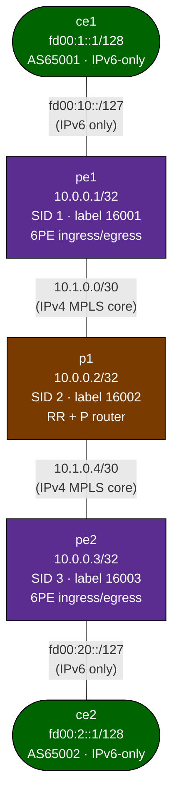

# IPv6 Transition Mechanisms Lab

This lab demonstrates **6PE (RFC 4798)** — carrying IPv6 prefixes across an
IPv4-only MPLS/SR core using BGP labeled-unicast. A companion section covers
**NAT64/DNS64** conceptually (Jool installation required; see below).

## How to use this lab

This is a **practice lab** on a working 6PE build — you observe and explain
rather than configure. At each verification step, **predict the output
first** (especially the IPv4-mapped next-hop and the two-label stack),
then check against the "Expected" note. The challenge questions are where
you reason without scaffolding.

---

## Background: Why Transition Mechanisms?

The IPv4 address space is exhausted. As networks migrate to IPv6, operators
face a period where:

- Some networks are IPv6-only (new deployments, mobile)
- Some networks remain IPv4-only (legacy infrastructure, servers)
- MPLS cores may be IPv4-only but must carry IPv6 customer traffic

Transition mechanisms solve the coexistence problem:

| Mechanism | Problem it solves |
|-----------|-------------------|
| **6PE**   | IPv6 customer sites connected across IPv4 MPLS core |
| **6VPE**  | Same as 6PE but with VRF separation (RFC 4659) |
| **NAT64** | IPv6-only clients reaching IPv4-only servers |
| **DNS64** | Synthesizes AAAA records so IPv6-only hosts can resolve IPv4 servers |
| **DS-Lite** | IPv4 over IPv6 tunnels (ISP migration) |
| **MAP-E/T** | Stateless IPv4-in-IPv6 for ISP networks |

---

## Part 1: 6PE Lab (topology.clab.yml)

### What is 6PE?

6PE (RFC 4798) allows IPv6 prefixes to be transported across an IPv4-only MPLS
backbone. Key points:

- **No IPv6 in the core**: P routers handle only IPv4 labels; they never see
  IPv6 headers.
- **PE routers are dual-stack**: They have IPv4 on the core side and IPv6 on
  the CE side.
- **BGP labeled-unicast**: The `ipv6 labeled-unicast` address family distributes
  IPv6 prefixes with MPLS labels between PEs (similar to BGP-LU for IPv4).
- **Two-label stack**: Forwarding uses an outer SR/LDP label (to reach the remote
  PE) and an inner 6PE label (to identify the IPv6 prefix at egress).
- **IPv4-mapped next-hops**: The iBGP next-hop for an IPv6 prefix is the
  originating PE's IPv4 loopback, encoded as an IPv4-mapped IPv6 address
  (e.g., `10.0.0.1` becomes `::ffff:10.0.0.1`). In FRR 8.4 the PE does not
  rewrite the next-hop toward the RR on its own (`next-hop-self` is ignored
  for this AF) — the PE configs do it with an outbound route-map
  (`RR-6PE-OUT`).

### Topology



**Node roles:**

| Node | Role | Loopback | SID |
|------|------|----------|-----|
| pe1 | Provider Edge (6PE ingress/egress) | 10.0.0.1/32 | index 1 → label 16001 |
| p1  | P router + BGP Route Reflector | 10.0.0.2/32 | index 2 → label 16002 |
| pe2 | Provider Edge (6PE ingress/egress) | 10.0.0.3/32 | index 3 → label 16003 |
| ce1 | IPv6-only CE (AS65001) | fd00:1::1/128 | — |
| ce2 | IPv6-only CE (AS65002) | fd00:2::1/128 | — |

**Links:**

| Link | Subnet | Notes |
|------|--------|-------|
| ce1:eth1 — pe1:eth1 | fd00:10::/127 | IPv6 only, no IPv4 |
| pe1:eth2 — p1:eth1  | 10.1.0.0/30  | IPv4 MPLS core |
| p1:eth2  — pe2:eth1 | 10.1.0.4/30  | IPv4 MPLS core |
| pe2:eth2 — ce2:eth1 | fd00:20::/127 | IPv6 only, no IPv4 |

### Deploy

```bash
# Build the FRR image first (if not already done)
docker build -t frr-lab:local images/frr/

# Deploy
sudo containerlab deploy -t labs/ipv6-transition/topology.clab.yml
```

### Verification

Work through these checks in order to understand the full 6PE data plane.

#### Step 1: IS-IS adjacencies and SR labels (on pe1 or p1)

```
# Check IS-IS neighbours are up
show isis neighbor

# Verify IS-IS learned all loopbacks
show isis route

# Confirm MPLS label table has SR label entries
show mpls table

# Expected: label 16001 (pe1), 16002 (p1), 16003 (pe2) all installed
# Example on pe2:
#   16001  SR-IPv4  Swap 16001  via 10.1.0.5  eth1   (toward p1 -> pe1)
```

#### Step 2: BGP sessions

```
# On pe1: check both iBGP (to p1) and eBGP (to ce1) are Established
show bgp summary

# Expected output shows:
#   10.0.0.2   (p1 RR)         — state: Established
#   fd00:10::1 (ce1)           — state: Established
```

#### Step 3: 6PE routes on pe1 (routes received from ce1 via eBGP)

```
# On pe1: IPv6 labeled-unicast RIB
show bgp ipv6 labeled-unicast

# Expected: fd00:1::/48 and fd00:1::1/128 received from fd00:10::1 (ce1)
# These routes have been assigned a local label (the "6PE label")

show bgp ipv6 labeled-unicast fd00:1::/48
# Shows: Next Hop: fd00:10::1, Label: <6PE-label>
```

#### Step 4: 6PE routes on pe2 (routes reflected by p1)

**Predict first:** pe2 learns ce1's IPv6 prefix via BGP, but the core is
IPv4-only. What will the BGP *next-hop* for an IPv6 prefix look like on
pe2 — a normal IPv6 address, or something stranger? Write down the exact
form before you run the command.

```
# On pe2: should see ce1's prefixes with pe1's loopback as next-hop
show bgp ipv6 labeled-unicast

# Expected: fd00:1::/48 with:
#   Next Hop: ::ffff:10.0.0.1  (IPv4-mapped next-hop = pe1's loopback)
#   Label: <6PE-label assigned by pe1>

show bgp ipv6 labeled-unicast fd00:1::/48
```

#### Step 5: IPv6 FIB on PE2 (the forwarding entry)

```
# On pe2: check the IPv6 route for ce1's prefix
show ipv6 route fd00:1::/48

# Expected: route with MPLS label stack
#   fd00:1::/48 via ::ffff:10.0.0.1, label stack [<SR-label> <6PE-label>]
#   The SR label brings the packet to pe1; the 6PE label identifies the IPv6 dest.

show mpls table
# Shows local label bindings including the 6PE label for ce1's prefixes
```

> **Linux kernel caveat:** the BGP 6PE route you see here stays
> control-plane only. The Linux kernel cannot install an IPv6 route whose
> next-hop is an IPv4(-mapped) address, so zebra never programs
> `fd00:1::/48 via ::ffff:10.0.0.1` into the FIB (the nexthops show `r`
> for "recursive" but no `*` for "installed"). The deployed configs
> include labeled **static** routes (`show running-config | include ipv6 route`)
> that push the same SR label the BGP route resolves to — that is what
> actually forwards in Step 6. On hardware routers (or VPP/Cisco/Juniper)
> the BGP route itself would be installed.

#### Step 6: End-to-end connectivity

```
# Ping from ce1 loopback to ce2 loopback (crosses the IPv4 MPLS core)
# On ce1:
ping fd00:2::1 source fd00:1::1

# Ping the aggregate prefix
ping fd00:2::1

# Traceroute (note: intermediate hops show IPv4 addresses — the MPLS core
# is invisible at the IPv6 layer; you may see pe1 and pe2's IPv6 addresses)
traceroute fd00:2::1 source fd00:1::1
```

#### Step 7: Packet capture — see the label stack

```bash
# Capture on pe1:eth2 (the core-facing interface) while pinging from ce1
./scripts/lab.sh capture ipv6-transition pe1 eth2 "mpls"

# You should see:
#   Ethernet / IPv4 (10.1.0.1 -> 10.0.0.3) / MPLS label=16003 / MPLS label=<6PE> / IPv6
#   The inner IPv6 packet is invisible to p1 — it only sees the outer IPv4+MPLS headers.
```

### How 6PE Label Forwarding Works (Step by Step)

When ce1 pings fd00:2::1 (ce2's loopback):

```
1. ce1 sends:     [IPv6: fd00:1::1 -> fd00:2::1]
                  via fd00:10::0 (pe1)

2. pe1 receives IPv6 packet, looks up fd00:2::/48:
   - Found in BGP: label=<6PE-B> (assigned by pe2), NH=::ffff:10.0.0.3
   - Resolves ::ffff:10.0.0.3 via IS-IS/SR: push label 16003 (pe2's SID)
   - Pushes label stack: [16003 | <6PE-B>]
   - Forwards IPv4+MPLS frame to p1

3. p1 receives [label=16003 | <6PE-B> | IPv6-payload]:
   - IS-IS/SR: 16003 = pe2's node SID
   - Since p1 is the penultimate hop (PHP), swaps or pops outer label
   - Forwards to pe2

4. pe2 receives [<6PE-B> | IPv6-payload]:
   - 6PE-B is pe2's own label for fd00:2::/48
   - Pops label, forwards native IPv6 to ce2 via fd00:20::0

5. ce2 receives [IPv6: fd00:1::1 -> fd00:2::1]
```

The MPLS core (p1) never processes any IPv6 header.

---

## Part 2: NAT64 / DNS64 (Conceptual — Jool Required)

### What is NAT64?

NAT64 (RFC 6146) translates IPv6 packets from IPv6-only clients into IPv4
packets for IPv4-only servers. Combined with DNS64 (RFC 6147), which synthesizes
AAAA records from A records, it allows fully IPv6-only networks to reach the
legacy IPv4 internet.

### How it works

**The NAT64 prefix**: `64:ff9b::/96` (IANA-assigned Well-Known Prefix).
An IPv4 address `A.B.C.D` is represented as `64:ff9b::A.B.C.D` in IPv6.

**DNS64**: When an IPv6-only host resolves `example.com`:
1. DNS64 resolver receives the query.
2. If no AAAA record exists but an A record does (e.g., `93.184.216.34`):
3. DNS64 synthesizes: `64:ff9b::93.184.216.34` = `64:ff9b::5db8:d822`
4. Host sends IPv6 packets to `64:ff9b::5db8:d822`.

**NAT64 router**: When the NAT64 router sees a packet destined for `64:ff9b::/96`:
1. Extracts the IPv4 address from bits 96-128: `93.184.216.34`
2. Translates the IPv6 source to an IPv4 address from its NAT pool
3. Sends a normal IPv4 packet to `93.184.216.34`
4. Translates the IPv4 reply back to IPv6 and returns it to the host

### Topology (conceptual)

```
[host6 IPv6-only] ──── [nat64/dns64 router] ──── [host4 IPv4-only]
  fd00:1::2/64               Jool                  192.0.2.2/24
  DNS: fd00:1::1 (DNS64)
```

### Jool Implementation

[Jool](https://nicmx.github.io/Jool/) is the recommended Linux NAT64/DNS64
implementation. It uses a kernel module (`jool.ko`) and userspace daemon.

```bash
# Install Jool (Ubuntu/Debian — requires DKMS)
apt-get install jool-dkms jool-tools

# Load kernel module
modprobe jool

# Create NAT64 instance
jool instance add "default" --netfilter --pool6 64:ff9b::/96

# Add IPv4 pool (addresses to use for outbound IPv4)
jool -i "default" pool4 add 203.0.113.1

# On the IPv6 host, set default route via the nat64 router:
ip -6 route add default via fd00:1::1

# Verify: ping an IPv4 address using NAT64 prefix
ping6 64:ff9b::8.8.8.8   # -> translates to ping 8.8.8.8
```

**DNS64 with Unbound:**

```
server:
    interface: fd00:1::1
    access-control: fd00:1::/64 allow
    dns64-prefix: 64:ff9b::/96

module-config: "dns64 validator iterator"
```

### Why NAT64 is not included as a running topology

NAT64 via Jool requires:
1. The `jool.ko` kernel module (must be built for the host kernel)
2. A custom Docker image with Jool installed and the module loaded

On a standard `frr-lab:local` container the host kernel module would need to be
pre-installed, or the container would need `--privileged` + `--net=host` access.
The 6PE topology above is fully self-contained and demonstrates a more
operationally common IPv6 transition mechanism used in real SP networks.

---

## Challenge questions

No answers provided — reason them through.

1. The 6PE next-hop is `::ffff:10.0.0.1` (an IPv4-mapped IPv6 address).
   Explain *why* 6PE encodes the next-hop this way instead of using pe1's
   real IPv6 address, and what it lets the IPv4-only P routers avoid
   knowing.
2. Forwarding uses two labels (SR transport + 6PE). The P routers only
   ever look at the outer one. Walk through what each P router does with
   an IPv6 packet, and prove (from Step 7's capture) that no P router ever
   parses an IPv6 header.
3. 6PE carries IPv6 across an IPv4 core; 6VPE (RFC 4659) adds VRFs. Given
   the L3VPN labs, sketch what changes between 6PE and 6VPE — which extra
   labels/attributes appear, and which customer problem 6VPE solves that
   6PE can't.
4. NAT64/DNS64 (Part 2) and 6PE solve *different* coexistence problems.
   State precisely which problem each addresses, and give a scenario where
   you'd need both at once.

---

## Useful FRR Commands Reference

### IS-IS / SR-MPLS
```
show isis neighbor                    # IS-IS adjacency state
show isis route                       # IS-IS IPv4 RIB
show isis segment-routing prefix-sids # Prefix-SID to label mappings
show mpls table                       # MPLS LFIB (label forwarding table)
show mpls fec                         # BGP/LDP FEC to label bindings
```

### BGP 6PE
```
show bgp summary                                   # All BGP sessions
show bgp ipv6 labeled-unicast                      # IPv6 BGP-LU RIB
show bgp ipv6 labeled-unicast <prefix>             # Detail for one prefix
show bgp ipv6 labeled-unicast neighbors <peer> received-routes
show bgp ipv6 labeled-unicast neighbors <peer> advertised-routes
```

### IPv6 Routing
```
show ipv6 route                       # IPv6 FIB
show ipv6 route fd00:1::/48           # Specific prefix
show interface eth1                   # Interface stats + IPv6 addresses
```

### Connectivity
```
ping fd00:2::1 source fd00:1::1       # Ping with source (on ce1)
traceroute fd00:2::1                  # Traceroute (IPv6)
```

---

## Troubleshooting

**IS-IS not forming adjacency**
- Check both ends have `isis network point-to-point` on the same interface
- Verify `mpls enable` is set on core interfaces
- Check `show isis neighbor` — look for Init or 2-Way state

**BGP sessions not establishing (iBGP)**
- Ensure `update-source lo` is set — iBGP uses loopback as source
- Loopback must be reachable via IS-IS: `show isis route | include 10.0.0`
- Check `show bgp summary` for the error state

**6PE routes not appearing on remote PE**
- Verify `address-family ipv6 labeled-unicast` is activated on both iBGP neighbors
- Verify `send-community both` is set (needed for extended communities)
- Check p1 has `route-reflector-client` under the ipv6 labeled-unicast AF
- On the originating PE, check `show bgp ipv6 labeled-unicast` shows the prefix
  with a label assigned

**IPv6 ping fails despite routes present**
- Verify `net.ipv6.conf.all.forwarding=1` is set (topology sysctls handle this)
- Check `set ipv6 next-hop prefer-global` route-map is applied to CE peers
  (link-local next-hops cannot be resolved for 6PE forwarding)
- Check `show ipv6 route <prefix>` on the PE — does it show a label stack?
- Verify `mpls enable` on core interfaces; `show mpls table` should show SR SIDs

**PHP (penultimate hop popping)**
- FRR SR-MPLS uses PHP by default: the node before the destination pops the
  outer label. This is correct behavior.
- With a 3-node core (pe1-p1-pe2), p1 is the penultimate hop for both pe1 and
  pe2, so p1 will pop (or swap to implicit-null) the SR outer label.
