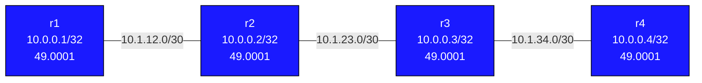

# IS-IS Basics — Practice Lab

IS-IS is the link-state protocol that runs the world's largest backbones —
and it does so without using IP as transport. In this lab you bring up a
four-router Level-2 backbone, write your own NET addresses, read the LSDB,
and steer traffic with metrics. The goal is fluency in what makes IS-IS
different from OSPF, not just reachability.

## Topology



| Node | Loopback     | NET Address                      |
|------|--------------|----------------------------------|
| r1   | 10.0.0.1/32  | 49.0001.0100.0000.0001.00        |
| r2   | 10.0.0.2/32  | 49.0001.0100.0000.0002.00        |
| r3   | 10.0.0.3/32  | 49.0001.0100.0000.0003.00        |
| r4   | 10.0.0.4/32  | 49.0001.0100.0000.0004.00        |

Link /30s: r1–r2 10.1.12.0, r2–r3 10.1.23.0, r3–r4 10.1.34.0.

## How to use this lab

This is a **practice lab**, not a tutorial. Each task gives you an
**objective** and **hints** — your job is to produce the configuration.

- **Predict before you configure**, **open hints before the solution**,
  and **verify** with `show isis database` / `show isis route`.

## Background — the NET address

```
49.0001.0100.0000.0001.00
|  |    |              |
|  |    System ID      SEL (always 00 for a router)
|  Area ID
AFI (49 = private)
```

- **System ID** is 6 bytes, unique in the domain. Convention here: pad the
  loopback — 10.0.0.1 → `010.000.000.001` → `0100.0000.0001`.
- All routers share area `0001` and run **Level-2 only** (one flat
  backbone — the simplest IS-IS).
- IS-IS runs **directly over Layer 2**, not over IP, which is why an IP
  misconfig can't break an IS-IS adjacency (a key reason SP networks
  favor it).

## Deploy / Destroy

```bash
sudo containerlab deploy -t topology.clab.yml
sudo containerlab destroy -t topology.clab.yml
docker exec -it clab-isis-basics-r1 Cli
```

---

## Task 1 — Build the Level-2 backbone

**Objective:** Enable IS-IS process `CORE` on all four routers — correct
NET per node, loopback passive, all transit interfaces enrolled,
`is-type level-2-only` — and reach `ping 10.0.0.4 source 10.0.0.1`
success.

**Predict first:** the System ID must be unique per router but the Area ID
(`0001`) is shared. What happens to adjacencies if you fat-finger two
routers with the *same* System ID? (You don't have to do it — just
predict.)

<details>
<summary>Hints</summary>

- Per interface: `ip router isis CORE` (loopback also gets
  `isis passive`).
- Process: `router isis CORE` with `net <NET>` and `is-type
  level-2-only`.
- r2 and r3 have two transit interfaces each.
- Verify: `show isis neighbor`, `show isis database`.

</details>

<details>
<summary>Solution</summary>

Example for **r1** (substitute NET / interfaces per node):
```text
configure terminal
interface lo
 ip router isis CORE
 isis passive
!
interface eth1
 ip router isis CORE
!
router isis CORE
 net 49.0001.0100.0000.0001.00
 is-type level-2-only
```

r2 and r3 add their second transit interface (`eth2`) under IS-IS.

</details>

<details>
<summary>Check your work</summary>

`show isis neighbor` shows each router's directly-connected peers; r2/r3
show two. `show isis database` holds an LSP from each system
(`0100.0000.000X.00-00`). End-to-end ping works. Prediction answer:
duplicate System IDs are toxic — the two routers' LSPs collide in the
LSDB, SPF computes against a corrupted graph, and you get intermittent
unreachability that's maddening to diagnose because adjacencies may
still *look* up. Unique System ID is the one identity rule IS-IS will not
forgive.

</details>

---

## Task 2 — Read the LSDB

**Objective:** From r1, use the database to confirm that every router's
LSP is present and to locate r4's loopback prefix in the flooded LSPs.

<details>
<summary>Hints</summary>

- `show isis database` (summary) and `show isis database detail` (full
  TLVs).
- LSPs are TLV-encoded — the IP reachability TLV carries prefixes like
  10.0.0.4/32.

</details>

<details>
<summary>Check your work</summary>

Four LSPs, one per system; r4's LSP carries 10.0.0.4/32 in its IP
reachability TLV, and r1 ran SPF over the whole set to reach it. Unlike
OSPF's fixed LSA formats, IS-IS packs everything into TLVs — which is
exactly why IS-IS extended cleanly to IPv6, SR, and more without a new
protocol version. That extensibility is the architectural payoff of the
TLV design.

</details>

---

## Task 3 — Steer traffic with a metric

**Objective:** There's only one path here, so create a reason to compare:
raise the IS-IS metric on one of r2's interfaces and observe whether/how
r1's route to a far prefix changes.

**Predict first:** with a single linear path, will changing one link's
metric change the *route* r1 uses, or only the *cost* it records? When
would the metric actually re-route traffic?

<details>
<summary>Hints</summary>

- `isis metric 100` under an interface.
- Compare `show isis route` on r1 before and after.

</details>

<details>
<summary>Check your work</summary>

On a linear topology the path can't change — there's no alternative — so
only the recorded cost moves. Metrics only *re-route* when a genuine
second path exists (as in the OSPF/EIGRP labs). Worth internalizing:
metric changes are silent no-ops until topology gives them a choice to
make, which is a common "I changed the metric and nothing happened"
confusion. (IS-IS default is the legacy 6-bit metric; `wide-metrics` is
needed for values >63 and for TE — note whether your platform defaulted
to wide.)

</details>

---

## Task 4 — Break it: level mismatch

**Objective:** Change one router from `level-2-only` to `level-1` (not
level-1-2) and diagnose the adjacency failure from its neighbor.

**Predict first:** L1 and L2 routers on a point-to-point link — do they
form an adjacency, a partial one, or none? What does the neighbor's
circuit/level info reveal?

<details>
<summary>What you should observe</summary>

The adjacency fails (or won't pass routes): an L1-only router and an
L2-only router don't establish a usable level adjacency on the link —
they're operating at different levels of the hierarchy. `show isis
neighbor detail` shows the level/circuit-type mismatch. The fix is to
make at least one side `level-1-2` (the IS-IS equivalent of an OSPF ABR)
or align both to the same level. Restore `level-2-only` and confirm the
neighbor and routes return.

</details>

---

## Verification Commands

```text
show isis neighbor [detail]    # adjacencies, level, circuit type
show isis database [detail]    # LSDB / full TLVs
show isis route                # IS-IS computed routes
show ip route isis             # routes installed in the RIB
show isis interface            # per-interface state
ping 10.0.0.4 source 10.0.0.1
```

---

## Challenge questions

No answers provided — reason them through.

1. IS-IS runs directly over Layer 2; OSPF rides IP (protocol 89).
   Describe a concrete failure that would break OSPF adjacency but leave
   IS-IS unaffected on the same link, and explain why SP backbones cite
   this as a security/robustness advantage.
2. IS-IS puts area boundaries on *links*; OSPF puts them on *routers*
   (ABRs). Take this four-router chain and design where you'd split it
   into L1/L2 in each model — and explain why an IS-IS router is "wholly
   in one area" while an OSPF router can straddle two.
3. The overload (OL) bit makes a router advertise its prefixes but signal
   "don't transit me." Give two real operational uses (one during
   maintenance, one during boot) and what would happen to traffic if you
   forgot to clear it.
4. On a broadcast LAN, IS-IS elects a DIS and OSPF elects a DR — but the
   adjacency models differ. Explain how non-DIS routers behave vs.
   non-DR routers, and why that makes IS-IS LANs "fully meshed" in a way
   OSPF LANs are not.

## Extensions

Optional follow-on ideas (not part of the validated workflow):

- Enable authentication on one link only and troubleshoot the resulting
  adjacency failure from circuit/database output.
- Set the overload bit and watch transit selection change without
  breaking adjacency.
- Enable `wide-metrics` and set an interface metric above 63; compare
  `show isis database` before and after.
