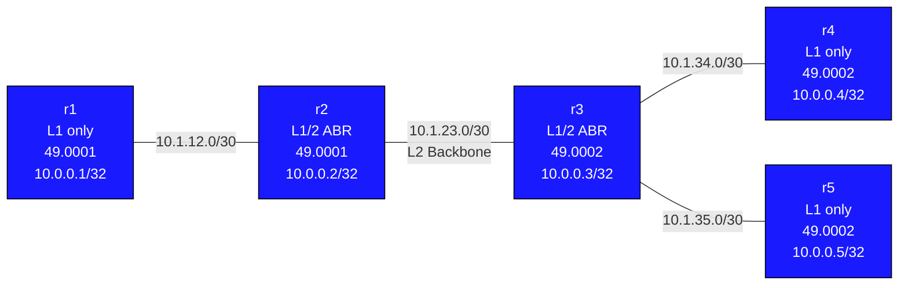

# Lab: isis-multiarea

## Purpose
Learn IS-IS multi-area operation: Level-1 (intra-area), Level-2 (inter-area backbone),
and Level-1/2 routers that bridge them. Understand how routes are leaked between levels.

## Topology



| Node | Role       | Area      | NET Address                    |
|------|------------|-----------|-------------------------------|
| r1   | L1 only    | 49.0001   | 49.0001.0100.0000.0001.00     |
| r2   | L1/2 ABR   | 49.0001   | 49.0001.0100.0000.0002.00     |
| r3   | L1/2 ABR   | 49.0002   | 49.0002.0100.0000.0003.00     |
| r4   | L1 only    | 49.0002   | 49.0002.0100.0000.0004.00     |
| r5   | L1 only    | 49.0002   | 49.0002.0100.0000.0005.00     |

| Link            | Subnet        | Addresses         |
|-----------------|---------------|-------------------|
| r1:eth1-r2:eth1 | 10.1.12.0/30  | r1:.1  r2:.2      |
| r2:eth2-r3:eth1 | 10.1.23.0/30  | r2:.1  r3:.2      |
| r3:eth2-r4:eth1 | 10.1.34.0/30  | r3:.1  r4:.2      |
| r3:eth3-r5:eth1 | 10.1.35.0/30  | r3:.1  r5:.2      |

## Deploy / Destroy

```bash
sudo containerlab deploy -t topology.clab.yml
sudo containerlab destroy -t topology.clab.yml
```

## What You Configure

### Level-1 routers: r1, r4, r5

```
Cli
configure terminal

interface lo
 ip router isis CORE
 isis passive

interface eth1
 ip router isis CORE

router isis CORE
 net 49.0001.0100.0000.0001.00    ! (adjust per node)
 is-type level-1

end
write memory
```

### Level-1/2 routers: r2, r3

```
Cli
configure terminal

interface lo
 ip router isis CORE
 isis passive

interface eth1
 ip router isis CORE

interface eth2
 ip router isis CORE

router isis CORE
 net 49.0001.0100.0000.0002.00    ! (adjust per node and area)
 is-type level-1-2

end
write memory
```

r3 also has eth3 — configure it under IS-IS as well.

## Verification

```bash
docker exec -it clab-isis-multiarea-r1 Cli

# On r1 (L1 only) — should see only area 49.0001 neighbors
show isis neighbor

# On r2 (L1/2) — should see r1 (L1) and r3 (L2)
show isis neighbor

# Check the L1 database on r1 — only sees area 49.0001 LSPs
show isis database

# Check L2 database on r2 — sees inter-area LSPs
show isis database level-2

# Route table on r1 — should have a default or summary toward r2 for inter-area
show ip route isis

# Can r1 reach r4 and r5?
ping 10.0.0.4 source 10.0.0.1
ping 10.0.0.5 source 10.0.0.1
```

## Concepts

### IS-IS Level Hierarchy

```
Area 49.0001          L2 Backbone         Area 49.0002
  [L1 routers]    [L1/2]-----[L1/2]    [L1 routers]
  only see          |           |        only see
  their area        +-----------+        their area
                  L2 adjacency
                  (crosses areas)
```

**Level-1 (L1) routers:**
- Maintain only an L1 LSDB for their area
- Know the full topology within their area
- Do NOT know inter-area destinations
- Reach outside their area by sending traffic to the nearest L1/2 router
  (L1/2 routers set the "attached" bit, causing L1 routers to use a default route toward them)

**Level-2 (L2):**
- Backbone level — connects areas
- L2 LSDB contains all L2 LSPs from every L1/2 and L2 router in the domain
- Only L1/2 or L2-only routers participate in L2

**Level-1/2 (L1/2) routers:**
- Maintain BOTH an L1 LSDB (for their area) and an L2 LSDB (backbone)
- Act as Area Border Routers (ABRs)
- Inject L1 route summaries into L2 (redistribute)
- Set the "attached" bit in their L1 LSPs — tells L1 routers "I can reach outside the area"

### Route Leaking / Default Route Injection

When an L1/2 router sets the "attached" bit, L1 routers generate a default route
pointing toward that L1/2 router. This is how traffic leaves an L1 area.

Optionally, you can leak specific prefixes from L2 into L1 for more precise routing:

```
router isis CORE
 redistribute level-2 into level-1 route-map LEAK-MAP
```

This is useful when you want L1 routers to know specific destinations rather than
relying solely on a default.

### Area Boundary is on Links, Not Routers

In OSPF, area boundaries are on routers (ABR). In IS-IS, the boundary is on links:

- r2 is IN area 49.0001 (its NET uses that area)
- r3 is IN area 49.0002 (its NET uses that area)
- The L2 adjacency between r2 and r3 crosses the area boundary

This means an IS-IS router belongs to exactly one area (unlike OSPF ABRs which are
in multiple areas simultaneously).

### Adjacency Rules

| Router type | Forms L1 adj with | Forms L2 adj with |
|-------------|-------------------|--------------------|
| L1          | L1 or L1/2 in same area | — |
| L1/2        | L1 or L1/2 in same area | L1/2 or L2 anywhere |
| L2          | — | L1/2 or L2 anywhere |

If area IDs don't match, L1 adjacency will NOT form even if physical connectivity exists.

## Challenge Exercises

1. On r1, run `show isis route` and observe whether you see a default route or
   specific inter-area routes. Why is there (or isn't there) a default route?

2. On r2, run `show isis database level-1` vs `show isis database level-2`.
   How do they differ? Which prefixes appear in each?

3. Configure route leaking on r3: leak r4 and r5 loopbacks (10.0.0.4, 10.0.0.5)
   from L2 into L1 area 49.0002 using a route-map. Verify r4 sees specific routes
   rather than just a default toward r3.

4. What happens if you change r4 to `is-type level-1-2`?
   Does it form L2 adjacency with r3? Does it appear in the L2 LSDB?
