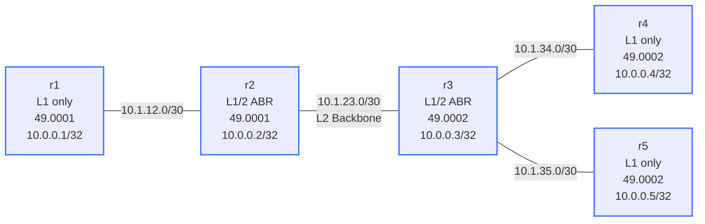

# IS-IS Multi-Area — Practice Lab

IS-IS scales with a two-level hierarchy: Level-1 inside an area, Level-2
across the backbone, and L1/2 routers bridging them. The mechanism that
gets traffic *out* of an L1 area isn't a configured default — it's the
**attached bit**. You'll build two areas, watch L1 routers auto-generate a
default toward the nearest L1/2, and then leak specific routes to override
that default.

## Topology



| Node | Role       | Area      | NET Address                    |
|------|------------|-----------|-------------------------------|
| r1   | L1 only    | 49.0001   | 49.0001.0100.0000.0001.00     |
| r2   | L1/2 ABR   | 49.0001   | 49.0001.0100.0000.0002.00     |
| r3   | L1/2 ABR   | 49.0002   | 49.0002.0100.0000.0003.00     |
| r4   | L1 only    | 49.0002   | 49.0002.0100.0000.0004.00     |
| r5   | L1 only    | 49.0002   | 49.0002.0100.0000.0005.00     |

## How to use this lab

This is a **practice lab**, not a tutorial. Each task gives you an
**objective** and **hints** — your job is to produce the configuration.

- **Predict before you configure**, **open hints before the solution**,
  and **verify** with the per-level database and route views.

## Background

- **L1** routers know only their own area and reach outside via the
  nearest L1/2 (signaled by the **attached bit**, which makes L1 routers
  install a default toward it).
- **L2** is the backbone; **L1/2** routers hold *both* databases and act
  as ABRs.
- Area boundary is on the **link** (r2 is wholly in 49.0001, r3 wholly in
  49.0002; their L2 adjacency crosses the boundary) — unlike OSPF where
  the ABR straddles two areas.
- L1 adjacency requires **matching area IDs**; L2 adjacency does not.

## Deploy / Destroy

```bash
./scripts/lab.sh deploy isis-multiarea
./scripts/lab.sh destroy isis-multiarea
./scripts/lab.sh cli isis-multiarea r1
```

---

## Task 1 — Build two areas joined by an L2 backbone

**Objective:** Configure r1/r4/r5 as `is-type level-1`, r2/r3 as
`is-type level-1-2`, correct NET per node, loopbacks passive, all transit
interfaces enrolled. Success: r1 can `ping 10.0.0.4` and `ping 10.0.0.5`.

**Predict first:** r2 (area 49.0001) and r3 (area 49.0002) are directly
connected. Will they form an L1 adjacency, an L2 adjacency, both, or
none? Why?

<details markdown="1">
<summary>Hints</summary>

- Per-interface `ip router isis CORE`; process `router isis CORE` with
  `net` and `is-type`.
- r3 has *three* transit interfaces (eth1 to r2, eth2 to r4, eth3 to r5).
- Check `show isis neighbor` and note the level of each adjacency.

</details>

<details markdown="1">
<summary>Solution</summary>

L1 routers (r1/r4/r5), example r1:
```text
configure terminal
interface lo
 ip router isis CORE
 isis passive
interface eth1
 ip router isis CORE
router isis CORE
 net 49.0001.0100.0000.0001.00
 is-type level-1
```

L1/2 routers (r2/r3): same but `is-type level-1-2`, all transit
interfaces under IS-IS, NET in the router's own area.

</details>

<details markdown="1">
<summary>Check your work</summary>

Prediction answer: r2↔r3 form an **L2-only** adjacency — their area IDs
differ, so no L1 adjacency is possible, but L2 doesn't care about area, so
the backbone adjacency comes up. `show isis neighbor` on r2 shows r1 as
**L1** and r3 as **L2**. End-to-end pings work because the L1/2 routers
inject area routes into L2 and the attached bit pulls L1 traffic toward
them. This split-personality adjacency (L1 with same-area neighbors, L2
across the boundary) is the heart of IS-IS hierarchy.

</details>

---

## Task 2 — See why r1 reaches r4 without a specific route

**Objective:** On r1, examine its route table and explain how it reaches
the *other* area at all.

**Predict first:** does r1 have a specific route to 10.0.0.4/32, or
something more general? What in r2's LSP causes whatever you'll find?

<details markdown="1">
<summary>Hints</summary>

- `show isis route` / `show ip route isis` on r1.
- Look for a default (0.0.0.0/0) and which router it points to.
- The **attached bit** is set by L1/2 routers in their L1 LSP.

</details>

<details markdown="1">
<summary>Check your work</summary>

r1 has a **default route** toward r2, not a specific route to 10.0.0.4 —
r2 set the attached bit in its L1 LSP, which is IS-IS's signal "I'm your
way out of the area," and every L1 router responds by installing a
default toward the nearest such router. This is elegant and scalable (L1
routers stay tiny) but blunt: r1 can't make any *choice* about external
destinations — it just sends everything to its closest exit. Task 3 fixes
that selectively.

</details>

---

## Task 3 — Leak specific routes from L2 into L1

**Objective:** On r3, leak r4's and r5's loopbacks from L2 into L1 area
49.0002 so the L1 routers there see specifics, not just a default.

**Predict first:** before leaking, by what path does r4 reach r5 (both in
area 49.0002, both connected to r3)? Does leaking change that, or only
change *external* reachability granularity?

<details markdown="1">
<summary>Hints</summary>

- A `route-map`/`prefix-list` selecting the loopbacks, then
  `redistribute level-2 into level-1 route-map <MAP>` under `router isis
  CORE` on r3.
- Verify on r4: `show ip route isis` — specific routes vs. default.

</details>

<details markdown="1">
<summary>Solution</summary>

On **r3**:
```text
ip prefix-list LEAK seq 5 permit 10.0.0.4/32
ip prefix-list LEAK seq 10 permit 10.0.0.5/32
!
route-map LEAK-MAP permit 10
 match ip address prefix-list LEAK
!
router isis CORE
 redistribute level-2 into level-1 route-map LEAK-MAP
```

</details>

<details markdown="1">
<summary>Check your work</summary>

r4 now sees specific L1 routes for the leaked prefixes instead of relying
solely on the default. (Note r4↔r5 already routed via r3 inside the area
regardless — leaking is about *inter-level* visibility, not intra-area
paths.) Route leaking is the IS-IS answer to "the default exit isn't
always the *best* exit" — in a multi-exit area, specific leaked routes
let L1 routers pick the topologically closer L1/2, which a single default
can't express.

</details>

---

## Task 4 — Break it / explore: promote an L1 router

**Objective:** Change r4 to `is-type level-1-2` and determine what
changes — does it now appear in the L2 LSDB, and does it form an L2
adjacency with r3?

**Predict first:** r4 only connects to r3 (already L1/2). After making r4
L1/2, will an L2 adjacency form on the r3–r4 link, and will r4's LSP show
up in the backbone database?

<details markdown="1">
<summary>What you should observe</summary>

Yes — r4 now maintains both databases and forms an **L2** adjacency with
r3 over the same link (in addition to L1), and r4's L2 LSP appears in the
backbone LSDB. You've extended the backbone one hop deeper into area
49.0002. The lesson: L1/2 isn't a property of "border" routers
specifically — any router can carry L2, and over-extending L2 inflates
every backbone router's LSDB. The discipline of keeping L1/2 only at true
area edges is what keeps the L2 database small. Restore r4 to `level-1`.

</details>

---

## Verification Commands

```text
show isis neighbor                 # adjacency level per neighbor
show isis database level-1         # area-local LSPs
show isis database level-2         # backbone LSPs
show ip route isis                 # default vs. specific routes
ping 10.0.0.4 source 10.0.0.1
ping 10.0.0.5 source 10.0.0.1
```

---

## Challenge questions

No answers provided — reason them through.

1. Area 49.0002 has two exits (imagine r3 and a second L1/2 router). With
   only the attached-bit default, how does an L1 router choose between
   them, and what *exactly* does route leaking buy you that the default
   cannot? Give a traffic example.
2. IS-IS forbids an L1 adjacency across mismatched areas but allows L2
   freely. Contrast this with OSPF's rule that everything must touch area
   0. Which model makes "merge two companies' backbones" easier, and why?
3. The attached bit caused r1 to install a default automatically. What
   failure does this create if r2 loses its backbone (L2) connectivity
   but stays up as an L1 router — and how would you detect the resulting
   black hole?
4. You leak a handful of L2 prefixes into L1 (Task 3). Describe the
   scaling trap if an operator "just leaks everything" from L2 into every
   L1 area, and what that does to the very hierarchy IS-IS levels exist
   to provide.
