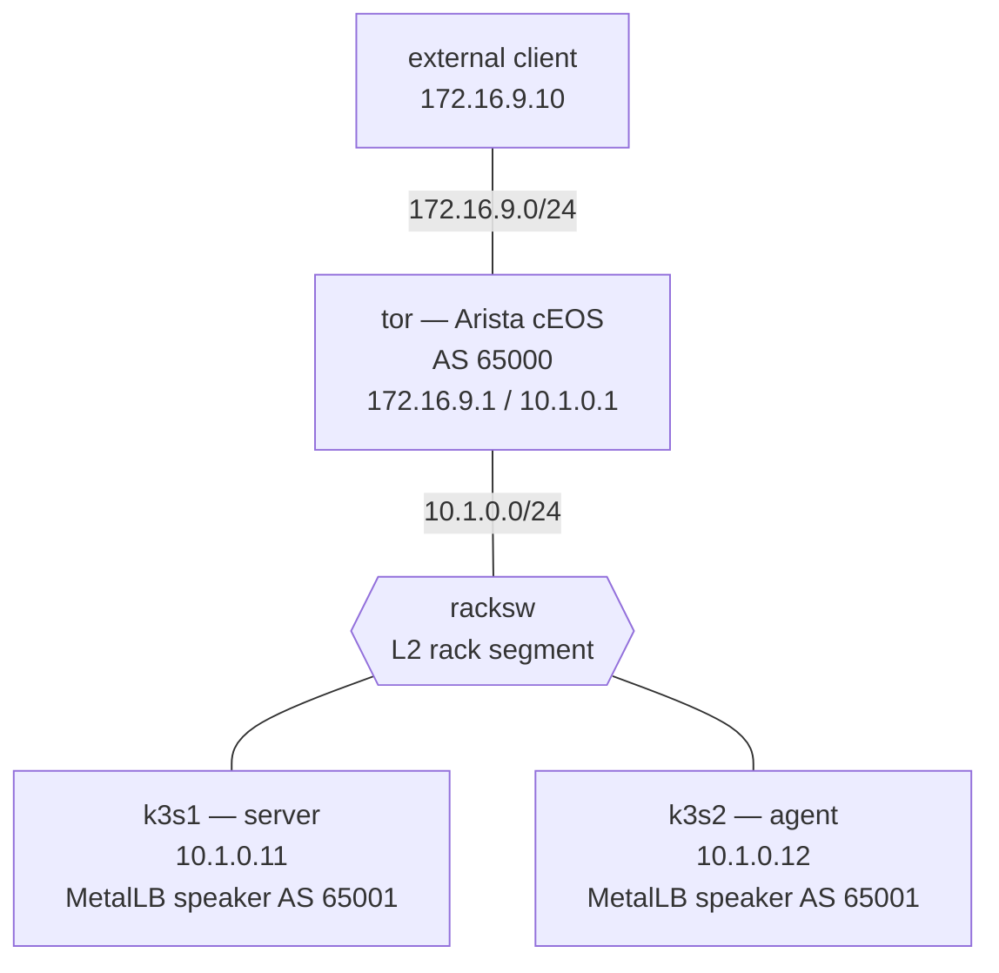

# Kubernetes ↔ BGP Fabric — Practice Lab

Build the boundary between a Kubernetes service and a routed data-center
fabric. A `LoadBalancer` object receives one address from MetalLB, two
node-local speakers advertise that address as the same BGP /32, and an Arista
cEOS ToR installs two next-hops in its FIB. You will then diagnose a locality
change that preserves BGP reachability and HTTP while withdrawing one ECMP
path.

**Lab type:** Build

## Topology



### Link and service addressing

| Segment | Subnet or address | Members |
|---------|-------------------|---------|
| Rack | `10.1.0.0/24` | tor `.1`, k3s1 `.11`, k3s2 `.12` |
| External client | `172.16.9.0/24` | tor `.1`, client `.10` |
| Service pool | `198.51.100.100/32` | one VIP allocated by MetalLB |
| ToR router ID | `10.0.0.254/32` | tor `Loopback0` |

### Node reference

| Node | Platform | Role | Learner-owned state |
|------|----------|------|---------------------|
| `tor` | Arista cEOS (amd64 4.35.2F / arm64 4.36.1F; canonical tag `ceos:4.35.2F`) | Routed ToR and client gateway | BGP, inbound prefix policy, ECMP |
| `racksw` | Incidental Linux bridge | Rack L2 segment | None |
| `k3s1` | k3s server | Control plane, workload node, MetalLB speaker | MetalLB and Service objects |
| `k3s2` | k3s agent | Workload node and MetalLB speaker | MetalLB and Service objects |
| `client` | Incidental Linux endpoint | Consumer outside Kubernetes | None |

The topology supplies addressing, a two-node k3s cluster, MetalLB's controller
and speakers, and four nginx replicas. The ToR deliberately has no routing
protocol, and MetalLB deliberately has no peer, pool, or advertisement.

## How to use this lab

This is a **practice lab**, not a tutorial. Each task gives you an
**objective** and **hints** — your job is to produce the configuration.

- **Predict before you configure.** When a task asks for a prediction,
  commit to an answer before touching the CLI. Being wrong and finding out
  why is the point.
- **Open the hints before the solution.** The solution toggle is the answer
  key — use it to check your work or when genuinely stuck, not as step one.
- **Verify like an operator.** After each task, prove the state is what you
  think it is with `show` commands before moving on.

## Deploy

Prepare the licensed cEOS image for your host architecture and build the
incidental Linux tool image:

```bash
scripts/build-images.sh ceos
docker build -t ops-lab:local images/ops-lab/
```

Every topology uses the canonical tag `ceos:4.35.2F`. On amd64 that tag
contains EOS 4.35.2F; on arm64, `scripts/build-images.sh ceos` imports the
supported cEOSarm 4.36.1F image under the same canonical tag. The checker
keeps the tag assertion exact and verifies the corresponding runtime release.
The final live evidence in `VALIDATION.md` was collected on amd64; it is not
an arm64 live-validation claim.

The topology pulls k3s by exact digest:

```text
rancher/k3s:v1.30.6-k3s1@sha256:204d4094343ed60ff60ed4b009785151c43d8f611761929aae3a1beb02fc0adf
```

The vendored manifests also pin MetalLB controller v0.14.8, speaker v0.14.8,
and nginx 1.27-alpine by digest. A cold deployment therefore needs registry
access for any pinned image absent from the local cache.

```bash
./scripts/lab.sh deploy k8s-fabric
```

Bootstrap uses separate bounded waits for API, node, and rollout phases and
records failure diagnostics in `/var/log/bootstrap.log`. The command below
gives the deployment a seven-minute observation window; that window is not
the sum of bootstrap's internal phase bounds:

```bash
./scripts/lab.sh cmd k8s-fabric k3s1 -- timeout 420 sh -c 'until grep -q "\[bootstrap\] done" /var/log/bootstrap.log; do sleep 5; done; tail -n 30 /var/log/bootstrap.log'
```

If the observation command times out, inspect the log for the phase-specific
timeout and its node, pod, and event diagnostics.

> **Safe k3s teardown:** do not force-remove a running k3s container. If you
> ever manage one by hand, use `docker stop -t 20 <container>` before
> removal. The lab destroy wrapper performs the safe sequence.

## Task 1 — Establish the silent baseline

**Objective:** prove that the supplied cluster and workload are ready while
both sides of the BGP boundary remain unconfigured.

```bash
./scripts/lab.sh cmd k8s-fabric k3s1 -- kubectl get nodes -o wide
./scripts/lab.sh cmd k8s-fabric k3s1 -- kubectl get pods -l app=web -o wide
./scripts/lab.sh cmd k8s-fabric k3s1 -- kubectl -n metallb-system get pods -o wide
./scripts/lab.sh cmd k8s-fabric k3s1 -- kubectl -n metallb-system get bgppeers,ipaddresspools,bgpadvertisements
./scripts/lab.sh cli k8s-fabric tor
```

At the EOS prompt:

```text
show ip route
show ip bgp summary
show running-config section router bgp
```

<details markdown="1">
<summary>Check your work</summary>

Exactly two nodes are `Ready`, their InternalIPs are `10.1.0.11` and
`10.1.0.12`, and four ready `web` pods are split across them. One MetalLB
controller and two speakers run, but the three MetalLB routing resources do
not exist. EOS has the connected rack and client routes but no BGP process.
This separates healthy scaffolding from the control plane you must build.

</details>

## Task 2 — Bound and enable the ToR peering

**Objective:** configure native EOS eBGP to both MetalLB speakers, accept
only the service pool's exact /32, and permit multiple equal BGP paths in the
FIB. Do not originate a prefix from the ToR.

**Predict first:** before the MetalLB peer exists, should either configured
EOS neighbor be `Established`? What evidence distinguishes a missing remote
speaker from a rejected route?

<details markdown="1">
<summary>Hints</summary>

- Build the prefix filter before the peer. The service pool contains only one
  host route, so the least-privilege filter has one permit entry.
- Apply the filter inbound to each neighbor through a route-map.
- EOS controls eBGP FIB width with `maximum-paths ... ecmp ...` under the BGP
  process. Use AS 65000 locally and AS 65001 for both rack neighbors.
- Use `show ip bgp summary`, the prefix-list, and the route-map attachment as
  three separate checks.

</details>

<details markdown="1">
<summary>Solution</summary>

```text
configure terminal
ip prefix-list METALLB-SERVICE-ONLY seq 10 permit 198.51.100.100/32
!
route-map METALLB-IN permit 10
   match ip address prefix-list METALLB-SERVICE-ONLY
!
router bgp 65000
   router-id 10.0.0.254
   maximum-paths 4 ecmp 4
   neighbor 10.1.0.11 remote-as 65001
   neighbor 10.1.0.11 route-map METALLB-IN in
   neighbor 10.1.0.12 remote-as 65001
   neighbor 10.1.0.12 route-map METALLB-IN in
   !
   address-family ipv4
      neighbor 10.1.0.11 activate
      neighbor 10.1.0.12 activate
end
```

</details>

<details markdown="1">
<summary>Check your work</summary>

Both neighbors exist but cannot establish until Task 3 creates the remote
peer. The prefix-list has exactly one permitted /32, and both neighbors have
`METALLB-IN` attached inbound. That distinction matters: session state tests
TCP/BGP adjacency; accepted-prefix state tests policy after adjacency.

</details>

## Task 3 — Define the MetalLB routing contract

**Objective:** create one reviewable Kubernetes artifact containing the
exact peer, address pool, and advertisement. Success means two established
sessions but zero advertised service prefixes because no LoadBalancer exists
yet.

**Predict first:** why does one `BGPPeer` object produce two sessions at the
ToR?

<details markdown="1">
<summary>Hints</summary>

- The three kinds are `BGPPeer`, `IPAddressPool`, and `BGPAdvertisement` in
  the `metallb-system` namespace.
- The peer needs the local ASN, remote ASN, and ToR rack address. The
  advertisement must select the pool explicitly.
- Inspect API discovery or `kubectl explain` for field names instead of
  copying a generic Internet example.

</details>

<details markdown="1">
<summary>Solution</summary>

Open a shell on `k3s1`, create the learner artifact, and apply it:

```bash
./scripts/lab.sh bash k8s-fabric k3s1
cat >/tmp/metallb-bgp.yaml <<'YAML'
apiVersion: metallb.io/v1beta2
kind: BGPPeer
metadata:
  name: tor
  namespace: metallb-system
spec:
  myASN: 65001
  peerASN: 65000
  peerAddress: 10.1.0.1
---
apiVersion: metallb.io/v1beta1
kind: IPAddressPool
metadata:
  name: svc-pool
  namespace: metallb-system
spec:
  addresses:
    - 198.51.100.100/32
---
apiVersion: metallb.io/v1beta1
kind: BGPAdvertisement
metadata:
  name: svc-adv
  namespace: metallb-system
spec:
  ipAddressPools:
    - svc-pool
YAML
kubectl apply -f /tmp/metallb-bgp.yaml
exit
```

</details>

<details markdown="1">
<summary>Check your work</summary>

`show ip bgp summary` on EOS shows exactly `10.1.0.11` and `10.1.0.12`
Established, both with AS 65001. The prefix count remains zero. One peer
object is consumed by the speaker DaemonSet on both nodes; each speaker uses
its node's rack-facing InternalIP, producing two independent sessions.

</details>

## Task 4 — Trace one Service into the FIB

**Objective:** expose `web` with an explicit LoadBalancer artifact, then
trace the same intent through allocation, speakers, BGP RIB, two-next-hop
EOS FIB, and external HTTP.

**Predict first:** which observation proves the router can forward the VIP,
rather than merely knowing two BGP paths for it?

<details markdown="1">
<summary>Hints</summary>

- The Service selects `app: web`, exposes TCP/80, and starts with
  `externalTrafficPolicy: Cluster`.
- Follow the object in order: Service status, speaker placement, BGP route,
  IP route, then a client request. Do not skip from Kubernetes straight to
  HTTP.

</details>

<details markdown="1">
<summary>Solution</summary>

```bash
./scripts/lab.sh bash k8s-fabric k3s1
cat >/tmp/web-service.yaml <<'YAML'
apiVersion: v1
kind: Service
metadata:
  name: web-lb
spec:
  type: LoadBalancer
  externalTrafficPolicy: Cluster
  selector:
    app: web
  ports:
    - name: http
      protocol: TCP
      port: 80
      targetPort: 80
YAML
kubectl apply -f /tmp/web-service.yaml
exit
```

</details>

Use this merged trace rather than treating each plane as a separate demo:

```bash
# Service -> allocation
./scripts/lab.sh cmd k8s-fabric k3s1 -- kubectl get service web-lb -o wide

# Allocation -> two speakers
./scripts/lab.sh cmd k8s-fabric k3s1 -- kubectl -n metallb-system get pods -l component=speaker -o wide

# Speakers -> BGP RIB -> two-next-hop FIB
./scripts/lab.sh cli k8s-fabric tor
```

```text
show ip bgp 198.51.100.100/32
show ip route 198.51.100.100/32
exit
```

```bash
# FIB -> external HTTP
./scripts/lab.sh cmd k8s-fabric client -- traceroute -n -m 4 198.51.100.100
./scripts/lab.sh cmd k8s-fabric client -- wget -qO- --timeout=5 http://198.51.100.100/
```

<details markdown="1">
<summary>Check your work</summary>

The Service status contains exactly `198.51.100.100`. The BGP RIB contains
that /32 from both node peers, and the EOS IP route contains next-hops
`10.1.0.11` and `10.1.0.12`. The IP route is the forwarding proof: it is the
RIB-to-FIB decision the client depends on. The external client then receives
the nginx page without using Kubernetes DNS or the Kubernetes API.

</details>

## Task 5 — Diagnose an endpoint-locality withdrawal

**Objective:** begin with a working service, inject an opaque cluster-side
fault, and determine why one route path disappears even though both BGP
sessions and client HTTP remain healthy. Repair the state and recover
two-next-hop ECMP.

First record a bounded, fresh source-address observation under the solved
state. The ten-second log window avoids treating an old request as evidence:

```bash
./scripts/lab.sh cmd k8s-fabric client -- sh -c 'for n in 1 2 3; do wget -qO- --timeout=5 http://198.51.100.100/ >/dev/null; done'
./scripts/lab.sh cmd k8s-fabric k3s1 -- kubectl logs -l app=web --since=10s --tail=20 --max-log-requests=10 | awk '/GET \/ HTTP/{print $1}' | sort -u
```

Inject the scenario. The injector deliberately does not print its mutation:

```bash
./labs/k8s-fabric/break.sh
```

**Predict first:** if both sessions stay Established and HTTP still works,
which evidence would let you rank service policy, endpoint placement, BGP
policy, and physical reachability without guessing?

Collect symptoms from every boundary:

```bash
./scripts/lab.sh cmd k8s-fabric k3s1 -- kubectl get service web-lb -o yaml
./scripts/lab.sh cmd k8s-fabric k3s1 -- kubectl get pods -l app=web -o wide
./scripts/lab.sh cmd k8s-fabric k3s1 -- kubectl get endpointslice -l kubernetes.io/service-name=web-lb -o wide
./scripts/lab.sh cli k8s-fabric tor
```

```text
show ip bgp summary
show ip bgp 198.51.100.100/32
show ip route 198.51.100.100/32
exit
```

```bash
./scripts/lab.sh cmd k8s-fabric client -- wget -qO- --timeout=5 http://198.51.100.100/
./scripts/lab.sh cmd k8s-fabric client -- sh -c 'for n in 1 2 3; do wget -qO- --timeout=5 http://198.51.100.100/ >/dev/null; done'
./scripts/lab.sh cmd k8s-fabric k3s1 -- kubectl logs -l app=web --since=10s --tail=20 --max-log-requests=10 | awk '/GET \/ HTTP/{print $1}' | sort -u
```

<details markdown="1">
<summary>Hints</summary>

- Compare the Service forwarding policy with the nodes named by the ready
  endpoints.
- A speaker can maintain its BGP session while withdrawing one NLRI. Session
  health and route presence answer different questions.

</details>

<details markdown="1">
<summary>Solution</summary>

The injected state changes the Service to `externalTrafficPolicy: Local` and
places all four endpoints on `k3s1`. With `Local`, only a node that owns a
ready local endpoint advertises the VIP. The k3s2 speaker therefore withdraws
the /32 without tearing down its BGP session. EOS retains one path through
`10.1.0.11`, so HTTP remains reachable; the fresh nginx log now exposes the
real client source `172.16.9.10` rather than the cluster-side translated
source seen under `Cluster`.

Apply the repair twice to prove it is idempotent:

```bash
./labs/k8s-fabric/solution.sh
./labs/k8s-fabric/solution.sh
```

</details>

<details markdown="1">
<summary>Check your work</summary>

In the broken state, both neighbors remain Established, the client still
gets the nginx page, and the VIP route has exactly one next-hop:
`10.1.0.11`. After repair, the Service policy is `Cluster`, ready endpoints
are split two per node, and the EOS FIB again contains exactly `.11` and
`.12`. The three changes connect Kubernetes forwarding policy to
endpoint-local advertisement and finally to fabric ECMP.

</details>

## Verification

```bash
./labs/k8s-fabric/check.sh
```

The deterministic solved result is `31 passed, 0 failed`. The checker is
read-only with respect to EOS and Kubernetes configuration and verifies:

- all five containers and their exact topology image references;
- the architecture-specific EOS runtime identity (including the exact amd64
  engineering build), k3s runtime, and pinned workload images;
- two Ready nodes, exact MetalLB resources, one exact VIP, and two-per-node
  ready web endpoints;
- the native EOS /32 prefix-list, route-map attachments, BGP neighbors,
  Established state, RIB prefix, and `.11`/`.12` FIB next-hops;
- bounded external HTTP through the routed VIP.

Under the supported fault, only the repaired Service policy, endpoint spread,
and two-next-hop FIB assertions fail; BGP sessions and HTTP remain healthy.

## Challenge questions

1. A platform grows to 60 worker nodes. Design a peer-scaling approach that
   avoids 60 static neighbor statements while preventing an arbitrary rack
   host from joining the ToR's BGP process.
2. The service pool expands from one /32 to 32 addresses. Design the narrowest
   maintainable inbound route policy, and explain how you would test that a
   default route from a compromised speaker is rejected.
3. A three-replica service must preserve client source IP across five nodes.
   Choose a placement strategy and failure policy that keeps `Local` safe
   during node drains and rolling upgrades.
4. A VIP exists in the BGP RIB with two paths but only one path reaches the
   FIB. Rank the EOS controls and path attributes you would inspect before
   changing MetalLB.

## Troubleshooting

| Symptom | Likely cause | Focused fix |
|---------|--------------|-------------|
| Bootstrap reaches its bound | Registry pull, API readiness, or node join failed | Read the bounded diagnostics in `/var/log/bootstrap.log`; confirm both rack IPs and registry access before rerunning `/bootstrap.sh` |
| EOS neighbors stay Active | Missing/wrong `BGPPeer`, peer address, or ASN | Compare the peer object to rack addressing and inspect both speaker pods |
| Sessions establish but no VIP enters the BGP RIB | Missing advertisement, no LoadBalancer allocation, or inbound /32 policy mismatch | Trace pool → Service status → advertisement → EOS prefix-list in that order |
| BGP RIB has two paths but the FIB has one | Native EOS multipath capacity is missing or one path is not equal | Inspect `maximum-paths`, both path attributes, then `show ip route` |
| VIP route has one next-hop while both sessions are Established | One speaker withdrew the NLRI because service policy and endpoint locality differ | Inspect `externalTrafficPolicy` and ready endpoint node placement; repair placement or choose `Cluster` deliberately |
| Client route exists but HTTP times out | Node return route, Service endpoints, or workload readiness failed | Verify the node route to `172.16.9.0/24`, EndpointSlices, and ready nginx pods |

## Cleanup

Remove the lab with the safe k3s teardown path:

```bash
./scripts/lab.sh destroy k8s-fabric
```
