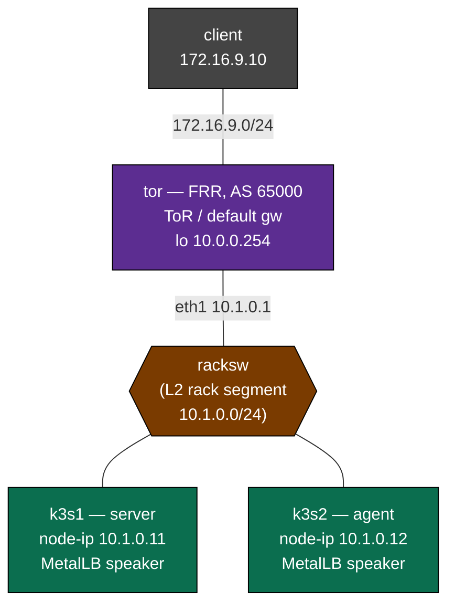

# Kubernetes ↔ BGP Fabric — Practice Lab

Make a Kubernetes `Service` become a route. A two-node **k3s** cluster hangs
off a single Top-of-Rack router the way a rack of servers actually does.
**MetalLB** in BGP mode runs on the nodes, peers to the ToR, and advertises
each `LoadBalancer` service as a **/32** — and because both nodes advertise
the *same* VIP, the ToR installs **ECMP** across the rack. You build the
ToR's BGP, MetalLB's BGP, expose a service, watch the /32 appear in the
router's table, and reach it from a client that has never heard of
Kubernetes. Then you flip `externalTrafficPolicy` and watch the
advertisement itself change — the seam where the cluster and the fabric
actually negotiate.

This is the integration every on-prem Kubernetes platform team has to get
right, and it's pure BGP underneath the Kubernetes vocabulary.

## Topology



### Link / segment addressing

| Segment            | Subnet          | Members                                   |
|--------------------|-----------------|-------------------------------------------|
| rack (via racksw)  | 10.1.0.0/24     | tor .1, k3s1 .11, k3s2 .12                 |
| clients            | 172.16.9.0/24   | tor .1, client .10                        |
| service VIP pool   | 198.51.100.0/24 | MetalLB assigns from 198.51.100.100–199   |

### Node reference

| Node   | Role                          | AS    | Key address        |
|--------|-------------------------------|-------|--------------------|
| tor    | Top-of-Rack router (FRR)      | 65000 | 10.1.0.1, lo 10.0.0.254 |
| k3s1   | k3s **server** + MetalLB      | 65001 | node-ip 10.1.0.11  |
| k3s2   | k3s **agent** + MetalLB       | 65001 | node-ip 10.1.0.12  |
| racksw | plain L2 bridge (rack fabric) | —     | —                  |
| client | service consumer              | —     | 172.16.9.10        |

**What's pre-built (scaffolding):** the k3s cluster (both nodes joined),
MetalLB **installed but unconfigured**, and a sample `web` deployment
(4 nginx replicas, spread across both nodes). Each k3s node's `node-ip` is
its rack address — that matters, because MetalLB advertises a node's
InternalIP as the BGP next-hop.

**What you build (the lab):** all the BGP — on the ToR *and* in MetalLB —
plus the service that ties them together.

> A cEOS or NX-OS ToR would take the same BGP config with cosmetic syntax
> changes; FRR keeps the whole rack under ~1.5 GB and validates locally.
> The Kubernetes and MetalLB objects are identical on any cluster.

## How to use this lab

This is a **practice lab**, not a tutorial. Each task gives you an
**objective** and **hints** — your job is to produce the configuration.

- **Predict before you configure.** When a task asks for a prediction,
  commit to an answer before touching the CLI. Being wrong and finding out
  why is the point.
- **Open the hints before the solution.** The solution toggle is the answer
  key — use it to check your work or when genuinely stuck, not as step one.
- **Verify like an operator.** After each task, prove the state is what you
  think it is with `show` commands before moving on.

## Deploy

Build the images once if you haven't (`docker build -t frr-lab:local
images/frr/` and `docker build -t ops-lab:local images/ops-lab/`). The k3s
and MetalLB/nginx images are pulled from the internet, so **this lab needs
internet access at deploy time.**

```bash
./scripts/lab.sh deploy k8s-fabric
```

First boot takes a few minutes: k3s starts, the agent joins, then a
background bootstrap installs MetalLB and the workload. Wait for it:

```bash
# watch it finish (look for "bootstrap] done")
./scripts/lab.sh cmd k8s-fabric k3s1 -- tail -f /var/log/bootstrap.log
```

Work the cluster from the server node (kubectl is preconfigured there):

```bash
./scripts/lab.sh cmd k8s-fabric k3s1 -- kubectl get nodes
./scripts/lab.sh cmd k8s-fabric k3s1 -- kubectl get pods -A
./scripts/lab.sh vtysh k8s-fabric tor       # the ToR's FRR CLI
```

Destroy when done:

```bash
./scripts/lab.sh destroy k8s-fabric
```

> **k3s teardown note:** if you ever remove a node container by hand, use
> `docker stop -t 20 <name>` **before** `docker rm` — force-removing a
> *running* k3s container can wedge the Docker daemon while it unwinds
> k3s's mounts. `containerlab destroy` does this correctly.

---

## Task 1 — Survey the cluster and the silent ToR (guided)

**Objective:** confirm the starting point — a healthy 2-node cluster with a
workload, MetalLB running but doing nothing, and a ToR with no BGP.

```bash
./scripts/lab.sh cmd k8s-fabric k3s1 -- kubectl get nodes -o wide
./scripts/lab.sh cmd k8s-fabric k3s1 -- kubectl get pods -o wide -l app=web
./scripts/lab.sh cmd k8s-fabric k3s1 -- kubectl -n metallb-system get pods
./scripts/lab.sh cmd k8s-fabric k3s1 -- kubectl get svc
./scripts/lab.sh vtysh k8s-fabric tor
```

```text
show ip route
show bgp ipv4 unicast summary
```

<details markdown="1">
<summary>Check your work</summary>

Both nodes are `Ready` with **InternalIP 10.1.0.11 / 10.1.0.12** — the rack
addresses, not the containerlab mgmt IPs (that's the `--node-ip` in each
node's entrypoint doing its job; remember it for Task 3). The four `web`
pods are split across both nodes. MetalLB shows a `controller` and **two**
`speaker` pods (a speaker per node, `DaemonSet`) — all `Running`, but there
is no `LoadBalancer` service yet and no MetalLB config, so they're idle. On
the ToR, `show ip route` has only connected routes (plus the mgmt network),
and `show bgp ipv4 unicast summary` reports **no BGP instance** — the router
doesn't know the cluster exists. Everything that connects the two, you're
about to build.

</details>

## Task 2 — Give the ToR its BGP

**Objective:** an eBGP configuration on the ToR that peers with **both**
k3s nodes and is ready to install a prefix learned from both of them as
ECMP. The nodes only ever *advertise* to the ToR — they accept nothing — so
this side originates nothing and just listens.

**Predict first:** you'll bring BGP up before MetalLB is configured on the
other side. What state will the two neighbors sit in — `Established`,
`Active`, or `Idle` — and why?

<details markdown="1">
<summary>Hints</summary>

- `router bgp 65000`, then a `neighbor <node-ip> remote-as 65001` for each
  of 10.1.0.11 and 10.1.0.12.
- FRR default: eBGP with no policy exchanges nothing. `no bgp
  ebgp-requires-policy` (you'll accept whatever MetalLB sends).
- ECMP is not automatic. Under `address-family ipv4 unicast`, FRR's default
  eBGP `maximum-paths` is **1** — one prefix from two peers installs a
  single next-hop unless you raise it. Set `maximum-paths` and `activate`
  both neighbors.
- The nodes have no BGP yet, so don't expect the sessions to come up during
  this task.

</details>

<details markdown="1">
<summary>Solution</summary>

On the ToR:

```text
configure terminal
router bgp 65000
 bgp router-id 10.0.0.254
 no bgp ebgp-requires-policy
 neighbor 10.1.0.11 remote-as 65001
 neighbor 10.1.0.12 remote-as 65001
 address-family ipv4 unicast
  maximum-paths 4
  neighbor 10.1.0.11 activate
  neighbor 10.1.0.12 activate
 exit-address-family
```

</details>

<details markdown="1">
<summary>Check your work</summary>

`show bgp ipv4 unicast summary` lists both neighbors in **`Idle`** (or
briefly `Active`/`Connect`) with `never` under Up/Down — the prediction.
MetalLB's speakers haven't been told to peer yet, so nothing is listening
on the node side; the ToR keeps trying. That's expected — you've built the
router's half of the seam. The next task builds the cluster's half, and the
sessions come up on their own.

</details>

## Task 3 — Give MetalLB its BGP

**Objective:** configure MetalLB so each speaker peers to the ToR and any
`LoadBalancer` VIP is advertised. Three objects: a `BGPPeer`, an
`IPAddressPool`, and a `BGPAdvertisement`. Success: both ToR sessions reach
`Established`.

**Predict first:** you write **one** `BGPPeer` naming the ToR (10.1.0.1),
yet the ToR ends up with **two** sessions. Where does the second one come
from?

<details markdown="1">
<summary>Hints</summary>

- `BGPPeer` (apiVersion `metallb.io/v1beta2`): `myASN: 65001`,
  `peerASN: 65000`, `peerAddress: 10.1.0.1`. It applies to every speaker,
  so each node peers to the ToR from its own node-ip.
- `IPAddressPool` (`v1beta1`): the addresses MetalLB may hand out —
  `198.51.100.100-198.51.100.199`.
- `BGPAdvertisement` (`v1beta1`): references the pool by name; without it,
  MetalLB allocates VIPs but never advertises them over BGP.
- Apply from k3s1: `kubectl apply -f <file>`. Check MetalLB's own view with
  `kubectl -n metallb-system logs -l component=speaker | grep -i bgp`.

</details>

<details markdown="1">
<summary>Solution</summary>

```yaml
apiVersion: metallb.io/v1beta2
kind: BGPPeer
metadata:
  name: tor
  namespace: metallb-system
spec:
  myASN: 65001
  peerASN: 65000
  peerAddress: 10.1.0.1
---
apiVersion: metallb.io/v1beta1
kind: IPAddressPool
metadata:
  name: svc-pool
  namespace: metallb-system
spec:
  addresses:
    - 198.51.100.100-198.51.100.199
---
apiVersion: metallb.io/v1beta1
kind: BGPAdvertisement
metadata:
  name: svc-adv
  namespace: metallb-system
spec:
  ipAddressPools:
    - svc-pool
```

</details>

<details markdown="1">
<summary>Check your work</summary>

Within a few seconds `show bgp ipv4 unicast summary` on the ToR shows
**both** neighbors `Established` with `0` prefixes received — the sessions
are up but there's no VIP to advertise yet. The prediction: one `BGPPeer`
becomes two sessions because the speaker is a `DaemonSet` — a pod on *every*
node — and each pod peers to the ToR independently from its node-ip. Two
nodes, two speakers, two sessions. That's also the seed of the ECMP you're
about to see: two speakers advertising the same VIP is what gives the ToR
two next-hops.

</details>

## Task 4 — Turn a Service into a route

**Objective:** expose the `web` deployment as a `LoadBalancer`, and prove
the assigned VIP is now a real BGP route in the ToR — reachable from the
client, which only speaks IP.

**Predict first:** the client has no idea Kubernetes exists. What has to be
true in the ToR's *forwarding table* for the client's HTTP request to the
VIP to be delivered?

<details markdown="1">
<summary>Hints</summary>

- `kubectl expose deploy web --type=LoadBalancer --port=80 --name=web-lb`,
  then `kubectl get svc web-lb` for the `EXTERNAL-IP`.
- On the ToR: `show bgp ipv4 unicast` (did the /32 arrive?), then
  `show ip route <VIP>/32` (did it get installed?).
- From the client: `wget -qO- http://<VIP>/` and
  `traceroute -n <VIP>`.

</details>

<details markdown="1">
<summary>Check your work</summary>

`kubectl get svc web-lb` shows `EXTERNAL-IP 198.51.100.100` — MetalLB's
controller allocated the first address in the pool and the speakers
advertised it. On the ToR, `show bgp ipv4 unicast` lists `198.51.100.100/32`
with **two paths** (one per node, both AS `65001`), and `show ip route
198.51.100.100/32` installs it `via 10.1.0.11` **and** `via 10.1.0.12`,
weight 1 each. That answers the prediction: the ToR needs a FIB entry for
the VIP whose next-hop is a node — which is exactly what MetalLB's
advertisement produced. `wget` from the client returns the nginx welcome
page, and `traceroute` goes client → `172.16.9.1` (ToR) → `10.1.0.11` (a
node) → the service. A Kubernetes object is now a line in a routing table.

</details>

## Task 5 — Read the ECMP, and make it visible

**Objective:** confirm the ToR is genuinely load-sharing across both nodes,
and expose *why* it is by tying the two BGP paths back to the two speakers.

**Predict first:** with `maximum-paths 4` and both speakers advertising, how
many next-hops are in the ToR's FIB for the VIP? If you removed
`maximum-paths` (back to the default 1), how many — and would traffic still
work?

<details markdown="1">
<summary>Hints</summary>

- `show ip route 198.51.100.100/32` — count the `via` lines.
- `show bgp ipv4 unicast 198.51.100.100/32` — the `multipath` markers show
  which paths FRR selected together.
- Tie it to the cluster: each next-hop (10.1.0.11 / 10.1.0.12) is a node
  running a speaker. `kubectl get pods -n metallb-system -o wide` shows the
  speaker on each.

</details>

<details markdown="1">
<summary>Check your work</summary>

The FIB has **two** next-hops, weight 1 each — the ToR hashes flows across
both nodes. In `show bgp ipv4 unicast 198.51.100.100/32` both paths are
flagged `multipath` and one is `best`; drop `maximum-paths` back to 1 and
the FIB collapses to a single node while BGP still *knows* both — traffic
keeps working through one node, but you've thrown away half your ingress
bandwidth and a node's worth of redundancy. The two paths exist because two
speakers, on two nodes, advertised the same /32; ECMP here is not a fabric
trick you configured on top, it's the *direct* consequence of the cluster
having more than one node. Add a third k3s node and the same VIP would
become a 3-way ECMP with nothing else to change.

</details>

## Task 6 — Break it: the policy that decides who advertises

**Objective:** discover how `externalTrafficPolicy` changes not just the
data path but the **BGP advertisement itself** — and the failure it can
cause. This is the single most-misunderstood knob in on-prem Kubernetes
networking.

Two facts to establish, then a break. First, who sees the client's IP?
Check what source address a pod logs today (policy is `Cluster`, the
default):

```bash
# fetch a few times from the client, then read the pods' access logs
./scripts/lab.sh cmd k8s-fabric client -- sh -c 'for i in 1 2 3; do wget -qO- http://198.51.100.100/ >/dev/null; done'
./scripts/lab.sh cmd k8s-fabric k3s1 -- sh -c 'for p in $(kubectl get pods -l app=web -o name); do kubectl logs "$p" --since=20s; done' | grep -oE '^[0-9.]+' | sort -u
```

Now switch the service to `Local` and repeat that log check. Then, with the
service still `Local`, force **all** `web` pods onto **one** node and watch
the ToR:

```bash
kubectl patch svc web-lb -p '{"spec":{"externalTrafficPolicy":"Local"}}'
kubectl patch deploy web -p '{"spec":{"template":{"spec":{"nodeSelector":{"kubernetes.io/hostname":"k3s1"}}}}}'
kubectl rollout status deploy/web
```

Work out, from the ToR's route table, what changed and why — before the
hints.

<details markdown="1">
<summary>Hints</summary>

- After the source-IP check: `Cluster` vs `Local` should give **different**
  answers. One of them is a node/CNI address, the other is the real client.
- After pinning pods to k3s1: `show ip route 198.51.100.100/32` on the ToR.
  How many next-hops now? Which node dropped out, and does it still have a
  `web` pod?
- Connect the two: under `Local`, a node only advertises the VIP if it has
  a **local** endpoint for that service.

</details>

<details markdown="1">
<summary>Check your work</summary>

Under the default `Cluster`, pods log a source IP of **10.42.0.1** — the
node's CNI gateway: kube-proxy SNATs so replies come back to the node that
received the packet, which means it can forward to a pod on *either* node,
but the real client IP is lost. Under `Local`, the same pods log
**172.16.9.10** — the real client — because kube-proxy stops SNATing and
only sends to pods on the receiving node.

That "only pods on the receiving node" is the catch. Once you pin every
`web` pod to k3s1, `show ip route 198.51.100.100/32` drops to a **single**
next-hop: **k3s2 withdrew the /32**, because under `Local` a node with no
local endpoint has nothing to send traffic to, so MetalLB stops advertising
from it. Good — the ToR now only steers to a node that can actually serve.
But notice what you traded: ECMP is gone, all ingress funnels through k3s1,
and during a rollout where pods move between nodes the advertisement
follows them a beat behind the endpoints — the window where the fabric and
the cluster disagree is exactly when `Local` blackholes a flow. `Cluster`
hides the client IP but is even across nodes and forgiving of pod placement;
`Local` preserves the client IP and avoids the extra hop but couples your
routing to your scheduler. Choosing between them *is* the on-prem
Kubernetes networking decision.

**Repair** — put the workload back where both nodes serve it, and restore
ECMP:

```bash
kubectl patch deploy web --type=json -p '[{"op":"remove","path":"/spec/template/spec/nodeSelector"}]'
kubectl patch svc web-lb -p '{"spec":{"externalTrafficPolicy":"Cluster"}}'
kubectl rollout status deploy/web
```

`show ip route 198.51.100.100/32` is back to two next-hops. Run
`./labs/k8s-fabric/check.sh` from the host to confirm the full end state.

</details>

---

## Verification

End state, all of which `./labs/k8s-fabric/check.sh` asserts:

- [ ] All five containers running; both k3s nodes `Ready`
- [ ] MetalLB controller + two speakers `Running`
- [ ] ToR has **two** `Established` BGP sessions (`show bgp ipv4 unicast
      summary`)
- [ ] `web-lb` has an `EXTERNAL-IP` from the pool (198.51.100.100)
- [ ] The ToR installs the VIP /32 as **ECMP** across both nodes
      (`show ip route <VIP>/32`)
- [ ] The client reaches the VIP through the ToR (`wget`)

## Challenge questions

No answers provided — argue them from what you built.

1. MetalLB advertises a node's **InternalIP** as the BGP next-hop. Trace
   what breaks, end to end, if this lab's k3s nodes had kept their
   containerlab mgmt IP as the node-ip instead of the rack IP — the session
   might even come up. Where exactly do packets die, and what does that tell
   you about why `--node-ip` is load-bearing here?
2. You've seen `Cluster` (even, hides client IP, extra hop) versus `Local`
   (client IP preserved, no extra hop, coupled to placement). Design the
   pod scheduling that makes `Local` safe to run for a 3-replica service on
   a 5-node cluster — and say what you give up to get it.
3. This lab peers each node to the ToR with an explicit `neighbor`
   statement. At 40 nodes that's 40 neighbor lines and every node addition
   is a ToR config change. What BGP feature removes that toil, and what's
   the security trade-off of turning it on?
4. A LoadBalancer VIP is a /32 injected by BGP from inside the cluster. An
   operator worries a compromised or buggy speaker could advertise
   `0.0.0.0/0` or someone else's prefix and black-hole the rack. What are
   your two independent controls — one on the ToR, one in MetalLB/k8s — to
   bound what the cluster is allowed to originate?
5. Compare this VIP mechanism with the one in `anycast-dns`: both put the
   same /32 in the routing table from multiple hosts and let ECMP/anycast
   spread load. What does MetalLB add that the anycast-dns watchdog doesn't,
   and in which failure (a dead *pod* vs a dead *node* vs a dead *service*)
   does each design converge faster?

## Troubleshooting

| Symptom | Cause | Fix |
|---------|-------|-----|
| ToR sessions stuck `Idle`/`Active`, never `Established` | MetalLB `BGPPeer` not applied, wrong `peerAddress`/ASN, or a speaker not running | `kubectl -n metallb-system get pods`; `kubectl -n metallb-system logs -l component=speaker \| grep -i bgp`; check the `BGPPeer` ASNs match the ToR |
| Sessions `Established` but `0` prefixes and no VIP route | No `BGPAdvertisement`, or the service isn't `LoadBalancer`, or the pool is exhausted | `kubectl get svc` for an `EXTERNAL-IP`; ensure a `BGPAdvertisement` references the pool |
| Service `EXTERNAL-IP` stuck `<pending>` | No `IPAddressPool`, pool exhausted, or the MetalLB controller is down | `kubectl -n metallb-system logs deploy/controller`; check the pool range |
| VIP route present but only **one** next-hop | `maximum-paths` still 1 on the ToR, or only one node advertises (see next row) | `maximum-paths 4` under the ToR's `address-family ipv4 unicast` |
| Only one node advertises under `externalTrafficPolicy: Local` | That's the design — a node with no local endpoint doesn't advertise | Spread the workload (both nodes need a pod), or use `Cluster` |
| `wget` to the VIP hangs from the client | Client lacks a route to the VIP pool, or the ToR has no FIB entry | Client `ip route` must cover `198.51.100.0/24` via the ToR; check `show ip route <VIP>/32` on the ToR |
| A node won't `Ready`, or the agent won't join | Slow image pulls, or the rack interface never got its IP | `./scripts/lab.sh cmd k8s-fabric k3s2 -- journalctl -u k3s-agent` is not available — read `docker logs clab-k8s-fabric-k3s2`; confirm eth1 has 10.1.0.12 |

## Extensions

- Replace the two explicit `neighbor` lines with a **dynamic listen range**
  (`bgp listen range 10.1.0.0/24 peer-group RACK`) so new nodes peer with no
  ToR change — challenge question 3 made real.
- Add a `BGPAdvertisement` with `communities` and have the ToR match on the
  community to, say, prefer one node or tag VIPs for export — the beginning
  of real traffic policy for cluster services.
- Give a specific service a pinned VIP with the `metallb.io/loadBalancerIPs`
  annotation, and advertise it with a different pool/community than the
  default range.
- Bring up a second service and confirm each gets its own /32 and its own
  ECMP set; then scale one service to a single replica under `Local` and
  watch its VIP track that one pod around the cluster.
