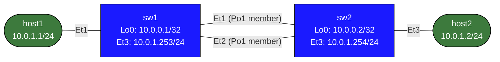

# LACP EtherChannel Lab

## Lab Overview

This lab teaches 802.3ad LACP (Link Aggregation Control Protocol) and EtherChannel on Arista EOS. You will bundle two physical links between two switches into a single logical Port-Channel interface, then explore its operational characteristics.

**What you will learn:**

- How LACP negotiates a port-channel bundle between two switches
- The difference between LACP active/passive modes and static (mode on) bundling
- How EOS hashes traffic across member links (load balancing)
- How to observe link-level distribution with counters
- How min-links protects against partial bundle failure
- How LACP fast timers speed up failure detection
- How the bundle behaves when a single member goes down

**Prerequisites:** Familiarity with EOS CLI, basic Layer 3 concepts, and IP routing.

---

## Topology



```
Node     Interface      IP Address        Role
------   -----------    ---------------   ---------------------------
host1    Ethernet1      10.0.1.1/24       LAN A host
host2    Ethernet1      10.0.1.2/24       LAN B host
sw1      Ethernet3      10.0.1.253/24     Gateway for host1
sw2      Ethernet3      10.0.1.254/24     Gateway for host2
sw1      Port-Channel1  10.12.0.1/30      Bundle IP (user creates)
sw2      Port-Channel1  10.12.0.2/30      Bundle IP (user creates)
sw1      Loopback0      10.0.0.1/32       Router ID
sw2      Loopback0      10.0.0.2/32       Router ID
```

**Links:**

| Link | sw1 port | sw2 port | Purpose |
|------|----------|----------|---------|
| 1    | Ethernet1 | Ethernet1 | Port-Channel1 member 1 |
| 2    | Ethernet2 | Ethernet2 | Port-Channel1 member 2 |
| 3    | Ethernet3 | host1:Ethernet1 | LAN A access |
| 4    | Ethernet3 | host2:Ethernet1 | LAN B access |

---

## Deploy the Lab

```bash
# From the containerlab repo root:
sudo containerlab deploy -t labs/lacp-etherchannel/topology.clab.yml

# Or using the helper script:
./scripts/lab.sh deploy lacp-etherchannel
```

Access the nodes:

```bash
# EOS CLI (Arista Cli)
./scripts/lab.sh Cli lacp-etherchannel sw1
./scripts/lab.sh Cli lacp-etherchannel sw2
./scripts/lab.sh Cli lacp-etherchannel host1
./scripts/lab.sh Cli lacp-etherchannel host2

# Or directly:
docker exec -it clab-lacp-etherchannel-sw1 Cli
docker exec -it clab-lacp-etherchannel-sw2 Cli
```

---

## Task 1: Configure LACP EtherChannel

Configure a two-member LACP port-channel between sw1 and sw2. Ethernet1 and Ethernet2 on both switches are already set to `no switchport` — you just need to add the channel-group and create the Port-Channel interface.

### On sw1

<details>
<summary>Show configuration</summary>

```
configure

interface Port-Channel1
   description to sw2 (LACP bundle)
   no switchport
   ip address 10.12.0.1/30

interface Ethernet1
   channel-group 1 mode active

interface Ethernet2
   channel-group 1 mode active

end
```
</details>

### On sw2

<details>
<summary>Show configuration</summary>

```
configure

interface Port-Channel1
   description to sw1 (LACP bundle)
   no switchport
   ip address 10.12.0.2/30

interface Ethernet1
   channel-group 1 mode active

interface Ethernet2
   channel-group 1 mode active

end
```
</details>

### What happens when you add `channel-group 1 mode active`

When you add a physical interface to a channel-group, EOS immediately begins sending LACPDUs (LACP Data Units) out that interface. The LACPDU contains:

- The switch's system MAC and LACP system priority
- The port's key (derived from speed and duplex — must match on all members)
- The port's LACP priority
- Timers (slow = 30 s, fast = 1 s)

When the peer switch responds with its own LACPDU, the two sides negotiate whether to bundle the port. If the port keys match and the negotiation succeeds, the port transitions to the **Collecting/Distributing** state and begins carrying traffic as part of the bundle.

---

## Task 2: Verify the Bundle

After configuring both switches, verify that the port-channel is up and both members are bundled.

### Quick summary

```
show etherchannel summary
```

Expected output on sw1:

```
Flags:  D - Down    P - bundled in port-channel
        I - stand-alone  s - suspended
        H - Hot-standby (LACP only)
        R - Layer3      S - Layer2
        U - in use      N - not in use, no aggregation
        f - wait for 45s default port cost rebalancing
        M - not in use, port not aggregated due to minimum links not met
        u - unsuitable for bundling
        d - default port

Number of channel-groups in use: 1
Number of aggregators:           1

Group  Port-Channel  Protocol    Ports
------+-------------+-----------+-----------------------------------------------
1      Po1(RU)       LACP        Et1(P)   Et2(P)
```

Key flags to know:

| Flag | Meaning |
|------|---------|
| `P`  | Bundled — port is actively carrying traffic in the channel |
| `D`  | Down — port is not up |
| `I`  | Stand-alone — LACP is running but no partner found |
| `s`  | Suspended — port is part of a channel-group but bundle is down |
| `U`  | Port-Channel is in use and forwarding |
| `R`  | Port-Channel is a routed (Layer 3) interface |

You want to see `Et1(P) Et2(P)` — both ports bundled.

### Detailed LACP state

```
show etherchannel 1 detail
```

This shows the per-port LACP state machine values:

```
Port-Channel Port-Channel1:
  Active Ports: 2
  Inactive Ports: 0
...
  Port Ethernet1:
    LACP State: Activity=Active Timeout=Long Aggregation=true Synchronization=true
                Collecting=true Distributing=true Defaulted=false Expired=false
    LACP Partner: Activity=Active Timeout=Long Aggregation=true Synchronization=true
                  Collecting=true Distributing=true Defaulted=false Expired=false
```

The critical states to look for:

- **Synchronization=true** — the port has been selected to be part of the bundle and both sides agree
- **Collecting=true** — the port is receiving frames from the partner
- **Distributing=true** — the port is sending frames to the partner

All three must be true for the port to carry traffic.

### Interface counters

```
show interfaces Port-Channel1
show interfaces Ethernet1
show interfaces Ethernet2
```

Port-Channel1 should show line protocol up/up. The member interfaces show their individual counters.

### Connectivity test

```
ping 10.12.0.2
```

From host1 (after adding a static route on sw1 and sw2):

<details>
<summary>Show configuration</summary>

```
! On sw1:
ip route 10.0.1.2/32 10.12.0.2

! On sw2:
ip route 10.0.1.1/32 10.12.0.1
```
</details>

Then from host1:

```
ping 10.0.1.2
```

---

## Task 3: Observe Load Balancing

EOS hashes each flow to a specific member link. The default hash for Layer 3 interfaces uses source and destination IP. You can view and change the algorithm.

### Show the current load-balance algorithm

```
show port-channel load-balance
```

### Change the hash algorithm

```
configure
port-channel load-balance src-dst-ip
end
```

Other available algorithms:

| Algorithm | Best for |
|-----------|----------|
| `src-dst-mac` | L2 switching (default) |
| `src-dst-ip` | L3 routed traffic |
| `src-dst-mixed-ip-port` | Mix of L3+L4, most entropy |

### Observe per-member traffic distribution

Watch the counters on each physical member before and after sending traffic:

```
! Clear counters first
clear counters

! Then send traffic (from host1 in another session):
!   ping 10.0.1.2 repeat 1000

! Check per-member output byte counters on sw1:
show interfaces Ethernet1 | grep "output"
show interfaces Ethernet2 | grep "output"
```

With only two hosts sending identical-destination traffic (same src/dst IP pair), you will see all traffic on ONE member — because the hash of that specific src+dst IP pair always resolves to the same link. This is expected and correct behavior.

To spread traffic across both links you need multiple flows with different source or destination IPs. With `src-dst-ip` hashing, traffic from 10.0.1.1 to 10.12.0.2 will always use the same member; traffic from 10.0.0.1 to 10.12.0.2 may hash to the other member.

### Verify the hash for a specific flow

EOS can show you which member a given flow will use:

```
test port-channel load-balance interface Port-Channel1 source-ip 10.0.1.1 destination-ip 10.0.1.2
```

This tells you which physical interface that flow will exit on without sending any real traffic.

---

## Task 4: Simulate a Link Failure

Shut down one member and observe that the bundle stays up with reduced bandwidth.

### Shut one member on sw1

<details>
<summary>Show configuration</summary>

```
configure
interface Ethernet2
   shutdown
end
```
</details>

### Verify the bundle is still up

```
show etherchannel summary
```

Expected: `Et1(P) Et2(D)` — Ethernet1 still bundled (P), Ethernet2 down (D). Port-Channel1 itself remains `U` (in use).

```
show interfaces Port-Channel1
```

The Port-Channel remains up/up — this is the key benefit of a port-channel over a single link. One link failing does not bring down the logical interface or disrupt routing.

### Restore the link

<details>
<summary>Show configuration</summary>

```
configure
interface Ethernet2
   no shutdown
end
```
</details>

LACP will re-negotiate and Ethernet2 will rejoin the bundle within a few seconds (or within 1 second with fast timers).

### Compare to a single-link failure scenario

Without a port-channel, if the single link between two routers goes down, the interface drops and all routing adjacencies (OSPF, BGP) reset. With a port-channel and two members, a single link failure is transparent to Layer 3 — the Port-Channel interface stays up, the IP address stays reachable, and no routing reconvergence is required.

---

## Task 5: Static EtherChannel (mode on)

LACP requires negotiation. An alternative is `mode on`, which creates a static bundle with no LACP PDUs exchanged. This is faster to configure but less safe — if there is a misconfiguration or the remote end is not also set to `mode on`, frames will loop.

### Switch to static mode on sw1

<details>
<summary>Show configuration</summary>

```
configure
interface Ethernet1
   channel-group 1 mode on
interface Ethernet2
   channel-group 1 mode on
end
```
</details>

### Switch to static mode on sw2

<details>
<summary>Show configuration</summary>

```
configure
interface Ethernet1
   channel-group 1 mode on
interface Ethernet2
   channel-group 1 mode on
end
```
</details>

### Verify

```
show etherchannel summary
```

The Protocol column now shows `Static` instead of `LACP`. The bundle will form if both sides are `mode on`. The bundle will NOT form if one side is `mode on` and the other is `mode active` or `mode passive` — LACP and static are incompatible.

### When to use each mode

| Mode | LACP | Use case |
|------|------|---------|
| `active` | Yes, initiates | Preferred — catches misconfigurations |
| `passive` | Yes, responds only | Use when partner initiates; will not form if both sides passive |
| `on` | No | Legacy or when LACP is not supported on the peer |

<details>
<summary>Show configuration</summary>

For this lab, switch back to LACP active when done:

```
configure
interface Ethernet1
   channel-group 1 mode active
interface Ethernet2
   channel-group 1 mode active
end
```
</details>

---

## Task 6: Min-Links

The `port-channel min-links` command sets a minimum number of active member ports required for Port-Channel1 to remain up. This prevents a "degraded bundle" scenario from being treated as healthy by routing protocols.

### Configure min-links on both switches

<details>
<summary>Show configuration</summary>

```
configure
interface Port-Channel1
   port-channel min-links 2
end
```

Apply the same on sw2.

</details>

### Test min-links behavior

With `min-links 2`, the port-channel will only stay up when both Ethernet1 and Ethernet2 are bundled. Shut one member:

<details>
<summary>Show configuration</summary>

```
configure
interface Ethernet2
   shutdown
end
```
</details>

Now check:

```
show etherchannel summary
show interfaces Port-Channel1
```

You should see Port-Channel1 go **down** even though one member (Ethernet1) is still up. The `M` flag will appear on the remaining active port — "not in use, port not aggregated due to minimum links not met."

This causes Port-Channel1 to drop, which triggers a routing reconvergence — but it ensures the routing layer does not continue using a half-capacity path that might be a symptom of a larger failure.

### Remove min-links

<details>
<summary>Show configuration</summary>

```
configure
interface Port-Channel1
   no port-channel min-links
end
```
</details>

Then restore the shut interface:

<details>
<summary>Show configuration</summary>

```
configure
interface Ethernet2
   no shutdown
end
```
</details>

---

## LACP Timers

LACP sends periodic PDUs to confirm the link is still alive. There are two timer modes:

| Timer | PDU interval | Hold-down (dead) |
|-------|-------------|-----------------|
| Slow (default) | 30 seconds | 90 seconds |
| Fast | 1 second | 3 seconds |

With slow timers (default), a failed link will not be detected by LACP for up to 90 seconds. With fast timers, detection happens within 3 seconds.

### Enable fast LACP timers on sw1

<details>
<summary>Show configuration</summary>

```
configure
interface Ethernet1
   lacp timer fast
interface Ethernet2
   lacp timer fast
end
```
</details>

### Enable fast LACP timers on sw2

<details>
<summary>Show configuration</summary>

```
configure
interface Ethernet1
   lacp timer fast
interface Ethernet2
   lacp timer fast
end
```
</details>

### Verify timer mode

```
show etherchannel 1 detail
```

Look for `Timeout=Short` (fast) vs `Timeout=Long` (slow) in the LACP state output.

### Observe the difference

With fast timers enabled, shut a member interface and watch how quickly the bundle reacts:

<details>
<summary>Show configuration</summary>

```
! In one session — watch etherchannel summary repeatedly
watch 1 show etherchannel summary

! In another session:
configure
interface Ethernet2
   shutdown
```
</details>

With slow timers the bundle degrades almost immediately (the physical link drops, which EOS detects instantly via carrier loss — LACP timers matter more when the physical layer stays up but LACP PDUs stop arriving, for example in a unidirectional fiber failure).

To restore:

<details>
<summary>Show configuration</summary>

```
configure
interface Ethernet1
   no lacp timer fast
interface Ethernet2
   no lacp timer fast
end
```
</details>

---

## Key Concepts

### What is LACP?

LACP (Link Aggregation Control Protocol) is defined in IEEE 802.3ad (now incorporated into 802.1AX). It allows two directly connected devices to negotiate the formation of a link aggregation group (LAG), also called an EtherChannel on Cisco/Arista platforms.

LACP is a control-plane protocol — it does not carry user data. Its sole job is to ensure both sides of each physical link agree to participate in the same bundle.

### LACPDU Exchange

Both sides send LACPDUs every 30 seconds (slow) or 1 second (fast) on each member port. Each LACPDU contains:

- **System ID**: MAC address of the sending switch (used to identify the partner)
- **System priority**: determines which side controls bundle membership (lower = higher priority)
- **Port key**: a value derived from interface speed — all ports in a bundle must have the same key
- **Port priority**: used to select which ports are active when more candidates exist than the maximum bundle size (default max is 8 active ports)
- **State flags**: Activity, Timeout, Aggregation, Synchronization, Collecting, Distributing

### Port States

A port progresses through several states before it carries traffic:

| State | Description |
|-------|-------------|
| **Detached** | Not part of any bundle |
| **Waiting** | Waiting to join a bundle (debounce timer) |
| **Attached** | Selected to join a bundle, but not yet synchronised |
| **Collecting** | Receiving frames from the partner; partner is also synchronized |
| **Distributing** | Transmitting frames; full bidirectional traffic allowed |

A port is only considered "bundled" (flag `P`) when it reaches **Collecting AND Distributing** simultaneously.

### Why Active/Active is Preferred

- **Active/Active**: both sides send LACPDUs. Bundle forms as soon as both sides are configured. If either side loses LACP PDUs, the other side will detect it.
- **Active/Passive**: one side sends, other responds. Bundle forms. But if the passive side is misconfigured, the active side keeps trying. Works fine in practice.
- **Passive/Passive**: neither side initiates. Bundle NEVER forms. Avoid this combination.
- **On/On**: no LACP at all. Bundle forms immediately but there is no detection mechanism for partner-side misconfiguration.

### Load Balancing and Flow Consistency

EOS uses a hash of packet header fields to select a member link. The same flow always hashes to the same member — this is critical for TCP, which requires in-order delivery. Reordering TCP segments across two links would cause severe performance degradation.

The hash inputs can be Layer 2 (MAC addresses), Layer 3 (IP addresses), or Layer 4 (TCP/UDP ports). More input fields means more entropy and better distribution across members, but the distribution is only as good as the diversity of your traffic flows.

A single large file transfer between two fixed endpoints will always use one link regardless of how many members the bundle has — because the src+dst IP never changes. Multiple concurrent flows with different source IPs will distribute well.

### Port-Channel vs Single Link Failure

| Event | Single link | Port-Channel (2 members) |
|-------|-------------|--------------------------|
| 1 link fails | Interface down, routing reconverges | Bundle stays up, traffic shifts to remaining member |
| Both links fail | N/A | Interface down, routing reconverges |
| Partial failure detection | Immediate (carrier) | Immediate (carrier) + LACP (if fiber stays up) |

---

## Verification Commands Summary

```
! Bundle status and member flags
show etherchannel summary

! Detailed LACP state per port
show etherchannel 1 detail

! Port-Channel interface counters
show interfaces Port-Channel1

! Individual member counters
show interfaces Ethernet1
show interfaces Ethernet2

! Load-balance algorithm in use
show port-channel load-balance

! Predict which member a flow will use
test port-channel load-balance interface Port-Channel1 source-ip 10.0.1.1 destination-ip 10.0.1.2

! Running config for the bundle
show running-config interfaces Port-Channel1
show running-config interfaces Ethernet1
show running-config interfaces Ethernet2

! LACP neighbor information
show lacp neighbor

! LACP counters (PDUs sent/received)
show lacp counters
```

---

## Teardown

```bash
sudo containerlab destroy -t labs/lacp-etherchannel/topology.clab.yml --cleanup
# or:
./scripts/lab.sh destroy lacp-etherchannel
```
