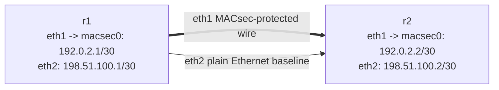

# macsec-basics — IEEE 802.1AE MACsec Lab

This lab uses native VyOS MACsec interfaces to show the difference between:

- a normal Ethernet link carrying plain IPv4/ICMP
- a MACsec-protected Ethernet link carrying the same traffic encrypted on the wire

## Topology



| Node | Plain link | MACsec link |
|------|------------|-------------|
| r1   | `eth2` = `198.51.100.1/30` | `macsec0` over `eth1` = `192.0.2.1/30` |
| r2   | `eth2` = `198.51.100.2/30` | `macsec0` over `eth1` = `192.0.2.2/30` |

## Build And Deploy

```bash
docker build -t vyos:local -f Dockerfile.vyos .
./scripts/lab.sh deploy macsec-basics
```

## Access

```bash
./scripts/lab.sh cli macsec-basics r1
./scripts/lab.sh cli macsec-basics r2
```

## What Is Prebuilt

- a plain Ethernet point-to-point link on `eth2`
- a MACsec point-to-point link on `eth1`
- MACsec interfaces `macsec0` on both routers using MKA with a shared CAK/CKN
- IP addressing on both the plain and protected links

## Verification

### 1. Confirm the plain Ethernet link

```bash
./scripts/lab.sh cmd macsec-basics r1 ping 198.51.100.2 count 3
```

### 2. Confirm the MACsec link

```bash
./scripts/lab.sh cmd macsec-basics r1 ping 192.0.2.2 count 3
```

### 3. Inspect the MACsec config

```bash
./scripts/lab.sh cli macsec-basics r1
# then run: show configuration commands | match macsec
docker exec clab-macsec-basics-r1 ip macsec show
```

## Packet Capture Walkthrough

The key idea is:

- capture on `eth2` to see a normal unencrypted Ethernet/IP link
- capture on `eth1` to see MACsec on the wire
- capture on `macsec0` to see the same MACsec traffic after decryption

### 1. Plain Ethernet baseline

Start a capture on `r1:eth2`:

```bash
./scripts/lab.sh pcap macsec-basics r1 eth2 /tmp/macsec-plain-eth2.pcap
```

In another terminal, generate traffic:

```bash
./scripts/lab.sh cmd macsec-basics r1 ping 198.51.100.2 count 3
```

What you should see in Wireshark or `tshark`:

- normal Ethernet II
- EtherType `0x0800`
- IPv4
- ICMP echo request/reply in the clear

### 2. MACsec on-wire capture

Start a capture on `r1:eth1`:

```bash
./scripts/lab.sh pcap macsec-basics r1 eth1 /tmp/macsec-wire-eth1.pcap
```

Generate traffic over the MACsec interface:

```bash
./scripts/lab.sh cmd macsec-basics r1 ping 192.0.2.2 count 3
```

What you should see:

- EtherType `0x88e5` for MACsec data frames
- during adjacency/keying, EtherType `0x888e` for EAPOL/MKA control traffic
- no plain ICMP payload visible on the wire capture

### 3. Decrypted MACsec payload view

Start a capture on `r1:macsec0`:

```bash
./scripts/lab.sh pcap macsec-basics r1 macsec0 /tmp/macsec-inner-macsec0.pcap
```

Generate traffic again:

```bash
./scripts/lab.sh cmd macsec-basics r1 ping 192.0.2.2 count 3
```

What you should see:

- normal IPv4/ICMP packets
- the same kind of payload you sent over the protected link
- this is the traffic after MACsec processing, not the encrypted wire image

## Fast `tshark` Checks

Plain Ethernet:

```bash
tshark -r /tmp/macsec-plain-eth2.pcap -Y icmp
```

On-wire MACsec:

```bash
tshark -r /tmp/macsec-wire-eth1.pcap -Y 'eth.type == 0x88e5 || eth.type == 0x888e'
```

Decrypted MACsec payload:

```bash
tshark -r /tmp/macsec-inner-macsec0.pcap -Y icmp
```

## What This Lab Teaches

- MACsec protects Ethernet frames on the wire, not just IP payloads
- a wire-side capture sees MACsec EtherType `0x88e5`, not the inner ICMP data
- a capture on the MACsec virtual interface shows the decrypted payload
- comparing `eth2`, `eth1`, and `macsec0` is the fastest way to understand what MACsec is actually doing

## Automated Check

```bash
./scripts/lab.sh check macsec-basics
```

## Cleanup

```bash
./scripts/lab.sh destroy macsec-basics
```

## Extensions

These are optional follow-on ideas to deepen the lab. They are not part of the validated base workflow.

- Break the CAK or CKN on one side and use MKA and interface state to identify why `macsec0` stops passing traffic.
- Change replay-window settings and observe what counters move during packet reordering or retransmission tests.
- Rebuild the link in integrity-only mode and compare the wire image to the encrypted default.
- Rotate keys during a running traffic test and watch for any loss or control-plane churn.
