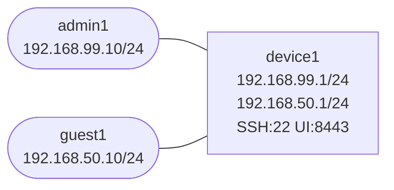

# management-access-control

This lab isolates a management-plane problem that shows up everywhere: the box is reachable, but it is reachable by too many people from too many places.

You will protect router-local management services by source subnet and interface.

## How to use this lab

This is a **practice lab**, not a tutorial. The environment is pre-built;
you produce the configuration or the diagnosis from the objectives.
**Predict each result before you verify**, and treat the challenge
questions as the real test.

## Topology



## Build and Deploy

```bash
docker build -t ops-lab:local images/ops-lab/
./scripts/lab.sh deploy management-access-control
```

## What Is Prebuilt

- `device1` runs SSH and a simple HTTPS-like management UI on TCP 8443
- both `admin1` and `guest1` can currently reach both services
- no management ACLs are in place yet

## Tasks

Apply a management ACL on `device1` so that:

- `admin1` can reach SSH and TCP 8443
- `guest1` cannot reach SSH or TCP 8443
- counters prove which rule matched

Suggested policy:

```bash
./scripts/lab.sh cmd management-access-control device1 -- bash -lc '
iptables -F INPUT
iptables -X MGMT-IN 2>/dev/null || true
iptables -N MGMT-IN
iptables -A INPUT -i eth1 -j MGMT-IN
iptables -A INPUT -i eth2 -j MGMT-IN
iptables -A MGMT-IN -m conntrack --ctstate ESTABLISHED,RELATED -j ACCEPT
iptables -A MGMT-IN -i eth1 -p tcp -s 192.168.99.0/24 --dport 22 -j ACCEPT
iptables -A MGMT-IN -i eth1 -p tcp -s 192.168.99.0/24 --dport 8443 -j ACCEPT
iptables -A MGMT-IN -i eth2 -p tcp --dport 22 -j DROP
iptables -A MGMT-IN -i eth2 -p tcp --dport 8443 -j DROP
iptables -A MGMT-IN -j ACCEPT
'
```

## Verification

Before policy:

```bash
./scripts/lab.sh cmd management-access-control admin1 -- nc -zvw 2 192.168.99.1 22
./scripts/lab.sh cmd management-access-control guest1 -- nc -zvw 2 192.168.50.1 22
./scripts/lab.sh cmd management-access-control admin1 -- nc -zvw 2 192.168.99.1 8443
./scripts/lab.sh cmd management-access-control guest1 -- nc -zvw 2 192.168.50.1 8443
```

After policy:

```bash
./scripts/lab.sh cmd management-access-control admin1 -- nc -zvw 2 192.168.99.1 22
./scripts/lab.sh cmd management-access-control guest1 -- nc -zvw 2 192.168.50.1 22
./scripts/lab.sh cmd management-access-control device1 -- iptables -L MGMT-IN -n -v --line-numbers
```

## What This Lab Teaches

- management-plane reachability is a separate design problem from data-plane reachability
- interface placement matters for management policy
- counters are the fastest way to prove that an access rule is doing what you think

## Challenge questions

No answers provided — reason them through.

1. You lock down management with an ACL on the VTY/mgmt interface. Construct
   the mistake that locks *you* out, and the safe procedure (reservation /
   console fallback) that prevents it.
2. In-band vs. out-of-band management: give a failure where in-band
   management dies exactly when you need it most, and what OOB buys you.
3. Role-based admin access (read-only vs. config) — why enforce it on the
   device even when you "trust" your team, and how does it limit blast
   radius after a credential leak?
4. SSH vs. the legacy alternatives: what specifically does each protect, and
   what's still exposed even with SSH if the management plane shares the
   data plane?
