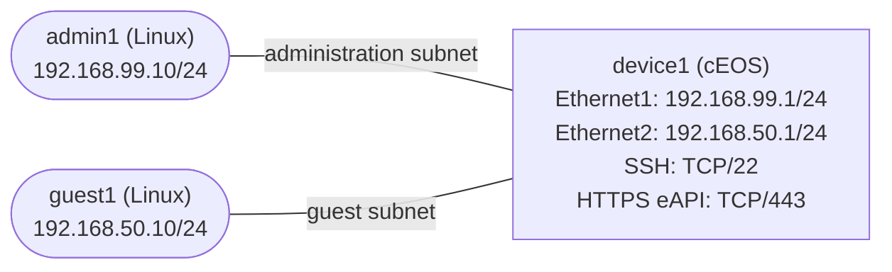

# Management Access Control — Practice Lab

Build a management-plane policy that lets an administrative subnet reach a
router's SSH and HTTPS API services while denying the same services to a guest
subnet. You will place the policy on the cEOS control plane, prove rule order
and matches with ACL counters, and recover from a deliberate management
lockout without disrupting unrelated IP traffic.

## Topology



| Node | Platform | Role | Pre-configured addressing |
|------|----------|------|---------------------------|
| `device1` | Arista cEOS 4.35.2F | Router and protected management endpoint | Ethernet1 `192.168.99.1/24`; Ethernet2 `192.168.50.1/24` |
| `admin1` | `ops-lab:local` Linux | Authorized traffic generator | eth1 `192.168.99.10/24`; default route via `192.168.99.1` |
| `guest1` | `ops-lab:local` Linux | Unauthorized traffic generator | eth1 `192.168.50.10/24`; default route via `192.168.50.1` |

| Link | Subnet | Purpose |
|------|--------|---------|
| `admin1:eth1` ↔ `device1:Ethernet1` | `192.168.99.0/24` | Authorized administration path |
| `guest1:eth1` ↔ `device1:Ethernet2` | `192.168.50.0/24` | Guest path used to test denial |

## How to use this lab

This is a **practice lab**, not a tutorial. Each task gives you an
**objective** and **hints** — your job is to produce the configuration.

- **Predict before you configure.** When a task asks for a prediction,
  commit to an answer before touching the CLI. Being wrong and finding out
  why is the point.
- **Open the hints before the solution.** The solution toggle is the answer
  key — use it to check your work or when genuinely stuck, not as step one.
- **Verify like an operator.** After each task, prove the state is what you
  think it is with `show` commands before moving on.

## Deploy

This mixed-platform lab requires the licensed cEOS image and the local Linux
tooling image. Complete these one-time prerequisites from the repository root:

```bash
# After downloading the cEOS-lab tarball for your host architecture.
scripts/build-images.sh ceos

# Build the incidental Linux traffic-generator image.
docker build -t ops-lab:local images/ops-lab/
```

Deploy and confirm all three nodes are running:

```bash
./scripts/lab.sh deploy management-access-control
./scripts/lab.sh status management-access-control
```

The measured probe footprint was about 1.158 GiB for `device1`, 1.09 MiB for
`admin1`, and 2.844 MiB for `guest1`.

## Pre-configured state

- `device1` has hostname `device1`, local `admin` / `admin` credentials,
  routed Ethernet1 and Ethernet2 addressing, and IP routing enabled.
- cEOS SSH is listening on TCP/22. HTTPS eAPI is enabled on TCP/443 with its
  lab-generated certificate.
- No IPv4 management ACL exists, and no ACL is attached to the control plane.
- `admin1` and `guest1` have the addresses and default routes in the tables.
- Initially, both endpoints can reach both management ports. That insecure
  baseline is intentional and is the state you will change.

The credentials are disposable lab credentials, not an example for
production. Open a cEOS CLI when needed with:

```bash
./scripts/lab.sh cli management-access-control device1
```

## Task 1 — Establish the unprotected baseline

**Objective:** Confirm routed reachability and run all four management-service
probes before creating policy. Record the four outcomes so you can compare
them with the end state.

**Predict first:** With no control-plane ACL attached, which of the four TCP
probes will establish? Will ICMP from the guest follow a different policy?

This is guided setup; run these commands from the repository root:

```bash
# Unrelated routed reachability
./scripts/lab.sh cmd management-access-control admin1 -- ping -c 2 -W 2 192.168.99.1
./scripts/lab.sh cmd management-access-control guest1 -- ping -c 2 -W 2 192.168.50.1

# Four service probes: two sources times two HTTPS/SSH services
./scripts/lab.sh cmd management-access-control admin1 -- nc -zvw 2 192.168.99.1 22
./scripts/lab.sh cmd management-access-control admin1 -- nc -zvw 2 192.168.99.1 443
./scripts/lab.sh cmd management-access-control guest1 -- nc -zvw 2 192.168.50.1 22
./scripts/lab.sh cmd management-access-control guest1 -- nc -zvw 2 192.168.50.1 443
```

<details markdown="1">
<summary>Check your work</summary>

Both pings and all four TCP probes succeed. This resolves the prediction:
without an attached control-plane ACL, the guest and administrator have the
same network access to the router-local SSH and HTTPS eAPI listeners. A TCP
connect test proves the listener and path are available; it does not prove a
user can authenticate.

</details>

## Task 2 — Design an ordered control-plane policy

**Objective:** Write an ordered policy that permits the administration subnet
to SSH and HTTPS eAPI, denies everyone else only for those two services, and
preserves unrelated IP traffic. Include an explicit rule for every outcome
you intend.

**Predict first:** If a broad TCP deny is placed before the two administrator
permits, will EOS continue looking for a later, more specific match?

<details markdown="1">
<summary>Hints</summary>

- EOS evaluates IPv4 ACL entries by sequence number and stops at the first
  match.
- Account for the implicit deny at the end of every ACL when deciding what
  must remain reachable.
- Test your ordering on an authorized management packet, an unauthorized
  management packet, and an unrelated packet before opening the solution.

</details>

<details markdown="1">
<summary>Solution</summary>

Use this ordered intent:

1. Permit source `192.168.99.0/24` to TCP/22.
2. Permit source `192.168.99.0/24` to TCP/443.
3. Deny every other source to TCP/22.
4. Deny every other source to TCP/443.
5. Permit all remaining IP traffic.

The administrator exceptions must precede the broad service denies. The
final permit deliberately leaves protocols such as ICMP outside this
management-service restriction.

</details>

<details markdown="1">
<summary>Check your work</summary>

Trace one packet from each source to each service through your written rules.
Each of the four flows should terminate on a different intended permit/deny
outcome, while ICMP reaches the final permit. EOS does not select the most
specific ACL entry; the first matching sequence wins, so an early broad deny
would make the later administrator exceptions unreachable. That resolves the
prediction.

</details>

## Task 3 — Implement management-plane protection

**Objective:** Create the named IPv4 ACL `MGMT-PLANE` from your design and
attach it inbound to the cEOS system control plane. Afterward, the
administrator must retain both services, the guest must lose both, and ICMP
must continue working.

**Predict first:** After the ACL is attached, will a new guest HTTPS probe
reach eAPI just because Ethernet2 itself has no interface ACL?

<details markdown="1">
<summary>Hints</summary>

- Create a named ACL under `ip access-list MGMT-PLANE`; use explicit sequence
  numbers so the evaluation order is visible.
- EOS recognizes `ssh` and `https` as TCP destination-port keywords.
- Apply the ACL under `system control-plane`, not under Ethernet1 or
  Ethernet2. Explore `ip access-group ?` in that configuration context.

</details>

<details markdown="1">
<summary>Solution</summary>

```text
configure
ip access-list MGMT-PLANE
   10 permit tcp 192.168.99.0/24 any eq ssh
   20 permit tcp 192.168.99.0/24 any eq https
   30 deny tcp any any eq ssh
   40 deny tcp any any eq https
   50 permit ip any any
system control-plane
   ip access-group MGMT-PLANE in
end
```

</details>

<details markdown="1">
<summary>Check your work</summary>

Run the same four `nc` probes from Task 1. The two `admin1` probes succeed;
the two `guest1` probes time out. Both ping commands still succeed.

Then inspect the attachment:

```text
show ip access-lists MGMT-PLANE
```

The output should end with both of these states:

```text
Configured on Ingress: control-plane(default VRF)
Active on     Ingress: control-plane(default VRF)
```

That resolves the prediction: a system control-plane ACL protects traffic
destined to the router itself regardless of which routed data interface the
packet entered. An interface data-plane ACL is neither required nor desired
for this objective.

</details>

## Task 4 — Prove the mechanism with counters

**Objective:** Generate one fresh probe for every intended management outcome
and use per-entry ACL counters to map packets to the exact first-match rule.
Also prove that unrelated ICMP uses the final permit rather than a service
rule.

**Predict first:** Which numbered entry should count a guest SSH SYN, and can
that deny counter increase even though no SSH authentication occurs?

Record the existing counters, generate all four service flows plus unrelated
traffic, and inspect them again:

```bash
./scripts/lab.sh cmd management-access-control device1 -- \
  Cli -p 15 -c "show ip access-lists MGMT-PLANE"

./scripts/lab.sh cmd management-access-control admin1 -- nc -zvw 2 192.168.99.1 22
./scripts/lab.sh cmd management-access-control admin1 -- nc -zvw 2 192.168.99.1 443
./scripts/lab.sh cmd management-access-control guest1 -- nc -zvw 2 192.168.50.1 22
./scripts/lab.sh cmd management-access-control guest1 -- nc -zvw 2 192.168.50.1 443
./scripts/lab.sh cmd management-access-control guest1 -- ping -c 2 -W 2 192.168.50.1

./scripts/lab.sh cmd management-access-control device1 -- \
  Cli -p 15 -c "show ip access-lists MGMT-PLANE"
```

The two denied `nc` commands are expected to return non-zero; keep going.

<details markdown="1">
<summary>Hints</summary>

- Read the sequence number and packet count on each line, not only the ACL
  name.
- Map source, protocol, and destination port to the first matching entry.
- A denied SYN still enters the control plane far enough for the ACL to
  classify and count it; it never reaches the SSH process.

</details>

<details markdown="1">
<summary>Solution</summary>

The expected mapping is:

| Generated traffic | Matching sequence | Action |
|-------------------|-------------------|--------|
| admin → TCP/22 | 10 | permit |
| admin → TCP/443 | 20 | permit |
| guest → TCP/22 | 30 | deny |
| guest → TCP/443 | 40 | deny |
| guest → ICMP | 50 | permit |

</details>

<details markdown="1">
<summary>Check your work</summary>

The packet count on sequences 10, 20, 30, 40, and 50 should increase from the
first snapshot to the second.
This is stronger evidence than a client result alone: the counter identifies
the exact first-match decision inside the router. The guest SSH SYN increments
deny sequence 30 before the SSH daemon sees it, so authentication never starts;
that resolves the prediction. Sequence 50 increasing for the ping proves the
policy is service-specific rather than a blanket guest-subnet block.

</details>

## Task 5 — Diagnose and repair an access lockout

**Objective:** Introduce the supplied fault, diagnose why the authorized
administrator loses both services while ICMP remains healthy, repair the
policy, and re-verify the complete end state. Work from the symptom; do not
read the helper before diagnosing it.

Start the incident and reproduce it:

```bash
./labs/management-access-control/break.sh

./scripts/lab.sh cmd management-access-control admin1 -- ping -c 2 -W 2 192.168.99.1
./scripts/lab.sh cmd management-access-control admin1 -- nc -zvw 2 192.168.99.1 22
./scripts/lab.sh cmd management-access-control admin1 -- nc -zvw 2 192.168.99.1 443
```

Do not change anything yet. Use ACL configuration, entry order, and counters
to explain all three symptoms. Then make the smallest repair that restores
the intended policy without detaching it.

<details markdown="1">
<summary>Hints</summary>

- One inspection command can show both ordered rules and counters; compare the
  first non-zero TCP match with the administrator permits and ask whether
  those later entries are reachable.

</details>

<details markdown="1">
<summary>Solution</summary>

The injected entry is an early broad TCP deny. It matches both authorized
management flows before sequences 10 and 20 can be evaluated, while the ping
continues to sequence 50.

Remove only the injected entry:

```text
configure
ip access-list MGMT-PLANE
   no 5
end
```

</details>

<details markdown="1">
<summary>Check your work</summary>

Re-run all four service probes from Task 1 and both pings. The two
administrator probes and both pings succeed; the two guest probes fail. In
`show ip access-lists MGMT-PLANE`, the unexpected early rule is gone, all five
intended entries remain, and the ACL is still configured and active on the
control plane. Finally run:

```bash
./scripts/lab.sh check management-access-control
```

The checker takes a counter snapshot, regenerates every intended flow, and
requires the corresponding rule counters to increase, so stale evidence
cannot pass by itself.

</details>

## Verification

The solved end state must satisfy all of these conditions:

- [ ] `admin1` reaches SSH on `192.168.99.1:22`.
- [ ] `admin1` reaches HTTPS eAPI on `192.168.99.1:443`.
- [ ] `guest1` cannot reach SSH on `192.168.50.1:22`.
- [ ] `guest1` cannot reach HTTPS eAPI on `192.168.50.1:443`.
- [ ] Both endpoint-to-router ICMP probes still succeed.
- [ ] `MGMT-PLANE` is configured and active inbound on the system control
  plane, not on either Ethernet interface.
- [ ] Intended sequences 10–50 are present and each has a meaningful non-zero
  counter after the matching verification traffic.

Run the end-state checker:

```bash
./scripts/lab.sh check management-access-control
```

## Challenge questions

No answers are provided; reason from the behavior you observed.

1. Design a safe change procedure for replacing `192.168.99.0/24` with a new
   administration subnet when your only current access is SSH through this
   ACL. What must be staged and verified before the old permit is removed?
2. An automation system now needs HTTPS eAPI from a single address in the
   guest subnet, but human SSH must remain denied there. Propose the smallest
   policy change and the evidence that would distinguish it from a broad
   guest exception.
3. The service probes pass, but an administrator still cannot log in. Rank the
   next three layers or components you would investigate and name evidence
   that separates a transport failure from an authentication failure.
4. You add a new router-local UDP management service. Explain how the current
   final permit affects it and redesign the policy if management-plane default
   deny is the new requirement without breaking necessary control protocols.

## Troubleshooting

| Symptom | Likely cause | Fix |
|---------|--------------|-----|
| Both admin and guest reach TCP/22 or TCP/443 | ACL is absent, only defined but not attached, or a broad permit precedes the denies | Inspect `show ip access-lists MGMT-PLANE`; attach it under `system control-plane` and correct first-match order |
| Admin and guest are both denied a management service | Broad service deny is before the admin exception, or the admin source/prefix is wrong | Inspect the first matching counter; correct the sequence or source prefix so the specific permit is evaluated first |
| SSH works but HTTPS probe is refused for both sources | HTTPS eAPI is not running, rather than filtered | Inspect `show management api http-commands`; restore HTTPS protocol and `no shutdown` |
| Guest management is denied, but guest ping also fails | Final unrelated-traffic permit is missing or unreachable | Restore the final unrelated-IP permit after the management-service denies |
| Rules look correct but counters stay at zero | ACL is not active on the control plane, or probes target the wrong interface address | Confirm the `Configured on` and `Active on` control-plane lines, then repeat probes against the address on the source's directly connected link |
