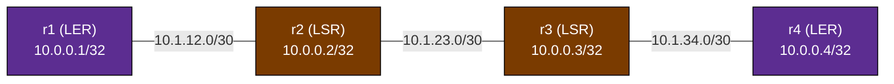

# MPLS with LDP — Practice Lab

Label a four-router core with **LDP**, the Label Distribution Protocol —
the way most deployed MPLS networks got their labels before Segment
Routing, and the way many brownfield cores still do. You build an OSPF
underlay, bring up LDP sessions on top of it, and then read what LDP
actually creates: hello adjacencies, TCP sessions between loopbacks,
per-prefix label bindings on every hop, and penultimate-hop popping on
the wire. The repo's SR labs (`mpls-sr-blank`, `mpls-sr-isis-bgp`) build
the same forwarding outcome with no LDP at all — after this lab you'll
understand exactly what state SR removed.

## Topology



### Link addressing

| Link    | Subnet        | Left side | Right side |
|---------|---------------|-----------|------------|
| r1 — r2 | 10.1.12.0/30  | .1 (r1)   | .2 (r2)    |
| r2 — r3 | 10.1.23.0/30  | .1 (r2)   | .2 (r3)    |
| r3 — r4 | 10.1.34.0/30  | .1 (r3)   | .2 (r4)    |

### Node reference

| Node | Role                    | Loopback    | LDP router-id / transport address |
|------|-------------------------|-------------|-----------------------------------|
| r1   | LER (label edge)        | 10.0.0.1/32 | 10.0.0.1                          |
| r2   | LSR (transit)           | 10.0.0.2/32 | 10.0.0.2                          |
| r3   | LSR (transit)           | 10.0.0.3/32 | 10.0.0.3                          |
| r4   | LER (label edge)        | 10.0.0.4/32 | 10.0.0.4                          |

IP addressing is pre-configured on every node. OSPF and LDP are not —
that's your job.

## How to use this lab

This is a **practice lab**, not a tutorial. Each task gives you an
**objective** and **hints** — your job is to produce the configuration.

- **Predict before you configure.** When a task asks for a prediction,
  commit to an answer before touching the CLI. Being wrong and finding out
  why is the point.
- **Open the hints before the solution.** The solution toggle is the answer
  key — use it to check your work or when genuinely stuck, not as step one.
- **Verify like an operator.** After each task, prove the state is what you
  think it is with `show` commands before moving on.

## Deploy

Build the base image once if you haven't (`docker build -t frr-lab:local
images/frr/`), then:

```bash
sudo containerlab deploy -t labs/mpls-ldp/topology.clab.yml
# or: ./scripts/lab.sh deploy mpls-ldp
```

Access a node:

```bash
./scripts/lab.sh vtysh mpls-ldp r1     # FRR CLI
./scripts/lab.sh bash  mpls-ldp r1     # Linux shell (ping, tcpdump)
```

Destroy when done:

```bash
sudo containerlab destroy -t labs/mpls-ldp/topology.clab.yml --cleanup
```

---

## Task 1 — Survey the blank core (guided)

**Objective:** confirm what you're starting from: interfaces addressed,
`ldpd` running, and *no* routing or label state anywhere.

Run these on r1 and r2:

```bash
./scripts/lab.sh vtysh mpls-ldp r1
```

```text
show ip route
show mpls ldp discovery
show mpls table
```

<details>
<summary>Check your work</summary>

`show ip route` lists only `C>` connected routes (plus the containerlab
management network: a `K>` default and `172.20.20.0/24` on eth0 — ignore
those throughout) — r1 cannot reach any loopback but its own. `show mpls ldp discovery` prints an empty ipv4
section: the daemon is alive (the command exists and returns) but no
interface is enabled for LDP, so it isn't even sending hellos yet.
`show mpls table` is empty — the kernel label table
(`net.mpls.platform_labels` is already set by the topology) has nothing
programmed. Everything you see from here on, you built.

</details>

## Task 2 — Build the OSPF underlay

**Objective:** single-area OSPF on all four routers so that every router
reaches every loopback. LDP will ride on this: it needs IP reachability
between loopbacks before any label can move.

**Predict first:** once OSPF converges, how many `O>` routes will r1's
table hold? Count before you look.

<details>
<summary>Hints</summary>

- `router ospf` → `network <prefix> area 0`. All addresses in this lab
  (loopbacks 10.0.0.x, links 10.1.x.x) fit under one summary statement —
  or list them per-subnet if you prefer being explicit.
- Set a deterministic `ospf router-id` (use the loopback).
- FRR 8.4 quirk: don't mix `network ... area` with per-interface
  `ip ospf area` — pick one style.

</details>

<details>
<summary>Solution</summary>

On r1 (analogous on r2/r3/r4 — change the router-id):

```text
configure terminal
router ospf
 ospf router-id 10.0.0.1
 network 10.0.0.0/8 area 0
exit
exit
```

</details>

<details>
<summary>Check your work</summary>

`show ip ospf neighbor` on r2 shows two neighbors in `Full`. On r1,
`show ip route` now has **5** `O>` routes: three remote loopbacks
(10.0.0.2/32, .3/32, .4/32) and the two transit /30s r1 isn't attached
to (10.1.23.0/30, 10.1.34.0/30). If you predicted 6, you counted r1's
own loopback — OSPF knows it, but the connected route wins.
`ping -c 3 10.0.0.4` from r1's shell must succeed before you continue —
plain IP, no labels yet.

</details>

## Task 3 — Enable MPLS forwarding and LDP

**Objective:** every core interface forwards MPLS, and every adjacent
pair of routers has an LDP session in state `OPERATIONAL`, using the
loopback as the transport address.

**Predict first:** LDP discovery is UDP multicast hellos, but the
session itself is TCP (port 646) between the two transport addresses.
For the r1–r2 pair, which router opens that TCP connection?

<details>
<summary>Hints</summary>

- Two separate things to enable, and forgetting the first is this lab's
  classic silent failure:
  1. Per interface: `mpls enable` (under `interface ethN`) — this turns
     on kernel MPLS input for the interface.
  2. Globally: the `mpls ldp` block → `router-id`, then
     `address-family ipv4` → `discovery transport-address <loopback>`
     and one `interface ethN` line per core-facing interface.
- All four routers need both. r2 and r3 have two core interfaces each.

</details>

<details>
<summary>Solution</summary>

On r2 (two interfaces; r1/r4 have only eth1, and use their own
loopbacks as router-id/transport-address):

```text
configure terminal
interface eth1
 mpls enable
exit
interface eth2
 mpls enable
exit
mpls ldp
 router-id 10.0.0.2
 address-family ipv4
  discovery transport-address 10.0.0.2
  interface eth1
  interface eth2
 exit-address-family
exit
exit
```

</details>

<details>
<summary>Check your work</summary>

`show mpls ldp discovery` on r2 lists eth1 and eth2 with the neighbor's
router-id against each. `show mpls ldp neighbor` on r2 shows **two**
sessions in `OPERATIONAL`. Prediction: the session runs between
10.0.0.1 and 10.0.0.2, and the **higher transport address opens the
TCP connection** — r2 is the active side. Confirm with
`show mpls ldp neighbor detail` on r1: the TCP connection line reads
`10.0.0.1:646 - 10.0.0.2:<ephemeral>` — r1 listens on 646, r2 connected
from an ephemeral port, so r2 initiated. This is also why the transport
addresses must be routable — which is exactly what Task 7 breaks.

</details>

## Task 4 — Read the label tables

**Objective:** trace one FEC — r4's loopback `10.0.0.4/32` — through
every table it appears in on r2: remote bindings, the local binding r2
advertises, and what actually got installed in the forwarding plane.

**Predict first:** r2 has two LDP neighbors (r1 and r3), and both
advertise a label for `10.0.0.4/32`. How many bindings for that FEC will
r2 *hold*, and how many will it *install*?

<details>
<summary>Hints</summary>

- `show mpls ldp binding` — the LIB: every label anyone told r2 about,
  plus r2's own local label per FEC.
- `show mpls table` — the LFIB: what the kernel will actually switch.
- `show ip route 10.0.0.4/32` — where the pushed label shows up for
  ingress traffic.

</details>

<details>
<summary>Check your work</summary>

The binding table shows `10.0.0.4/32` with a **local label** (what r2
tells its neighbors to use) and **two remote bindings** — one learned
from r1, one from r3. That's *liberal label retention*: LDP keeps every
binding, even useless ones. But `show mpls table` installs exactly
**one** entry for that FEC: in-label → swap to r3's label, out eth2 —
because the routing table's next hop for 10.0.0.4/32 is r3, and LDP
always follows the IGP. The binding from r1 sits unused until the IGP
path changes. So: hold 2 (+1 local), install 1 — LDP allocates a label
per FEC per router, network-wide state that grows with the routing
table. Keep that in mind for the SR comparison at the end.

</details>

## Task 5 — See PHP on the wire

**Objective:** capture a labeled packet mid-core, then prove that the
last hop of the LSP carries **no label** — penultimate-hop popping.

**Predict first:** you'll ping from r1's loopback to r4's loopback and
capture on both the r2→r3 link and the r3→r4 link. Which captures show
an MPLS header?

From r1's **Linux shell** (not vtysh):

```bash
ping -I 10.0.0.1 10.0.0.4
```

While it runs, capture on r2 and on r3 (their shells):

```bash
tcpdump -c 4 -ni eth2 mpls          # r2: the r2->r3 link
tcpdump -c 4 -ni eth2 ip and icmp   # r3: the r3->r4 link
```

<details>
<summary>Hints</summary>

- Look at r4's advertised binding for its own loopback in
  `show mpls ldp binding` on r3 — the label value is the explanation.
- `show mpls table` on r3: what does the entry for r4's FEC say in the
  out-label column?

</details>

<details>
<summary>Check your work</summary>

On r2→r3 you see `MPLS (label <N>, exp 0, [S], ttl ...)` wrapping each
ICMP packet — the LSP is real. On r3→r4 the same pings arrive as plain
IP: **no MPLS header at all**. r4 advertised the reserved label
**implicit-null (3)** for its own loopback, which instructs r3 — the
penultimate hop — to pop the label instead of swapping it, so r4 does a
single IP lookup instead of a label lookup *plus* an IP lookup. Your
prediction should have been: label on r2→r3, none on r3→r4. Note the
asymmetry of the ping too: echo *replies* ride a second LSP in the
opposite direction (toward 10.0.0.1), which is why you sourced the ping
from the loopback — and if you capture r3's eth2 *without* the `ip and
icmp` filter you'll see those replies labeled on this very link, because
r4 is the *ingress* of the return LSP and PHP for it happens later, at
r2. Same link, one direction popped, the other labeled.

</details>

## Task 6 — Replace PHP with explicit-null

**Objective:** make r4 request **explicit-null (label 0)** instead of
implicit-null for its local FECs, and show that the r3→r4 hop now
carries a labeled packet.

**Predict first:** after the change, what label value will the capture
on r3's eth2 show?

<details>
<summary>Hints</summary>

- One line, on r4 only, inside `mpls ldp` → `address-family ipv4`.
- The keyword to look for with `?` is under `label local advertise`.

</details>

<details>
<summary>Solution</summary>

On r4:

```text
configure terminal
mpls ldp
 address-family ipv4
  label local advertise explicit-null
 exit-address-family
exit
exit
```

</details>

<details>
<summary>Check your work</summary>

Re-run the Task 5 ping and capture on r3 with `tcpdump -c 4 -ni eth2
mpls`: the last hop now shows `MPLS (label 0, ...)` — explicit-null.
r3 still "pops" in effect (label 0 means "this is the bottom, route the
IP underneath") but the MPLS header survives the last hop. The
operational reason to do this: the EXP/TC bits (QoS marking) live in the
label header — with PHP they're thrown away one hop early; with
explicit-null the egress router still sees them. Revert to implicit-null
(`no label local advertise explicit-null`) before the next task so
you're back at the default.

</details>

## Task 7 — Break it: the session that died with the IGP up

**Objective:** diagnose a real LDP failure mode from its symptoms.
Inject the fault from your host shell **without reading the command's
intent too closely** — then investigate from the routers:

```bash
docker exec clab-mpls-ldp-r3 ip route add blackhole 10.0.0.2/32
```

Now wait — and notice *how long* you're waiting. Nothing visible happens
for minutes: LDP fails slowly, because the session only dies when its
**180-second hold timer** expires. Watch `show mpls ldp neighbor` on r3
until the 10.0.0.2 session disappears (~3–4 minutes).

Symptoms to explain once it does: `ping -I 10.0.0.1 10.0.0.4` from r1
now **fails completely**, yet OSPF is `Full` everywhere, r1's
`show ip route 10.0.0.4/32` still shows a healthy-looking route, and
`show mpls ldp discovery` on r3 still lists r2.

Work the problem before opening the hints: which session died, why, and
— the interesting part — *where exactly* do the packets die?

<details>
<summary>Hints</summary>

- Compare `show mpls ldp discovery` and `show mpls ldp neighbor` on r3.
  One of them still sees r2 — which, and why do they differ?
- Discovery is link-scoped multicast hellos; the session is TCP between
  the two **transport addresses**. What are those addresses, and can r3
  reach r2's right now? (`show ip route 10.0.0.2/32` on r3, and look at
  *every* route source, not just OSPF.)
- To find where packets die: does r1 still push a label
  (`show ip route 10.0.0.4/32`)? Is that in-label still in r2's
  `show mpls table`? Confirm with tcpdump on r2's eth1 vs eth2.

</details>

<details>
<summary>Check your work</summary>

The r3↔r2 session is gone from `show mpls ldp neighbor`, while
`show mpls ldp discovery` **still lists r2** — hellos arrive over link
multicast regardless of routing. The TCP session, though, runs
loopback-to-loopback (10.0.0.3 ↔ 10.0.0.2), and the injected kernel
**blackhole route for 10.0.0.2/32** overrides the OSPF /32 (distance 0
beats 110), so r3's keepalives toward r2's transport address die
locally and the hold timer eventually kills the session.

Now the damage. r1's session to r2 is healthy, so r1 **keeps** r2's
label binding (liberal retention) and `show ip route 10.0.0.4/32` on r1
still says `label 18` — r1 keeps labeling every packet toward r4. But on
r2, `show mpls table` no longer contains in-label 18: when r3's bindings
were withdrawn, r2 had no outgoing label left for that FEC and removed
the LFIB entry entirely (its IP route to 10.0.0.4/32 is now unlabeled).
So labeled echo requests enter r2's eth1 and are **dropped on arrival**
— tcpdump shows them in on eth1, nothing out on eth2. A hard blackhole,
while OSPF, discovery, and every route display report green.

The lesson generalizes: an LSP is only as alive as its weakest session,
the IGP cannot see label state, and an ingress will happily use a stale
label path indefinitely. Note the geometry, too — if you had killed the
**r1–r2** session instead, r1 would have lost its binding and fallen
back to *unlabeled* IP forwarding: traffic survives. Whether an LDP
failure blackholes or silently degrades depends on **where in the path**
the session died. Verify like an operator: sessions and LFIB entries,
not ping alone.

Repair and re-verify:

```bash
docker exec clab-mpls-ldp-r3 ip route del blackhole 10.0.0.2/32
```

Recovery is hello-triggered and takes seconds — no hold timer on the way
up. `show mpls ldp neighbor` on r3 is OPERATIONAL to r2 again, the
loopback ping works, and the r2→r3 capture shows MPLS.

</details>

---

## Verification

End state, all of which `./labs/mpls-ldp/check.sh` asserts:

- [ ] OSPF: every router has every remote loopback (`show ip route`)
- [ ] LDP: r2 and r3 each have two `OPERATIONAL` sessions
      (`show mpls ldp neighbor`)
- [ ] Bindings: `10.0.0.4/32` has a local + remote labels on r2
      (`show mpls ldp binding`)
- [ ] LFIB: label-swap entries installed (`show mpls table`)
- [ ] Ingress: r1's route to `10.0.0.4/32` carries a pushed label
      (`show ip route 10.0.0.4/32`)
- [ ] Data path: `ping -I 10.0.0.1 10.0.0.4` succeeds and shows MPLS on
      the r2→r3 capture

## Challenge questions

No answers provided — argue them from what you built.

1. Count the protocol state on r2 in this lab: sessions, hello
   adjacencies, and label bindings held vs installed. Now do the same
   count for a middle router in `mpls-sr-blank` after its SR task.
   What disappeared, and what single piece of information per router
   replaced all of it?
2. LDP always labels the IGP's best path. Your operator wants 20% of
   the r1→r4 traffic pinned to a longer path during a fiber migration.
   What can LDP do about that, and what did carriers historically deploy
   alongside LDP to get it?
3. In Task 7 a mid-path session loss blackholed traffic, while the same
   fault adjacent to the ingress would have silently degraded to
   unlabeled IP forwarding. For plain IPv4 the degraded case sounds
   harmless — argue why it is an *outage* for the L3VPN traffic in
   `mpls-sr-isis-bgp`, and which of the two failure modes an operator
   should actually prefer.
4. The r2–r3 link flaps for 2 seconds. Walk the timeline of what OSPF
   and LDP each tear down and rebuild, in order, and where in that
   timeline packets can be blackholed even though both protocols are
   "converging correctly." What is LDP-IGP synchronization for?
5. Rank these three cores by total label-related state on a transit
   router as the network grows to 1,000 loopbacks, and justify:
   (a) this lab's LDP core, (b) the SR core from `mpls-sr-blank`,
   (c) a BGP-labeled-unicast core (`bgp-labeled-unicast`).

## Troubleshooting

| Symptom | Cause | Fix |
|---------|-------|-----|
| `show mpls ldp discovery` empty on a router | No `interface ethN` lines under `mpls ldp` → `address-family ipv4` | Add each core interface to the LDP address-family block |
| Discovery sees the neighbor but the session never reaches OPERATIONAL | Transport addresses unreachable — loopbacks not in OSPF, or (Task 7) a bogus route to the neighbor's loopback | Fix loopback reachability; check `show ip route <transport-addr>` for non-OSPF route sources |
| End-to-end ping dead but OSPF Full everywhere | A mid-path LDP session died; the ingress still pushes a retained (stale) label that a transit LSR no longer has in its LFIB | Walk the path comparing the pushed label (`show ip route <FEC>`) against each hop's `show mpls table`; fix the dead session |
| Sessions OPERATIONAL but `show mpls table` empty / pings unlabeled | `mpls enable` missing on the interfaces — bindings exchange fine but the kernel won't forward labels | Add `mpls enable` under every core interface |
| `ping -I 10.0.0.1 10.0.0.4` fails but `ping 10.0.0.4` works | The far end has no route back to your loopback — OSPF isn't advertising it | Check the `network` statement covers 10.0.0.0/8 (or the loopback /32) |
| Everything configured, still no labels on the wire | Ping not sourced from a labeled FEC — traffic to a connected /30 never enters the LSP | Ping loopback-to-loopback (`-I 10.0.0.1`), not link addresses |

## Extensions

- Enable `debug mpls ldp messages recv` and watch a label withdraw
  propagate when you shut r4's loopback out of OSPF.
- Add a fifth router and a second equal-cost path between r2 and r3,
  and check whether both LDP next-hops get installed (ECMP over LSPs).
- Filter what you label: use `mpls ldp` allocation filters so only
  /32 loopbacks get labels (the common carrier hygiene), and confirm the
  transit /30s stop appearing in the binding table.
