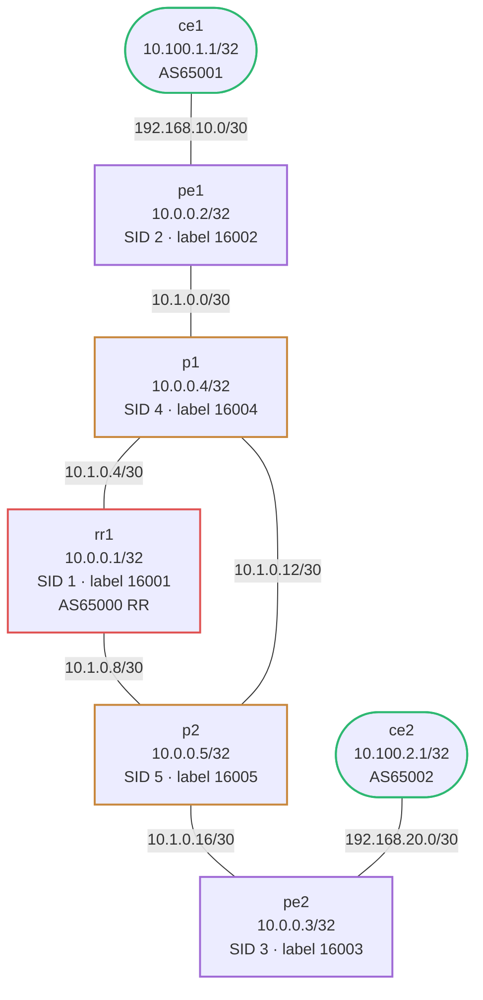

# MPLS / IS-IS / SR / BGP L3VPN — Practice Lab

Build a working service provider network from scratch — IS-IS, SR-MPLS,
BGP VPNv4, and L3VPN — one layer at a time. The topology and IP addressing
are pre-configured; you implement every protocol. This is the build-it
counterpart to the `mpls-sr-isis-bgp` reference lab.

## How to use this lab

This is a **practice lab**, not a tutorial. Each step gives you an
objective and hints; configuration is behind solution toggles.

- **Predict before each verify**: commit to what `show` will return
  before you run it — a half-built stack has a *specific* failure at each
  layer, and predicting it is how you learn to read the stack.
- **Build bottom-up**: each layer depends on the one below. Don't move on
  until the current layer's verify passes.

---

## Topology



### Link addressing

| Link           | Subnet           | Left side   | Right side  |
|----------------|------------------|-------------|-------------|
| ce1 — pe1      | 192.168.10.0/30  | .1 (ce1)    | .2 (pe1)    |
| pe1 — p1       | 10.1.0.0/30      | .1 (pe1)    | .2 (p1)     |
| p1  — rr1      | 10.1.0.4/30      | .5 (p1)     | .6 (rr1)    |
| rr1 — p2       | 10.1.0.8/30      | .9 (rr1)    | .10 (p2)    |
| p1  — p2       | 10.1.0.12/30     | .13 (p1)    | .14 (p2)    |
| p2  — pe2      | 10.1.0.16/30     | .17 (p2)    | .18 (pe2)   |
| pe2 — ce2      | 192.168.20.0/30  | .2 (pe2)    | .1 (ce2)    |

### Node reference

| Node | Loopback      | IS-IS NET                    | SR SID index | SR label |
|------|---------------|------------------------------|--------------|----------|
| rr1  | 10.0.0.1/32   | 49.0001.0000.0000.0001.00    | 1            | 16001    |
| pe1  | 10.0.0.2/32   | 49.0001.0000.0000.0002.00    | 2            | 16002    |
| pe2  | 10.0.0.3/32   | 49.0001.0000.0000.0003.00    | 3            | 16003    |
| p1   | 10.0.0.4/32   | 49.0001.0000.0000.0004.00    | 4            | 16004    |
| p2   | 10.0.0.5/32   | 49.0001.0000.0000.0005.00    | 5            | 16005    |
| ce1  | 10.100.1.1/32 | —                            | —            | —        |
| ce2  | 10.100.2.1/32 | —                            | —            | —        |

---

## Deploy and access

```bash
# Deploy the lab (from this directory)
./scripts/lab.sh deploy mpls-sr-blank

# List nodes and their management IPs
./../../scripts/lab.sh list mpls-sr-blank

# Open the FRR CLI on any node
./../../scripts/lab.sh vtysh mpls-sr-blank pe1

# Open a Linux shell (for ip/ping commands)
./../../scripts/lab.sh bash mpls-sr-blank pe1
```

Inside vtysh, use `?` after any keyword for context-sensitive help,
and `do show ...` to run show commands from config mode.

---

## Suggested build order

1. **IS-IS** — get all SP loopbacks reachable
2. **SR-MPLS** — add segment routing to IS-IS, enable MPLS on interfaces
3. **BGP** — iBGP between pe1, pe2, rr1 over loopbacks; address-family ipv4 vpn
4. **L3VPN** — VRF on PE nodes, eBGP to CEs, end-to-end ping

---

## Step 1 — IS-IS underlay

**Objective:** Configure IS-IS Level-2 on **rr1, pe1, pe2, p1, p2** (not
the CEs) so every SP loopback is reachable from every other.

**Predict first:** the loopbacks are advertised `passive` and transit
links are `point-to-point`. What would happen if you forgot `isis passive`
on a loopback — would it break reachability, or just create a pointless
behavior? Name it.

<details markdown="1">
<summary>Hints</summary>

- Process: `router isis CORE`, `net <NET>` (from the table),
  `is-type level-2-only`, `metric-style wide` (SR needs wide metrics).
- Per interface: `ip router isis CORE` on lo *and* all transit links;
  add `isis network point-to-point` + `isis metric 10` on transit only;
  `isis passive` on lo.

</details>

<details markdown="1">
<summary>Solution</summary>

```text
router isis CORE
 net <NET>
 is-type level-2-only
 metric-style wide
!
interface <transit>
 ip router isis CORE
 isis network point-to-point
 isis metric 10
!
interface lo
 ip router isis CORE
 isis passive
```

</details>

### Verify IS-IS (predict each before running)

```
! On p1 — should see pe1, rr1, p2 as level-2 neighbours
show isis neighbor

! All 5 SP routers should appear
show isis database

! Loopback routes from other routers should be present
show ip route isis

! Connectivity check — rr1 loopback reachable from pe1
ping 10.0.0.1 source 10.0.0.2
```

---

## Step 2 — Segment Routing (SR-MPLS)

SR distributes MPLS labels via IS-IS extensions — no LDP needed.

### On each SP router: enable SR in IS-IS

<details markdown="1">
<summary>Show configuration</summary>

```
router isis CORE
 segment-routing on
 segment-routing prefix <loopback>/32 index <index>
```

</details>

Use each router's index from the table above (e.g. pe1 = index 2).

### On each SP router: enable MPLS on transit interfaces

<details markdown="1">
<summary>Show configuration</summary>

```
interface <transit-interface>
 mpls enable
```

</details>

Apply to all transit interfaces (not the loopback, not CE-facing).
On p1 this means eth1, eth2, eth3. On pe1 this means eth2 only.

### Verify SR-MPLS

```
! SR labels assigned to each loopback prefix
show isis segment-routing node

! MPLS forwarding table — should have labels 16001-16005
show mpls table

! Route to a remote loopback should show MPLS encap
show ip route 10.0.0.3

! Ping a remote loopback — this now travels over MPLS
ping 10.0.0.3 source 10.0.0.2
```

---

## Step 3 — BGP

iBGP between pe1, pe2, and rr1. rr1 acts as the route reflector —
pe1 and pe2 only peer with rr1, not with each other.

BGP sessions run over loopbacks (reachable via IS-IS from step 1).

### On rr1: global BGP + route reflector

<details markdown="1">
<summary>Show configuration</summary>

```
router bgp 65000
 bgp router-id 10.0.0.1
 bgp cluster-id 10.0.0.1
 !
 neighbor IBGP peer-group
 neighbor IBGP remote-as 65000
 neighbor IBGP update-source lo
 !
 neighbor 10.0.0.2 peer-group IBGP
 neighbor 10.0.0.2 description pe1
 neighbor 10.0.0.3 peer-group IBGP
 neighbor 10.0.0.3 description pe2
 !
 address-family ipv4 unicast
  no neighbor IBGP activate
 exit-address-family
 !
 address-family ipv4 vpn
  neighbor IBGP activate
  neighbor IBGP route-reflector-client
  neighbor IBGP send-community both
 exit-address-family
```

</details>

### On pe1 and pe2: BGP toward rr1

<details markdown="1">
<summary>Show configuration</summary>

```
router bgp 65000
 bgp router-id <loopback>
 !
 neighbor 10.0.0.1 remote-as 65000
 neighbor 10.0.0.1 update-source lo
 neighbor 10.0.0.1 description rr1
 !
 address-family ipv4 unicast
  no neighbor 10.0.0.1 activate
 exit-address-family
 !
 address-family ipv4 vpn
  neighbor 10.0.0.1 activate
  neighbor 10.0.0.1 send-community both
 exit-address-family
```

</details>

### Verify BGP

```
! On rr1 — pe1 and pe2 should show Established
show bgp summary

! Should see VPN routes once L3VPN is configured (step 4)
show bgp ipv4 vpn
```

---

## Step 4 — L3VPN (VRF + eBGP to CE)

This is where the pieces come together. Each PE router creates a VRF for
customer traffic. Customer routes are carried over the SP network as
VPNv4 prefixes, using MPLS labels for forwarding.

### On pe1 and pe2: create the Linux VRF

This must be done in the Linux shell (not vtysh) because FRR needs the
kernel VRF device to exist before it can configure the interface inside it.

```bash
# Run from a bash shell on pe1
ip link add CUST-A type vrf table 100
ip link set CUST-A up
ip link set eth1 master CUST-A    # pe1: CE-facing interface is eth1
```

```bash
# Run from a bash shell on pe2
ip link add CUST-A type vrf table 100
ip link set CUST-A up
ip link set eth2 master CUST-A    # pe2: CE-facing interface is eth2
```

### On pe1 and pe2: declare the VRF in FRR

<details markdown="1">
<summary>Show configuration</summary>

```
vrf CUST-A
!
interface eth1 vrf CUST-A     ! pe1: eth1 is CE-facing
 ip address 192.168.10.2/30
```

</details>

Then run `vtysh -b` (or exit and re-enter vtysh) to reload the config
after the Linux VRF is in place.

### On pe1: BGP VRF instance + L3VPN export

<details markdown="1">
<summary>Show configuration</summary>

```
router bgp 65000 vrf CUST-A
 bgp router-id 10.0.0.2
 no bgp ebgp-requires-policy
 !
 neighbor 192.168.10.1 remote-as 65001
 neighbor 192.168.10.1 description ce1
 !
 address-family ipv4 unicast
  neighbor 192.168.10.1 activate
  label vpn export auto
  rd vpn export 65000:100
  rt vpn both 65000:100
  export vpn
  import vpn
 exit-address-family
```

</details>

### On pe2: same pattern, different addresses

<details markdown="1">
<summary>Show configuration</summary>

```
router bgp 65000 vrf CUST-A
 bgp router-id 10.0.0.3
 no bgp ebgp-requires-policy
 !
 neighbor 192.168.20.1 remote-as 65002
 neighbor 192.168.20.1 description ce2
 !
 address-family ipv4 unicast
  neighbor 192.168.20.1 activate
  label vpn export auto
  rd vpn export 65000:100
  rt vpn both 65000:100
  export vpn
  import vpn
 exit-address-family
```

</details>

### On ce1 and ce2: eBGP toward PE

<details markdown="1">
<summary>Show configuration</summary>

```
router bgp 65001           ! ce2: use 65002
 bgp router-id 10.100.1.1  ! ce2: use 10.100.2.1
 no bgp ebgp-requires-policy
 !
 neighbor 192.168.10.2 remote-as 65000   ! ce2: use 192.168.20.2
 neighbor 192.168.10.2 description pe1   ! ce2: description pe2
 !
 address-family ipv4 unicast
  neighbor 192.168.10.2 activate
  network 10.100.1.1/32    ! ce2: network 10.100.2.1/32
 exit-address-family
```

</details>

### Verify L3VPN

```
! On rr1 — should see ce1 and ce2 loopbacks with VPN labels
show bgp ipv4 vpn

! On pe1 — VRF routing table should have both CE loopbacks
show bgp vrf CUST-A
show ip route vrf CUST-A

! On ce1 — BGP session to pe1 should be Established
show bgp summary

! End-to-end: ce1 loopback to ce2 loopback through the full stack
! Run from a bash shell on ce1:
ping -I 10.100.1.1 10.100.2.1
```

A successful ping means:

- IS-IS found the path through the SP core
- SR pushed the right MPLS labels at pe1
- Labels were swapped/popped at p1 and p2
- The VPN label delivered the packet to the correct VRF at pe2
- BGP carried the CE routes end-to-end

---

## Step 5 — Break it: disable MPLS on one transit interface

**Objective:** Once the end-to-end ping works, run `no mpls enable` on
**p1**'s interface toward p2, then diagnose ce1 → ce2 from the symptom.

**Predict first:** IS-IS and BGP are untouched, so the control plane still
looks healthy everywhere. Will the ping fail, and if so, which `show`
command will *look fine* and which will reveal the real problem?

<details markdown="1">
<summary>What you should observe</summary>

The ping breaks, but `show isis neighbor`, `show bgp ipv4 vpn`, and `show
ip route vrf CUST-A` all still look **perfectly healthy** — the control
plane never noticed. The failure is purely in the data plane: with MPLS
disabled on that hop, labeled packets arriving there are dropped, so the
SR-transported VPN traffic dies even though every routing protocol agrees
on the path. The truth is in `show mpls table` / `ip -M route show` and a
`traceroute` that stops at p1. This is the signature MPLS outage —
control plane green, data plane black-holed — and the reason MPLS
troubleshooting always checks `mpls enable` per interface early. Restore
it and re-verify.

</details>

---

## Challenge questions

No answers provided — reason them through.

1. SR derives pe2's label (16003) from its SID index and the SRGB. If two
   routers were configured with *different* SRGB ranges, what exactly
   would break, and why is a network-wide consistent SRGB a hard
   requirement that LDP never had?
2. The VPN label is allocated `auto` per-VRF at each PE. Trace why the VPN
   label is locally significant to the egress PE while the SR transport
   label must be understood network-wide — and what that means for who can
   safely renumber what.
3. You add a second customer with overlapping address space (both use
   10.100.1.0/24). Walk through every place the RD and RT each do their
   job to keep the two customers isolated end to end.
4. Compare this SR build with adding LDP instead at Step 2: list the
   protocols, sessions, and per-hop state LDP would require, and the one
   scaling property SR gains by piggybacking on IS-IS.

---

## Useful commands reference

### IS-IS

```
show isis neighbor
show isis database [detail <lsp-id>]
show isis route
show isis segment-routing node
```

### MPLS / SR

```
show mpls table
show ip route isis
show ip route <prefix>          ! look for 'encap mpls' in the output
```

### BGP

```
show bgp summary
show bgp ipv4 vpn
show bgp vrf CUST-A
show bgp vrf CUST-A ipv4 unicast
```

### Interfaces / VRF

```
show interface <name>
show ip route vrf CUST-A
show vrf
```

### Linux shell (bash)

```bash
ip vrf show
ip link show master CUST-A
ip route show proto isis
ip -M route show               # kernel MPLS label table
cat /proc/sys/net/mpls/conf/eth1/input   # 1 = MPLS enabled on interface
```

---

## Troubleshooting

**IS-IS adjacencies not forming**

- Check that both ends of a link have `ip router isis CORE` and `isis network point-to-point`
- Check that the IS-IS NET is unique per router and correctly formatted

**MPLS labels not installed in kernel (`ip -M route show` is empty)**

- Confirm `net.mpls.platform_labels` is non-zero: `cat /proc/sys/net/mpls/platform_labels`
- Confirm `mpls enable` is in the running config for each transit interface: `show run`
- If you added `mpls enable` after IS-IS was already up, run `vtysh -b` to reload

**BGP sessions stuck in Active**

- Loopbacks must be reachable first — confirm IS-IS is working: `ping 10.0.0.1 source 10.0.0.2`
- Check `update-source lo` is configured on both ends

**VRF BGP session not coming up**

- Confirm the Linux VRF exists: `ip vrf show`
- Confirm the CE-facing interface is enslaved: `ip link show master CUST-A`
- If you configured `interface ethX vrf CUST-A` in FRR before creating the Linux VRF,
  run `vtysh -b` after creating the VRF

**CE routes not reaching the other PE**

- Check `rt vpn both 65000:100` is the same on both PE nodes (import/export RT must match)
- Check `show bgp ipv4 vpn` on rr1 — routes from both PEs should be visible there
