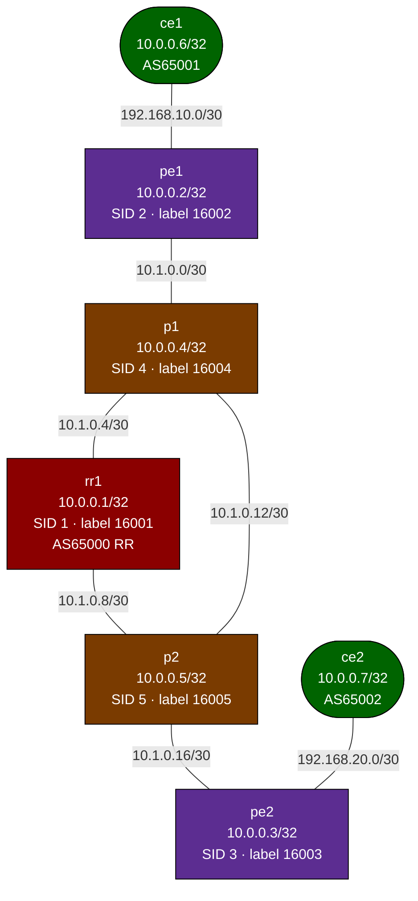

# Lab: mpls-sr-isis-bgp

## Purpose
A fully working reference implementation of a modern Service Provider MPLS stack. Combines
IS-IS Level-2 as the IGP, Segment Routing MPLS (SR-MPLS) for label distribution (no LDP),
BGP VPNv4 with a Route Reflector for L3VPN, and customer CE routers doing eBGP with PE nodes.
Deploy and explore — everything works out of the box.

## Topology



### Links (all /30)

| Link | Subnet | Left | Right |
|------|--------|------|-------|
| ce1:eth1  -- pe1:eth1  | 192.168.10.0/30 | ce1=.1  | pe1=.2  (VRF CUST-A) |
| ce2:eth1  -- pe2:eth2  | 192.168.20.0/30 | ce2=.1  | pe2=.2  (VRF CUST-A) |
| pe1:eth2  -- p1:eth1   | 10.1.0.0/30     | pe1=.1  | p1=.2   |
| p1:eth2   -- rr1:eth1  | 10.1.0.4/30     | p1=.1   | rr1=.2  |
| rr1:eth2  -- p2:eth1   | 10.1.0.8/30     | rr1=.1  | p2=.2   |
| p1:eth3   -- p2:eth2   | 10.1.0.12/30    | p1=.1   | p2=.2   |
| p2:eth3   -- pe2:eth1  | 10.1.0.16/30    | p2=.1   | pe2=.2  |

### Nodes

| Node | Loopback | SR SID | SR Label | Role |
|------|----------|--------|----------|------|
| rr1  | 10.0.0.1/32 | 1 | 16001 | BGP RR + P router |
| pe1  | 10.0.0.2/32 | 2 | 16002 | PE router + IS-IS |
| pe2  | 10.0.0.3/32 | 3 | 16003 | PE router + IS-IS |
| p1   | 10.0.0.4/32 | 4 | 16004 | P router (IS-IS + SR only) |
| p2   | 10.0.0.5/32 | 5 | 16005 | P router (IS-IS + SR only) |
| ce1  | 10.0.0.6/32 | — | — | CE (AS65001, eBGP to pe1) |
| ce2  | 10.0.0.7/32 | — | — | CE (AS65002, eBGP to pe2) |

## Deploy / Destroy

```bash
sudo containerlab deploy -t topology.clab.yml
# Wait 30–60 seconds for IS-IS and BGP to converge

sudo containerlab destroy -t topology.clab.yml --cleanup
```

## Quick Verification

```bash
# IS-IS adjacencies on pe1 (should see p1)
docker exec clab-mpls-sr-isis-bgp-pe1 vtysh -c "show isis neighbor"

# SR-MPLS labels in the routing table
docker exec clab-mpls-sr-isis-bgp-pe1 vtysh -c "show mpls table"

# BGP VPNv4 routes at the Route Reflector
docker exec clab-mpls-sr-isis-bgp-rr1 vtysh -c "show bgp ipv4 vpn"

# VRF routing table on pe1
docker exec clab-mpls-sr-isis-bgp-pe1 vtysh -c "show ip route vrf CUST-A"

# End-to-end ping: ce1 to ce2 across the L3VPN
docker exec clab-mpls-sr-isis-bgp-ce1 ping -c3 10.0.0.7
```

See **VERIFY.md** for the complete set of verification commands.

## Architecture

### Layer 1: IS-IS IGP

IS-IS Level-2 runs on all SP nodes (rr1, pe1, pe2, p1, p2). Each node's loopback is
advertised into IS-IS, giving every SP node reachability to every other SP node's loopback.

### Layer 2: SR-MPLS Label Distribution

Instead of LDP, Segment Routing MPLS distributes labels via IS-IS TLV extensions. Each
node advertises a **Node SID** (Segment Identifier) which maps to a globally unique MPLS label:

```
Node SID index N → Label = SRGB_start + N = 16000 + N
```

So pe2 (SID 3) gets label **16003**. Any node can forward traffic to pe2 by pushing label 16003.

### Layer 3: BGP VPNv4 + Route Reflector

rr1 is the BGP Route Reflector. All PE nodes have iBGP sessions to rr1 and advertise VPN
routes (RFC 4364 VPNv4) with:
- **RD (Route Distinguisher)**: 65000:100 — makes VPN routes unique in the BGP table
- **RT (Route Target)**: 65000:100 — controls VPN import/export policy

### Layer 4: L3VPN

PE nodes maintain a VRF (`CUST-A`, route table 100) for customer traffic:
- CE nodes connect to the VRF interface on each PE
- CE routes are redistributed into BGP VPNv4 via the VRF AF
- Remote CE routes arrive as VPNv4 from the RR and are imported into the local VRF

### Forwarding Label Stack

When pe1 forwards a packet from ce1 to ce2:
```
[VPN label (pe2→ce2)] [SR label 16003 (→pe2)] [IP packet]
```
- Outer label (16003) is swapped at each P router toward pe2
- At the penultimate hop (p2), PHP removes the SR label (implicit null)
- pe2 sees the VPN label and knows which VRF/CE to forward to

## Concepts

### Segment Routing vs LDP

| Feature | LDP | SR-MPLS |
|---------|-----|---------|
| Protocol | Separate LDP sessions | IS-IS/OSPF extensions |
| Label allocation | Per-LSP, dynamic | Per-prefix, global/SRGB |
| Configuration | LDP on each interface | SR SID per loopback |
| State | Per-hop state required | Stateless at transit |
| Traffic engineering | Requires RSVP-TE | SR-TE (source routing) |

### VPNv4 Address Family

VPNv4 = 12-byte RD prefix + 4-byte IPv4 prefix. The RD makes VPN customer routes
globally unique in the BGP table even if customer address spaces overlap.

### VRF on Linux

PE nodes use Linux VRFs (created via `ip link add VRF type vrf table 100`). The CE-facing
interface is enslaved to the VRF. FRR's BGP VPN support then manages importing/exporting
routes between the VRF and the global VPNv4 table.

## Challenge Exercises

1. Use `traceroute` from ce1 to ce2 and observe the MPLS label stack at each hop.
   Do you see the SR label being swapped? Where does PHP occur?

2. Add a second VRF `CUST-B` (RD/RT 65000:200) on pe1 and pe2 with different CE IPs.
   Verify CUST-A and CUST-B are isolated from each other.

3. Modify the IS-IS metric on the p1-p2 link to be very high (e.g., 1000) and observe
   whether the forwarding path changes (traffic should prefer rr1 as a transit).

4. Use `show bgp ipv4 vpn` on rr1 and note the label values. Match these labels to
   entries in `show mpls table` on pe2.

5. Study `show segment-routing local-block` — what is the SRGB range? How does this
   determine the actual MPLS labels assigned to each SID?
