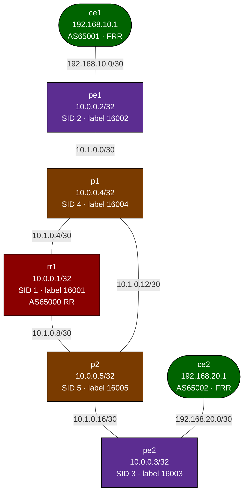

# MPLS Segment Routing — Nokia SR-Linux Reference Lab

A fully-working MPLS SR-MPLS / BGP L3VPN lab using Nokia SR-Linux — the platform Nokia invented Segment Routing on. Deploy and explore; compare with the FRR-based `mpls-sr-isis-bgp` lab to see how the same concepts map to a production SP platform.

> **Note:** SR-Linux uses a YANG-based CLI that differs from IOS/FRR. Configuration is applied via `enter candidate` / `commit now` in `sr_cli`. The startup configs in this lab are pre-applied at container boot.

## How to use this lab

This is a **practice lab** on a working reference build — you observe and
explain rather than configure. Predict each verification's output before
running it, and read the "what it proves" note after. If you've done
`mpls-sr-isis-bgp` (FRR) or `mpls-sr-blank`, treat this as the same stack
on a production-grade NOS and notice what the YANG model changes.

---

## Topology



### Node SIDs (SRGB 16000–16999)

| Node | Loopback    | SID index | SR label |
|------|-------------|-----------|----------|
| rr1  | 10.0.0.1/32 | 1         | 16001    |
| pe1  | 10.0.0.2/32 | 2         | 16002    |
| pe2  | 10.0.0.3/32 | 3         | 16003    |
| p1   | 10.0.0.4/32 | 4         | 16004    |
| p2   | 10.0.0.5/32 | 5         | 16005    |

### Transit links

| Link            | Subnet       | Left IP    | Right IP   |
|-----------------|--------------|------------|------------|
| pe1 — p1        | 10.1.0.0/30  | 10.1.0.1   | 10.1.0.2   |
| p1  — rr1       | 10.1.0.4/30  | 10.1.0.5   | 10.1.0.6   |
| rr1 — p2        | 10.1.0.8/30  | 10.1.0.9   | 10.1.0.10  |
| p1  — p2        | 10.1.0.12/30 | 10.1.0.13  | 10.1.0.14  |
| p2  — pe2       | 10.1.0.16/30 | 10.1.0.17  | 10.1.0.18  |

### CE links (in VRF CUST-A on PE side)

| Link        | Subnet          | CE IP         | PE IP         |
|-------------|-----------------|---------------|---------------|
| ce1 — pe1   | 192.168.10.0/30 | 192.168.10.1  | 192.168.10.2  |
| ce2 — pe2   | 192.168.20.0/30 | 192.168.20.1  | 192.168.20.2  |

---

## Deploy and access

```bash
# Pull SR-Linux image first if not already present
docker pull ghcr.io/nokia/srlinux:latest

./scripts/lab.sh deploy mpls-sr-srlinux

# SR-Linux CLI
./scripts/lab.sh cli mpls-sr-srlinux rr1
./scripts/lab.sh cli mpls-sr-srlinux pe1
./scripts/lab.sh cli mpls-sr-srlinux p1

# CE (FRR)
./scripts/lab.sh cli mpls-sr-srlinux ce1
```

---

## Verification

### Step 1 — IS-IS adjacencies (check on p1)

```
# In sr_cli on p1
show network-instance default protocols isis adjacency
```

Expected: Full adjacencies to pe1, rr1, p2.

### Step 2 — SR-MPLS label database (check on p1)

```
show network-instance default route-table ipv4-unicast prefix 10.0.0.2/32
```

The route to pe1's loopback should show an MPLS label (16002) as the next-hop label.

```
show network-instance default mpls forwarding-table
```

Shows the LFIB: incoming labels, operations (swap/pop), outgoing labels.

### Step 3 — BGP VPNv4 sessions (check on rr1)

```
show network-instance default protocols bgp neighbor
```

Sessions to pe1 (10.0.0.2) and pe2 (10.0.0.3) should be `Established`.

### Step 4 — L3VPN routes (check on pe1)

```
show network-instance CUST-A protocols bgp neighbor
show network-instance CUST-A route-table ipv4-unicast
```

pe1 should have a BGP session to ce1 (192.168.10.1) and routes imported from CUST-A.

```
show network-instance default protocols bgp routes l3vpn-ipv4-unicast
```

Shows VPNv4 routes in the global BGP table.

### Step 5 — End-to-end L3VPN ping

```bash
# From ce1 (FRR), ping ce2's loopback
./scripts/lab.sh cmd mpls-sr-srlinux ce1 -- vtysh -c 'ping 10.100.2.1'
```

Traffic path: ce1 → pe1 (MPLS label push 16003) → p1 → p2 → pe2 (pop) → ce2

**Predict first (before the ping):** how many labels does pe1 push, what
does p2 do at the penultimate hop, and which label does pe2 actually use
to choose the VRF? Then confirm against `show network-instance default
mpls forwarding-table` on the transit routers.

---

## Challenge questions

No answers provided — reason them through.

1. SR-Linux needs no `net.mpls.platform_labels` sysctl, but the FRR labs
   do. What does that tell you about where MPLS forwarding lives in each
   platform, and why does it matter for performance at scale?
2. SR-Linux's `l3vpn-ipv4-unicast` is the same RFC 4364 VPNv4 you used in
   the FRR labs. Map the FRR concepts (`vrf`, `rd vpn export`, `rt vpn
   both`) onto SR-Linux's `network-instance` + `bgp-vpn` model, and note
   which one forces you to be explicit about import/export policy.
3. SR-Linux requires an explicit `accept-all` routing policy where FRR
   accepted routes by default. Argue why default-deny BGP policy is the
   safer production posture, and what class of outage default-accept
   invites.
4. Pick a transit link and predict what `show ... mpls forwarding-table`
   shows for the SR label toward pe2 (swap vs. pop). Verify, then explain
   where PHP happens and why the SRGB makes the label predictable network-
   wide.

---

## SR-Linux CLI cheat sheet

| FRR command | SR-Linux equivalent |
|-------------|---------------------|
| `show ip route` | `show network-instance default route-table ipv4-unicast` |
| `show ip ospf neighbor` | `show network-instance default protocols isis adjacency` |
| `show bgp summary` | `show network-instance default protocols bgp summary` |
| `show mpls table` | `show network-instance default mpls forwarding-table` |
| `ping A.B.C.D` | `ping A.B.C.D network-instance default` |

To make configuration changes interactively:
```
enter candidate
    /network-instance default
        ...
commit now
```

---

## Architecture notes

**No Linux MPLS sysctl needed** — SR-Linux handles MPLS forwarding natively in the dataplane. Unlike FRR, there is no `net.mpls.platform_labels` sysctl required.

**Separate network-instances for VRFs** — SR-Linux uses `network-instance` of type `ip-vrf` for L3VPNs, equivalent to Linux VRFs + FRR `vrf` command. The `bgp-vpn` block under the `ip-vrf` instance controls RD/RT export and import.

**BGP policy required** — SR-Linux BGP requires explicit export/import policies. The `accept-all` policy defined in `/routing-policy` permits all prefixes. In production you would use specific policies.

**`l3vpn-ipv4-unicast` AF** — SR-Linux's name for VPNv4 (RFC 4364). The `afi-safi l3vpn-ipv4-unicast` statement in the global BGP instance enables VPNv4 advertisement to iBGP peers.

---

## Cleanup

```bash
./scripts/lab.sh destroy mpls-sr-srlinux
```
