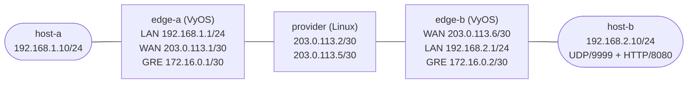

# MTU and PMTUD Troubleshooting — Guided Debug Lab

Diagnose a size-sensitive outage across a routed GRE service. The control
plane, tunnel, and small probes all look healthy, yet a realistic transfer
stalls. You will turn that vague symptom into packet-size, interface, and
counter evidence; make a calculated VyOS change; and prove why the repaired
path behaves differently.

## Topology



| Node | Platform | Role | Pre-configured addressing |
|------|----------|------|---------------------------|
| `host-a` | `ops-lab:local` Linux | Site A test endpoint | eth1 `192.168.1.10/24`; default via `192.168.1.1` |
| `edge-a` | VyOS | Site A learned edge and GRE endpoint | eth1 `192.168.1.1/24`; eth2 `203.0.113.1/30`; tun0 `172.16.0.1/30` |
| `provider` | `ops-lab:local` Linux | Incidental routed transport | eth1 `203.0.113.2/30`; eth2 `203.0.113.5/30` |
| `edge-b` | VyOS | Site B learned edge and GRE endpoint | eth2 `203.0.113.6/30`; eth1 `192.168.2.1/24`; tun0 `172.16.0.2/30` |
| `host-b` | `ops-lab:local` Linux | Site B test endpoint and services | eth1 `192.168.2.10/24`; default via `192.168.2.1` |

| Link | Subnet | Purpose |
|------|--------|---------|
| `host-a:eth1` ↔ `edge-a:eth1` | `192.168.1.0/24` | Site A LAN |
| `edge-a:eth2` ↔ `provider:eth1` | `203.0.113.0/30` | West transport segment |
| `provider:eth2` ↔ `edge-b:eth2` | `203.0.113.4/30` | East transport segment |
| `edge-b:eth1` ↔ `host-b:eth1` | `192.168.2.0/24` | Site B LAN |
| `edge-a:tun0` ↔ `edge-b:tun0` | `172.16.0.0/30` | GRE overlay carrying both remote LAN routes |

## How to use this lab

This is a **guided debug lab**, not a tutorial. Each task gives you an
**objective** and **hints** — your job is to produce the configuration.

- **Predict before you configure.** When a task asks for a prediction,
  commit to an answer before touching the CLI. Being wrong and finding out
  why is the point.
- **Open the hints before the solution.** The solution toggle is the answer
  key — use it to check your work or when genuinely stuck, not as step one.
- **Verify like an operator.** After each task, prove the state is what you
  think it is with `show` commands before moving on.

Preserve the starting state until Tasks 1 and 2 have produced enough evidence
to locate the boundary. A failed ping alone does not prove where a packet was
dropped; use bounded probes and captures.

## Deploy

Build the incidental Linux tooling image, and prepare `vyos:local` by
following the [VyOS platform notes](../../docs/platforms/vyos.md):

```bash
docker build -t ops-lab:local images/ops-lab/
./scripts/lab.sh deploy mtu-pmtud-troubleshooting
./scripts/lab.sh status mtu-pmtud-troubleshooting
```

The measured probe footprint was approximately 526 MiB in aggregate:
250.5 MiB for `edge-a`, 255.9 MiB for `edge-b`, 4.941 MiB for `host-a`,
13.95 MiB for `host-b`, and 660 KiB for `provider`.

Open the two VyOS CLIs in separate terminals as needed:

```bash
./scripts/lab.sh cli mtu-pmtud-troubleshooting edge-a
./scripts/lab.sh cli mtu-pmtud-troubleshooting edge-b
```

The disposable VyOS credentials are `admin` / `admin`. The lab starts with
working GRE underlay reachability, tunnel addresses, and static remote-LAN
routes. Both hosts run UDP echo on port 9999; `host-b` also serves an exact
262,144-byte HTTP response on port 8080.

## Initial symptom and success criteria

The reported symptom is: **small cross-site traffic succeeds, but a bounded
download of the 256 KiB object does not finish**.

Do not call the incident resolved until all of these are true:

- small reachability and both service listeners remain healthy;
- a 1,348-byte DF UDP payload receives an acknowledgement in both directions;
- after flushing `host-a` route state, one fresh A-to-B 1,349-byte probe
  produces local `EMSGSIZE` plus ICMP type 3/code 4 evidence naming the
  calculated managed-edge limit;
- the full 262,144-byte HTTP object completes within a bound;
- the provider's relevant drop counter does not increase during final tests;
- the repository checker passes.

## Task 1 — Reproduce the service symptom

**Objective:** Establish that routing, the GRE endpoints, the UDP listeners,
and small packets are healthy, then reproduce the large HTTP timeout with a
bounded command. Record evidence rather than labeling a cause.

**Hypothesis first:** If small ICMP and the remote TCP listener both work,
does that prove a 256 KiB response can cross the same path?

Run these guided observations from the repository root:

```bash
./scripts/lab.sh cmd mtu-pmtud-troubleshooting host-a -- \
  ping -c 3 -W 2 192.168.2.10
./scripts/lab.sh cmd mtu-pmtud-troubleshooting host-b -- \
  ping -c 3 -W 2 192.168.1.10
./scripts/lab.sh cmd mtu-pmtud-troubleshooting host-b -- \
  ss -lntup
./scripts/lab.sh cmd mtu-pmtud-troubleshooting edge-a -- \
  ip -o link show tun0
./scripts/lab.sh cmd mtu-pmtud-troubleshooting edge-a -- \
  ip route show 192.168.2.0/24
```

Now bound the user-visible transaction:

```bash
./scripts/lab.sh cmd mtu-pmtud-troubleshooting host-a -- \
  timeout 6 python3 -c \
  "import urllib.request; print(len(urllib.request.urlopen('http://192.168.2.10:8080', timeout=5).read()))"
```

<details markdown="1">
<summary>Hint 1 — Separate the claims</summary>

- Separate listener health, route health, tunnel state, and completed data
  transfer in your notes. They are different claims.

</details>

<details markdown="1">
<summary>Hint 2 — Bound negative evidence</summary>

- Keep every negative test bounded with a timeout. A hanging client is a
  symptom, not a reason to leave an unbounded process behind.

</details>

<details markdown="1">
<summary>Diagnosis and solution</summary>

Do not change configuration yet. The expected starting evidence is healthy
small pings in both directions, UDP/9999 and TCP/8080 listeners on `host-b`,
an UP `tun0`, a remote-LAN route through it, and a timed-out HTTP fetch. That
combination narrows the incident to size-sensitive forwarding without yet
identifying the failing interface or mechanism.

</details>

<details markdown="1">
<summary>Check your work</summary>

Your record must contain a successful small ping, a live TCP/8080 listener,
the remote route via `tun0`, and a non-zero bounded HTTP result. This resolves
the hypothesis: small control probes and an accepting TCP listener prove
only those packets; they do not prove the full response was delivered.

</details>

## Task 2 — Locate the packet-size boundary

**Objective:** Sweep one DF UDP datagram at several payload sizes, identify
the first failing size, and correlate it with interface-specific captures and
a provider counter delta. Fill in the results table before opening the final
hint.

**Predict first:** Will the largest successful payload differ by one byte
from the smallest unsuccessful payload, or will the transition be gradual?

The helper sends one connected UDP datagram with IPv4 PMTU discovery forced
to `DO`; it exits non-zero on timeout or `EMSGSIZE` and prints stable result
text. Test useful candidates, adding your own binary-search points if needed:

```bash
for size in 1200 1348 1349 1360; do
  ./scripts/lab.sh cmd mtu-pmtud-troubleshooting host-a -- \
    /df-probe.py "$size" 192.168.2.10 || true
done
```

| Payload | Host result | `edge-a:eth2` outer length/flags | `provider:eth1` observation | Provider counter delta |
|---------|-------------|----------------------------------|-----------------------------|------------------------|
| 1200 | | | | |
| 1348 | | | | |
| 1349 | | | | |
| 1360 | | | | |

Use separate terminals for bounded captures while repeating one passing and
one failing probe:

```bash
./scripts/lab.sh cmd mtu-pmtud-troubleshooting edge-a -- \
  timeout 8 tcpdump -lnni eth2 -vv 'proto gre or icmp'

./scripts/lab.sh cmd mtu-pmtud-troubleshooting provider -- \
  timeout 8 tcpdump -lnni eth1 -vv 'proto gre or icmp'

./scripts/lab.sh cmd mtu-pmtud-troubleshooting host-a -- \
  timeout 8 tcpdump -lnni eth1 -vv 'icmp[0] == 3 and icmp[1] == 4'
```

Snapshot the provider's OUTPUT counters before and after one fresh failing
probe:

```bash
./scripts/lab.sh cmd mtu-pmtud-troubleshooting provider -- \
  iptables -nvx -L OUTPUT --line-numbers
```

<details markdown="1">
<summary>Hint 1 — Interpret one datagram</summary>

- The helper payload excludes the UDP and IPv4 headers. Add the protocol
  headers before comparing an inner packet with an overlay interface.
- A timeout says the request/reply transaction did not finish. It does not
  by itself say whether the request was dropped, the reply was dropped, or
  feedback vanished.

</details>

<details markdown="1">
<summary>Hint 2 — Compare interfaces</summary>

- One IPv4 UDP datagram adds 28 bytes to the helper payload.
- Match the same probe on `edge-a:eth2` and `provider:eth1`. Record the outer
  IPv4 total length and DF flag rather than relying on a generic ping result.
- Compare the provider OUTPUT rule packet count, not only the policy text.

</details>

<details markdown="1">
<summary>Hint 3 — Account for the overlay</summary>

- Inspect both provider data interfaces: the live path limit is 1400 bytes.
- Base IPv4 GRE adds 24 bytes outside the inner IPv4 packet in this lab.
- For a 1,349-byte UDP payload, calculate `1349 + 8 + 20 + 24` and compare
  that result with the physical path limit.

</details>

<details markdown="1">
<summary>Diagnosis and solution</summary>

The 1,348-byte payload produces a 1,376-byte inner IPv4 packet and a
1,400-byte outer IPv4/GRE packet, so it passes. The 1,349-byte payload
produces outer length 1,401 with DF set. Captures show that oversized packet
reach the provider boundary, while the host sees no ICMP type 3/code 4. The
provider's matching OUTPUT drop counter increases. This is a feedback black
hole at the transport limit, not a failed GRE control state or missing route.

Keep the provider policy in place. The learned repair belongs on the managed
VyOS edges in Task 3.

</details>

<details markdown="1">
<summary>Check your work</summary>

Your table should show `ack:1348`, a timeout at 1349 in the starting state,
outer length 1401 with DF for the failing probe, no corresponding feedback
at `host-a`, and a provider drop-counter increase. A one-byte transition is
expected because the test uses one UDP datagram; it makes the encapsulation
budget measurable without TCP segmentation ambiguity.

</details>

## Task 3 — Calculate and apply the edge repair

**Objective:** Calculate a tunnel MTU that keeps the encapsulated packet
within the measured path limit, configure that exact value persistently on
both VyOS tunnel interfaces, and verify both configured and operational
state.

**Predict first:** If only one GRE endpoint receives the new value, must
both traffic directions exhibit the same payload behavior?

<details markdown="1">
<summary>Hint 1 — Calculate before configuring</summary>

- Start with the measured physical limit and subtract only the headers added
  outside the inner packet by this lab's GRE encapsulation.
- The result is the tunnel's inner IPv4 packet budget, not the UDP payload
  budget.

</details>

<details markdown="1">
<summary>Hint 2 — Use native VyOS configuration</summary>

- The setting lives under `interfaces tunnel tun0 mtu`.
- Apply the same calculated value on `edge-a` and `edge-b`, then `commit` and
  `save` on each device.
- Compare `show configuration commands` with `ip -o link show tun0`; one is
  persistent intent and the other is operational state.

</details>

<details markdown="1">
<summary>Diagnosis and solution</summary>

The calculated budget is `1400 - 24 = 1376` bytes. Apply it on **both**
edges:

```text
configure
set interfaces tunnel tun0 mtu 1376
commit
save
exit
```

</details>

<details markdown="1">
<summary>Check your work</summary>

On each edge, `show configuration commands` contains exactly one `tun0` MTU
setting with value 1376, and `ip -o link show tun0` reports `UP` and `mtu
1376`. This value constrains the inner packet before the edge adds 24 bytes,
so the resulting outer packet cannot exceed the measured 1400-byte path.
The prediction remains deliberately open until Task 5 tests one-sided drift.

</details>

## Task 4 — Prove PMTUD at the managed boundary

**Objective:** Flush endpoint route state, prove that 1349 now receives
bounded fragmentation-needed feedback naming MTU 1376, prove 1348 and the
large HTTP transfer succeed, and show that the provider counter stays flat.

**Predict first:** Why should moving the size decision to the managed tunnel
edge change what `host-a` observes even though the provider drop policy has
not changed?

First snapshot the provider counter. Then clear learned route information on
`host-a` and start this bounded capture in a separate terminal:

```bash
./scripts/lab.sh cmd mtu-pmtud-troubleshooting provider -- \
  iptables -nvx -L OUTPUT --line-numbers
./scripts/lab.sh cmd mtu-pmtud-troubleshooting host-a -- \
  ip route flush cache
./scripts/lab.sh cmd mtu-pmtud-troubleshooting host-a -- \
  timeout 6 tcpdump -lnni eth1 -vv -c 1 \
  'icmp[0] == 3 and icmp[1] == 4'
```

Generate the boundary probe, safe probes in both directions, and the full
HTTP response:

```bash
./scripts/lab.sh cmd mtu-pmtud-troubleshooting host-a -- \
  /df-probe.py 1349 192.168.2.10 || true
./scripts/lab.sh cmd mtu-pmtud-troubleshooting host-a -- \
  /df-probe.py 1348 192.168.2.10
./scripts/lab.sh cmd mtu-pmtud-troubleshooting host-b -- \
  /df-probe.py 1348 192.168.1.10
./scripts/lab.sh cmd mtu-pmtud-troubleshooting host-a -- \
  timeout 10 python3 -c \
  "import urllib.request; body=urllib.request.urlopen('http://192.168.2.10:8080', timeout=8).read(); print(len(body))"
./scripts/lab.sh cmd mtu-pmtud-troubleshooting provider -- \
  iptables -nvx -L OUTPUT --line-numbers
```

<details markdown="1">
<summary>Hint 1 — Require correlated feedback</summary>

- Require all three related observations for the 1349 test: helper
  `EMSGSIZE`, an ICMP type 3/code 4 capture, and advertised MTU 1376.

</details>

<details markdown="1">
<summary>Hint 2 — Prove the whole service path</summary>

- Compare the same provider rule's numeric packet count before and after the
  entire final probe set.
- Validate the HTTP body length, not merely the TCP handshake or status code.

</details>

<details markdown="1">
<summary>Diagnosis and solution</summary>

No further configuration is required. With `tun0` at 1376, an oversized
inner DF packet is rejected by the managed ingress edge before it becomes an
oversized GRE packet. That edge can return fragmentation-needed feedback
directly to the attached host. A 1348-byte payload still fits exactly, and
TCP can learn/use the smaller packet budget, so the 262,144-byte response
completes without exercising the provider's dropped feedback.

</details>

<details markdown="1">
<summary>Check your work</summary>

The 1349 helper prints `EMSGSIZE`, and the bounded host capture contains
ICMP fragmentation-needed with `mtu 1376`. Both 1348 probes print
`ack:1348`; HTTP prints `262144`; and the provider counter is unchanged.
This resolves the prediction: the repair moves feedback generation ahead of
the unmanaged drop point, so PMTUD can converge at the source.

Exact packet-size conclusions here come from one UDP datagram and captures
on named interfaces. TCP captures on container veths may show GRO/GSO
coalescing or segmentation artifacts, so a displayed TCP frame size alone is
not a reliable substitute for this test.

</details>

## Task 5 — Diagnose a one-sided regression

**Objective:** Inject an opaque regression, compare the previously safe
payload in both directions, locate the one-sided state difference, make the
minimal repair, and finish with the full checker.

**Hypothesis first:** If A-to-B still returns `ack:1348` while B-to-A returns
`EMSGSIZE`, which categories of shared-path fault become less likely?

Inject the fault and observe only the service symptom:

```bash
./labs/mtu-pmtud-troubleshooting/break.sh
./scripts/lab.sh cmd mtu-pmtud-troubleshooting host-a -- \
  /df-probe.py 1348 192.168.2.10
./scripts/lab.sh cmd mtu-pmtud-troubleshooting host-b -- \
  /df-probe.py 1348 192.168.1.10 || true
```

<details markdown="1">
<summary>Hint 1 — Use the direction difference</summary>

- Re-run the same probe size and destination pair; do not change multiple
  variables at once.
- Compare configured and operational tunnel state on both edges. The
  underlay and provider are shared by both directions.

</details>

<details markdown="1">
<summary>Hint 2 — Find the minimal repair</summary>

- Look for a single value that differs from the proven Task 4 baseline.
- Repair only that drift, then repeat both directions before running the
  checker.

</details>

<details markdown="1">
<summary>Diagnosis and solution</summary>

The helper changes only `edge-b` tunnel MTU to 1300. Restore the proven value
on `edge-b`:

```text
configure
set interfaces tunnel tun0 mtu 1376
commit
save
exit
```

Clear the reverse endpoint's learned route state before repeating the
previously rejected probe:

```bash
./scripts/lab.sh cmd mtu-pmtud-troubleshooting host-b -- \
  ip route flush cache
```

</details>

<details markdown="1">
<summary>Check your work</summary>

Before repair, A-to-B 1348 can still pass while B-to-A returns `EMSGSIZE`
because each source-side edge enforces its local tunnel budget. After the
minimal configuration repair and route-cache refresh, both directions return
`ack:1348`, the 1349 PMTUD evidence still names 1376, HTTP completes, and the
checker passes:

```bash
./labs/mtu-pmtud-troubleshooting/check.sh
```

The checker also confirms the exact VyOS intent, live interface state,
services, provider counter stability, and process cleanup.

</details>

## Final verification checklist

- [ ] Both VyOS devices have exactly `interfaces tunnel tun0 mtu 1376`.
- [ ] Both operational `tun0` interfaces are UP with MTU 1376.
- [ ] The 1,348-byte DF UDP probe returns `ack:1348` in both directions.
- [ ] After a route-cache flush, 1349 returns `EMSGSIZE` and host capture
      shows ICMP type 3/code 4 with MTU 1376.
- [ ] The HTTP fetch prints exactly `262144` within its timeout.
- [ ] The provider fragmentation-needed drop counter stays unchanged during
      final probes.
- [ ] `./labs/mtu-pmtud-troubleshooting/check.sh` exits zero.

## Troubleshooting

| Symptom | Likely cause | Focused action |
|---------|--------------|----------------|
| No small cross-site ping | Underlay, GRE, or remote-LAN route is unhealthy | Check WAN next-hop reachability, `tun0` UP state, and the exact remote-LAN route before investigating size |
| 1348 times out in both directions after repair | One or both tunnel MTUs are not 1376, or UDP echo is absent | Compare VyOS configured/operational MTU and `ss -lunp` on both hosts |
| 1349 times out instead of returning `EMSGSIZE` | Feedback is still generated beyond the managed edge, or stale route state obscures a fresh test | Flush host route cache, capture type 3/code 4 on host eth1, and recheck both edge MTUs |
| HTTP handshake succeeds but body hangs | Packet-size adaptation did not converge | Require exact UDP boundary evidence and a full 262,144-byte body before accepting TCP health |
| Only B-to-A 1348 fails after Break-It | Source-side state differs between edges | Compare `tun0` configured and operational MTU, then restore only the drifted edge |
| Capture appears to show unexpectedly large TCP packets | veth GRO/GSO is changing capture presentation | Use the one-datagram DF helper and interface-specific captures for exact size conclusions |

## Transfer questions

No answers are provided; reason from the evidence you collected.

1. An IPsec profile adds more overhead than this GRE tunnel. What must be
   measured before choosing a tunnel MTU, and why is copying 1376 unsafe?
2. A firewall permits ICMP type 3/code 4 but rate-limits it. What capture and
   counter pattern would distinguish intermittent PMTUD from packet loss?
3. MSS clamping makes HTTP work while the 1349-byte UDP test still fails.
   What did MSS clamping change, and what did it leave unresolved?
4. The provider upgrades its path from 1400 to 1500. Which parts of this
   repair remain safe, and what evidence would justify increasing the
   overlay MTU?

## Stretch challenge

Design a repeatable test matrix for GRE carried over IPv6 or protected by
IPsec. Include bidirectional exact-size probes, the header budget, the
interface on which each capture must run, the expected ICMP family/type, and
the production risk of relying on a default tunnel MTU.

## Cleanup

```bash
./scripts/lab.sh destroy mtu-pmtud-troubleshooting
```
