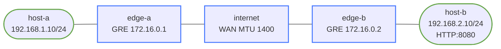

# mtu-pmtud-troubleshooting

This lab demonstrates one of the most common day-2 overlay problems:

- the tunnel is up
- routing is correct
- small packets work
- large packets with `DF` do not

The underlay links are forced to MTU `1400`, but the GRE tunnel is left at its default.

## How to use this lab

This is a **practice troubleshooting lab**. Something is broken (or about to
be); your job is to find and fix it from the symptom, not a script. **Form
a hypothesis before each command**, predict what a healthy vs. broken output
looks like, and only then run it. The challenge questions test transfer.

## Topology



## Build and Deploy

```bash
docker build -t frr-lab:local images/frr/
./scripts/lab.sh deploy mtu-pmtud-troubleshooting
```

## What Is Prebuilt

- routed LANs behind each edge
- WAN links at MTU `1400`
- a working GRE tunnel between `edge-a` and `edge-b`
- static routes over GRE to the remote LAN
- a simple HTTP service on `host-b:8080`
- a UDP echo responder on `host-b:9999`

## Baseline Checks

Small packets work:

```bash
./scripts/lab.sh cmd mtu-pmtud-troubleshooting host-a -- ping -c 3 192.168.2.10
./scripts/lab.sh cmd mtu-pmtud-troubleshooting host-a -- \
  python3 -c "import urllib.request; print(urllib.request.urlopen('http://192.168.2.10:8080').status)"
```

Large `DF` traffic does not. The FRR image uses BusyBox `ping`, so use Python to send a UDP datagram with the Don't Fragment bit set:

```bash
./scripts/lab.sh cmd mtu-pmtud-troubleshooting host-a -- python3 -c "
import socket
s = socket.socket(socket.AF_INET, socket.SOCK_DGRAM)
s.setsockopt(socket.IPPROTO_IP, 10, 2)
s.sendto(b'x' * 1360, ('192.168.2.10', 9999))
"
```

Expected result: `OSError: [Errno 90] Message too large` even though normal reachability works.

## Troubleshooting Workflow

### 1. Confirm the tunnel is up

```bash
./scripts/lab.sh cmd mtu-pmtud-troubleshooting edge-a -- ip addr show gre1
./scripts/lab.sh cmd mtu-pmtud-troubleshooting edge-b -- ip addr show gre1
./scripts/lab.sh cmd mtu-pmtud-troubleshooting edge-a -- ip route
```

### 2. Compare physical and tunnel MTU

```bash
./scripts/lab.sh cmd mtu-pmtud-troubleshooting edge-a -- ip link show eth2
./scripts/lab.sh cmd mtu-pmtud-troubleshooting edge-a -- ip link show gre1
```

You should notice:

- WAN link MTU is `1400`
- tunnel MTU is still large enough to exceed the underlay once GRE overhead is added

### 3. Capture the failure

Run a capture on `edge-a` while sending a large `DF` probe from `host-a`:

```bash
./scripts/lab.sh cmd mtu-pmtud-troubleshooting edge-a -- \
  tcpdump -ni eth2 -vv 'icmp or proto gre'

./scripts/lab.sh cmd mtu-pmtud-troubleshooting host-a -- python3 -c "
import socket
s = socket.socket(socket.AF_INET, socket.SOCK_DGRAM)
s.setsockopt(socket.IPPROTO_IP, 10, 2)
s.sendto(b'x' * 1360, ('192.168.2.10', 9999))
"
```

Look for:

- the oversized attempt
- ICMP fragmentation-needed feedback
- no successful GRE-encapsulated payload for the large probe

### 4. Fix the tunnel MTU

Set the GRE interface MTU to a safe value on both edges:

```bash
./scripts/lab.sh cmd mtu-pmtud-troubleshooting edge-a -- ip link set gre1 mtu 1376
./scripts/lab.sh cmd mtu-pmtud-troubleshooting edge-b -- ip link set gre1 mtu 1376
```

Re-test with a payload that fits:

```bash
./scripts/lab.sh cmd mtu-pmtud-troubleshooting host-a -- python3 -c "
import socket
s = socket.socket(socket.AF_INET, socket.SOCK_DGRAM)
s.settimeout(2)
s.setsockopt(socket.IPPROTO_IP, 10, 2)
s.sendto(b'x' * 1348, ('192.168.2.10', 9999))
print(s.recvfrom(4096))
"
```

### 5. Optional: clamp TCP MSS

If you want to enforce a safe TCP MSS at the edges:

```bash
./scripts/lab.sh cmd mtu-pmtud-troubleshooting edge-a -- \
  iptables -t mangle -A FORWARD -o gre1 -p tcp --tcp-flags SYN,RST SYN -j TCPMSS --set-mss 1336
./scripts/lab.sh cmd mtu-pmtud-troubleshooting edge-b -- \
  iptables -t mangle -A FORWARD -o gre1 -p tcp --tcp-flags SYN,RST SYN -j TCPMSS --set-mss 1336
```

## Verification Commands

```bash
./scripts/lab.sh cmd mtu-pmtud-troubleshooting edge-a -- ip -d link show gre1
./scripts/lab.sh cmd mtu-pmtud-troubleshooting edge-a -- iptables -t mangle -L -n -v
./scripts/lab.sh cmd mtu-pmtud-troubleshooting host-a -- python3 -c "
import socket
s = socket.socket(socket.AF_INET, socket.SOCK_DGRAM)
s.settimeout(2)
s.setsockopt(socket.IPPROTO_IP, 10, 2)
s.sendto(b'x' * 1348, ('192.168.2.10', 9999))
print(s.recvfrom(4096))
"
```

## What This Lab Teaches

- control-plane success does not prove the data plane is healthy
- overlay overhead changes the effective packet budget
- packet capture plus exact-size probes is the fastest way to prove an MTU problem

## Challenge questions

No answers provided — reason them through.

1. Small pings work, large transfers hang. Explain the exact mechanism
   (DF bit, ICMP "fragmentation needed", a firewall dropping that ICMP) that
   produces this classic "PMTUD black hole."
2. Where do MTU mismatches typically hide (tunnels, VLANs, providers), and
   why does adding any encapsulation (GRE/IPsec/VXLAN) make this lab's
   symptom more likely?
3. MSS clamping "fixes" it for TCP — what does it actually change, why only
   TCP, and what non-TCP traffic is still broken?
4. Give the ordered diagnostic that isolates the exact hop where the MTU
   drops, using only ping with varying sizes and the DF bit.
