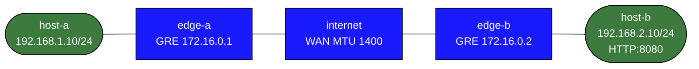

# mtu-pmtud-troubleshooting

This lab demonstrates one of the most common day-2 overlay problems:

- the tunnel is up
- routing is correct
- small packets work
- large packets with `DF` do not

The underlay links are forced to MTU `1400`, but the GRE tunnel is left at its default.

## Topology



## Build and Deploy

```bash
docker build -t frr-lab:local images/frr/
sudo containerlab deploy -t labs/mtu-pmtud-troubleshooting/topology.clab.yml
```

## What Is Prebuilt

- routed LANs behind each edge
- WAN links at MTU `1400`
- a working GRE tunnel between `edge-a` and `edge-b`
- static routes over GRE to the remote LAN
- a simple HTTP service on `host-b:8080`
- a UDP echo responder on `host-b:9999`

## Baseline Checks

Small packets work:

```bash
docker exec clab-mtu-pmtud-troubleshooting-host-a ping -c 3 192.168.2.10
docker exec clab-mtu-pmtud-troubleshooting-host-a \
  python3 -c "import urllib.request; print(urllib.request.urlopen('http://192.168.2.10:8080').status)"
```

Large `DF` traffic does not. The FRR image uses BusyBox `ping`, so use Python to send a UDP datagram with the Don't Fragment bit set:

```bash
docker exec clab-mtu-pmtud-troubleshooting-host-a python3 -c "
import socket
s = socket.socket(socket.AF_INET, socket.SOCK_DGRAM)
s.setsockopt(socket.IPPROTO_IP, 10, 2)
s.sendto(b'x' * 1360, ('192.168.2.10', 9999))
"
```

Expected result: `OSError: [Errno 90] Message too large` even though normal reachability works.

## Troubleshooting Workflow

### 1. Confirm the tunnel is up

```bash
docker exec clab-mtu-pmtud-troubleshooting-edge-a ip addr show gre1
docker exec clab-mtu-pmtud-troubleshooting-edge-b ip addr show gre1
docker exec clab-mtu-pmtud-troubleshooting-edge-a ip route
```

### 2. Compare physical and tunnel MTU

```bash
docker exec clab-mtu-pmtud-troubleshooting-edge-a ip link show eth2
docker exec clab-mtu-pmtud-troubleshooting-edge-a ip link show gre1
```

You should notice:

- WAN link MTU is `1400`
- tunnel MTU is still large enough to exceed the underlay once GRE overhead is added

### 3. Capture the failure

Run a capture on `edge-a` while sending a large `DF` probe from `host-a`:

```bash
docker exec clab-mtu-pmtud-troubleshooting-edge-a \
  tcpdump -ni eth2 -vv 'icmp or proto gre'

docker exec clab-mtu-pmtud-troubleshooting-host-a python3 -c "
import socket
s = socket.socket(socket.AF_INET, socket.SOCK_DGRAM)
s.setsockopt(socket.IPPROTO_IP, 10, 2)
s.sendto(b'x' * 1360, ('192.168.2.10', 9999))
"
```

Look for:

- the oversized attempt
- ICMP fragmentation-needed feedback
- no successful GRE-encapsulated payload for the large probe

### 4. Fix the tunnel MTU

Set the GRE interface MTU to a safe value on both edges:

```bash
docker exec clab-mtu-pmtud-troubleshooting-edge-a ip link set gre1 mtu 1376
docker exec clab-mtu-pmtud-troubleshooting-edge-b ip link set gre1 mtu 1376
```

Re-test with a payload that fits:

```bash
docker exec clab-mtu-pmtud-troubleshooting-host-a python3 -c "
import socket
s = socket.socket(socket.AF_INET, socket.SOCK_DGRAM)
s.settimeout(2)
s.setsockopt(socket.IPPROTO_IP, 10, 2)
s.sendto(b'x' * 1348, ('192.168.2.10', 9999))
print(s.recvfrom(4096))
"
```

### 5. Optional: clamp TCP MSS

If you want to enforce a safe TCP MSS at the edges:

```bash
docker exec clab-mtu-pmtud-troubleshooting-edge-a \
  iptables -t mangle -A FORWARD -o gre1 -p tcp --tcp-flags SYN,RST SYN -j TCPMSS --set-mss 1336
docker exec clab-mtu-pmtud-troubleshooting-edge-b \
  iptables -t mangle -A FORWARD -o gre1 -p tcp --tcp-flags SYN,RST SYN -j TCPMSS --set-mss 1336
```

## Verification Commands

```bash
docker exec clab-mtu-pmtud-troubleshooting-edge-a ip -d link show gre1
docker exec clab-mtu-pmtud-troubleshooting-edge-a iptables -t mangle -L -n -v
docker exec clab-mtu-pmtud-troubleshooting-host-a python3 -c "
import socket
s = socket.socket(socket.AF_INET, socket.SOCK_DGRAM)
s.settimeout(2)
s.setsockopt(socket.IPPROTO_IP, 10, 2)
s.sendto(b'x' * 1348, ('192.168.2.10', 9999))
print(s.recvfrom(4096))
"
```

## What This Lab Teaches

- control-plane success does not prove the data plane is healthy
- overlay overhead changes the effective packet budget
- packet capture plus exact-size probes is the fastest way to prove an MTU problem
