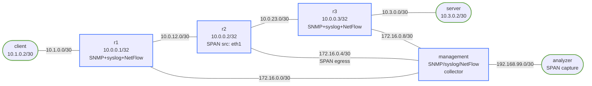

# network-assurance — SNMP, Syslog, SPAN, NetFlow Lab

Demonstrates four core network observability mechanisms using Linux containers with FRR for the routed underlay.

## How to use this lab

This is a **practice lab**, not a tutorial. The environment is pre-built;
you produce the configuration or the diagnosis from the objectives.
**Predict each result before you verify**, and treat the challenge
questions as the real test.

## Topology



## Node Addressing

| Node       | Interface | IP              | Function                        |
|------------|-----------|-----------------|----------------------------------|
| r1         | lo        | 10.0.0.1/32     | OSPF router-id                  |
| r1         | eth1      | 10.1.0.1/30     | client-facing                   |
| r1         | eth2      | 10.0.12.1/30    | r1-r2 link                      |
| r1         | eth3      | 172.16.0.1/30   | management                      |
| r2         | lo        | 10.0.0.2/32     | OSPF router-id                  |
| r2         | eth1      | 10.0.12.2/30    | r1-r2 link (**SPAN source**)    |
| r2         | eth2      | 10.0.23.1/30    | r2-r3 link                      |
| r2         | eth3      | 172.16.0.5/30   | management / SPAN egress        |
| r3         | lo        | 10.0.0.3/32     | OSPF router-id                  |
| r3         | eth1      | 10.0.23.2/30    | r2-r3 link                      |
| r3         | eth2      | 10.3.0.1/30     | server-facing                   |
| r3         | eth3      | 172.16.0.9/30   | management                      |
| management | eth1      | 172.16.0.2/30   | r1 management                   |
| management | eth2      | 172.16.0.6/30   | r2 management / SPAN ingress    |
| management | eth3      | 172.16.0.10/30  | r3 management                   |
| management | eth4      | 192.168.99.1/30 | to analyzer                     |
| analyzer   | eth1      | 192.168.99.2/30 | SPAN capture                    |
| client     | eth1      | 10.1.0.2/30     | traffic source                  |
| server     | eth1      | 10.3.0.2/30     | traffic destination             |

## Build and Deploy

```bash
docker build -t assurance-lab:local labs/network-assurance/
./scripts/lab.sh deploy network-assurance
```

## Assurance Mechanisms

### 1. SNMP

All three routers run `snmpd` with:

- **SNMPv2c**: community `public`, accessible from `172.16.0.0/16`
- **SNMPv3**: user `snmpv3user`, authProtocol=SHA, privProtocol=AES

```bash
# Poll interface table via SNMPv2c (from management container)
./scripts/lab.sh cmd network-assurance management -- \
    snmpwalk -v2c -c public 172.16.0.1 1.3.6.1.2.1.2.2

# Get sysName via SNMPv3
./scripts/lab.sh cmd network-assurance management -- \
    snmpget -v3 -u snmpv3user -l authPriv \
    -a SHA -A authpass123 -x AES -X privpass456 \
    172.16.0.1 sysName.0

# Get OSPF neighbor count (OSPF-MIB)
./scripts/lab.sh cmd network-assurance management -- \
    snmpwalk -v2c -c public 172.16.0.1 1.3.6.1.2.1.14

# Poll all three routers' interface error counts
for ip in 172.16.0.1 172.16.0.5 172.16.0.9; do
    ./scripts/lab.sh cmd network-assurance management -- \
        snmpget -v2c -c public $ip ifInErrors.2 2>/dev/null || true
done
```

### 2. Centralized Syslog

All routers forward syslog (UDP 514) to the management node. Logs are written to `/var/log/remote/<hostname>.log`.

```bash
# Watch r1 syslog in real time
./scripts/lab.sh cmd network-assurance management -- \
    tail -f /var/log/remote/r1.log

# Generate a syslog message manually
./scripts/lab.sh cmd network-assurance r1 -- \
    logger -p local0.notice "Test syslog message from r1"

# Trigger OSPF state change (brings down eth2 → OSPF logs appear)
./scripts/lab.sh cmd network-assurance r1 -- \
    bash -c "ip link set eth2 down; sleep 3; ip link set eth2 up"
```

### 3. SPAN (Port Mirroring)

r2's eth1 is mirrored to eth3 (management link) via `tc mirred`. The management node forwards these frames to the analyzer. The analyzer sees all traffic transiting r2's r1-facing interface.

```bash
# On analyzer: watch mirrored frames from r2:eth1
./scripts/lab.sh cmd network-assurance analyzer -- tcpdump -i eth1 -n

# Generate traffic through r2 (client → server)
./scripts/lab.sh cmd network-assurance client -- ping -c 5 10.3.0.2

# On analyzer: watch only ICMP mirrored from r2
./scripts/lab.sh cmd network-assurance analyzer -- tcpdump -i eth1 -n icmp

# Save SPAN traffic to pcap for Wireshark analysis
./scripts/lab.sh cmd network-assurance analyzer -- tcpdump -i eth1 -w /tmp/span.pcap -c 100
docker cp clab-network-assurance-analyzer:/tmp/span.pcap /tmp/
```

### 4. NetFlow

Each router exports NetFlow v5 records (via `softflowd`) to the management node's UDP port 2055. `nfcapd` collects and stores them; `nfdump` queries the stored flows.

```bash
# Generate traffic for flow records
./scripts/lab.sh cmd network-assurance client -- \
    ping -c 20 10.3.0.2

# Wait ~30 seconds for nfcapd to rotate files, then query
./scripts/lab.sh cmd network-assurance management -- \
    nfdump -R /var/log/netflow -s bytes -n 10

# Show flows by source/destination
./scripts/lab.sh cmd network-assurance management -- \
    nfdump -R /var/log/netflow -o extended

# Filter by protocol
./scripts/lab.sh cmd network-assurance management -- \
    nfdump -R /var/log/netflow 'proto icmp'
```

## Exploration Tasks

1. **OSPF convergence in syslog**: bring down an interface on r2 and watch `management` receive OSPF adjacency-loss messages from r2 in real time
2. **SNMP trending**: poll `ifInOctets` every 5 seconds while generating traffic; calculate utilization manually
3. **SPAN forensics**: use the analyzer to capture traffic while client pings server, then open the pcap in Wireshark — confirm you see the original ICMP plus enclosing frames
4. **NetFlow top-N**: run `iperf3` between client and server, then query NetFlow for top flows by byte count
5. **SNMPv3 vs v2c**: capture snmp traffic on management:eth1 — v2c community is in plaintext, v3 auth+priv is encrypted

## Challenge questions

No answers provided — reason them through.

1. Assurance is "prove the network is doing what you intended," not just
   "is it up." Pick one mechanism in this lab and state the *intent* it
   verifies and the failure it would catch that a simple ping wouldn't.
2. Active probing (IP SLA-style) vs. passive telemetry (streaming counters):
   give a failure each one sees first, and why you want both.
3. A link is up, the protocol is up, but an application is degraded. What
   layers of assurance would surface that, and where does ping-based
   monitoring go blind?
4. Design a minimal set of assurance checks for this topology that would
   alert before users notice — and justify why each is worth the
   operational cost.
