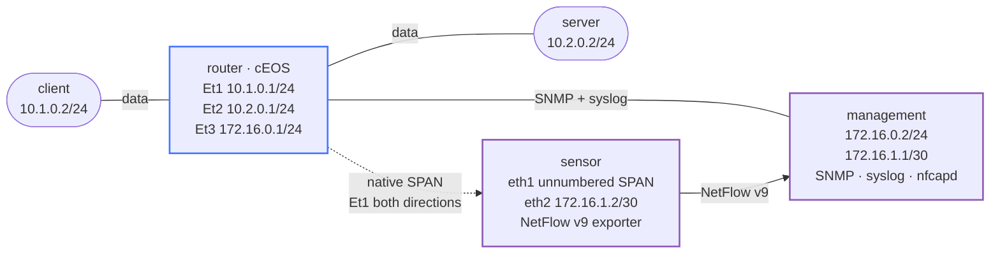

# Network Assurance — Practice Lab

Compare complementary assurance mechanisms across two controlled events. A
traffic burst connects EOS interface counters over SNMP with packets from a
native SPAN session and summarized NetFlow v9 records; an interface transition
connects reachability, SNMP operational state, and native EOS syslog. SPAN and
NetFlow are not independent here—the flow sensor consumes the SPAN feed, so
they share that failure domain. The telemetry plumbing is intentionally
preconfigured so the work stays focused on freshness and consistency.

## Topology



The sensor is not inline. Losing its flow exporter does not change the client
to server forwarding path, which is what makes the final fault diagnostically
useful.

### Nodes

| Node | Image/platform | Interface and address | Role |
|------|----------------|-----------------------|------|
| `router` | `ceos:4.35.2F` | `Ethernet1` `10.1.0.1/24`; `Ethernet2` `10.2.0.1/24`; `Ethernet3` `172.16.0.1/24`; `Ethernet4` unnumbered | Native routing, SNMPv2c/v3, syslog, and SPAN |
| `client` | `ops-lab:local` | `eth1` `10.1.0.2/24`; default via `10.1.0.1` | Controlled traffic source |
| `server` | `ops-lab:local` | `eth1` `10.2.0.2/24`; default via `10.2.0.1` | Controlled traffic destination |
| `management` | `assurance-lab:local` | `eth1` `172.16.0.2/24`; `eth2` `172.16.1.1/30` | SNMP poller, UDP/514 syslog receiver, UDP/2055 flow collector |
| `sensor` | `assurance-lab:local` | `eth1` unnumbered/promiscuous; `eth2` `172.16.1.2/30` | Observes SPAN and exports NetFlow v9 |

### Links

| Endpoint A | Endpoint B | Network/use |
|------------|------------|-------------|
| `client:eth1` | `router:Ethernet1` | `10.1.0.0/24` client data link and bidirectional SPAN source |
| `server:eth1` | `router:Ethernet2` | `10.2.0.0/24` server data link |
| `management:eth1` | `router:Ethernet3` | `172.16.0.0/24` SNMP polling and native syslog |
| `sensor:eth1` | `router:Ethernet4` | Unnumbered native SPAN destination |
| `management:eth2` | `sensor:eth2` | `172.16.1.0/30` NetFlow v9 export path |

## How to use this lab

This is a **reference/observation practice lab**, not a tool-configuration
tutorial. The four evidence planes are preconfigured; each task asks you to
produce a prediction, a bounded observation, or a diagnosis.

- **Predict before you observe.** When a task asks for a prediction, commit
  to an answer before touching the CLI. Being wrong and finding out why is
  the point.
- **Open the hints before the solution.** The solution toggle is the answer
  key—use it to check your approach or when genuinely stuck, not as step one.
- **Verify like an operator.** Treat timestamps, direction, counters, and
  collection boundaries as part of the evidence. A stale record is not proof.

## Deploy

This lab needs the repository's operations image, its pinned collector image,
and the cEOS 4.35.2F image described in the
[cEOS platform notes](../../docs/platforms/ceos.md).

```bash
docker build -t ops-lab:local images/ops-lab/
docker build -t assurance-lab:local labs/network-assurance/
docker image inspect ceos:4.35.2F >/dev/null
./scripts/lab.sh deploy network-assurance
```

The complete end-state checker is deliberately heavier than a smoke test: it
creates a fresh traffic burst and can take about 20 seconds.

```bash
./scripts/lab.sh check network-assurance
```

## Task 1 — Establish a trustworthy baseline

**Objective:** Prove that the forwarding path is healthy and identify the
source, destination, and freshness boundary of each assurance plane before
using any of them to support a conclusion.

**Predict first:** If the end-to-end ping succeeds, which of SNMP, syslog,
SPAN, and NetFlow have actually been proven healthy by that result?

<details markdown="1">
<summary>Hints</summary>

- Start with live container and interface state, then test the data path.
- A configured collector is not the same as a collector with fresh evidence.
- Use numeric OIDs so the result does not depend on optional MIB files.

</details>

<details markdown="1">
<summary>Solution</summary>

```bash
docker ps --filter name=clab-network-assurance --format 'table {{.Names}}\t{{.Status}}'
./scripts/lab.sh cmd network-assurance router -- \
  Cli -p 15 -c enable -c 'show interfaces status'
./scripts/lab.sh cmd network-assurance client -- ping -c 3 10.2.0.2

# SNMPv2c sysName.0
./scripts/lab.sh cmd network-assurance management -- \
  snmpget -v2c -c ASSURANCE -On 172.16.0.1 .1.3.6.1.2.1.1.5.0

# Numeric ifDescr table: confirm ifIndex 1/2 map to Ethernet1/2.
./scripts/lab.sh cmd network-assurance management -- \
  snmpwalk -v2c -c ASSURANCE -On 172.16.0.1 .1.3.6.1.2.1.2.2.1.2

# Confirm the preconfigured observation mechanisms are active.
./scripts/lab.sh cmd network-assurance router -- \
  Cli -p 15 -c enable -c 'show monitor session ASSURANCE'
./scripts/lab.sh cmd network-assurance management -- \
  sh -c 'pgrep -a rsyslogd; pgrep -a nfcapd'
./scripts/lab.sh cmd network-assurance sensor -- \
  softflowctl -c /run/softflowd.ctl statistics
```

</details>

<details markdown="1">
<summary>Check your work</summary>

The ping proves only current forwarding and return reachability. A numeric
SNMP response proves the poll path, a newly generated marker proves syslog,
packets captured during a known window prove SPAN, and records from a freshly
expired known flow prove NetFlow. Merely finding old log or flow files proves
storage, not current collection.

</details>

## Task 2 — Correlate one deterministic burst

**Objective:** Generate one controlled client-to-server event and correlate it
with an `ifHCInOctets` increase, a bounded bidirectional SPAN capture, and fresh
bidirectional NetFlow records with meaningful packet and byte totals.

**Predict first:** Which direction of the ICMP exchange increments Ethernet1
`ifHCInOctets`, and why should the sensor report two flow directions?

<details markdown="1">
<summary>Hints</summary>

- Ethernet1 is ifIndex `1`; its `ifHCInOctets` instance is
  `.1.3.6.1.2.1.31.1.1.1.6.1`.
- Capture a small visible sample, but generate a larger deterministic burst for
  flow export. Small bursts can remain in libpcap batching.
- Expire the sensor cache, then allow one five-second collector rotation.

</details>

<details markdown="1">
<summary>Solution</summary>

```bash
# Start with a new collector window so every displayed record belongs to this
# event. The six-second wait lets nfcapd close the unlinked active file.
docker exec clab-network-assurance-sensor \
  softflowctl -c /run/softflowd.ctl expire-all
docker exec clab-network-assurance-management \
  sh -c 'rm -f /var/log/netflow/nfcapd.*'
sleep 6

before=$(docker exec clab-network-assurance-management \
  snmpget -v2c -c ASSURANCE -Oqv 172.16.0.1 \
  .1.3.6.1.2.1.31.1.1.1.6.1)

docker exec clab-network-assurance-sensor \
  timeout 8 tcpdump -lnni eth1 -c 6 \
  'icmp and (host 10.1.0.2 or host 10.2.0.2)' \
  >/tmp/assurance-span.txt 2>&1 &
capture_pid=$!

docker exec clab-network-assurance-client \
  ping -q -c 2000 -i 0.001 -s 1400 10.2.0.2
wait "$capture_pid" || true

after=$(docker exec clab-network-assurance-management \
  snmpget -v2c -c ASSURANCE -Oqv 172.16.0.1 \
  .1.3.6.1.2.1.31.1.1.1.6.1)
printf 'ifHCInOctets before=%s after=%s delta=%s\n' \
  "$before" "$after" "$((after-before))"
sed -n '1,12p' /tmp/assurance-span.txt

docker exec clab-network-assurance-sensor \
  softflowctl -c /run/softflowd.ctl expire-all
sleep 7
docker exec clab-network-assurance-management \
  nfdump -N -R /var/log/netflow -o 'fmt:%sa %da %pkt %byt' \
  'proto icmp and (host 10.1.0.2 or host 10.2.0.2)'
rm -f /tmp/assurance-span.txt
```

</details>

<details markdown="1">
<summary>Check your work</summary>

The 64-bit inbound counter increases because echo requests enter Ethernet1.
The native bidirectional monitor session copies both requests and replies to
the sensor. The flow output has `10.1.0.2 → 10.2.0.2` and the reverse
direction, normally close to 2,000 packets and 2.8 MB each. Exact totals can
be slightly lower because measured libpcap batching and collector-window timing
can exclude some packets from the summarized records; four-digit packet counts
and seven-digit byte counts are the meaningful threshold.

</details>

## Task 3 — Observe an interface state transition

**Objective:** Shut Ethernet2, prove the same transition through reachability,
SNMP `ifOperStatus`, and a fresh native EOS syslog event, then restore and
re-prove the healthy state.

**Predict first:** Which evidence arrives without polling, and which evidence
can say that the interface is down but not explain when it changed?

<details markdown="1">
<summary>Hints</summary>

- Ethernet2's numeric `ifOperStatus` instance is
  `.1.3.6.1.2.1.2.2.1.8.2`.
- Search only the most recent bounded log lines for the native `LINEPROTO`
  transition.
- Restore the interface before moving to the next task.

</details>

<details markdown="1">
<summary>Solution</summary>

```bash
./scripts/lab.sh cmd network-assurance router -- Cli -p 15 \
  -c $'enable\nconfigure terminal\ninterface Ethernet2\nshutdown'

./scripts/lab.sh cmd network-assurance client -- ping -c 3 -W 1 10.2.0.2 || true
./scripts/lab.sh cmd network-assurance management -- \
  snmpget -v2c -c ASSURANCE -On 172.16.0.1 .1.3.6.1.2.1.2.2.1.8.2
./scripts/lab.sh cmd network-assurance management -- \
  timeout 3 tail -n 20 /var/log/remote/router.log

./scripts/lab.sh cmd network-assurance router -- Cli -p 15 \
  -c $'enable\nconfigure terminal\ninterface Ethernet2\nno shutdown'
./scripts/lab.sh cmd network-assurance client -- ping -c 3 10.2.0.2
./scripts/lab.sh cmd network-assurance management -- \
  snmpget -v2c -c ASSURANCE -On 172.16.0.1 .1.3.6.1.2.1.2.2.1.8.2
./scripts/lab.sh cmd network-assurance management -- \
  tail -n 10 /var/log/remote/router.log
```

</details>

<details markdown="1">
<summary>Check your work</summary>

During shutdown, ping fails and the numeric SNMP response returns `2` (down).
Native EOS syslog
pushes a `%LINEPROTO-5-UPDOWN` event for Ethernet2; after `no shutdown`, it
pushes the matching `up` event, SNMP returns `1` (up), and forwarding recovers.
Syslog supplies the event timeline, while the polled OID supplies current
state.

</details>

## Task 4 — Compare SNMPv2c with SNMPv3 authPriv

**Objective:** Capture one SNMPv2c poll and one SNMPv3 `authPriv` poll in a
bounded window, then identify which fields remain observable and which request
content is protected.

**Predict first:** Will SNMPv3 encryption hide every packet field, including
addresses, ports, security model, engine metadata, and username?

<details markdown="1">
<summary>Hints</summary>

- Capture on `management:eth1` with verbose decoding and UDP port 161.
- Use the same numeric `sysName.0` OID for both requests.
- Look for the v2c community and compare it with the v3 scoped PDU.

</details>

<details markdown="1">
<summary>Solution</summary>

```bash
docker exec clab-network-assurance-management \
  timeout 10 tcpdump -lnnvi eth1 -c 6 'udp port 161' \
  >/tmp/assurance-snmp.txt 2>&1 &
capture_pid=$!
sleep 1

docker exec clab-network-assurance-management \
  snmpget -v2c -c ASSURANCE -On 172.16.0.1 .1.3.6.1.2.1.1.5.0
docker exec clab-network-assurance-management \
  snmpget -v3 -u observer -l authPriv \
  -a SHA -A AssuranceAuth123 -x AES -X AssurancePriv123 \
  -On 172.16.0.1 .1.3.6.1.2.1.1.5.0

wait "$capture_pid" || true
sed -n '1,120p' /tmp/assurance-snmp.txt
rm -f /tmp/assurance-snmp.txt
```

</details>

<details markdown="1">
<summary>Check your work</summary>

The SNMPv2c decode exposes the `ASSURANCE` community and requested OID. The
v3 exchange first performs engine discovery, then the authenticated/private
request shows user and engine metadata while its scoped PDU is ciphertext.
SNMPv3 does not hide transport headers or every USM/engine field: `authPriv`
protects management content; it does not make the packet invisible.

</details>

## Task 5 — Break-It: diagnose a telemetry blind spot

**Objective:** Inject the opaque fault, identify the missing evidence plane,
prove that forwarding and the other three planes remain healthy, then repair
the fault and generate fresh flow evidence.

**Predict first:** If ping, interface counters, syslog, and mirrored packets
remain healthy but new flow records disappear, is the forwarding device the
most likely fault domain?

```bash
./labs/network-assurance/break.sh
./scripts/lab.sh check network-assurance || true
```

<details markdown="1">
<summary>Hints</summary>

- Classify checker failures by evidence plane instead of treating every red
  assertion as an independent fault.
- Compare fresh SPAN packets on the sensor's observation interface with fresh
  UDP/2055 datagrams on the collector-facing interface.
- Keep the data path out of the repair unless its own evidence fails.

</details>

<details markdown="1">
<summary>Solution and repair</summary>

The injected fault stops only `softflowd` on the non-inline sensor. The SPAN
feed still arrives, but nothing summarizes those packets or exports NetFlow.

```bash
./labs/network-assurance/solution.sh
./scripts/lab.sh check network-assurance
```

`solution.sh` idempotently reruns the sensor setup and verifies the daemon,
PID file, and control socket. A passing checker then proves fresh
bidirectional records rather than merely restarting a process.

</details>

<details markdown="1">
<summary>Check your work</summary>

In the broken state, data-plane reachability, SNMP, native syslog, and fresh
SPAN request/reply assertions still pass. Only the flow-sensor health and fresh
flow-evidence assertions fail. After repair, the entire checker passes and the
new records again have both directions and meaningful totals.

</details>

## Verification

Run the checker once after completing all tasks:

```bash
./scripts/lab.sh check network-assurance
```

| Evidence plane | Source | Collector/observer | Required fresh proof |
|----------------|--------|--------------------|----------------------|
| SNMP | EOS agent | `management` | Numeric v2c and v3 polls; Ethernet1 counter delta; Ethernet2 state |
| Syslog | Native EOS logging | `management` UDP/514 | New marker or `%LINEPROTO-5-UPDOWN` event from `172.16.0.1` |
| SPAN | EOS monitor session, Ethernet1 both directions | `sensor:eth1` | Bounded capture contains request and reply |
| NetFlow v9 | `softflowd` observing SPAN | `management` UDP/2055 | Fresh records in both directions with four-digit packets and seven-digit bytes |

- [ ] All five expected containers are running on their exact images.
- [ ] Client-to-server forwarding works through native EOS routing.
- [ ] Numeric SNMPv2c and SNMPv3 `authPriv` polls return `assurance-router`.
- [ ] A fresh native EOS log marker reaches the collector.
- [ ] A bounded SPAN capture sees both ICMP directions.
- [ ] Fresh NetFlow v9 records contain both directions and meaningful totals.
- [ ] No bounded capture process or temporary host capture remains.

## Challenge questions

1. Which pair of evidence planes in this lab shares the largest common failure
   domain, and what extra observation would reduce that risk?
2. The SNMP counter rises but neither SPAN nor NetFlow sees the flow. Rank
   three plausible causes and state the next discriminating check for each.
3. How would you choose a production flow-active timeout without overwhelming
   the collector or delaying incident detection?
4. What security improvements would you require before moving the v2c and
   UDP syslog examples onto an untrusted management network?
5. If the mirrored link becomes oversubscribed, which conclusions from this
   lab become unsafe even while packet forwarding remains perfect?

## Troubleshooting

| Symptom | Likely cause | Fix |
|---------|--------------|-----|
| Both SNMP versions time out | `management:eth1`, EOS Ethernet3, or the SNMP agent/config is unavailable | Check link/address state, ping `172.16.0.1`, then inspect the EOS SNMP configuration |
| SNMPv2c works but v3 fails | Username, security level, authentication password, or privacy password differs | Use `observer`, `authPriv`, SHA/AES, and the credentials documented in the task |
| Ping works but no fresh native log appears | UDP/514 receiver or EOS source/host logging configuration is unhealthy | Check `rsyslogd`, its socket, `logging host`, and `logging local-interface Ethernet3` |
| SPAN sees requests but not replies | Monitor direction is not `both`, or replies are not returning through Ethernet1 | Inspect `show monitor session ASSURANCE` and the server route before changing the sensor |
| SPAN is fresh but NetFlow is absent | The non-inline exporter or export link is unhealthy | Inspect the sensor PID/control socket, UDP/2055 capture, and `nfcapd`; use the collapsed Task 5 repair when applicable |
| A tiny ping produces no immediate flow record | libpcap batching and flow expiry delay the export | Use the documented 2,000-packet burst, expire the cache, and wait for the five-second collector rotation |

## Cleanup

Remove only the temporary evidence created by the documented tasks, then
destroy the topology:

```bash
rm -f /tmp/assurance-span.txt /tmp/assurance-snmp.txt
./scripts/lab.sh destroy network-assurance
```
