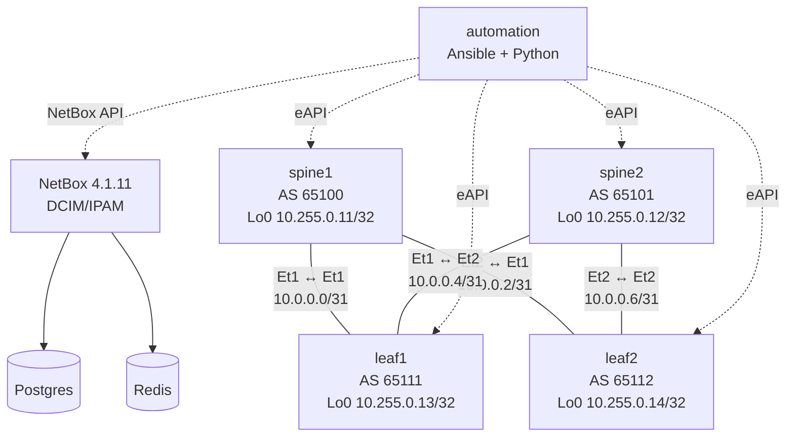

# Network Automation with NetBox — Capstone

Build a relational DCIM/IPAM source of truth for a redundant cEOS fabric,
derive deterministic native EOS merge candidates from cables and addressing,
and reconcile intended state against observed facts under an explicit ownership
policy. The earlier `automation-fundamentals` lab teaches eAPI and Python
mechanics; this capstone assumes those skills and concentrates on NetBox
relationships, fail-closed rendering, and authority boundaries instead of
repeating them.

## Prerequisites

- ContainerLab `0.74.1` or newer and Docker
- the local `ceos:4.35.2F` image described in the
  [cEOS platform notes](../../docs/platforms/ceos.md)
- about 6 GiB of free RAM for a four-node fabric plus NetBox services
- `netbox-automation:local`, built from this lab's digest-pinned Dockerfile
- completion of `automation-fundamentals`, or equivalent eAPI/Ansible basics

!!! danger "Disposable credentials only"
    `admin` / `admin`, the NetBox database password, and `SECRET_KEY` in this
    lab are disposable bootstrap credentials for an isolated local exercise.
    They are deliberately easy to inspect. Never reuse this pattern or these
    values in production; use a secret store, TLS, least-privilege tokens, and
    rotated credentials.

## Topology



### Nodes

| Node | Role | Management | Loopback | Instructional status |
|------|------|------------|----------|----------------------|
| `spine1` | cEOS spine, AS 65100 | `172.31.40.11/24` | `10.255.0.11/32` | Critical |
| `spine2` | cEOS spine, AS 65101 | `172.31.40.12/24` | `10.255.0.12/32` | Critical |
| `leaf1` | cEOS leaf, AS 65111 | `172.31.40.13/24` | `10.255.0.13/32` | Critical |
| `leaf2` | cEOS leaf, AS 65112 | `172.31.40.14/24` | `10.255.0.14/32` | Critical |
| `netbox` | NetBox 4.1.11 API/UI | `172.31.40.23/24` | — | Instructional service |
| `automation` | Controller | `172.31.40.24/24` | — | Instructional service |
| `postgres` | NetBox database | `172.31.40.21/24` | — | Incidental dependency |
| `redis` | NetBox cache/queue | `172.31.40.22/24` | — | Incidental dependency |

### Fabric relationships

| Cable | Endpoint A | Endpoint B | Address pair |
|-------|------------|------------|--------------|
| 1 | `spine1:Ethernet1` | `leaf1:Ethernet1` | `10.0.0.0/31`, `10.0.0.1/31` |
| 2 | `spine1:Ethernet2` | `leaf2:Ethernet1` | `10.0.0.2/31`, `10.0.0.3/31` |
| 3 | `spine2:Ethernet1` | `leaf1:Ethernet2` | `10.0.0.4/31`, `10.0.0.5/31` |
| 4 | `spine2:Ethernet2` | `leaf2:Ethernet2` | `10.0.0.6/31`, `10.0.0.7/31` |

### Learner-owned service outcome

| Device | VRF | VLAN/access | SVI |
|--------|-----|-------------|-----|
| `leaf1` | `BLUE`, RD `65111:10` | VLAN 10 `BLUE-USERS` on `Ethernet3` | `Vlan10`, `10.10.10.1/24` |
| `leaf2` | `BLUE`, RD `65111:10` | VLAN 10 `BLUE-USERS` on `Ethernet3` | `Vlan10`, `10.10.10.2/24` |

## Ownership and workflow boundaries

| Data | Authority | Reconciliation behavior |
|------|-----------|-------------------------|
| Management reachability, bootstrap hostname/user/eAPI | Startup config | Modeled for access, but excluded from rendered candidates |
| Interface addressing, descriptions, enabled state, MTU | NetBox intent | NetBox wins; discovery reports but never adopts changes |
| Fabric cables and BGP `local_asn` | NetBox relationship/custom field | Must pass graph integrity before rendering |
| BLUE VRF, VLAN, access port, SVI | Learner artifact imported to NetBox | NetBox wins; rendered as native EOS merge input |
| Device serial | Observed EOS facts | Explicitly adoptable into NetBox |

Candidates contain no password, username, or eAPI bootstrap. They are
**merge inputs**, not full replacements: they add or correct the lines they
own, but cannot prove removal convergence for arbitrary extra configuration.
That limitation is why drift detection remains a separate step.

## How to use this lab

This is a **practice lab**, not a tutorial. Each task gives you an
**objective** and **hints** — your job is to produce the configuration.

- **Predict before you configure.** When a task asks for a prediction,
  commit to an answer before touching the CLI. Being wrong and finding out
  why is the point.
- **Open the hints before the solution.** The solution toggle is the answer
  key — use it to check your work or when genuinely stuck, not as step one.
- **Verify like an operator.** After each task, prove the state is what you
  think it is with `show` commands before moving on.

## Deploy

```bash
docker build -t netbox-automation:local labs/network-automation-netbox/
./scripts/lab.sh deploy network-automation-netbox
docker exec clab-network-automation-netbox-automation \
  python3 /workspace/wait_for_netbox.py --timeout 360
```

Do not replace readiness with a fixed sleep. Cold first initialization can
take roughly 3.5 minutes; the helper polls token provisioning and the
authenticated `/api/status/` endpoint until a bounded deadline. The UI is at
`http://127.0.0.1:8001` with disposable login `admin` / `admin`.

## Task 1 — Prove the bootstrap boundary

**Objective:** Prove the four-node underlay has two eBGP peers per node and
loopback reachability, while the learner-owned BLUE service is absent.

**Predict first:** Will a clean deployment pass the final checker before you
create service intent? Which parts should already work?

<details markdown="1">
<summary>Hints</summary>

- Inspect BGP summary and a remote loopback from a spine and a leaf.
- Look for `Vlan10` and `Ethernet3` on a leaf.
- Startup config deliberately owns enough state to reach the APIs and keep a
  known-good routed underlay, but it withholds the service outcome.

</details>

<details markdown="1">
<summary>Solution / procedure</summary>

```bash
docker exec clab-network-automation-netbox-spine1 \
  Cli -p 15 -c 'show ip bgp summary'
docker exec clab-network-automation-netbox-leaf1 \
  Cli -p 15 -c 'ping 10.255.0.12 repeat 3 timeout 2'
docker exec clab-network-automation-netbox-leaf1 \
  Cli -p 15 -c 'show running-config section interface Ethernet3' \
  -c 'show running-config section interface Vlan10'
```

</details>

<details markdown="1">
<summary>Check your work</summary>

Every fabric node has exactly two established peers, and the loopback ping has
zero loss. The service interfaces have no intended configuration yet. This
proves bootstrap reachability without pretending the learner outcome was
pre-solved; the final checker should not yet pass.

</details>

## Task 2 — Seed and audit the relationship graph

**Objective:** Idempotently seed the underlay/DCIM model and prove exact object
counts, explicit `local_asn` values, primary IPs, and four cable relationships.

**Predict first:** If the seed is relationally idempotent, which counts should
change on its second run?

<details markdown="1">
<summary>Hints</summary>

- Work inside the `automation` node at `/workspace`.
- Seed twice, then use the baseline phase of the read-only audit.
- Trace a cable in NetBox from both endpoint interfaces; subnet coincidence is
  not accepted as a substitute for a cable object.

</details>

<details markdown="1">
<summary>Solution / procedure</summary>

```bash
./scripts/lab.sh bash network-automation-netbox automation
cd /workspace
python3 wait_for_netbox.py --timeout 360
python3 seed_netbox.py
python3 seed_netbox.py
python3 audit_netbox.py --phase baseline
```

</details>

<details markdown="1">
<summary>Check your work</summary>

The second run creates no duplicates. Baseline counts remain four devices,
sixteen interfaces, sixteen assigned addresses, four cables, six prefixes,
and zero service VRFs/VLANs. The `local_asn` integer custom field replaces the
old asset-tag/tag encoding, so the renderer has one typed source for BGP ASNs.

</details>

## Task 3 — Model BLUE and render native candidates

**Objective:** Create the bounded learner service artifact, import it twice,
and render four secret-free candidates through NetBox's native
`render-config` endpoint.

**Predict first:** If one cable disappears or one endpoint moves outside its
`/31`, should a renderer omit that neighbor or refuse the whole candidate set?

<details markdown="1">
<summary>Hints</summary>

- The top-level key is `service`; match the service table exactly.
- Each leaf needs an access interface description and an SVI description.
- Import validates the entire artifact before changing NetBox. Rendering then
  validates cables, endpoint addressing, custom fields, template, and context.

</details>

<details markdown="1">
<summary>Solution / procedure</summary>

Create `/workspace/learner-service.yml` with:

```yaml
service:
  name: BLUE
  rd: "65111:10"
  vlan:
    vid: 10
    name: BLUE-USERS
  prefix: 10.10.10.0/24
  leaves:
    - device: leaf1
      access_interface: Ethernet3
      access_description: BLUE user access
      svi: Vlan10
      svi_description: BLUE gateway
      address: 10.10.10.1/24
    - device: leaf2
      access_interface: Ethernet3
      access_description: BLUE user access
      svi: Vlan10
      svi_description: BLUE gateway
      address: 10.10.10.2/24
```

Then run:

```bash
cd /workspace
python3 import_service.py learner-service.yml
python3 import_service.py learner-service.yml
python3 audit_netbox.py --phase complete
python3 render_from_netbox.py
sha256sum generated/*.cfg
grep -R -E 'username |secret |password ' generated/ || true
```

</details>

<details markdown="1">
<summary>Check your work</summary>

Complete counts are four devices, twenty interfaces, eighteen addresses, four
cables, one VRF, one VLAN, and seven prefixes. Four nonempty device-specific
EOS configs appear together only after all native renders succeed. The secret
scan is empty because management/API bootstrap is outside candidate ownership.
A relationship error instead emits `MODEL INTEGRITY ERROR` and preserves the
previous complete candidate set.

</details>

## Task 4 — Precheck, deploy, and prove idempotence

**Objective:** Review a check-mode diff, deploy the NetBox candidates, and
prove a repeated check and apply report zero device changes.

**Predict first:** Which leaf objects should appear in the first diff, and
what should the second precheck report after a successful apply?

<details markdown="1">
<summary>Hints</summary>

- `precheck.sh` renders into a temporary directory and cleans it.
- `deploy.yml` uses merge semantics and the collections already bundled with
  Ansible; do not install collections from the network.
- Inspect the recap for `changed=0` on all four nodes.

</details>

<details markdown="1">
<summary>Solution / procedure</summary>

```bash
cd /workspace
./precheck.sh
ansible-playbook -i inventory.yml deploy.yml --diff
./precheck.sh
ansible-playbook -i inventory.yml deploy.yml --diff
```

</details>

<details markdown="1">
<summary>Check your work</summary>

The first diff adds BLUE/VLAN 10/Ethernet3/Vlan10 on the leaves while the
underlay is already converged. The second check and apply report `changed=0`
for all four devices. This is stable because candidates exclude the plaintext
bootstrap username line whose salted EOS hash would otherwise differ on every
run.

</details>

## Task 5 — Reconcile facts under field ownership

**Objective:** Adopt only observed serials, inject one live intent-owned
description drift, prove discovery refuses to adopt it, then restore it with a
NetBox-wins deploy.

**Predict first:** After discovery runs against the dirty leaf, will NetBox's
`Ethernet3` description change or will the drift remain visible?

<details markdown="1">
<summary>Hints</summary>

- Gather fresh facts before every report.
- Stable diagnostic `[INTENT_DESCRIPTION_DRIFT]` identifies the owned field.
- `discover_sync.py` prints an adoption/preservation decision for each device.

</details>

<details markdown="1">
<summary>Solution / procedure</summary>

In the controller terminal you opened in Task 2, run:

```bash
cd /workspace
ansible-playbook -i inventory.yml facts.yml
python3 discover_sync.py
python3 drift_report.py
```

Run the drift injection from a **second host terminal at the repository root**,
not from the controller shell:

```bash
docker exec clab-network-automation-netbox-leaf1 \
  Cli -p 15 -c $'enable\nconfigure terminal\ninterface Ethernet3\ndescription emergency-manual-change'
```

If you have only one terminal, exit the controller first, run that host command
from the repository root, then re-enter with
`./scripts/lab.sh bash network-automation-netbox automation`. Back in the
controller terminal, continue with:

```bash
cd /workspace
ansible-playbook -i inventory.yml facts.yml
python3 drift_report.py || true
python3 discover_sync.py
python3 drift_report.py || true
ansible-playbook -i inventory.yml deploy.yml
ansible-playbook -i inventory.yml facts.yml
python3 drift_report.py
```

</details>

<details markdown="1">
<summary>Check your work</summary>

The first discovery adopts each real EOS serial and explicitly preserves all
intent-owned fields. Both dirty reports name
`[INTENT_DESCRIPTION_DRIFT]`; discovery does not launder the manual change
into intended state. The deploy restores `BLUE user access`, and fresh facts
return a `CLEAN` report. This makes the direction of authority observable.

</details>

## Task 6 — Author and retain your capstone rationale

**Objective:** Produce your own evidence-backed design rationale and retain it
as `/workspace/capstone-rationale.md`. This file is your capstone artifact; the
cleanup command below intentionally does not remove it.

This is a learner-authored deliverable, so no answer text or solution template
is supplied. Cite the evidence you collected in Tasks 2–5 and write in your own
words. Your rationale is complete only when it:

- identifies which NetBox relationships are authoritative for rendering and
  explains how your evidence demonstrates that authority;
- states why only observed device serials may be adopted, and identifies the
  intent-owned observation that discovery refused to adopt;
- distinguishes repeatable merge application from deletion convergence and
  explains the deletion limitation you observed;
- proposes a bounded, reviewable deletion workflow with pre-change validation,
  blast-radius controls, and explicit rollback evidence; and
- names the post-change evidence that would prove both the intended deletion
  and a successful rollback.

Retain the finished file with your audit output, render hashes, Ansible recaps,
and before/after drift reports. Do not replace the rationale with copied lab
prose or a list of commands.

## Task 7 — Break the SoT graph and repair narrowly

**Objective:** Run the opaque fault injector, diagnose a NetBox-only graph
failure without disturbing live forwarding or known-good candidates, then use
the narrow repair twice.

**Predict first:** Will BGP or loopback forwarding fail when only intended
NetBox data is invalid, and should a failed render change existing hashes?

<details markdown="1">
<summary>Hints</summary>

- Record candidate hashes before breaking the lab.
- Compare the cable endpoints to their assigned addresses and `/31` network.
- The renderer's first `MODEL INTEGRITY ERROR` is more useful than guessing at
  the live fabric.

</details>

<details markdown="1">
<summary>Solution / procedure</summary>

From the repository root:

```bash
sha256sum labs/network-automation-netbox/automation/generated/*.cfg
./labs/network-automation-netbox/break.sh

docker exec clab-network-automation-netbox-automation \
  python3 /workspace/audit_netbox.py --phase complete
docker exec clab-network-automation-netbox-automation \
  python3 /workspace/render_from_netbox.py --validate-only || true
docker exec clab-network-automation-netbox-leaf1 \
  Cli -p 15 -c 'show ip bgp summary'
sha256sum labs/network-automation-netbox/automation/generated/*.cfg

./labs/network-automation-netbox/solution.sh
./labs/network-automation-netbox/solution.sh
./scripts/lab.sh check network-automation-netbox
```

</details>

<details markdown="1">
<summary>Check your work</summary>

The broken audit isolates an intended fabric-address and `/31` relationship
failure. Live BGP, loopback reachability, eAPI, and the previous candidate
hashes remain healthy because the fault never touches EOS and the renderer
fails closed. The solution changes only the exact leaf1 assignment back to its
contract value, validates the recovered graph, and safely regenerates the
complete candidate set; running it twice is harmless.

</details>

## Final verification

```bash
./scripts/lab.sh check network-automation-netbox
```

The checker is read-only with respect to NetBox intended data and devices. It
uses fresh facts, Ansible check mode, and two temporary render directories,
then removes them. It verifies all eight services and exact images, native EOS
identity, two peers per node, complete loopback reachability, eAPI, authenticated
NetBox 4.1.11, exact relational counts, BLUE intent, cable `/31` integrity,
secret-free stable candidates, adopted serial ownership, clean drift, and a
four-node zero-change recap.

## Results to retain

| Evidence | Healthy result | Mechanism proved |
|----------|----------------|------------------|
| Baseline seed twice | Counts unchanged | Relational idempotence |
| Cable and endpoint audit | Four exact peers, two addresses per `/31` | DCIM relationships drive topology |
| Native render hashes | Four stable, device-specific files | Deterministic fail-closed generation |
| Second Ansible run | Four `changed=0` recaps | Merge candidate idempotence |
| Dirty drift report | `[INTENT_DESCRIPTION_DRIFT]` | NetBox-owned field divergence |
| Discovery output | Serial adopted; intent preserved | Explicit observation ownership |
| Learner-authored capstone rationale | Acceptance criteria supported by retained evidence | Authority, deletion, and rollback judgment |
| Broken graph | Render refuses; BGP and hashes stay healthy | SoT validation boundary |

## Challenge questions

1. A new fabric link is cabled correctly but its NetBox interfaces use a `/30`.
   Design the minimum additional integrity checks needed before rendering.
2. Two teams both want authority over interface descriptions. Propose an
   ownership and exception workflow that avoids silent last-writer-wins drift.
3. Merge candidates cannot remove arbitrary stale device configuration. Choose
   a safe convergence strategy for deletion and identify its rollback evidence.
4. The fabric grows to hundreds of devices. Which validation stages can run in
   parallel, and which complete-set decision must remain atomic?

## Troubleshooting

| Symptom | Likely cause | Focused fix |
|---------|--------------|-------------|
| Readiness returns 403 or times out | Anonymous status was used, or cold migrations are still running | Run authenticated `wait_for_netbox.py --timeout 360`; inspect only the scoped NetBox/Postgres logs if it expires |
| Baseline audit has extra VRFs/VLANs | Reused dirty NetBox database | Destroy this scoped lab with cleanup and redeploy; do not reseed over unrelated data |
| `SERVICE MODEL ERROR` | Learner artifact differs from the stated contract | Compare keys, types, descriptions, and both leaf entries; then import again |
| `MODEL INTEGRITY ERROR` names a cable | Missing/wrong endpoint, multiple cable, or inconsistent endpoint address | Inspect that exact NetBox cable and its two interface assignments; do not bypass the validator |
| Every check mode says changed | Candidate contains bootstrap username/secret or differs from native EOS normalization | Regenerate from the checked-in secret-free template; do not render credentials |
| `[INTENT_DESCRIPTION_DRIFT]` persists | Discovery correctly refused to adopt an intent-owned field | Review the diff, then run the NetBox-wins deploy and gather fresh facts |
| Drift reports an unadopted serial | Facts were gathered but observation adoption was not run | Review facts, run `discover_sync.py`, gather again, and report |

## Cleanup

The first command removes only this lab's ignored learner/generated/fact/backup
artifacts from its bound workspace. It intentionally leaves the ignored
`/workspace/capstone-rationale.md` learner artifact in place. Save anything
else you want to retain first.

```bash
docker exec clab-network-automation-netbox-automation sh -c \
  'rm -rf /workspace/generated /workspace/facts /workspace/backups /workspace/learner-service.yml /workspace/.check-* /workspace/.precheck-*'
./scripts/lab.sh destroy network-automation-netbox
```

Implementation probe evidence and the final validation record live beside this
README in `PROBE.md` and `VALIDATION.md`. The required
`lab-tutor` skill was unavailable during remediation, so no tutor validation is
claimed; the repository authoring contract was used as the fallback.
