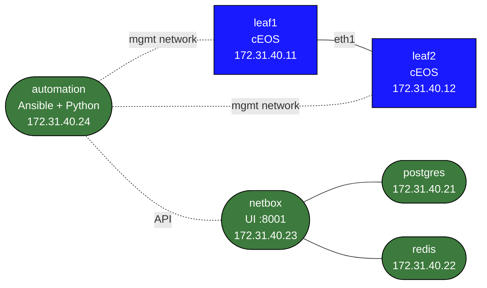

# Network Automation and NetBox Lab

This lab teaches a practical small-scale automation workflow:

- build inventory in NetBox
- keep intended state in data files
- render configs from intent
- back up running configs
- gather facts and detect drift

## Build

```bash
docker build -t netbox-automation:local labs/network-automation-netbox/
sudo containerlab deploy -t labs/network-automation-netbox/topology.clab.yml
```

## Access

- NetBox UI: `http://127.0.0.1:8001`
- NetBox login: `admin` / `admin`
- automation shell:

```bash
docker exec -it clab-network-automation-netbox-automation bash
```

## Topology



## Lab Components

- `leaf1`, `leaf2`: small cEOS fleet
- `netbox`: source-of-truth UI
- `automation`: Ansible and Python workspace

Files in `/workspace` on the automation node:

- `inventory.yml`
- `intent.yml`
- `render_intent.py`
- `backup.yml`
- `facts.yml`

## Suggested Workflow

### 1. Create Inventory in NetBox

Use the UI to create:

- site
- device roles
- devices `leaf1` and `leaf2`
- their management IPs and interface addresses

### 2. Render Intended Config

On the automation node:

```bash
cd /workspace
python3 render_intent.py
ls generated/
```

### 3. Back Up the Running Config

```bash
cd /workspace
mkdir -p backups facts
ansible-galaxy collection install arista.eos ansible.netcommon
ansible-playbook -i inventory.yml backup.yml
```

### 4. Gather Facts

```bash
ansible-playbook -i inventory.yml facts.yml
```

### 5. Introduce Drift

Make a manual change on `leaf1`, then compare:

- intended config in `generated/`
- backup in `backups/`
- live facts in `facts/`

## What This Lab Teaches

- source of truth and running state are not the same thing
- rendered config, device backup, and gathered facts each answer different operational questions
- even a small fleet benefits from repeatable pre/post checks
