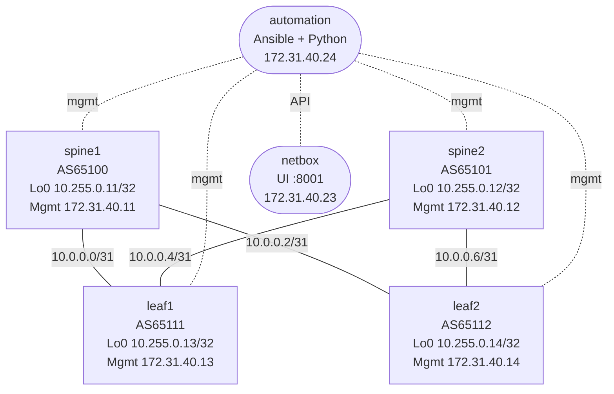

# NetBox Automation Capstone Lab

This lab is a full source-of-truth capstone built around NetBox.

You will use NetBox for:

- DCIM objects: site, racks, manufacturer, platform, roles, devices, interfaces, cables
- IPAM objects: prefixes, IP addresses, primary IPs, VLANs, VRFs
- structured automation input for config rendering
- validation against live running state

The automation node includes scripts and playbooks to:

- seed NetBox
- render EOS configs from the modeled topology
- push rendered configs
- back up running configs
- gather live facts
- detect drift

## Build

```bash
docker build -t netbox-automation:local labs/network-automation-netbox/
sudo containerlab deploy -t labs/network-automation-netbox/topology.clab.yml
```

## Access

- NetBox UI: `http://127.0.0.1:8001`
- NetBox login: `admin` / `admin`
- automation shell:

```bash
docker exec -it clab-network-automation-netbox-automation bash
```

If you are on a different machine than the lab host, forward the UI with SSH:

```bash
ssh -N -L 8001:127.0.0.1:8001 <user>@<lab-host>
```

Then browse to `http://127.0.0.1:8001`.

## Topology



## What Is In The Lab

Routers:

- `spine1`, `spine2`
- `leaf1`, `leaf2`

Service containers:

- `netbox`
- `postgres`
- `redis`
- `automation`

Automation workspace files in `/workspace`:

- `netbox_model.yml`
- `seed_netbox.py`
- `render_from_netbox.py`
- `deploy.yml`
- `backup.yml`
- `facts.yml`
- `drift_report.py`
- `inventory.yml`

## What NetBox Will Model

This capstone intentionally uses more of NetBox than the original small lab.

Seeded object types:

- site
- tenant
- manufacturer
- platform
- device type
- device roles
- racks
- tags
- devices
- interfaces
- cables
- VLAN group
- VLANs
- VRFs
- prefixes
- IP addresses
- primary IPs

## Lab Addressing

### Management

| Device | Management |
|--------|------------|
| `spine1` | `172.31.40.11/24` |
| `spine2` | `172.31.40.12/24` |
| `leaf1`  | `172.31.40.13/24` |
| `leaf2`  | `172.31.40.14/24` |

### Loopbacks

| Device | Loopback0 |
|--------|-----------|
| `spine1` | `10.255.0.11/32` |
| `spine2` | `10.255.0.12/32` |
| `leaf1`  | `10.255.0.13/32` |
| `leaf2`  | `10.255.0.14/32` |

### Fabric Links

| Link | Subnet |
|------|--------|
| `spine1:Ethernet1` ↔ `leaf1:Ethernet1` | `10.0.0.0/31` |
| `spine1:Ethernet2` ↔ `leaf2:Ethernet1` | `10.0.0.2/31` |
| `spine2:Ethernet1` ↔ `leaf1:Ethernet2` | `10.0.0.4/31` |
| `spine2:Ethernet2` ↔ `leaf2:Ethernet2` | `10.0.0.6/31` |

### Service Objects To Model In NetBox

| Object | Values |
|--------|--------|
| VRFs | `BLUE`, `GREEN` |
| VLANs | `10 USERS`, `20 SERVERS` |
| Service prefixes | `10.10.10.0/24`, `10.20.20.0/24` |

These services are intentionally present even though the capstone focus is NetBox and automation, not end-host data-plane testing.

## Step 1 — Verify The Base Fabric

This lab ships with a working underlay so the automation workflow has a known-good starting point.

Run:

```bash
./scripts/lab.sh check network-automation-netbox
```

Expected:

- all BGP adjacencies are established
- loopback reachability works across the fabric
- the NetBox UI responds

## Step 2 — Export NetBox Connection Info

The seeding and rendering scripts use the NetBox API.

By default they can auto-provision a token using the lab credentials `admin` / `admin`, so this is enough on the automation node:

```bash
docker exec -it clab-network-automation-netbox-automation bash
cd /workspace
export NETBOX_URL=http://172.31.40.23:8080
export NETBOX_USERNAME=admin
export NETBOX_PASSWORD=admin
```

If you prefer a manually created token, set `NETBOX_TOKEN` instead.

## Step 3 — Seed NetBox

The seed model lives in `netbox_model.yml`.

Run:

```bash
cd /workspace
python3 seed_netbox.py
```

This populates NetBox with:

- fabric devices and racks
- interfaces and cables
- management, loopback, and transit addressing
- VLANs and VRFs
- IPAM prefixes and IP assignments

After seeding, explore these NetBox areas:

- `DCIM -> Devices`
- `DCIM -> Interfaces`
- `DCIM -> Cables`
- `IPAM -> Prefixes`
- `IPAM -> IP Addresses`
- `IPAM -> VLANs`
- `IPAM -> VRFs`
- `Organization -> Racks`

## Step 4 — Render Configs From NetBox

Render fresh configs from the modeled topology:

```bash
cd /workspace
python3 render_from_netbox.py
ls generated/
```

You should get:

- `generated/spine1.cfg`
- `generated/spine2.cfg`
- `generated/leaf1.cfg`
- `generated/leaf2.cfg`

What the renderer uses:

- devices and roles from NetBox
- interface/IP structure from the model
- BGP underlay neighbors derived from the seeded topology
- VLAN and VRF objects for service configuration on the leaves

## Step 5 — Push The Rendered Config

Install collections if needed:

```bash
cd /workspace
ansible-galaxy collection install arista.eos ansible.netcommon
```

Push the rendered config:

```bash
ansible-playbook -i inventory.yml deploy.yml
```

This lets you treat NetBox plus the render step as the intended-state source for the devices.

## Step 6 — Back Up Running Config

```bash
cd /workspace
mkdir -p backups facts
ansible-playbook -i inventory.yml backup.yml
```

This saves current running configs into `backups/`.

## Step 7 — Gather Facts

```bash
cd /workspace
ansible-playbook -i inventory.yml facts.yml
```

This saves EOS facts into `facts/`.

## Step 8 — Run Drift Detection

```bash
cd /workspace
python3 drift_report.py
```

The current drift report checks interface/IP consistency between the NetBox model and live device facts.

This is intentionally narrow but practical. It gives you a concrete example of how to compare:

- source of truth
- intended config
- observed running state

## Step 9 — Introduce Drift

Make a manual change on one leaf. Good examples:

- change an interface description
- change an access VLAN on `Ethernet3`
- remove a loopback address
- alter a fabric IP

Then rerun:

```bash
ansible-playbook -i inventory.yml backup.yml
ansible-playbook -i inventory.yml facts.yml
python3 drift_report.py
```

Compare:

- `generated/*.cfg`
- `backups/*.cfg`
- `facts/*.json`
- the NetBox UI

## NetBox Features This Capstone Exercises

### DCIM

- device roles
- device types
- platforms
- racks
- device inventory
- interfaces
- cables
- tags

### IPAM

- prefixes
- IP addresses
- primary IPs
- VLANs
- VRFs

### Automation

- API-driven data access
- rendered config generation
- programmatic config deployment
- live facts collection
- drift detection against the source-of-truth model

## Files To Inspect

- `automation/netbox_model.yml`
- `automation/seed_netbox.py`
- `automation/render_from_netbox.py`
- `automation/deploy.yml`
- `automation/drift_report.py`
- `configs/spine1/startup-config`
- `configs/spine2/startup-config`
- `configs/leaf1/startup-config`
- `configs/leaf2/startup-config`

## Ideas To Extend It Further

If you want to keep pushing this lab, the highest-value next additions are:

- create custom fields for ownership, maintenance window, and compliance status
- add config contexts and merge them into the renderer
- pull device/interface data directly from NetBox instead of using the YAML model as the seed source
- add a second site and model inter-site inventory
- add circuits/providers and WAN-facing devices
- add server nodes and make VLAN-backed services observable end to end
- turn the drift report into a fuller compliance report

## What This Capstone Teaches

- NetBox is most valuable when it models both inventory and IPAM consistently
- source of truth, intended config, and running state are different datasets
- a small fabric is enough to practice a real automation workflow
- NetBox becomes useful operationally when it feeds rendering, deployment, and validation, not just documentation
