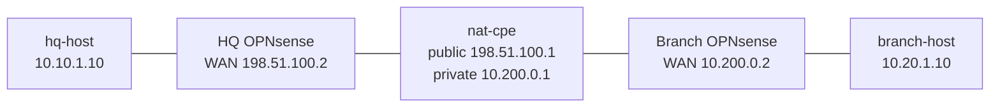

# OPNsense IPsec NAT-T — Practice Lab

Build an IKEv2 site-to-site tunnel when one firewall is behind NAT. This lab
forces NAT traversal honestly: `nat-cpe` source-NATs the branch WAN and
forwards the IKE/NAT-T ports to it. You first establish the tunnel, then prove
that encrypted data crosses the public side in UDP/4500 rather than native ESP.

> Prerequisite: [OPNsense platform notes](../../docs/platforms/opnsense.md).
> Run this lab alone: it starts two 3 GB firewall VMs.

## Topology



| Firewall | WAN | Protected LAN | IKE identity |
|---|---|---|---|
| HQ | `198.51.100.2/24`, gateway `198.51.100.1` | `10.10.1.0/24` | `hq.natt.lab` |
| Branch | `10.200.0.2/24`, gateway `10.200.0.1` | `10.20.1.0/24` | `branch.natt.lab` |

The HQ peer reaches the branch through `198.51.100.1`. `nat-cpe` forwards
UDP/500 and UDP/4500 to the branch firewall and source-NATs its replies.

## Start

```bash
docker build -t opnsense-tools:local labs/opnsense-ngfw-basics/
sudo labs/opnsense-ipsec-nat-t/prepare-bridges.sh
./scripts/lab.sh deploy opnsense-ipsec-nat-t
sudo labs/opnsense-ipsec-nat-t/start-opnsense.sh
```

HQ GUI: `https://127.0.0.1:8544`; branch GUI:
`https://127.0.0.1:8545`.

## Task 1 — Build the underlay

Assign each firewall's `vtnet1` WAN and `vtnet2` LAN interfaces from the
table. Add the default route and rules that permit IKEv2/NAT-T on WAN:
UDP/500 and UDP/4500. Verify each firewall reaches its WAN gateway before
touching IPsec.

## Task 2 — Negotiate IKEv2 through NAT

Create matching IKEv2 phase-1 settings with PSK authentication and the stated
FQDN identities. Configure the branch remote gateway as `198.51.100.2`; on
HQ, use the NAT public endpoint `198.51.100.1`. Create a phase-2 tunnel-mode
policy for `10.10.1.0/24` and `10.20.1.0/24`.

**Predict first:** the branch's configured WAN address is private. Which
address will HQ observe as the IKE source, and why does that require an
identity distinct from the transport address?

## Task 3 — Prove NAT-T on the wire

Capture at the public side of the NAT boundary:

```bash
./scripts/lab.sh capture opnsense-ipsec-nat-t nat-cpe eth1 \
  'udp.port == 500 || udp.port == 4500 || esp'
```

In another terminal generate protected traffic:

```bash
./scripts/lab.sh cmd opnsense-ipsec-nat-t hq-host -- ping -c3 10.20.1.10
```

After NAT detection, expect IKE and ESP-in-UDP on port 4500. You should not
see the inner `10.10.1.0/24` or `10.20.1.0/24` packet fields in cleartext.

## Task 4 — Triage by layer

Break and restore each condition separately:

1. Block UDP/500: no IKE SA.
2. Permit UDP/500 but block UDP/4500: NATed negotiation/data cannot complete.
3. Restore IKE but make phase-2 selectors incompatible: IKE up, child SA or
   protected traffic absent.
4. Restore selectors but block the IPsec interface policy: SAs exist but LAN
   traffic fails.

Use IPsec overview/status, firewall Live View, `nat-cpe` capture, and the host
tests to prove the failure domain.

## Verification

```bash
./scripts/lab.sh check opnsense-ipsec-nat-t
```

Also capture UDP/4500 and record the IKE and child-SA status on both
firewalls. The check deliberately cannot replace that firewall-side evidence.

## Cleanup

```bash
sudo labs/opnsense-ipsec-nat-t/stop-opnsense.sh
./scripts/lab.sh destroy opnsense-ipsec-nat-t
sudo labs/opnsense-ipsec-nat-t/cleanup-bridges.sh
```
