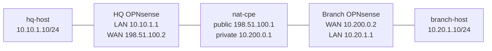

# OPNsense IKEv2 NAT Traversal — Practice Lab

Build a native OPNsense site-to-site IKEv2 tunnel when the Branch firewall is
behind source NAT. You will separate public underlay, peer identity, protected
selectors, and encrypted-interface policy; then prove that ESP crosses the NAT
boundary inside UDP/4500 and diagnose a deliberately misleading outage.

**Lab type:** Build

**Estimated time:** 75–100 minutes

**Prerequisites:** `ipsec-basics`, Linux x86-64 with KVM, Docker,
ContainerLab, `iproute2`, `qemu-system-x86_64`, `qemu-img`, OpenSSH client,
`sshpass`, and GNU `timeout`, plus the tested
[OPNsense 26.1.6_2 base image](../../docs/platforms/opnsense.md)

## Platform decision

HQ and Branch are the critical learned firewall roles, so both run genuine
OPNsense 26.1/FreeBSD in external QEMU/KVM VMs. `nat-cpe` is intrinsic Linux
NAT scaffolding because the lesson requires a controlled address-translation
boundary, while `hq-host`, `branch-host`, and the four bridges are incidental
traffic roles. The incidental containers use the digest-pinned
`ops-lab:local` image.

Run this lab alone. The two VMs allocate 3 GiB each, in addition to host,
QEMU, and container overhead.

## Topology


```mermaid
flowchart LR
    hqhost["hq-host<br/>10.10.1.10/24"] --- hq["HQ OPNsense<br/>LAN 10.10.1.1<br/>WAN 198.51.100.2"]
    hq --- nat["nat-cpe<br/>public 198.51.100.1<br/>private 10.200.0.1"]
    nat --- branch["Branch OPNsense<br/>WAN 10.200.0.2<br/>LAN 10.20.1.1"]
    branch --- branchhost["branch-host<br/>10.20.1.10/24"]
```

| Link | Endpoint A | Endpoint B | Purpose |
|---|---|---|---|
| HQ LAN | hq-host `10.10.1.10/24` | HQ `10.10.1.1/24` | protected HQ subnet |
| Public | HQ `198.51.100.2/24` | nat-cpe `198.51.100.1/24` | observable outer traffic |
| Private WAN | nat-cpe `10.200.0.1/24` | Branch `10.200.0.2/24` | translated branch underlay |
| Branch LAN | Branch `10.20.1.1/24` | branch-host `10.20.1.10/24` | protected Branch subnet |

| Role | Platform | Learner responsibility |
|---|---|---|
| HQ | OPNsense 26.1 | data interfaces, gateway, responder policy, IPsec policy |
| Branch | OPNsense 26.1 | data interfaces, gateway, initiator policy, IPsec policy |
| nat-cpe | `ops-lab:local` | intrinsic SNAT and UDP/500/4500 forwarding |
| protected hosts | `ops-lab:local` | incidental probes, pre-addressed |

`nat-cpe` maps Branch traffic to `198.51.100.1` and forwards inbound UDP/500
and UDP/4500 to `10.200.0.2`. The answer-free VM overlays initially retain
only the prepared `vtnet0` management interface: no data interfaces, gateway,
IPsec relationship, or learner firewall policy is preconfigured.

## How to use this lab

This is a **practice lab**, not a tutorial. Each task gives you an
**objective** and **hints** — your job is to produce the configuration.

- **Predict before you configure.** When a task asks for a prediction,
  commit to an answer before touching the CLI. Being wrong and finding out
  why is the point.
- **Open the hints before the solution.** The solution toggle is the answer
  key — use it to check your work or when genuinely stuck, not as step one.
- **Verify like an operator.** After each task, prove the state is what you
  think it is with show commands before moving on.

## Deploy

Build the pinned incidental image once, then deploy the Linux scaffolding and
start the two VMs as root:

```bash
docker build -t ops-lab:local images/ops-lab/
sudo labs/opnsense-ipsec-nat-t/prepare-bridges.sh
./scripts/lab.sh deploy opnsense-ipsec-nat-t
sudo labs/opnsense-ipsec-nat-t/start-opnsense.sh
```

The start helper waits a bounded time for both VMs and rolls back partial
startup. Management listeners bind only to loopback:

| Role | HTTPS | SSH | Serial |
|---|---:|---:|---:|
| HQ | `https://127.0.0.1:8544` | `127.0.0.1:2301` | `127.0.0.1:4301` |
| Branch | `https://127.0.0.1:8545` | `127.0.0.1:2302` | `127.0.0.1:4302` |

The disposable local credential is username `root`, password `opnsense`.
From another computer, reach HTTPS only through an SSH tunnel to the lab host;
do not expose these listeners on a LAN.

## Task 1 — Build and prove the underlay

**Objective:** Assign each firewall's `vtnet1` WAN and `vtnet2` protected-LAN
interface, install exactly one default gateway through `vtnet1`, and permit
only the data-interface traffic the design requires. Prove both next hops and
the remote public peer before configuring IPsec.

**Predict first:** Will a Branch ping to `198.51.100.2` reveal
`10.200.0.2` or `198.51.100.1` as its source at HQ? Which device owns that
change?

<details markdown="1">
<summary>Hints</summary>

- Preserve the prepared `vtnet0` management interface. Assign new interfaces
  for `vtnet1` and `vtnet2` from the topology table.
- HQ's WAN policy must admit IKEv2, NAT-T, and the public ICMP diagnostic used
  later. Each LAN policy permits its local protected network outbound.
- Inspect **System > Routes > Status**, interface state, and firewall Live View
  separately; one successful ping does not prove all three.

</details>

<details markdown="1">
<summary>Solution</summary>

Create `WAN_DATA` on `vtnet1` and the role's LAN on `vtnet2`, using the exact
addresses and gateways in the topology. On each LAN, allow its interface
network outbound. On HQ WAN, allow inbound IPv4 UDP/500, UDP/4500, and ICMP
to the HQ WAN address.

The repository answer helper applies Tasks 1–3 transactionally after you have
made your own attempt:

```bash
labs/opnsense-ipsec-nat-t/solution.sh
```

</details>

<details markdown="1">
<summary>Check your work</summary>

Both assigned interfaces show `UP` with their documented `/24` addresses.
The default route leaves `vtnet1`; HQ reaches `198.51.100.1`, Branch reaches
`10.200.0.1`, and Branch reaches `198.51.100.2`. That last test crosses the
NAT boundary and proves routed public underlay independently of IKE.

</details>

## Task 2 — Authenticate IKEv2 through NAT

**Objective:** Build one PSK-authenticated IKEv2 relationship using stable
FQDN identities `hq.lab` and `branch.lab`. Make Branch the initiator toward
HQ's public address while HQ accepts the peer whose transport source is the
NAT public address.

**Predict first:** Why must HQ authenticate `branch.lab` instead of treating
the observed source address as peer identity? Which address will NAT detection
report as changed?

<details markdown="1">
<summary>Hints</summary>

- Use OPNsense's **VPN > IPsec > Connections** model, not a legacy Phase 1
  object. Select IKEv2, PSK authentication, and disable MOBIKE for this fixed
  site-to-site path.
- Use the IKE proposal `aes256-sha256-modp2048`, a 30-second DPD delay, and
  exactly one local and one remote authentication round.
- HQ can remain passive; Branch has the routable public peer address and owns
  initiation. Use the same disposable lab-only secret on both peers.

</details>

<details markdown="1">
<summary>Solution</summary>

After your attempt, run the transactional answer helper. It uses supported
OPNsense 26.1 models, fixed lab object identities, saved configuration, and
native service reloads; it does not automate GUI clicks.

```bash
labs/opnsense-ipsec-nat-t/solution.sh
```

The non-production secret is intentionally kept out of this README. Inspect
`configure.php` only after attempting the identity and proposal design.

</details>

<details markdown="1">
<summary>Check your work</summary>

On each firewall, `configctl ipsec list status` returns one IKEv2 SA in
`ESTABLISHED` state. HQ reports remote NAT, Branch reports local NAT, both use
UDP/4500, and the authenticated IDs remain the two FQDNs rather than either
transport address. This separates identity from locator.

</details>

## Task 3 — Install the protected CHILD policy

**Objective:** Add one tunnel-mode CHILD policy for
`10.10.1.0/24` ↔ `10.20.1.0/24`, activate policy on OPNsense's encrypted
interface, and prove bidirectional protected-host traffic.

**Predict first:** Can an `ESTABLISHED` IKE SA coexist with failed protected
traffic? Name two CHILD/data-plane reasons why it can.

<details markdown="1">
<summary>Hints</summary>

- Use `aes256-sha256-modp2048` for ESP, enable policies, and keep tunnel mode.
- HQ uses trap start/DPD actions; Branch uses start actions. That gives one
  active owner of initiation without sacrificing responder-triggered policy.
- After IPsec registration creates `enc0`, add one inbound IPv4 pass rule from
  the remote protected `/24` to the local protected `/24` on that interface. A
  broad rule or one on a guessed legacy interface name is not equivalent.

</details>

<details markdown="1">
<summary>Solution</summary>

```bash
labs/opnsense-ipsec-nat-t/solution.sh
```

The helper deliberately registers native `enc0` before adding its model-backed
firewall rule; OPNsense rejects that rule if the dynamic interface is not yet
known.

</details>

<details markdown="1">
<summary>Check your work</summary>

The native status JSON shows one `INSTALLED` `TUNNEL` ESP CHILD with exact
opposite selectors, AES-CBC-256/HMAC-SHA2-256, and `encap=yes`. Both protected
hosts ping each other, `pfctl -sr` contains an active quick inbound pass on
`enc0`, and packet counters increase during the probes.

</details>

## Task 4 — Make ESP-in-UDP visible

**Objective:** Capture only the public side of the NAT boundary while
protected traffic succeeds. Prove bidirectional UDP/4500-encapsulated ESP and
the absence of readable protected addresses.

**Predict first:** Which two addresses and ports should the outer capture
show? Why will neither protected host address appear even though those hosts
generated the packets?

<details markdown="1">
<summary>Hints</summary>

- Observe `nat-cpe` `eth1`, not a protected LAN or the private WAN side.
- Bound the packet count and time. Require evidence in both outer directions,
  and treat any clear-text protected address as a failure.

</details>

<details markdown="1">
<summary>Solution</summary>

```bash
labs/opnsense-ipsec-nat-t/capture.sh
```

The helper generates both protected directions, validates four public packets,
and removes its mode-0600 temporary capture text on success, failure, or
interruption.

</details>

<details markdown="1">
<summary>Check your work</summary>

The output contains public `198.51.100.2:4500` ↔
`198.51.100.1:4500` `UDP-encap: ESP` packets in both directions. No
`10.10.1.0/24` or `10.20.1.0/24` address is readable. NAT-T protects the
original IP packet with ESP, then carries that ESP packet through NAT in UDP.

</details>

## Task 5 — Diagnose an opaque boundary failure

**Objective:** Arm one live-only fault, preserve evidence before changing
anything, identify the failing layer, and restore only that layer from the
existing saved firewall configuration.

**Predict first:** Rank these hypotheses before arming the fault: bad PSK,
selector mismatch, missing encrypted-interface policy, or loss of the NAT-T
data path. Which observations would eliminate each?

```bash
labs/opnsense-ipsec-nat-t/break.sh
./scripts/lab.sh cmd opnsense-ipsec-nat-t hq-host -- ping -c2 10.20.1.10
SSHPASS=opnsense sshpass -e ssh -p 2302 \
  -o StrictHostKeyChecking=no -o UserKnownHostsFile=/dev/null \
  root@127.0.0.1 'configctl ipsec list status'
```

<details markdown="1">
<summary>Hints</summary>

- Compare authenticated SA state, CHILD state, protected traffic, and Branch
  reachability to HQ's public address as four separate claims.
- Capture at both sides of `nat-cpe` before editing either firewall. The fault
  is opaque: the script reports outcomes, not the injected rule.

</details>

<details markdown="1">
<summary>Solution</summary>

```bash
labs/opnsense-ipsec-nat-t/repair.sh
```

The repair removes only exact marked fault copies and restarts native IPsec
from saved state. It cannot create missing learner configuration; use
`solution.sh` only when complete answer replacement is intended.

</details>

<details markdown="1">
<summary>Check your work</summary>

Immediately after the break, protected pings fail while the authenticated SAs
remain visible and Branch still reaches HQ's public address. That evidence
rules out the public underlay, peer identity, and initial negotiation. Repair
restores bidirectional protected traffic without rewriting saved firewall or
IPsec objects, and the exact checker returns to zero failures.

</details>

## Verification

```bash
labs/opnsense-ipsec-nat-t/check.sh
labs/opnsense-ipsec-nat-t/capture.sh
```

The non-solving checker reads saved OPNsense model state through loopback SSH,
validates exact lab-owned object cardinality and a nonprinting PSK digest,
proves live interfaces/routes/PF/IKE/CHILD/NAT-T/algorithms/selectors, checks
the exact Linux NAT scaffold, generates bidirectional protected and underlay
traffic, and requires IPsec counters to move. Generic failures do not print
the expected secret or a replacement configuration.

## Challenge questions

1. Replace the PSK with certificates for 200 branches. Which identity,
   enrollment, and revocation decisions change while NAT detection does not?
2. A second translated branch shares the same public address. Design peer
   identities and initiation ownership that avoid ambiguous responder matches.
3. Compare policy-based selectors with route-based IPsec for ten protected
   subnets. Which change-control and observability risks move between designs?
4. Design a monitor that distinguishes public underlay failure, IKE failure,
   CHILD failure, encrypted-interface policy failure, and application failure
   without using a single aggregate “VPN up” alarm.

## Troubleshooting

| Symptom | Likely cause | Focused action |
|---|---|---|
| SSH/HTTPS unavailable on loopback | VM not ready, stale QEMU process, or management baseline mismatch | stop the lab, verify the prepared base requirements, then start with the bounded helper |
| WAN gateway unreachable | bridge/tap, interface assignment, address, or default gateway | inspect host bridges, VM `vtnet1`, and the native route separately |
| No IKE SA | UDP/500 path, peer locator, FQDN identity, PSK, or IKE proposal | prove public ICMP, inspect Live View and native IPsec status without exporting secrets |
| IKE up, no CHILD | selector, ESP proposal, mode, or start-action mismatch | compare saved CHILD objects and the status JSON on both peers |
| CHILD installed, hosts fail | LAN policy, `enc0` policy, host route, or NAT-T forwarding | inspect PF, host routes, CHILD counters, and captures at the boundary |
| UDP/4500 visible only one way | forwarding/NAT state or asymmetric public policy | compare `nat-cpe` private/public captures and exact iptables inventory |
| Checker rejects a manually working tunnel | extra or noncanonical lab-owned objects | remove duplicate connection/auth/CHILD/rule objects or use the transactional answer helper after the attempt |

## Why this matters

NAT-T is not a weaker replacement for ESP. IKE detects address translation,
authenticates stable identities that need not equal transport addresses, and
encapsulates ESP so a NAT device can maintain a UDP mapping. Operators who
collapse identity, locator, SA state, and protected forwarding into one “VPN”
signal lose the ability to isolate failures like Task 5.

In production, use certificate authentication or a managed unique-secret
process, restrict management with an administrative network and strong
credentials, monitor tunnel and application state separately, and retain
bounded encrypted-traffic metadata according to policy. This lab's shared
credential, loopback management, and serial telnet listeners are local-only
training conveniences, not deployable controls.

## Cleanup and limitations

Stopping removes both disposable overlays, including learner configuration.
Use this exact order:

```bash
sudo labs/opnsense-ipsec-nat-t/stop-opnsense.sh
./scripts/lab.sh destroy opnsense-ipsec-nat-t
sudo labs/opnsense-ipsec-nat-t/cleanup-bridges.sh
```

- The external base disk is not committed; results depend on the documented
  OPNsense 26.1/amd64 baseline and KVM-capable Linux host.
- The lab validates IKEv2 PSK NAT-T, tunnel selectors, and PF policy. It does
  not validate HA, certificates, dynamic routing, performance, offload, or
  long-duration NAT rebinding.
- Runtime overlays and capture text can contain sensitive configuration or
  metadata. Helpers use restrictive permissions and remove them, but the lab
  host remains a trusted boundary.
- QEMU serial consoles use unencrypted telnet bound to `127.0.0.1`. Do not
  widen the bind address; prefer loopback SSH/HTTPS for routine access.
