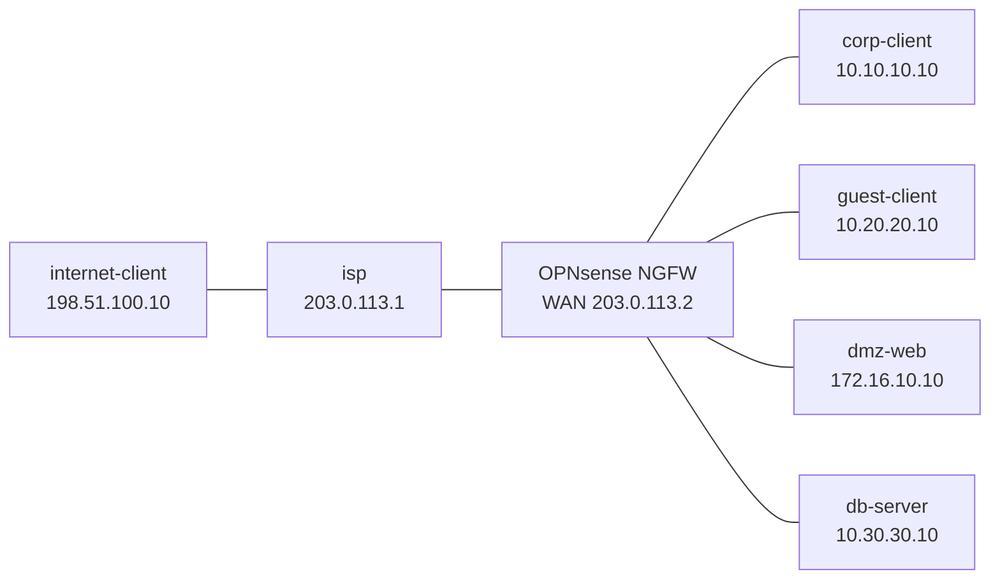

# OPNsense NGFW Basics — Capstone Lab

Build a real open-source firewall at an enterprise edge. You configure a
five-interface OPNsense VM, publish a DMZ service, separate corp and guest
traffic, apply NAT, read state and logs, then use Suricata evidence to explain
the difference between a firewall permit and an IPS decision.

> Prerequisite: create the local base image described in
> [OPNsense platform notes](../../docs/platforms/opnsense.md). The firewall
> disk is not part of this repository; every lab run uses a disposable overlay.

## Topology



| OPNsense NIC | Role | Address |
|---|---|---|
| `vtnet1` | WAN | `203.0.113.2/30` |
| `vtnet2` | CORP | `10.10.10.1/24` |
| `vtnet3` | GUEST | `10.20.20.1/24` |
| `vtnet4` | DMZ | `172.16.10.1/24` |
| `vtnet5` | DB | `10.30.30.1/24` |

`vtnet0` is the out-of-band DHCP management NIC supplied by the shared
runtime. Do not use it for the lab's data plane.

## Start

```bash
docker build -t opnsense-tools:local labs/opnsense-ngfw-basics/
sudo labs/opnsense-ngfw-basics/prepare-bridges.sh
./scripts/lab.sh deploy opnsense-ngfw-basics
sudo labs/opnsense-ngfw-basics/start-opnsense.sh
```

Open `https://127.0.0.1:8444` and log in with username `root` and password
`opnsense`, or use `labs/opnsense-ngfw-basics/console-opnsense.sh`. SSH is
available locally with `ssh -p 2201 root@127.0.0.1` and uses the same password.

From another computer, tunnel the web UI through SSH to the lab machine:

```bash
ssh -N -L 8444:127.0.0.1:8444 <lab-host-user>@<lab-host-ip>
```

Keep that session open and browse to `https://127.0.0.1:8444` on the other
computer. Stop the VM with
`sudo labs/opnsense-ngfw-basics/stop-opnsense.sh`.

## Task 1 — Assign interfaces and establish the edge

Assign the five data NICs, set the table addresses, and add the default route
through `203.0.113.1`. Verify every directly connected host reaches its local
gateway and that the firewall can resolve/reach the public-test network.

**Predict first:** with no pass rules, which data-plane flow does OPNsense
allow? Where will a rejected first packet be visible?

## Task 2 — Model policy with aliases

Create aliases for `CORP_NET`, `GUEST_NET`, `DMZ_WEB`, `DB_SERVER`,
`PUBLIC_NET`, `WEB_PORTS`, `GUEST_EGRESS`, and `TCP_3306`. Use aliases in all
later rules; do not scatter literal addresses and ports through rules.

## Task 3 — Segment the inside

Create and log these explicit policies:

1. GUEST to CORP: deny.
2. GUEST to DB: deny.
3. CORP to DMZ web: permit HTTP/HTTPS.
4. DMZ web to DB: permit TCP/3306 only.
5. GUEST to WAN: permit DNS/HTTP/HTTPS only.
6. CORP to WAN: permit required outbound traffic.

For each denied test, inspect the Live View log and show that no state was
created. For an allowed test, identify its state and rule label.

## Task 4 — NAT is not policy

Configure outbound source NAT for CORP and GUEST on WAN. Publish `dmz-web`
through the WAN address on HTTP and HTTPS with a port forward and its matching
WAN firewall rule.

Prove all of these:

```bash
./scripts/lab.sh cmd opnsense-ngfw-basics corp-client -- curl -fsS http://198.51.100.10
./scripts/lab.sh cmd opnsense-ngfw-basics guest-client -- curl -fsS http://198.51.100.10
./scripts/lab.sh cmd opnsense-ngfw-basics internet-client -- curl -fsS http://203.0.113.2
```

Then prove guest cannot reach corp or DB, and that public access to corp and
DB remains denied. Explain the distinct jobs of the NAT rule, firewall rule,
and resulting state entry.

## Task 5 — Add NGFW evidence with Suricata

Enable Suricata in IDS/alert mode on WAN or DMZ, enable a safe rule source,
and generate one documented test event. Record the firewall pass log and the
Suricata alert for the same flow. Change only the IPS policy/action, repeat the
test, and show the prevention evidence. Return the rule to its safe default
after the test.

## Verification

```bash
./scripts/lab.sh check opnsense-ngfw-basics
```

The check covers positive and negative traffic outcomes after you configure
the firewall. GUI evidence remains required: firewall log, state-table entry,
NAT translation, and Suricata alert/drop evidence.

## Challenge questions

1. Why does a port-forward need both translation and a WAN policy decision?
2. A packet is accepted by a firewall rule but dropped by IPS. Which logs and
   counters prove the exact layer that acted?
3. Why is a broad “guest to RFC1918 deny” useful but insufficient as a full
   guest-isolation policy?

## Cleanup

```bash
sudo labs/opnsense-ngfw-basics/stop-opnsense.sh
./scripts/lab.sh destroy opnsense-ngfw-basics
sudo labs/opnsense-ngfw-basics/cleanup-bridges.sh
```
