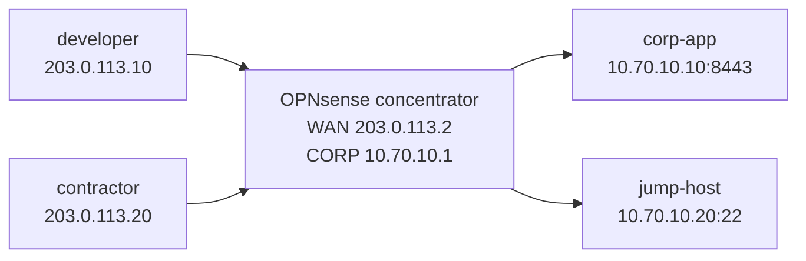

# OPNsense Remote-Access VPN Concentrator — Practice Lab

Turn an OPNsense firewall into a remote-access VPN concentrator. Two road
warriors terminate WireGuard on one firewall, receive distinct tunnel
addresses, and are authorized differently once inside the VPN.

This is a concentrator lab, not merely a tunnel lab: you must prove identity,
tunnel routing, split tunneling, firewall enforcement, logging, and selective
revocation.

> Prerequisites: [OPNsense platform notes](../../docs/platforms/opnsense.md)
> and `docker build -t wireguard-lab:local labs/wireguard/`.

## Topology



Use `10.250.0.0/24` for the WireGuard tunnel. Give the concentrator
`10.250.0.1`, developer `10.250.0.10`, and contractor `10.250.0.20`.

## Start

```bash
docker build -t wireguard-lab:local labs/wireguard/
sudo labs/opnsense-remote-access-concentrator/prepare-bridges.sh
./scripts/lab.sh deploy opnsense-remote-access-concentrator
sudo labs/opnsense-remote-access-concentrator/start-opnsense.sh
```

The concentrator GUI is `https://127.0.0.1:8644`.

## Task 1 — Make the firewall a concentrator

Assign `vtnet1` as WAN `203.0.113.2/24` and `vtnet2` as CORP
`10.70.10.1/24`. Permit UDP/51820 to the firewall on WAN. Install the
OPNsense WireGuard plugin if it is not present, then create one local instance
listening on UDP/51820 with tunnel address `10.250.0.1/24`.

Create one peer for each road warrior. Each peer must have its own key and
tunnel address; do not reuse a private key.

## Task 2 — Configure the road warriors

On developer and contractor, generate keys and create `wg0` configurations.
Each peer's endpoint is `203.0.113.2:51820`. Route only `10.70.10.0/24`
through `wg0`; leave the default route on `eth1`.

**Predict first:** which route proves this is split tunnel, and what would
change if `0.0.0.0/0` were included in `AllowedIPs`?

## Task 3 — Authorize after authentication

Assign the WireGuard interface and write labeled rules:

1. developer tunnel address to `corp-app:8443`: permit;
2. developer tunnel address to `jump-host:22`: permit;
3. contractor tunnel address to `jump-host:22`: permit;
4. contractor tunnel address to `corp-app:8443`: deny and log;
5. all VPN users to the firewall management interface: deny and log.

Test the exact service ports, then inspect the WireGuard handshake, firewall
Live View, and state table. A successful handshake does not grant access by
itself; the VPN-interface policy does.

## Task 4 — Revoke one user

Disable/remove the contractor peer on the concentrator. Prove the developer
tunnel and applications remain available while the contractor handshake and
access disappear. Explain why this is a concentrator advantage over a shared
PSK design.

## Verification

```bash
./scripts/lab.sh check opnsense-remote-access-concentrator
```

The check verifies peer interfaces and intended application access. Also save
manual evidence of split-route selection, per-peer handshakes, firewall logs,
and the isolated revocation.

## Extensions

- Rebuild the same policy with full tunneling and compare DNS, route, and log
  behavior.
- Add a third peer with no application entitlement.
- Reimplement the remote-access service as IKEv2 with individual certificates
  or EAP, then compare lifecycle and revocation to per-device WireGuard keys.

## Cleanup

```bash
sudo labs/opnsense-remote-access-concentrator/stop-opnsense.sh
./scripts/lab.sh destroy opnsense-remote-access-concentrator
sudo labs/opnsense-remote-access-concentrator/cleanup-bridges.sh
```
