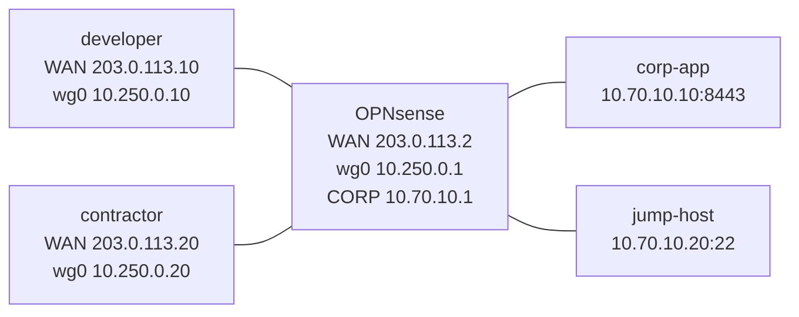

# OPNsense Remote-Access VPN Concentrator — Practice Lab

Build a native OPNsense WireGuard concentrator for two remote users. You will
separate public transport from tunnel addressing, bind distinct public keys to
inner-address ownership, enforce different post-authentication entitlements,
observe encrypted traffic, revoke one identity, and diagnose an outage whose
healthy handshake points at the wrong layer.

**Lab type:** Build

**Estimated time:** 75–100 minutes

**Prerequisites:** `wireguard`, Linux x86-64 with KVM, Docker, ContainerLab,
`iproute2`, `qemu-system-x86_64`, `qemu-img`, OpenSSH client, `sshpass`, and
GNU `timeout`, plus the tested
[OPNsense 26.1.6_2 base image](../../docs/platforms/opnsense.md)

## Platform decision

The concentrator is the critical learned firewall role, so it runs genuine
OPNsense 26.1/FreeBSD in an external QEMU/KVM VM. OPNsense 26.1.6_2 includes
native WireGuard; this lab does not install an extra plugin. `developer` and
`contractor` are intrinsic Linux WireGuard endpoints because their real keys,
cryptokey routes, handshakes, and counters are part of the mechanism being
studied. `corp-app`, `jump-host`, and both bridges are incidental service and
link roles.

Run this lab alone. The VM allocates 3 GiB in addition to host, QEMU, and
container overhead.

## Topology


```mermaid
flowchart LR
    dev["developer<br/>WAN 203.0.113.10<br/>wg0 10.250.0.10"] --- fw["OPNsense<br/>WAN 203.0.113.2<br/>wg0 10.250.0.1<br/>CORP 10.70.10.1"]
    contractor["contractor<br/>WAN 203.0.113.20<br/>wg0 10.250.0.20"] --- fw
    fw --- app["corp-app<br/>10.70.10.10:8443"]
    fw --- jump["jump-host<br/>10.70.10.20:22"]
```

| Segment | Endpoint | Address | Purpose |
|---|---|---|---|
| Public WAN | OPNsense `vtnet1` | `203.0.113.2/24` | UDP/51820 concentrator endpoint |
| Public WAN | developer `eth1` | `203.0.113.10/24` | cleartext underlay only |
| Public WAN | contractor `eth1` | `203.0.113.20/24` | cleartext underlay only |
| CORP | OPNsense `vtnet2` | `10.70.10.1/24` | protected-side gateway |
| CORP | corp-app `eth1` | `10.70.10.10/24` | TCP/8443 application |
| CORP | jump-host `eth1` | `10.70.10.20/24` | TCP/22 jump service |
| Tunnel | OPNsense `wg0` | `10.250.0.1/24` | concentrator tunnel address |
| Tunnel | developer `wg0` | `10.250.0.10/32` | developer-owned client address |
| Tunnel | contractor `wg0` | `10.250.0.20/32` | contractor-owned client address |

| Role | Platform | Responsibility |
|---|---|---|
| concentrator | OPNsense 26.1.6_2 | native WireGuard instance, peer ownership, routing, PF policy and logs |
| developer, contractor | `wireguard-lab:local` | intrinsic per-deployment identities, `wg0`, split routes and probes |
| corp-app, jump-host | `ops-lab:local` | deterministic incidental TCP responders |

The answer-free baseline pre-addresses only public clients and CORP services.
It contains no `wg0`, client key material, OPNsense data-interface assignment,
WireGuard instance, peer, or learner firewall policy.

## How to use this lab

This is a **practice lab**, not a tutorial. Each task gives you an
**objective** and **hints** — your job is to produce the configuration.

- **Predict before you configure.** When a task asks for a prediction,
  commit to an answer before touching the CLI. Being wrong and finding out
  why is the point.
- **Open the hints before the solution.** The solution toggle is the answer
  key — use it to check your work or when genuinely stuck, not as step one.
- **Verify like an operator.** After each task, prove the state is what you
  think it is with show commands before moving on.

## Deploy

Build both pinned container images once, deploy the answer-free scaffolding,
then start the VM as root:

```bash
docker build -t wireguard-lab:local labs/wireguard/
docker build -t ops-lab:local images/ops-lab/
sudo labs/opnsense-remote-access-concentrator/prepare-bridges.sh
./scripts/lab.sh deploy opnsense-remote-access-concentrator
sudo labs/opnsense-remote-access-concentrator/start-opnsense.sh
```

The start helper checks the host and base image, waits a bounded time for SSH,
and rolls back partial startup. Management listeners bind only to loopback:

| Service | Listener |
|---|---|
| HTTPS | `https://127.0.0.1:8644` |
| SSH | `127.0.0.1:2401` |
| serial telnet | `127.0.0.1:4401` |

The disposable credential is username `root`, password `opnsense`. If you are
working from another computer, reach HTTPS only through an SSH tunnel to the
lab host. Never expose these listeners on a LAN.

## Task 1 — Establish the native boundary

**Objective:** Assign OPNsense `vtnet1` as `WAN_DATA` and `vtnet2` as `CORP`,
permit only UDP/51820 plus the bounded WAN diagnostic to the firewall, and
rely on stateful return handling for protected services. Prove the public and
protected scaffolds independently before creating WireGuard state.

**Predict first:** Should a cleartext capture on developer `eth1` ever reveal
a `10.70.10.0/24` packet after the VPN is healthy? What would such a packet
prove about route or tunnel ownership?

<details markdown="1">
<summary>Hints</summary>

- Preserve the prepared `vtnet0` management interface. Assign `vtnet1` and
  `vtnet2` using the addressing table.
- On WAN, admit IPv4 UDP/51820 and ICMP only to the WAN address. Do not add a
  broad CORP ingress permit; PF state admits replies to allowed tunnel flows.
- Prove interface state, PF activation, and client-to-WAN reachability as
  separate facts.

</details>

<details markdown="1">
<summary>Solution</summary>

Create `WAN_DATA` on `vtnet1` as `203.0.113.2/24` and `CORP` on `vtnet2` as
`10.70.10.1/24`. Add the two narrowly scoped WAN interface rules described in
the hints.

After making your own attempt, the answer helper converges Tasks 1–3 with
native OPNsense models and transactional rollback:

```bash
labs/opnsense-remote-access-concentrator/solution.sh
```

</details>

<details markdown="1">
<summary>Check your work</summary>

Both data interfaces are `UP` with their documented `/24` addresses, and both
clients reach `203.0.113.2` through `eth1`. No tunnel interface or private
route is required for that probe. A later public capture should contain only
the outer UDP exchange; readable CORP traffic there would mean the split route
or encryption boundary is wrong.

</details>

## Task 2 — Bind unique identities to split routes

**Objective:** Create one native OPNsense WireGuard instance `remote_access`
on UDP/51820, enroll one distinct public key per client, and configure both
clients to route only `10.70.10.0/24` through the tunnel. Require a five-second
persistent keepalive and preserve the public endpoint route through `eth1`.

**Predict first:** If both public keys authenticate successfully but OPNsense
binds the contractor key to the wrong `/32`, will the recent-handshake field
prove that contractor application traffic can return? Why or why not?

<details markdown="1">
<summary>Hints</summary>

- Use **VPN > WireGuard > Settings**, one instance numbered `0`, and two peer
  records. The instance owns `10.250.0.1/24`; each peer owns exactly one client
  `/32` from the topology table.
- Generate a separate key pair inside each client. Keep private material only
  in a mode-700 runtime directory with mode-600 files.
- Each client peer uses endpoint `203.0.113.2:51820`, AllowedIPs
  `10.70.10.0/24`, and persistent keepalive `5`. Do not include a default
  route.

</details>

<details markdown="1">
<summary>Solution</summary>

```bash
labs/opnsense-remote-access-concentrator/solution.sh
```

The helper creates per-deployment client identities without printing private
keys. It preserves valid canonical keys on an idempotent rerun and relates the
two saved peer UUIDs to the native server in a separate model transaction.

</details>

<details markdown="1">
<summary>Check your work</summary>

OPNsense has exactly one `wg0` instance and two live peers. Its routes select
`wg0` for `10.250.0.10/32` and `.20/32`. On each client,
`ip route get 10.70.10.10` selects `wg0`, while
`ip route get 203.0.113.2` and the default route select `eth1`. Recent
handshakes and bidirectional transfer counters prove authenticated encrypted
exchange, but they do not prove application authorization.

The server does **not** assign a client address. The client config owns its
local `wg0` address; the matching OPNsense public key plus AllowedIPs binds
that identity to permitted inner-address ownership.

</details>

## Task 3 — Enforce post-authentication authorization

**Objective:** On the registered WireGuard interface, create exactly five
ordered IPv4 rules: logged management denial, two developer permits, one
contractor jump-host permit, and a logged contractor application denial.
Disable reply-to behavior on every tunnel rule and prove the complete service
matrix plus both denial logs.

**Predict first:** Which result would demonstrate authorization rather than
authentication: a recent WireGuard handshake, a positive transfer counter, or
different application outcomes for two healthy peers? Explain your choice.

<details markdown="1">
<summary>Hints</summary>

- Register native `wg0` before building MVC rules on `opt3`. Keep the exact
  order from the objective so a broad rule cannot shadow a denial.
- Block `10.250.0.0/24` to `10.70.10.1/32` first and log it. Then permit the
  developer `/32` to TCP/8443 and TCP/22, permit the contractor `/32` only to
  TCP/22, and log its TCP/8443 block.
- Test each identity against both services and management; then correlate the
  labels and counters in **Firewall > Log Files > Live View**.

</details>

<details markdown="1">
<summary>Solution</summary>

```bash
labs/opnsense-remote-access-concentrator/solution.sh
```

The helper reloads the native WireGuard template, runs the argument-bearing
WireGuard configure action, registers `wg0`, and only then saves and reloads
the five ordered PF rules.

</details>

<details markdown="1">
<summary>Check your work</summary>

Developer receives `corp-application` from TCP/8443 and `jump-host` from
TCP/22. Contractor receives only `jump-host`; application and firewall
management connections fail. Both block rules are logged and their counters
increase during denied probes. This unequal service matrix, while both peers
retain recent handshakes, proves policy is applied after key authentication.

</details>

## Task 4 — Observe encryption and revoke selectively

**Objective:** Prove that developer application traffic appears on the public
link only as bidirectional UDP/51820, then revoke and re-enroll only the
contractor. Preserve developer identity, handshake, and both entitlements
throughout.

**Predict first:** During contractor revocation, should developer's public key,
WireGuard interface, route, or PF policy need to change? Which observation
would reveal an unnecessarily broad revocation procedure?

<details markdown="1">
<summary>Hints</summary>

- Capture on developer `eth1`, bound by both time and packet count. Generate
  developer service traffic while the capture runs.
- Disable only the contractor peer on OPNsense. Compare exact live peer
  inventory and developer service behavior before and after.
- Re-enable the same identity; do not rotate either user's key for this
  exercise.

</details>

<details markdown="1">
<summary>Solution</summary>

```bash
labs/opnsense-remote-access-concentrator/capture.sh
labs/opnsense-remote-access-concentrator/revoke.sh
labs/opnsense-remote-access-concentrator/reenroll.sh
```

Each peer-lifecycle helper validates the existing canonical records and rolls
back on failure or interruption. Re-enrollment leaves the final state healthy.

</details>

<details markdown="1">
<summary>Check your work</summary>

The capture contains both public directions between developer and
`203.0.113.2:51820`, with no readable `10.250.0.0/24` or `10.70.10.0/24`
address. Revocation reduces OPNsense live inventory from two peers to the
developer only; developer services still succeed while contractor access
fails. Re-enrollment restores exactly two peers and the original service
matrix without changing the developer key.

</details>

## Task 5 — Diagnose healthy-handshake, broken-ownership symptoms

**Objective:** Arm an opaque, live WireGuard fault; preserve evidence at the
underlay, handshake, route, identity, and service layers; identify the narrow
ownership error; and repair only that saved peer field.

**Predict first:** Rank these hypotheses before the break: public underlay
failure, key mismatch, missing PF permit, client split-route error, or server
AllowedIPs ownership mismatch. Which two observations eliminate the most
hypotheses without changing state?

```bash
labs/opnsense-remote-access-concentrator/break.sh
./scripts/lab.sh cmd opnsense-remote-access-concentrator contractor -- \
  bash -c 'exec 3<>/dev/tcp/10.70.10.20/22'
SSHPASS=opnsense sshpass -e ssh -p 2401 \
  -o StrictHostKeyChecking=no -o UserKnownHostsFile=/dev/null \
  root@127.0.0.1 '/usr/bin/wg show wg0'
```

<details markdown="1">
<summary>Hints</summary>

- Compare public reachability, peer inventory, handshake age, client route
  selection, OPNsense AllowedIPs, and developer service health separately.
- A public key authenticates a peer, while AllowedIPs controls which inner
  source address that peer may own and where replies are routed.
- Do not rebuild keys, clients, instance, or PF policy. The focused repair
  refuses an answer-free or structurally noncanonical baseline.

</details>

<details markdown="1">
<summary>Solution</summary>

```bash
labs/opnsense-remote-access-concentrator/repair.sh
```

The repair changes only the contractor's incorrect saved tunnel-address
ownership back to its canonical `/32`, reloads native WireGuard, and requires
the exact checker. It does not create missing learner configuration.

</details>

<details markdown="1">
<summary>Check your work</summary>

While faulted, both public paths and developer services remain healthy. The
contractor still has a recent authenticated handshake, yet its jump-host
connection fails because OPNsense no longer associates replies with the
client's actual inner address. Repair restores that one ownership binding;
the full matrix and exact checker return to zero failures.

</details>

## Verification

```bash
labs/opnsense-remote-access-concentrator/check.sh
labs/opnsense-remote-access-concentrator/capture.sh
```

The non-solving checker correlates public keys without printing private
material. It validates exact container images and inventory, OPNsense version
and interfaces, native General/Client/Server models, deterministic UUID
relations, derived server key consistency, exact saved and live PF rule order,
scope and logging, client file modes and key continuity, tunnel addresses,
peer endpoints, AllowedIPs, keepalives, split-route selection, recent
handshakes, positive transfers, service processes, the full authorization
matrix, management denial, and logged-denial counters.

## Challenge questions

1. Design an enrollment process for 500 contractors that keeps private keys
   off the concentrator. Which inventory fields become authoritative, and how
   do you detect abandoned identities?
2. Compare per-peer WireGuard revocation with shared-PSK remote access. Which
   users and secrets are disturbed in each design after one device is stolen?
3. A user needs two noncontiguous internal prefixes but no default route.
   Design client and server AllowedIPs while preventing overlap with every
   other peer's inner ownership.
4. Design monitoring that distinguishes public endpoint loss, stale
   handshake, cryptokey-route mismatch, PF denial, and application failure
   without treating any single signal as “VPN health.”

## Troubleshooting

| Symptom | Likely cause | Focused action |
|---|---|---|
| SSH/HTTPS unavailable on loopback | VM not ready, stale process, or base mismatch | stop the exact runtime, verify the documented base and KVM, then use the bounded start helper |
| Client cannot ping `203.0.113.2` | bridge/tap, WAN assignment, address, or WAN diagnostic rule | inspect client `eth1`, host bridge membership, OPNsense `vtnet1`, and PF separately |
| No `wg0` on OPNsense | General disabled, instance invalid, or wrong native reload action | inspect saved General/Server records; use `configctl wireguard configure`, not an argumentless restart |
| One peer absent | public-key record disabled, relation missing, or duplicate key | compare exact Client objects, Server peer relation, and live `wg show wg0 peers` |
| Handshake current, one client fails | wrong server AllowedIPs/tunnel ownership, client address, or route | compare public key, actual client `wg0` address, both AllowedIPs views, and server `/32` route |
| Both peers reach every service | overly broad or misordered `opt3` rules | inspect exact PF order, source `/32`, destination/port, quick action, and reply-to setting |
| Denial works but no log appears | block rule logging disabled or wrong rule matched first | correlate rule label, ordering, Live View entry, and verbose PF counter |
| Checker rejects a working-looking tunnel | duplicate or noncanonical lab-owned objects | remove extra objects or use the transactional answer helper after your attempt |

## Security notes

WireGuard authenticates public keys; it does not supply user authorization or
address assignment. Treat client private keys as credentials, keep them in
restricted storage, rotate on compromise, and bind each public key to the
smallest nonoverlapping inner prefix. Apply management denial before service
permits, log high-value denials according to policy, and avoid exporting full
configurations or private-key-bearing diagnostic output.

This lab's root/`opnsense` credential, loopback HTTPS/SSH, and serial telnet
are disposable local training conveniences. They are not production controls.

## Cleanup and limitations

Stopping removes the disposable overlay, including learner OPNsense keys and
configuration. Destroy containers before asking the bridge cleaner to remove
bridges with attached ports:

```bash
sudo labs/opnsense-remote-access-concentrator/stop-opnsense.sh
./scripts/lab.sh destroy opnsense-remote-access-concentrator
sudo labs/opnsense-remote-access-concentrator/cleanup-bridges.sh
```

- The external base disk is not committed. Results depend on the documented
  OPNsense 26.1.6_2/amd64 baseline and a KVM-capable Linux host.
- The lab validates one concentrator, two fixed peers, split routing, static
  PF authorization, selective revocation, and one ownership failure. It does
  not validate HA, roaming across public addresses, DNS policy, MFA,
  performance, or long-duration key lifecycle.
- OPNsense's private key lives only in the disposable guest configuration;
  client private keys live only in mode-600 files inside ephemeral containers.
  Runtime state and packet metadata still make the lab host a trusted boundary.
- QEMU serial uses unencrypted telnet bound to `127.0.0.1`. Never widen the
  bind address; prefer loopback SSH/HTTPS for routine access.
