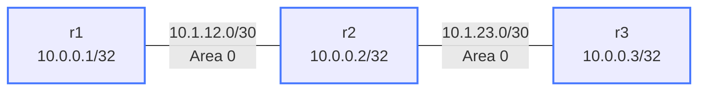

# OSPF MD5 Authentication — Practice Lab

Without authentication, any device that connects to a network segment can
speak OSPF and inject false LSAs, poisoning routing tables across the whole
domain. In this lab you bring up a three-router OSPF area, lock it down with
MD5 authentication, deliberately break a key, and perform a zero-downtime
key rollover — the procedure that matters in production.

## Topology



| Segment       | Subnet        | Addresses        |
|---------------|---------------|------------------|
| r1 -- r2      | 10.1.12.0/30  | r1=.1, r2=.2     |
| r2 -- r3      | 10.1.23.0/30  | r2=.1, r3=.2     |
| Loopbacks     | 10.0.0.1–3/32 | one per router   |

All interfaces are in OSPF area 0. IP addressing is pre-configured.

## How to use this lab

This is a **practice lab**, not a tutorial. Each task gives you an
**objective** and **hints** — your job is to produce the configuration.

- **Predict before you configure.** When a task asks for a prediction,
  commit to an answer before touching the CLI. Being wrong and finding out
  why is the point.
- **Open the hints before the solution.** The solution toggle is the answer
  key — use it to check your work or when genuinely stuck, not as step one.
- **Verify like an operator.** After each task, prove the state is what you
  think it is with `show` commands before moving on.

## Lab Setup

```bash
./scripts/lab.sh deploy ospf-auth
```

Connect to a router:

```bash
sudo ./scripts/lab.sh cli ospf-auth r1
```

---

## Task 1 — Baseline OSPF, no authentication

**Objective:** Bring up OSPF on all three routers (router-ids = loopbacks,
loopbacks passive, everything in area 0) so that r2 has two `Full` neighbors
and `ping 10.0.0.3 source 10.0.0.1` succeeds.

<details markdown="1">
<summary>Hints</summary>

- This lab's solution uses `network <prefix> area 0` statements under
  `router ospf` (the alternative is per-interface `ip ospf area`).
- Each router needs a `network` statement for its loopback and for each
  connected transit subnet.
- `show ip ospf neighbor` and `show ip route ospf` are your checks.

</details>

<details markdown="1">
<summary>Solution</summary>

On **r1**:

```text
configure terminal
router ospf
 ospf router-id 10.0.0.1
 network 10.0.0.1/32 area 0
 network 10.1.12.0/30 area 0
 passive-interface Loopback0
```

On **r2**:

```text
configure terminal
router ospf
 ospf router-id 10.0.0.2
 network 10.0.0.2/32 area 0
 network 10.1.12.0/30 area 0
 network 10.1.23.0/30 area 0
 passive-interface Loopback0
```

On **r3**:

```text
configure terminal
router ospf
 ospf router-id 10.0.0.3
 network 10.0.0.3/32 area 0
 network 10.1.23.0/30 area 0
 passive-interface Loopback0
```

</details>

<details markdown="1">
<summary>Check your work</summary>

`show ip ospf neighbor` on r2 shows both neighbors `Full`:

```text
Neighbor ID Instance VRF      Pri State        Dead Time   Address     Interface
10.0.0.1         1 default     1 Full/DR        00:00:39   10.1.12.1   Ethernet1
10.0.0.3         1 default     1 Full/BDR       00:00:37   10.1.23.2   Ethernet2
```

and `ping 10.0.0.3 source 10.0.0.1` succeeds from r1. The baseline matters:
when you add authentication next, any breakage is provably caused by auth,
not by the underlying OSPF config.

</details>

---

## Task 2 — Add MD5 authentication on every link

**Objective:** Enable MD5 authentication on all OSPF interfaces using key ID
`1`, key string `SecretKey123`, without any adjacency staying down.

**Predict first:** when you enable auth on r2's Ethernet1 *before* touching
r1, what happens to that adjacency — and roughly how quickly?

<details markdown="1">
<summary>Hints</summary>

- Two per-interface commands: one turns on `message-digest` authentication
  for the interface, the other defines `message-digest-key <id> md5 <key>`.
- The key and key **ID** must match on both ends of each link.
- r2 needs it on two interfaces; r1 and r3 on one each.
- `show ip ospf interface Ethernet1` shows auth type and active key IDs.

</details>

<details markdown="1">
<summary>Solution</summary>

On **r1** (Ethernet1), **r3** (Ethernet1), and **r2** (Ethernet1 *and*
Ethernet2):

```text
configure terminal
interface Ethernet1
 ip ospf authentication message-digest
 ip ospf message-digest-key 1 md5 SecretKey123
```

</details>

<details markdown="1">
<summary>Check your work</summary>

`show ip ospf interface Ethernet1` on r2 shows:

```text
  Authentication MD5
  Cryptographic sequence number 0
  Key ID: 1, Auth data length: 16, Auth data: 0x...
```

and `show ip ospf neighbor` is back to two `Full` neighbors.

Your prediction: the moment one side requires MD5 and the other doesn't,
hellos are rejected and the adjacency drops once the dead interval expires —
authentication type is checked before anything else in the packet. This is
why auth rollouts on live networks are sequenced link by link, fastest
config first on the far end.

</details>

---

## Task 3 — Break it: key mismatch

**Objective:** Simulate a typo'd key (or rogue router) and diagnose the
symptom from the *other* side of the link.

Apply the break on **r1**:

```text
configure terminal
interface Ethernet1
 ip ospf message-digest-key 1 md5 WrongKeyHere
```

**Predict first:** what exactly will r2 show — a neighbor in a broken state,
or no neighbor at all? Will r3 be affected?

<details markdown="1">
<summary>Diagnosis hints (try before revealing)</summary>

- Wait out the dead interval (~40 s), then `show ip ospf neighbor` on r2.
- Nothing in the neighbor table? `debug ospf packet all` on r2 (disable
  afterwards with `no debug ospf packet all`) — what does it log about
  packets arriving on Ethernet1?
- Check `show ip route ospf` on r3: which prefixes vanished?

</details>

<details markdown="1">
<summary>What you should observe</summary>

Neighbor `10.0.0.1` disappears from r2's table entirely — there is no
"auth-failed" neighbor state, because packets failing MD5 verification are
dropped before the neighbor state machine ever sees them. The only direct
evidence is in the debug log (`authentication failure` / mismatched digest).
A silent missing neighbor with both interfaces up is the classic
authentication-failure signature.

r3 keeps its adjacency (the mismatch is per-link) but loses routes to
10.0.0.1/32 and 10.1.12.0/30 — a localized auth failure still has
domain-wide reachability consequences.

**Repair:** restore `SecretKey123` on r1's Ethernet1 and watch the adjacency
return to `Full` within a hello interval or two.

</details>

---

## Task 4 — Zero-downtime key rollover

**Objective:** Replace `SecretKey123` (key ID 1) with `NewSecretKey456` (key
ID 2) on **all** links without any adjacency dropping at any point.

**Predict first:** OSPF allows multiple keys on one interface. In what order
must "add key 2" and "remove key 1" happen across the three routers so no
link is ever left without a shared key?

<details markdown="1">
<summary>Hints</summary>

- Phase 1: add the new key (`message-digest-key 2`) on *every* interface of
  *every* router, old key still in place.
- cEOS accepts packets signed with any configured key and signs with the
  highest key ID.
- Phase 2: only after the new key is everywhere, remove key 1 everywhere.
- Keep `show ip ospf neighbor` running on r2 throughout — it must never
  lose a neighbor.

</details>

<details markdown="1">
<summary>Solution</summary>

Phase 1 — on every OSPF interface of all three routers:

```text
interface Ethernet1
 ip ospf message-digest-key 2 md5 NewSecretKey456
```

Phase 2 — only after phase 1 is complete everywhere:

```text
interface Ethernet1
 no ip ospf message-digest-key 1 md5 SecretKey123
```

</details>

<details markdown="1">
<summary>Check your work</summary>

`show ip ospf interface` now lists only `Key ID: 2`, and at no point did
`show ip ospf neighbor` lose an entry. The order is the whole lesson:
**add everywhere, then remove anywhere**. If you remove key 1 on one side
while the other side doesn't yet have key 2, that link has no key in common
and drops — which answers the prediction.

</details>

---

## Verification

```text
show ip ospf neighbor                # both adjacencies Full
show ip ospf interface Ethernet1     # Authentication MD5, Key ID: 2 only
show ip route ospf                   # all loopbacks present
ping 10.0.0.3 source 10.0.0.1        # end-to-end
```

---

## Challenge questions

No answers provided — reason them through.

1. An attacker plugs into the r1–r2 segment and replays *captured* OSPF
   packets from earlier (they have valid MD5 digests). What field in the
   authenticated header defeats this, and what operational habit could
   accidentally weaken that protection?
2. There are two places to enable message-digest auth: per-interface or
   `area 0 authentication message-digest` under the OSPF process. A network
   has both configured with different intents. Which wins, and when would
   you deliberately choose area-wide auth?
3. During a rollover, a router reloads after phase 1 but its startup-config
   was saved *before* phase 1. Walk through what happens to its adjacencies
   when it comes back, and how you'd detect the situation quickly.
4. MD5 is cryptographically broken for collision resistance, yet OSPF MD5
   auth is still considered useful. What threat does it actually defend
   against here, and what would push you to HMAC-SHA (and what's the
   interop cost)?

---

## Troubleshooting Reference

| Command | What to look for |
|---------|-----------------|
| `show ip ospf neighbor` | Neighbor state (`Full` = healthy; *absent* = likely auth) |
| `show ip ospf interface Ethernet1` | Auth type, active key IDs |
| `show ip ospf database` | LSA count — should be consistent across all routers |
| `show ip route ospf` | OSPF-learned routes with `O` prefix |
| `debug ospf packet all` | Live packet events incl. auth failures (disable after use) |

To disable debug:

```text
no debug ospf packet all
```

## Reference — SHA Authentication (cEOS Extension)

cEOS also supports HMAC-SHA authentication beyond the standard:

```text
interface Ethernet1
 ip ospf authentication hmac-sha-256
 ip ospf authentication-key MySharedKey
```

SHA-256 is cryptographically stronger than MD5, but is **not interoperable**
with vendors that only implement RFC 5709 HMAC-SHA or older Cisco IOS. Use
MD5 when interoperability is required.

## Cleanup

```bash
./scripts/lab.sh destroy ospf-auth
```
