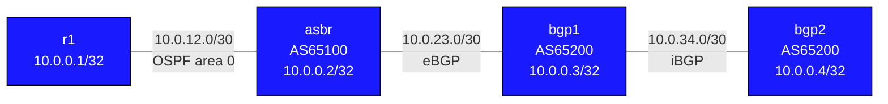

# OSPF ↔ BGP Redistribution — Practice Lab

Connect an OSPF domain to a BGP AS with mutual redistribution at a single
ASBR — the classic enterprise-edge pattern, and the source of some of the
classic enterprise-edge outages. IP addressing is pre-configured; you
implement both protocols and the redistribution, then tighten it with
route-maps the way production demands.

---

## Topology



### Link addressing

| Link          | Subnet        | Left side        | Right side       | Protocol  |
|---------------|---------------|------------------|------------------|-----------|
| r1 — asbr     | 10.0.12.0/30  | 10.0.12.1 (r1)   | 10.0.12.2 (asbr) | OSPF a0   |
| asbr — bgp1   | 10.0.23.0/30  | 10.0.23.1 (asbr) | 10.0.23.2 (bgp1) | eBGP      |
| bgp1 — bgp2   | 10.0.34.0/30  | 10.0.34.1 (bgp1) | 10.0.34.2 (bgp2) | iBGP      |

### Node reference

| Node | Loopback     | ASN   | Role                               |
|------|--------------|-------|------------------------------------|
| r1   | 10.0.0.1/32  | —     | OSPF-only router                   |
| asbr | 10.0.0.2/32  | 65100 | ASBR — redistributes OSPF ↔ BGP   |
| bgp1 | 10.0.0.3/32  | 65200 | eBGP + iBGP transit                |
| bgp2 | 10.0.0.4/32  | 65200 | BGP end-router                     |

**Goal:** `ping 10.0.0.4 source 10.0.0.1` succeeds from r1's EOS CLI, and
`ping 10.0.0.1 source 10.0.0.4` succeeds from bgp2's EOS CLI.

---

## How to use this lab

This is a **practice lab**, not a tutorial. Each task gives you an
**objective** and **hints** — your job is to produce the configuration.

- **Predict before you configure.** When a task asks for a prediction,
  commit to an answer before touching the CLI. Being wrong and finding out
  why is the point.
- **Open the hints before the solution.** The solution toggle is the answer
  key — use it to check your work or when genuinely stuck, not as step one.
- **Verify like an operator.** After each task, prove the state is what you
  think it is with `show` commands before moving on.

## Deploy and access

```bash
# Deploy the lab
sudo containerlab deploy --topo topology.clab.yml

# Open the EOS CLI on any node
docker exec -it clab-ospf-bgp-redist-asbr Cli
```

---

## Task 1 — OSPF island

**Objective:** Run OSPF area 0 between r1 and asbr, loopbacks advertised
and passive. Success: `Full` adjacency and asbr can ping 10.0.0.1.

<details>
<summary>Hints</summary>

- `router ospf 1` + `network ... area 0.0.0.0` statements on both nodes.
- `passive-interface Loopback0` keeps the loopback advertised without
  sending hellos on it.

</details>

<details>
<summary>Solution</summary>

r1:
```text
configure
router ospf 1
 router-id 10.0.0.1
 passive-interface Loopback0
 network 10.0.0.1/32 area 0.0.0.0
 network 10.0.12.0/30 area 0.0.0.0
```

asbr:
```text
configure
router ospf 1
 router-id 10.0.0.2
 passive-interface Loopback0
 network 10.0.0.2/32 area 0.0.0.0
 network 10.0.12.0/30 area 0.0.0.0
```

</details>

<details>
<summary>Check your work</summary>

`show ip ospf neighbor` on asbr shows r1 in `Full`. r1 knows nothing east
of asbr's loopback — the OSPF world currently ends at the ASBR, which is
the point: each protocol island must work on its own before you bridge
them, or you'll be debugging two problems through one symptom later.

</details>

---

## Task 2 — BGP island

**Objective:** Build the BGP side: eBGP between asbr (AS 65100) and bgp1
(AS 65200), iBGP between bgp1 and bgp2. Both sessions `Established`.

**Predict first:** bgp1 will pass eBGP-learned prefixes to bgp2 over iBGP.
What attribute of those prefixes will make them unusable on bgp2 unless
you add one command on bgp1 — and why does eBGP not have this problem?

<details>
<summary>Hints</summary>

- EOS: neighbors defined under `router bgp`, then `activate` under
  `address-family ipv4`.
- The iBGP fix is a per-neighbor command on bgp1 toward bgp2.
- EOS does not require eBGP policy config for routes to flow (unlike FRR).

</details>

<details>
<summary>Solution</summary>

asbr:
```text
configure
router bgp 65100
 bgp router-id 10.0.0.2
 neighbor 10.0.23.2 remote-as 65200
 address-family ipv4
  neighbor 10.0.23.2 activate
```

bgp1:
```text
configure
router bgp 65200
 bgp router-id 10.0.0.3
 neighbor 10.0.23.1 remote-as 65100
 neighbor 10.0.34.2 remote-as 65200
 address-family ipv4
  neighbor 10.0.23.1 activate
  neighbor 10.0.34.2 activate
  neighbor 10.0.34.2 next-hop-self
```

bgp2:
```text
configure
router bgp 65200
 bgp router-id 10.0.0.4
 neighbor 10.0.34.1 remote-as 65200
 address-family ipv4
  neighbor 10.0.34.1 activate
```

</details>

<details>
<summary>Check your work</summary>

`show bgp ipv4 unicast summary` shows `Established` on asbr and bgp1
(twice). Prediction answer: iBGP preserves the **next-hop** unchanged, so
bgp2 would see prefixes with next-hop 10.0.23.1 — an address bgp2 has no
route to — and mark them inaccessible. `next-hop-self` on bgp1 rewrites it.
eBGP doesn't suffer this because the next-hop is rewritten to the peering
address at each eBGP hop by default.

</details>

---

## Task 3 — Redistribute OSPF into BGP

**Objective:** On asbr, inject the OSPF-learned prefixes into BGP so bgp2
can see r1's loopback.

**Predict first:** after `redistribute ospf`, list exactly which prefixes
you expect to appear in bgp2's BGP table, and what bgp2 will show as their
next-hop.

<details>
<summary>Hints</summary>

- The command goes under `address-family ipv4` of the **BGP** process on
  asbr.
- Check on bgp2 with `show bgp ipv4 unicast`.

</details>

<details>
<summary>Solution</summary>

asbr:
```text
configure
router bgp 65100
 address-family ipv4
  redistribute ospf
```

</details>

<details>
<summary>Check your work</summary>

bgp2's table gains 10.0.0.1/32 (r1's loopback, OSPF-learned) and
10.0.0.2/32 — with next-hop 10.0.34.1 (bgp1), thanks to Task 2's
`next-hop-self`. Note what did *not* happen: r1 still cannot reach
anything — redistribution here is one-directional, and pings from r1
would die for want of a *return* path. Half-done mutual redistribution
looks exactly like this: routes visible on one side, traffic dead both
ways.

</details>

---

## Task 4 — Redistribute BGP into OSPF, close the loop

**Objective:** Complete the other direction so the end-to-end pings in the
Goal succeed.

**Predict first:** what route code and LSA type will the BGP prefixes
carry inside the OSPF domain, and will their metric grow as they cross it?

<details>
<summary>Hints</summary>

- This one goes under the **OSPF** process on asbr.
- Check r1 with `show ip route ospf` and
  `show ip ospf database external`.

</details>

<details>
<summary>Solution</summary>

asbr:
```text
configure
router ospf 1
 redistribute bgp
```

</details>

<details>
<summary>Check your work</summary>

r1 shows `O E2 10.0.0.3/32` and `O E2 10.0.0.4/32` — Type-5 external
LSAs, E2 metric (fixed at the ASBR, non-accumulating). Both goal pings now
succeed. You've built the full chain: OSPF → (asbr) → eBGP → (next-hop
rewritten at bgp1) → iBGP, and back. Every prefix crossing the boundary
changed protocol, metric semantics, and trust domain at asbr — which is
why the next task exists.

</details>

---

## Task 5 — Control the boundary with a route-map

**Objective:** Production never runs naked `redistribute`. Replace the
OSPF→BGP redistribution with a route-map that (a) blocks the transit
subnet 10.0.12.0/30 from entering BGP and (b) tags everything else with
community `65100:100`.

<details>
<summary>Hints</summary>

- Build a `ip prefix-list` with a deny for the transit /30 and a
  `permit 0.0.0.0/0 le 32` catch-all.
- One `route-map` statement can both `match ip address prefix-list ...`
  and `set community ...`.
- Re-apply as `redistribute ospf route-map <name>`; verify on bgp1 with
  `show bgp ipv4 unicast 10.0.0.1/32` (communities show in detail view).

</details>

<details>
<summary>Solution</summary>

asbr:
```text
configure
ip prefix-list NO-TRANSIT seq 5 deny 10.0.12.0/30
ip prefix-list NO-TRANSIT seq 10 permit 0.0.0.0/0 le 32
route-map OSPF-TO-BGP permit 10
 match ip address prefix-list NO-TRANSIT
 set community 65100:100
!
router bgp 65100
 address-family ipv4
  redistribute ospf route-map OSPF-TO-BGP
```

</details>

<details>
<summary>Check your work</summary>

On bgp1: 10.0.12.0/30 is gone from the BGP table, and the surviving
redistributed prefixes carry community 65100:100. The deny-then-permit
prefix-list shape is the standard idiom; the community tag is what lets
AS 65200 recognize "these came from redistribution at asbr" and write
policy against them later — provenance marking at the protocol boundary.

</details>

---

## Verification

```text
! On asbr — confirm both protocols have neighbours
show ip ospf neighbor
show bgp ipv4 unicast summary

! On asbr — see what is being redistributed
show bgp ipv4 unicast          ! BGP table (should include OSPF prefixes)
show ip route ospf             ! OSPF routes (should include BGP prefixes)

! On bgp2 — confirm OSPF prefixes arrived via BGP
show bgp ipv4 unicast
show ip route

! End-to-end ping
ping 10.0.0.4 source 10.0.0.1   ! on r1
ping 10.0.0.1 source 10.0.0.4   ! on bgp2
```

---

## Challenge questions

No answers provided — reason them through.

1. A second ASBR is added between the same OSPF domain and AS 65200 and
   both ASBRs run mutual redistribution. Describe, step by step, how a
   single prefix could loop OSPF → BGP → OSPF → BGP, and name two
   independent mechanisms (one tag-based, one metric/AD-based) that
   prevent it.
2. Someone replaces `redistribute ospf` with `network` statements for
   each prefix on asbr. What changes about the BGP attributes (origin,
   stability under OSPF flaps), and when is each approach right?
3. r1 suddenly can't reach bgp2, but bgp2 *can* see 10.0.0.1/32 in its
   BGP table. Give an ordered, three-step diagnosis path that pins the
   failure to either the OSPF→BGP direction, the BGP→OSPF direction, or
   the iBGP next-hop — using one command per step.
4. The transit subnet filter in Task 5 only guards one direction. What's
   the equivalent risk in the BGP→OSPF direction if AS 65200 one day
   sends you a full internet table, and which single safety knob would
   you insist on before enabling `redistribute bgp` in production OSPF?

---

## Troubleshooting

**OSPF neighbours not forming**
- `show ip ospf interface Ethernet1` — confirm OSPF is enabled and area matches
- `show ip ospf neighbor` — check state; Init means hellos arriving but not bidirectional

**BGP session stuck in Active**
- `show bgp ipv4 unicast summary` — Active means TCP not established
- Confirm the peer IP and remote-as are correct on both sides
- `ping 10.0.23.2` from asbr to confirm L3 reachability

**Prefixes not appearing after redistribution**
- `show bgp ipv4 unicast` on asbr — if no OSPF prefixes, check `redistribute ospf` is under `address-family ipv4`
- `show ip route bgp` on r1 — if empty, check `redistribute bgp` is in the OSPF process
- `show ip ospf database external` on r1 — Type-5 LSAs from asbr should appear

**bgp2 has routes but next-hop is unreachable**
- This is the `next-hop-self` issue — add `neighbor 10.0.34.2 next-hop-self` on bgp1
- Without it, bgp2 tries to reach 10.0.23.1 (asbr) which is not in bgp2's routing table

**Routes show in table but ping fails**
- Check return path: does bgp2 have a route back to 10.0.0.1?
- Verify `redistribute bgp` is configured in OSPF on asbr
- Use `traceroute` to isolate where packets are dropped
