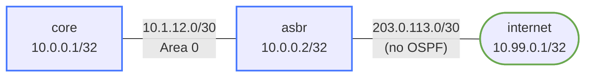

# OSPF Default Route Injection — Practice Lab

How does every router in a network learn the way to the internet without
each one carrying a static default? The edge router (ASBR) injects a default
into OSPF with `default-information originate`. In this lab you build that
edge, watch the default appear and disappear with the upstream, weigh the
`always` keyword's black-hole risk, and finish with a route-map–conditioned
default — the production pattern.

## Topology



| Segment           | Subnet          | Addresses            | OSPF? |
|-------------------|-----------------|----------------------|-------|
| core -- asbr      | 10.1.12.0/30    | core=.1, asbr=.2     | Yes, area 0 |
| asbr -- internet  | 203.0.113.0/30  | asbr=.1, internet=.2 | No    |
| core loopback     | 10.0.0.1/32     |                      | Yes   |
| asbr loopback     | 10.0.0.2/32     |                      | Yes   |
| internet loopback | 10.99.0.1/32    |                      | No    |

The key constraint: **internet is not running OSPF**. It has no idea about
the internal network. The asbr is the boundary between the two worlds.

## How to use this lab

This is a **practice lab**, not a tutorial. Each task gives you an
**objective** and **hints** — your job is to produce the configuration.

- **Predict before you configure.** When a task asks for a prediction,
  commit to an answer before touching the CLI. Being wrong and finding out
  why is the point.
- **Open the hints before the solution.** The solution toggle is the answer
  key — use it to check your work or when genuinely stuck, not as step one.
- **Verify like an operator.** After each task, prove the state is what you
  think it is with `show` commands before moving on.

## Lab Setup

```bash
./scripts/lab.sh deploy ospf-default-route
```

Connect to a router:
```bash
sudo ./scripts/lab.sh cli ospf-default-route asbr
```

---

## Task 1 — OSPF inside, nothing outside

**Objective:** Bring up OSPF between core and asbr (loopbacks + transit link
in area 0, loopbacks passive). asbr's Ethernet2 toward internet must stay
**out** of OSPF. Success: adjacency `Full`, and core has routes to asbr's
loopback — but no default.

<details markdown="1">
<summary>Hints</summary>

- `network <prefix> area 0` statements under `router ospf`; simply don't
  write one for 203.0.113.0/30.
- Confirm the external interface is excluded: `show ip ospf interface`
  should not list Ethernet2.

</details>

<details markdown="1">
<summary>Solution</summary>

On **core**:
```text
configure terminal
router ospf
 ospf router-id 10.0.0.1
 network 10.0.0.1/32 area 0
 network 10.1.12.0/30 area 0
 passive-interface Loopback0
```

On **asbr** (Ethernet2 deliberately absent):
```text
configure terminal
router ospf
 ospf router-id 10.0.0.2
 network 10.0.0.2/32 area 0
 network 10.1.12.0/30 area 0
 passive-interface Loopback0
```

</details>

<details markdown="1">
<summary>Check your work</summary>

`show ip ospf neighbor` on asbr shows core in `Full`. On core,
`show ip route` has OSPF routes for 10.0.0.2/32 — and **no `0.0.0.0/0`
entry at all**. core currently has no way to reach anything outside
10.x: that's the problem the rest of the lab solves, one mechanism at a
time.

</details>

---

## Task 2 — Give asbr a default, and prove it doesn't propagate

**Objective:** Add a static default route on asbr via the internet router,
then check core.

**Predict first:** after the static is in asbr's table, will core's routing
table change at all? Why or why not?

<details markdown="1">
<summary>Hints</summary>

- `ip route 0.0.0.0/0 <next-hop>` on asbr.
- Then `show ip route` on **both** routers.

</details>

<details markdown="1">
<summary>Solution</summary>

On **asbr**:
```text
configure terminal
ip route 0.0.0.0/0 203.0.113.2
```

</details>

<details markdown="1">
<summary>Check your work</summary>

asbr shows `S 0.0.0.0/0 [1/0] via 203.0.113.2` — and core shows nothing
new. A static route is local: OSPF does not advertise anything from the
routing table unless told to. The gap between "the edge knows the way out"
and "the domain knows the way out" is exactly what
`default-information originate` bridges.

</details>

---

## Task 3 — Originate the default into OSPF

**Objective:** Make asbr advertise the default into OSPF, and verify it on
core both in the routing table and in the LSDB.

**Predict first:** what LSA type will carry `0.0.0.0/0`, and what route code
will core display for it?

<details markdown="1">
<summary>Hints</summary>

- One command under `router ospf` on asbr.
- Check `show ip route` on core and `show ip ospf database external`.

</details>

<details markdown="1">
<summary>Solution</summary>

On **asbr**:
```text
configure terminal
router ospf
 default-information originate
```

</details>

<details markdown="1">
<summary>Check your work</summary>

core now shows:

```text
O E2   0.0.0.0/0 [110/1] via 10.1.12.2, Ethernet1
```

A **Type-5 External LSA** for 0.0.0.0/0 (visible in
`show ip ospf database external`), displayed as `O E2`. Two things to
register: the LSA only exists because asbr *actually has* a default in its
table (the static from Task 2 — origination is conditional by default),
and it's E2, so the ASBR's cost is the only cost any router sees. For a
default route that's the right behavior: everyone just forwards to the
nearest ASBR.

</details>

---

## Task 4 — Break it: lose the upstream

**Objective:** Remove the static default on asbr
(`no ip route 0.0.0.0/0 203.0.113.2`) and observe from core.

**Predict first:** does core's `O E2 0.0.0.0/0` survive? If it disappears,
what *withdrew* it — a timer, an LSA flush, or the adjacency dropping?

<details markdown="1">
<summary>What you should observe</summary>

Within seconds to ~40 s, core's default vanishes. The adjacency never
dropped — asbr flushed its own Type-5 LSA (max-aged it) the moment its
local default disappeared, because conditional origination keeps checking
the FIB. This self-withdrawing behavior is the feature: when the edge
loses the internet, the domain *finds out* instead of black-holing traffic
at the edge.

Restore the static default before continuing:
`ip route 0.0.0.0/0 203.0.113.2`.

</details>

---

## Task 5 — The `always` keyword, and why it's dangerous

**Objective:** Reconfigure origination with the `always` keyword, repeat
Task 4's break, and observe the difference from core's point of view —
then explain where a packet from core to 8.8.8.8 dies.

<details markdown="1">
<summary>Hints</summary>

- `default-information originate always` on asbr.
- Remove the static again; check core; then trace the path of an
  internet-bound packet hop by hop in your head.

</details>

<details markdown="1">
<summary>Check your work</summary>

With `always`, core **keeps** `O E2 0.0.0.0/0` even though asbr has no
default of its own. Traffic from core follows the advertised default to
asbr and is dropped *there*, silently — asbr has no route for the
destination. That's a black-hole default: the failure moved from "visible
at core" to "invisible inside asbr," which is strictly worse.

`always` is legitimate when the ASBR's own default comes and goes for
reasons OSPF shouldn't care about, or when a route-map supplies smarter
conditioning — which is the next task. Restore the static default and
return to plain `default-information originate` before moving on.

</details>

---

## Task 6 — Conditional default with a route-map

**Objective:** Advertise the default only while the internet link is
actually up, using the presence of the connected route `203.0.113.0/30` as
the health signal. Then prove it by failing the link from the container
shell.

<details markdown="1">
<summary>Hints</summary>

- Three pieces on asbr: a `ip prefix-list` matching 203.0.113.0/30, a
  `route-map` that matches that prefix-list, and
  `default-information originate always route-map <name>`.
- `always` + route-map is the intended combination: the route-map, not the
  FIB-default check, decides.
- Fail the link from the host shell:
  `sudo ./scripts/lab.sh cmd ospf-default-route asbr -- ip link set eth2 down`.

</details>

<details markdown="1">
<summary>Solution</summary>

On **asbr**:
```text
configure terminal
ip prefix-list INTERNET-UP seq 5 permit 203.0.113.0/30
route-map CHECK-INTERNET permit 10
 match ip address prefix-list INTERNET-UP
!
router ospf
 default-information originate always route-map CHECK-INTERNET
```

Test:
```bash
sudo ./scripts/lab.sh cmd ospf-default-route asbr -- ip link set eth2 down
# watch core's table, then:
sudo ./scripts/lab.sh cmd ospf-default-route asbr -- ip link set eth2 up
```

</details>

<details markdown="1">
<summary>Check your work</summary>

Link down → the connected route 203.0.113.0/30 leaves asbr's table → the
route-map stops matching → the Type-5 default is withdrawn and core loses
`O E2 0.0.0.0/0`. Link up → it returns, no operator action. The condition
now tracks the thing you actually care about ("is my internet-facing link
healthy") instead of a static route that would never disappear on its own.
In production the tracked prefix is often a far-end /32 learned from the
provider, which also catches "link up but provider dead."

</details>

---

## End-to-End Reachability Test

internet needs a return route before core can ping it:

<details markdown="1">
<summary>Configuration (on internet)</summary>

```text
configure terminal
ip route 10.0.0.0/8 203.0.113.1
```

</details>

Then from **core**:
```text
ping 10.99.0.1 source 10.0.0.1
```

Forward path: core → asbr (OSPF default) → internet (static).
Return: internet → asbr (static 10.0.0.0/8) → core (OSPF).

---

## Verification

```text
show ip route                      # core: O E2 0.0.0.0/0 via 10.1.12.2
show ip route static               # asbr: S 0.0.0.0/0
show ip ospf database external     # Type-5 for 0.0.0.0/0, advertiser 10.0.0.2
show ip ospf neighbor              # Full
ping 10.99.0.1 source 10.0.0.1     # end-to-end through the default
```

---

## Challenge questions

No answers provided — reason them through.

1. A second ASBR is added with its own upstream, both originating defaults.
   With E2 metrics, how does core choose between them — and what two
   different knobs could you use to make one ASBR primary? Why is E1 worth
   considering only in this two-exit design?
2. Someone configures `default-information originate always` (no
   route-map) on both ASBRs "for redundancy." Describe the failure mode
   when one ASBR's upstream dies. What would users experience, and which
   show command on which router exposes it fastest?
3. The route-map in Task 6 tracks the *connected* subnet of the internet
   link. Give a realistic failure where that condition stays true but the
   internet is unreachable, and propose a better prefix to track.
4. Why does the injected default have to be a Type-5 external LSA rather
   than a Type-3 summary — and what does that imply about advertising a
   default into a stub area (which forbids Type-5)?

---

## Reference — `default-information originate` modes

| Mode | When default is advertised | Risk |
|------|---------------------------|------|
| `default-information originate` | Only when 0.0.0.0/0 exists in FIB | Safe — conditional on actual reachability |
| `default-information originate always` | Always, regardless of FIB | Black-hole if upstream is down |
| `... always route-map MAP` | Only when route-map match succeeds | Best of both: explicit, tunable condition |

## Reference — Why E2 for the default?

The injected default is an **E2 external**: the ASBR's cost is the only
cost, never accumulating across the domain — so every router just heads
for its nearest/only ASBR, which is right for internet egress. E1 (cost
accumulates) only matters with multiple ASBRs where "closest exit" should
win. (`ip default-network` is a legacy classful Cisco feature, not
available in cEOS — `default-information originate` is the modern answer.)

## Troubleshooting Reference

| Command | What to look for |
|---------|-----------------|
| `show ip route` | `O E2 0.0.0.0/0` on core — the OSPF default |
| `show ip route static` | `S 0.0.0.0/0` on asbr — prerequisite for origination |
| `show ip ospf database external` | Type-5 LSA for 0.0.0.0/0 originated by asbr |
| `show ip ospf neighbor` | Adjacency state between core and asbr |
| `show running-config` | Verify `default-information originate` is present |

## Cleanup

```bash
./scripts/lab.sh destroy ospf-default-route
```
