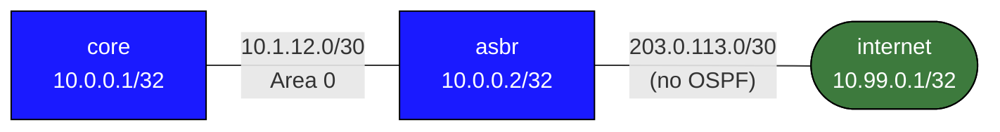

# Lab: OSPF Default Route Injection

## Overview

This lab teaches how to inject a default route into an OSPF domain using
`default-information originate`. This is the standard way a network's edge
router (ASBR) advertises internet reachability to internal OSPF routers.

Without this, every internal router needs its own static default route or a
separate BGP session to learn internet reachability. With
`default-information originate`, the ASBR handles it centrally — one
configuration point distributes default reachability to the entire domain.

## Topology



| Segment           | Subnet          | Addresses            | OSPF? |
|-------------------|-----------------|----------------------|-------|
| core -- asbr      | 10.1.12.0/30    | core=.1, asbr=.2     | Yes, area 0 |
| asbr -- internet  | 203.0.113.0/30  | asbr=.1, internet=.2 | No    |
| core loopback     | 10.0.0.1/32     |                      | Yes   |
| asbr loopback     | 10.0.0.2/32     |                      | Yes   |
| internet loopback | 10.99.0.1/32    |                      | No    |

The key constraint: **internet is not running OSPF**. It has no idea about
the internal network. The asbr is the boundary between the two worlds.

## Lab Setup

```bash
sudo containerlab deploy -t topology.clab.yml
```

Connect to a router:
```bash
sudo docker exec -it clab-ospf-default-route-asbr Cli
```

## Step 1 — Configure Basic OSPF on core and asbr

Configure OSPF on the two internal routers. Do **not** include the external
interface (asbr's Ethernet2 toward internet) in OSPF.

On **core**:
```
configure terminal
router ospf
 ospf router-id 10.0.0.1
 network 10.0.0.1/32 area 0
 network 10.1.12.0/30 area 0
 passive-interface Loopback0
```

On **asbr** (Ethernet2 is external — NOT in OSPF):
```
configure terminal
router ospf
 ospf router-id 10.0.0.2
 network 10.0.0.2/32 area 0
 network 10.1.12.0/30 area 0
 passive-interface Loopback0
```

Verify adjacency:
```
asbr# show ip ospf neighbor
```

At this point, core has OSPF routes to asbr's loopback and the shared segment,
but no default route:
```
core# show ip route
```

There is no `0.0.0.0/0` entry. core has no way to reach the internet.

## Step 2 — Add a Static Default Route on asbr

The asbr needs to know how to reach the internet. Add a static default pointing
to the internet router's address:

```
asbr# configure terminal
asbr(config)# ip route 0.0.0.0/0 203.0.113.2
```

Verify:
```
asbr# show ip route
```

You should see:
```
S      0.0.0.0/0 [1/0] via 203.0.113.2, Ethernet2
```

core still has no default route — the static route on asbr is local to asbr.

## Step 3 — Inject the Default Route Into OSPF

Now configure asbr to originate a default route into OSPF:

```
asbr# configure terminal
asbr(config)# router ospf
asbr(config-router)# default-information originate
```

This generates a **Type-5 External LSA for 0.0.0.0/0** only if a default route
exists in asbr's routing table (the static route from Step 2 satisfies this).

Verify from **core**:
```
core# show ip route
```

You should now see:
```
O E2   0.0.0.0/0 [110/1] via 10.1.12.2, Ethernet1
```

The `O E2` notation means:
- `O` = learned via OSPF
- `E2` = external type 2 (cost does not accumulate, explained below)

Also verify the Type-5 LSA directly:
```
core# show ip ospf database external
```

## Step 4 — Experiment: Remove the Static Default

See what happens when the upstream path disappears:

```
asbr# configure terminal
asbr(config)# no ip route 0.0.0.0/0 203.0.113.2
```

Within 40 seconds (OSPF dead interval), asbr withdraws the Type-5 LSA for
0.0.0.0/0 because it no longer has a default route to originate.

Check on **core**:
```
core# show ip route
```

The `O E2 0.0.0.0/0` entry is gone. core can no longer reach the internet.

Restore the static default:
```
asbr(config)# ip route 0.0.0.0/0 203.0.113.2
```

## Step 5 — The `always` Keyword

The `always` keyword forces asbr to advertise the default route regardless of
whether a default route exists in its own routing table:

```
asbr# configure terminal
asbr(config)# router ospf
asbr(config-router)# default-information originate always
```

Now even if you run `no ip route 0.0.0.0/0 203.0.113.2`, core will still see
the `O E2 0.0.0.0/0` route. However, traffic following that default will be
**black-holed** at asbr (it has no idea where to send it).

### When is `always` appropriate?

- When asbr learns its default via BGP or another protocol that operates
  independently of OSPF. cEOS has the default in its table, but it came from
  BGP — `default-information originate` (without `always`) will still work
  because it checks the FIB, not specifically static routes.
- When you want to use OSPF to distribute reachability during lab testing
  without worrying about whether a real upstream exists.
- When a route-map condition (Step 6) handles the "is internet reachable"
  logic more precisely than relying on a static route.

**Caution:** In production, `always` without a route-map can cause a black-hole
default that attracts all internet-destined traffic and drops it silently.

Restore to conditional mode:
```
asbr(config-router)# default-information originate
```
(Removing `always` — issue the command without it to override.)

## Step 6 — Conditional Default With a Route-Map

A more robust approach: only inject the default when a specific prefix confirms
internet connectivity is actually working. We use the presence of the
203.0.113.0/30 connected route as a proxy for "internet link is up."

On **asbr**:

**Step 6a — Create a prefix-list matching the internet-facing subnet:**
```
asbr# configure terminal
asbr(config)# ip prefix-list INTERNET-UP seq 5 permit 203.0.113.0/30
```

**Step 6b — Create a route-map that matches it:**
```
asbr(config)# route-map CHECK-INTERNET permit 10
asbr(config-route-map)# match ip address prefix-list INTERNET-UP
```

**Step 6c — Apply to default-information originate:**
```
asbr(config)# router ospf
asbr(config-router)# default-information originate always route-map CHECK-INTERNET
```

Now the default is only injected when 203.0.113.0/30 appears in the routing
table. This prefix is the connected route on Ethernet2 — it exists when the link is
up and disappears when the link goes down.

**Test the condition:**

Simulate the internet link going down:
```bash
# From the lab host shell (not Cli):
sudo docker exec clab-ospf-default-route-asbr ip link set eth2 down
```

Watch core's routing table:
```
core# show ip route
```

Within the OSPF dead interval, the `O E2 0.0.0.0/0` disappears because the
route-map condition (203.0.113.0/30 present) is no longer satisfied.

Bring the link back up:
```bash
sudo docker exec clab-ospf-default-route-asbr ip link set eth2 up
```

The default returns automatically when the connected route reappears.

## End-to-End Reachability Test

To verify full connectivity (core to internet), internet needs a return route:

On **internet**:
```
configure terminal
ip route 10.0.0.0/8 203.0.113.1
```

Now from **core**:
```
core# ping 10.99.0.1 source 10.0.0.1
```

Traffic path: core -> asbr (via OSPF default) -> internet (via static).
Return: internet -> asbr (via static 10.0.0.0/8) -> core (via OSPF).

## `default-information originate` vs `always` Summary

| Mode | When default is advertised | Risk |
|------|---------------------------|------|
| `default-information originate` | Only when 0.0.0.0/0 exists in FIB | Safe — conditional on actual reachability |
| `default-information originate always` | Always, regardless of FIB | Can create black-hole if internet is down |
| `... always route-map MAP` | Only when route-map match succeeds | Best of both: always syntax, conditional logic |

## Why E2 (External Type 2) for the Default Route?

The default route injected by `default-information originate` is always an
**E2 external route**. The cost assigned at the ASBR is the only cost any
router sees — it does not accumulate as the route crosses OSPF routers.

This is intentional for a default route: all internal routers should forward
to the nearest (or only) ASBR. If the cost accumulated, routers close to the
ASBR might prefer it less than routers further away, which is the wrong behavior
for internet egress.

Compare with E1: the metric increases by the intra-domain OSPF cost to reach
the ASBR. Useful when there are multiple ASBRs redistributing the same prefix
and you want routers to prefer the topologically closest exit point.

For the default route specifically, E2 is almost always correct.

## Contrast With `ip default-network`

`ip default-network` is a legacy Cisco feature that marks a classful network
as a candidate default route. It is not OSPF-specific and is not available in
cEOS. Always use `default-information originate` for OSPF-distributed defaults.
In modern networks, the correct approach is always:
1. Static default on the edge router
2. `default-information originate` to distribute it
3. Optionally with a route-map for conditional injection

## Troubleshooting Reference

| Command | What to look for |
|---------|-----------------|
| `show ip route` | `O E2 0.0.0.0/0` on core — the OSPF default |
| `show ip route static` | `S 0.0.0.0/0` on asbr — prerequisite for origination |
| `show ip ospf database external` | Type-5 LSA for 0.0.0.0/0 originated by asbr |
| `show ip ospf neighbor` | Adjacency state between core and asbr |
| `show running-config` | Verify `default-information originate` is present |

## Cleanup

```bash
sudo containerlab destroy -t topology.clab.yml
```
