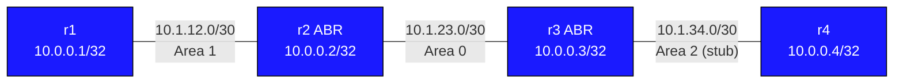

# OSPF Multi-Area — Practice Lab

Build a working multi-area OSPF network from scratch. IP addressing is
pre-configured on every node. You design and implement the OSPF process,
area assignments, and stub-area configuration yourself.

---

## Topology



### Link addressing

| Link      | Subnet        | Left side       | Right side      | OSPF Area |
|-----------|---------------|-----------------|-----------------|-----------|
| r1 — r2   | 10.1.12.0/30  | 10.1.12.1 (r1)  | 10.1.12.2 (r2)  | Area 1    |
| r2 — r3   | 10.1.23.0/30  | 10.1.23.1 (r2)  | 10.1.23.2 (r3)  | Area 0    |
| r3 — r4   | 10.1.34.0/30  | 10.1.34.1 (r3)  | 10.1.34.2 (r4)  | Area 2    |

### Node reference

| Node | Loopback     | Role                     | Areas         |
|------|--------------|--------------------------|---------------|
| r1   | 10.0.0.1/32  | Regular router           | Area 1        |
| r2   | 10.0.0.2/32  | ABR                      | Area 0 + 1    |
| r3   | 10.0.0.3/32  | ABR                      | Area 0 + 2    |
| r4   | 10.0.0.4/32  | Stub area router         | Area 2 (stub) |

**Goal:** full-state adjacencies on every link, every loopback reachable from
every router, and Area 2 running as a stub area with a default route on r4.

---

## How to use this lab

This is a **practice lab**, not a tutorial. Each task gives you an
**objective** and **hints** — your job is to produce the configuration.

- **Predict before you configure.** When a task asks for a prediction,
  commit to an answer before touching the CLI. Being wrong and finding out
  why is the point.
- **Open the hints before the solution.** The solution toggle is the answer
  key — use it to check your work or when genuinely stuck, not as step one.
- **Verify like an operator.** After each task, prove the state is what you
  think it is with `show` commands before moving on.

---

## Deploy and access

```bash
# Deploy the lab (run from this directory)
./scripts/lab.sh deploy ospf-multiarea

# List nodes and their management IPs
../../scripts/lab.sh list ospf-multiarea

# Open the cEOS CLI on any node
../../scripts/lab.sh Cli ospf-multiarea r1

# Open a Linux shell (for ip/ping commands)
../../scripts/lab.sh bash ospf-multiarea r1
```

Inside Cli, use `?` after any keyword for context-sensitive help,
and `do show ...` to run show commands from config mode.

---

## Task 1 — Bring up OSPF with the correct area boundaries

**Objective:** Enable OSPF on all four routers so that every link runs in the
area shown in the topology table, every loopback is advertised, and all three
adjacencies reach `Full`. Use each router's loopback as its router-id, and
make loopbacks passive.

**Predict first:** r2 sits in Area 0 and Area 1. Before configuring, decide:
which area does each of r2's *three* interfaces (Loopback0, Ethernet1,
Ethernet2) belong in, and what makes a router an ABR — a knob you configure,
or a consequence of its interfaces?

<details markdown="1">
<summary>Hints</summary>

- The OSPF process is created with `router ospf 1`; set the router-id there.
- On EOS, area membership is per-interface: `ip ospf area <X>` under each
  `interface` context (including loopbacks).
- `passive-interface Loopback0` lives under `router ospf 1`.
- Put each ABR's loopback in Area 0. r1/r4 loopbacks go in their local area.
- `show ip ospf interface brief` tells you instantly which interfaces OSPF
  picked up and in which area.

</details>

<details markdown="1">
<summary>Solution</summary>

On **r1** (all interfaces in Area 1):

```text
router ospf 1
 router-id 10.0.0.1
 passive-interface Loopback0
!
interface Loopback0
 ip ospf area 1
!
interface Ethernet1
 ip ospf area 1
```

On **r2** (ABR — Ethernet1 in Area 1, Ethernet2 and Loopback0 in Area 0):

```text
router ospf 1
 router-id 10.0.0.2
 passive-interface Loopback0
!
interface Loopback0
 ip ospf area 0
!
interface Ethernet1
 ip ospf area 1
!
interface Ethernet2
 ip ospf area 0
```

On **r3** (ABR — Ethernet1 and Loopback0 in Area 0, Ethernet2 in Area 2):

```text
router ospf 1
 router-id 10.0.0.3
 passive-interface Loopback0
!
interface Loopback0
 ip ospf area 0
!
interface Ethernet1
 ip ospf area 0
!
interface Ethernet2
 ip ospf area 2
```

On **r4** (all interfaces in Area 2):

```text
router ospf 1
 router-id 10.0.0.4
 passive-interface Loopback0
!
interface Loopback0
 ip ospf area 2
!
interface Ethernet1
 ip ospf area 2
```

</details>

<details markdown="1">
<summary>Check your work</summary>

`show ip ospf neighbor` on r2 and r3 should each list two neighbors in
`FULL` state (r2: r1 and r3; r3: r2 and r4). `show ip route ospf` on r1
should show `O IA` (inter-area) routes for the Area 0 and Area 2 prefixes —
they arrived as Type-3 summary LSAs generated by the ABRs.

Your prediction: ABR is not a knob. A router becomes an ABR simply by having
interfaces in Area 0 *and* another area — r2's Ethernet1 is in Area 1 while
Ethernet2 and Loopback0 are in Area 0, and that alone makes it generate
Type-3 LSAs in both directions. If you'd put r2's loopback in Area 1
instead, the network would still converge — but the loopback would be
advertised as an inter-area route into the backbone, which is why
convention puts ABR loopbacks in Area 0.

</details>

---

## Task 2 — Prove what the area boundary actually does

**Objective:** Use the link-state database to show that r1 does *not* have
topology information about Area 0 or Area 2 — only summaries.

**Predict first:** On r1, will `show ip ospf database` contain a Router LSA
(Type-1) originated by r4? Will it contain r4's loopback prefix anywhere?

<details markdown="1">
<summary>Hints</summary>

- Compare `show ip ospf database` on r1 and on r2 (the ABR sees multiple
  area databases).
- Type-1 (Router) LSAs never leave their area. Type-3 (Summary) LSAs are how
  prefixes cross the ABR.
- Look at the "advertising router" column on r1's Type-3 LSAs.

</details>

<details markdown="1">
<summary>Check your work</summary>

r1's database has Router LSAs only for r1 and r2 (the Area 1 members), and a
list of Type-3 Summary LSAs — all advertised by 10.0.0.2 (r2, its ABR) —
carrying 10.1.23.0/30, 10.1.34.0/30, and the other loopbacks. So: **no**
Type-1 from r4, but **yes**, r4's loopback appears — as a Type-3 summary.

This is the entire point of areas: r1 runs SPF over Area 1's topology only
and takes the ABR's word for everything beyond it. Distance-vector behavior
between areas, link-state within them.

</details>

---

## Task 3 — Make Area 2 a stub area

**Objective:** Convert Area 2 to a stub area so r4 stops carrying external
routing information and instead receives a default route from r3.

**Predict first:** Stub configuration must match on both r3 and r4. What do
you expect to happen to the r3–r4 adjacency if you configure `stub` on r3
only — stays up, drops, or flaps? (Configure r3 first, check, then r4 —
watch it happen.)

<details markdown="1">
<summary>Hints</summary>

- One line under `router ospf 1` on **both** r3 and r4: `area 2 stub`.
- The stub flag is carried in the hello packet's options field (the E-bit) —
  hellos with mismatched options are rejected.
- Watch with `show ip ospf neighbor` and `show logging` on r4.

</details>

<details markdown="1">
<summary>Solution</summary>

On **r3 and r4**:

```text
router ospf 1
 area 2 stub
```

</details>

<details markdown="1">
<summary>Check your work</summary>

While only r3 was configured, the adjacency **drops** and stays down — the
two routers no longer agree on the E-bit in their hellos, so they refuse to
be neighbors at all (this is the answer to the prediction; "stub mismatch"
is a classic real-world adjacency failure). Once r4 matches, the adjacency
reforms and `show ip route ospf` on r4 gains `O IA 0.0.0.0/0` via 10.1.34.1
— the default the ABR injects into a stub area in place of external LSAs.

</details>

---

## Task 4 — Break it: the misplaced backbone

**Objective:** Break the network by moving r3's Ethernet1 from Area 0 into
Area 2, then diagnose from r1's point of view and repair.

Apply the break on **r3**:

```text
interface Ethernet1
 ip ospf area 2
```

**Now diagnose from r1**, as if you didn't know what changed: r1 still has a
full adjacency with r2 — yet routes are missing. Which routes are gone,
which survive, and why exactly those?

<details markdown="1">
<summary>Diagnosis hints (try before revealing)</summary>

- `show ip route ospf` on r1 and r2 — what disappeared?
- `show ip ospf neighbor` on r2 and r3 — is the r2–r3 adjacency even up?
- Both ends of r2–r3 must agree on the area. What does r2 think the link's
  area is vs. r3?

</details>

<details markdown="1">
<summary>What you should observe</summary>

The r2–r3 adjacency drops (area mismatch in the hello — same rejection
mechanism as the stub mismatch in Task 3, different field). r1 keeps its
intra-area view of Area 1 and r2's Area 0 prefixes that r2 itself owns, but
every prefix beyond r2 — r3's loopback, 10.1.34.0/30, r4, the stub default
path — vanishes, because r2 no longer has a working backbone neighbor to
learn them from. A one-interface area typo on a backbone link partitions
the network even though *your* local adjacency looks perfectly healthy.

Repair: put r3's Ethernet1 back in area 0, confirm the neighbor table on r2,
and re-run the verification below.

</details>

---

## Verification

```text
! Check neighbour adjacencies — should show Full state on all links
show ip ospf neighbor

! Inspect the link-state database
show ip ospf database

! Show OSPF-learned routes in the routing table
show ip route ospf

! Confirm r1 can reach r4's loopback (end-to-end reachability)
ping 10.0.0.4 source 10.0.0.1

! On r4 — verify the stub default route exists (from the ABR r3)
show ip route ospf
```

Expected adjacencies:

| Neighbour pair | State    |
|----------------|----------|
| r1 — r2        | Full     |
| r2 — r3        | Full     |
| r3 — r4        | Full     |

---

## Challenge questions

No answers provided — reason them through.

1. Area 2 is stub, but suppose r4 still receives dozens of Type-3 summaries
   and you want it to hold *only* the default route. What changes, on which
   router(s), and why does the internal router not need to know about it?
2. A junior engineer connects a new Area 3 router directly to r1 (Area 1)
   instead of to an ABR. Adjacency comes up, but no Area 3 routes reach the
   rest of the network. Explain what rule was violated and two ways to fix
   it — one re-cabling and one configuration-only.
3. Rank these failures by how much of the network each one breaks, and
   justify the order: (a) r2's Ethernet1 goes down, (b) r2's Ethernet2 goes
   down, (c) r3 configured `area 2 stub no-summary` while r4 has plain
   `stub`.
4. This lab's ABRs summarize nothing — every loopback crosses areas as its
   own /32. Design the `area range` statements that would compress the
   topology's prefixes, and state what new failure mode summarization
   introduces.

---

## Troubleshooting

**Neighbours stuck in Init or 2-Way**
- Confirm both ends of the link are in the same area (`show ip ospf interface`)
- Check that neither side has a mismatched hello/dead timer

**No adjacency forming at all**
- Verify the IP addresses are correct: `show interface Ethernet1`
- Check that OSPF is enabled on the interface: `show ip ospf interface Ethernet1`
- Stub/area mismatches prevent hellos from being accepted at all

**r4 does not have a default route**
- Confirm `area 2 stub` is configured on both r3 and r4
- A mismatch (one side stub, the other not) prevents adjacency entirely

**Routes missing from r1 or r4**
- Check the OSPF database on each router: `show ip ospf database`
- Type-3 summary LSAs carry inter-area routes; confirm they appear on r2 and r3
- If totally-stub is configured, Type-3 LSAs will not reach r4 — that is expected

---

## Extensions

These are optional follow-on ideas to deepen the lab. They are not part of
the validated base workflow.

- Convert Area 2 to totally stubby (`no-summary` on the ABR only) and diff
  r4's routing table before and after.
- Add `area 2 range` summarization at r3 and verify on r1 that the /32 is
  replaced by the summary in the database.
- Introduce an MTU or hello/dead mismatch on one adjacency and diagnose the
  exact failure mode from interface and neighbor state.
- Capture OSPF on an ABR link and identify when Type-1, Type-3, and
  default-route information appear during convergence.
