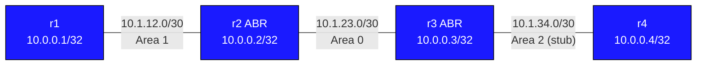

# OSPF Multi-Area — Practice Lab

Build a working multi-area OSPF network from scratch. IP addressing is
pre-configured on every node. You implement the OSPF process, area
assignments, and stub-area configuration yourself.

---

## Topology



### Link addressing

| Link      | Subnet        | Left side       | Right side      | OSPF Area |
|-----------|---------------|-----------------|-----------------|-----------|
| r1 — r2   | 10.1.12.0/30  | 10.1.12.1 (r1)  | 10.1.12.2 (r2)  | Area 1    |
| r2 — r3   | 10.1.23.0/30  | 10.1.23.1 (r2)  | 10.1.23.2 (r3)  | Area 0    |
| r3 — r4   | 10.1.34.0/30  | 10.1.34.1 (r3)  | 10.1.34.2 (r4)  | Area 2    |

### Node reference

| Node | Loopback     | Role                     | Areas         |
|------|--------------|--------------------------|---------------|
| r1   | 10.0.0.1/32  | Regular router           | Area 1        |
| r2   | 10.0.0.2/32  | ABR                      | Area 0 + 1    |
| r3   | 10.0.0.3/32  | ABR                      | Area 0 + 2    |
| r4   | 10.0.0.4/32  | Stub area router         | Area 2 (stub) |

---

## Deploy and access

```bash
# Deploy the lab (run from this directory)
containerlab deploy --topo topology.clab.yml

# List nodes and their management IPs
../../scripts/lab.sh list ospf-multiarea

# Open the cEOS CLI on any node
../../scripts/lab.sh Cli ospf-multiarea r1

# Open a Linux shell (for ip/ping commands)
../../scripts/lab.sh bash ospf-multiarea r1
```

Inside Cli, use `?` after any keyword for context-sensitive help,
and `do show ...` to run show commands from config mode.

---

## Step 1 — Configure the OSPF process on each router

Enter Cli on each node and configure the OSPF process. Use the process
name "CORE" and set the router-id to match the loopback address.

```
router ospf
 ospf router-id <loopback-ip>
```

| Node | Command                        |
|------|--------------------------------|
| r1   | `ospf router-id 10.0.0.1`      |
| r2   | `ospf router-id 10.0.0.2`      |
| r3   | `ospf router-id 10.0.0.3`      |
| r4   | `ospf router-id 10.0.0.4`      |

---

## Step 2 — Assign interfaces to OSPF areas

Configure each interface individually. Go into the interface context
and add `ip ospf area <X>`. Mark loopbacks passive so they are
advertised but do not attempt to form adjacencies.

### r1 (all interfaces in Area 1)

```
interface Loopback0
 ip ospf area 1
!
interface Ethernet1
 ip ospf area 1
!
router ospf 1
 passive-interface Loopback0
```

### r2 (ABR: Ethernet1 in Area 1, Ethernet2 and Loopback0 in Area 0)

```
interface Loopback0
 ip ospf area 0
!
interface Ethernet1
 ip ospf area 1
!
interface Ethernet2
 ip ospf area 0
!
router ospf 1
 passive-interface Loopback0
```

### r3 (ABR: Ethernet1 and Loopback0 in Area 0, Ethernet2 in Area 2)

```
interface Loopback0
 ip ospf area 0
!
interface Ethernet1
 ip ospf area 0
!
interface Ethernet2
 ip ospf area 2
!
router ospf 1
 passive-interface Loopback0
```

### r4 (all interfaces in Area 2)

```
interface Loopback0
 ip ospf area 2
!
interface Ethernet1
 ip ospf area 2
!
router ospf 1
 passive-interface Loopback0
```

---

## Step 3 — Declare Area 2 as a stub area

A stub area suppresses external LSAs (Type-5). The ABR (r3) injects a
default route into the area instead. Both the ABR and every internal
router in the area must have matching stub configuration.

Configure this on **r3 and r4**:

```
router ospf
 area 2 stub
```

After this, r4 should see a default route `0.0.0.0/0` via r3 in its
OSPF routing table.

---

## Verification

```
! Check neighbour adjacencies — should show Full state on all links
show ip ospf neighbor

! Inspect the link-state database
show ip ospf database

! Show OSPF-learned routes in the routing table
show ip route ospf

! Confirm r1 can reach r4's loopback (end-to-end reachability)
ping 10.0.0.4 source 10.0.0.1

! On r4 — verify a default route exists (from the stub ABR r3)
show ip route ospf
```

Expected adjacencies:

| Neighbour pair | State    |
|----------------|----------|
| r1 — r2        | Full     |
| r2 — r3        | Full     |
| r3 — r4        | Full     |

---

## Experiments

### Convert Area 2 to totally-stub

A totally-stubby area also suppresses inter-area summary LSAs (Type-3),
leaving only a single default route. Only the ABR needs the `no-summary`
keyword; the internal router (r4) keeps plain `stub`.

On **r3** only:

```
router ospf
 area 2 stub no-summary
```

Check r4's routing table before and after — inter-area routes should
disappear, leaving only the default route and intra-area prefixes.

### Add inter-area summarization at r3

ABRs can summarize Type-3 LSAs sent into the backbone. Advertise a
summary of the Area 2 loopback range instead of the individual /32:

```
router ospf
 area 2 range 10.0.0.0/24
```

Verify on r1 and r2 that the specific 10.0.0.4/32 is replaced by the
summary 10.0.0.0/24 in the OSPF database.

---

## Troubleshooting

**Neighbours stuck in Init or 2-Way**
- Confirm both ends of the link are in the same area (`show ip ospf interface`)
- Check that neither side has a mismatched hello/dead timer

**No adjacency forming at all**
- Verify the IP addresses are correct: `show interface Ethernet1`
- Check that OSPF is enabled on the interface: `show ip ospf interface Ethernet1`

**r4 does not have a default route**
- Confirm `area 2 stub` is configured on both r3 and r4
- A mismatch (one side stub, the other not) prevents adjacency from reaching Full

**Routes missing from r1 or r4**
- Check the OSPF database on each router: `show ip ospf database`
- Type-3 summary LSAs carry inter-area routes; confirm they appear on r2 and r3
- If totally-stub is configured, Type-3 LSAs will not reach r4 — that is expected
