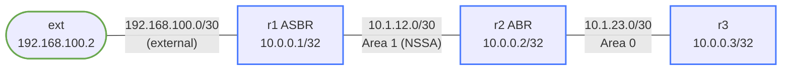

# OSPF NSSA (Not-So-Stubby Area) — Practice Lab

A stub area blocks external (Type-5) LSAs — which also makes it illegal to
put an ASBR *inside* one. NSSA is the workaround: almost-stub, but external
routes redistributed inside the area travel as **Type-7** LSAs and get
translated to Type-5 at the ABR. In this lab you build the area, redistribute
at the edge, and watch the Type-7 → Type-5 translation happen in the LSDB.

## Topology



| Link | Subnet | Left | Right | OSPF Area |
|------|--------|------|-------|-----------|
| ext:Ethernet1 - r1:Ethernet1 | 192.168.100.0/30 | ext=.2 | r1=.1 | none (external) |
| r1:Ethernet2 - r2:Ethernet1  | 10.1.12.0/30    | r1=.1  | r2=.2 | Area 1 (NSSA) |
| r2:Ethernet2 - r3:Ethernet1  | 10.1.23.0/30    | r2=.1  | r3=.2 | Area 0 |

Loopbacks: r1=10.0.0.1/32 (area1), r2=10.0.0.2/32 (area0), r3=10.0.0.3/32 (area0)

## How to use this lab

This is a **practice lab**, not a tutorial. Each task gives you an
**objective** and **hints** — your job is to produce the configuration.

- **Predict before you configure.** When a task asks for a prediction,
  commit to an answer before touching the CLI. Being wrong and finding out
  why is the point.
- **Open the hints before the solution.** The solution toggle is the answer
  key — use it to check your work or when genuinely stuck, not as step one.
- **Verify like an operator.** After each task, prove the state is what you
  think it is with `show` commands before moving on.

## Area type background

| Area Type | Type-3 (inter-area) | Type-5 (external) | Type-7 (NSSA ext) | ASBR inside? |
|-----------|--------------------|--------------------|-------------------|--------------|
| Regular | Yes | Yes | No | Yes |
| Stub | Yes | No | No | No |
| Totally Stub | Default only | No | No | No |
| NSSA | Yes | No | Yes | **Yes** |
| Totally NSSA | Default only | No | Yes | Yes |

Keep this table handy — the tasks make you prove most of its cells.

## Deployment

```bash
./scripts/lab.sh deploy ospf-nssa
```

---

## Task 1 — Baseline: regular areas, then redistribute

**Objective:** Bring up OSPF with area 1 as a *regular* area (r1 ↔ r2) and
area 0 (r2 ↔ r3), loopbacks included per the topology table. Then make r1 an
ASBR with `redistribute connected` and find the external route in r3's LSDB.

**Predict first:** with area 1 still a regular area, which LSA type carries
192.168.100.0/30 to r3, and which router will r3 list as the advertising
router?

<details markdown="1">
<summary>Hints</summary>

- Standard `router ospf` + `network ... area ...` statements on all three
  routers (r2 straddles both areas).
- After `redistribute connected` on r1: `show ip ospf database external`
  on r3 and read the "Advertising Router" field.

</details>

<details markdown="1">
<summary>Solution</summary>

On **r1**:
```text
router ospf
 router-id 10.0.0.1
 network 10.0.0.1/32 area 1
 network 10.1.12.0/30 area 1
 redistribute connected
```

On **r2**:
```text
router ospf
 router-id 10.0.0.2
 network 10.0.0.2/32 area 0
 network 10.1.12.0/30 area 1
 network 10.1.23.0/30 area 0
```

On **r3**:
```text
router ospf
 router-id 10.0.0.3
 network 10.0.0.3/32 area 0
 network 10.1.23.0/30 area 0
```

</details>

<details markdown="1">
<summary>Check your work</summary>

Adjacencies `Full` on both links. r3's `show ip ospf database external`
shows a **Type-5** LSA for 192.168.100.0/30 with **Advertising Router
10.0.0.1** — r1's own LSA, flooded unchanged across the whole domain.
That's normal redistribution in a regular area. Remember both facts (type
and advertiser); both change once the area becomes NSSA.

</details>

---

## Task 2 — Convert area 1 to NSSA

**Objective:** Make area 1 an NSSA on every router that touches it, without
permanently losing the external route on r3.

**Predict first:** two predictions. (1) What happens to the r1–r2 adjacency
the moment you configure NSSA on r1 but haven't yet on r2? (2) Once both
sides agree, what will r3's external LSA look like — same type, same
advertising router as in Task 1?

<details markdown="1">
<summary>Hints</summary>

- `area 1 nssa` under `router ospf` — on **both** r1 and r2.
- Area type is negotiated in hellos (N/E option bits), same mechanism that
  makes stub mismatches fatal.
- Compare `show ip ospf database nssa-external` (on r1/r2) with
  `show ip ospf database external` (on r3).

</details>

<details markdown="1">
<summary>Solution</summary>

On **r1** and **r2**:
```text
router ospf
 area 1 nssa
```

</details>

<details markdown="1">
<summary>Check your work</summary>

(1) With only r1 converted, the r1–r2 adjacency **drops** — hello option
bits no longer match, the routers won't even be neighbors. (2) After both
agree: inside area 1 the external route now exists as a **Type-7**
(`show ip ospf database nssa-external`, advertising router 10.0.0.1, note
the **Forward Address** field = r1's external-segment IP). On r3 the route
is back as a **Type-5** — but the advertising router is now **10.0.0.2**:
the ABR re-originated (translated) it. r3 cannot tell NSSA was ever
involved.

</details>

---

## Task 3 — Read the translation like a protocol engineer

**Objective:** Use the LSDB views to document the full Type-7 → Type-5
pipeline: who originates what, where each LSA floods, and what the P-bit
and Forward Address do.

<details markdown="1">
<summary>Hints</summary>

- `show ip ospf database nssa-external` on r1 and r2 — both see the
  Type-7 (it floods within area 1 only).
- `show ip ospf database external detail` on r3 — find the forward
  address in the translated Type-5.
- The P-bit ("Propagate") in the Type-7 is what permits translation.

</details>

<details markdown="1">
<summary>Check your work</summary>

The chain you should be able to narrate: r1 redistributes → originates
Type-7 with P-bit set and Forward Address 192.168.100.1 → floods only
within area 1 → r2 (the NSSA ABR; with multiple ABRs, the highest
router-id wins the translator role) re-originates it as Type-5 into the
rest of the domain → r3 routes to the prefix as `O E2`, and thanks to the
preserved forward address, traffic still goes *through* r2 toward r1
without extra recursion surprises.

```text
r3# show ip route ospf
O E2   192.168.100.0/30 [110/20] via 10.1.23.1, Ethernet1
```

`ping 192.168.100.2 source 10.0.0.3` proves it end to end (ext has a
static default back via r1).

</details>

---

## Task 4 — Totally NSSA

**Objective:** Stop r2 from sending inter-area (Type-3) routes into area 1,
leaving r1 with intra-area routes, its own Type-7, and just a default.

**Predict first:** which router(s) need the change — and as what route type
will r1's new default appear (`O IA`, `O E2`, or `O N2`)?

<details markdown="1">
<summary>Hints</summary>

- One keyword added to the NSSA command, on the **ABR only**.
- Compare r1's `show ip route ospf` before and after.

</details>

<details markdown="1">
<summary>Solution</summary>

On **r2** only:
```text
router ospf
 area 1 nssa no-summary
```

</details>

<details markdown="1">
<summary>Check your work</summary>

r1's `O IA` routes (r3's loopback, the area-0 link) disappear, replaced by
a single default originated by the ABR — shown as **`O N2 0.0.0.0/0`**
(it's delivered via the NSSA mechanism, hence N2 rather than IA or E2).
Internal routers only ever needed "send it to the ABR" anyway; totally-NSSA
makes that explicit and shrinks the area's database to the minimum while
still allowing the local ASBR.

</details>

---

## Verification Summary

| Command | Where | Expected result |
|---------|-------|----------------|
| `show ip ospf neighbor` | r2 | r1 (area 1) and r3 (area 0), both Full |
| `show ip ospf database nssa-external` | r1, r2 | Type-7 from r1 (10.0.0.1) |
| `show ip ospf database external` | r3 | Type-5 from r2 (10.0.0.2) |
| `show ip route ospf` | r3 | O E2 192.168.100.0/30 |
| `ping 192.168.100.2 source 10.0.0.3` | r3 | Success |

## OSPF Database Commands

| Command | What it shows |
|---------|--------------|
| `show ip ospf database` | Summary of all LSA types |
| `show ip ospf database router` | Type-1 (Router LSAs) |
| `show ip ospf database network` | Type-2 (Network LSAs) |
| `show ip ospf database summary` | Type-3 (Inter-area summary LSAs) |
| `show ip ospf database external` | Type-5 (AS External LSAs) |
| `show ip ospf database nssa-external` | Type-7 (NSSA External LSAs) |
| `show ip ospf database external detail` | Full Type-5 detail with forward addr |

---

## Challenge questions

No answers provided — reason them through.

1. Area 1 gains a second ABR (r2b) with a higher router-id, connected to
   both area 1 and area 0. What changes about the translation, why does
   the protocol elect exactly one translator, and what could go wrong if
   both translated?
2. Your security team wants area 1 to receive *no* knowledge of the
   outside world, while still injecting its own external route. Which area
   type satisfies this, and which direction of traffic still needs the
   default route to work?
3. A plain stub area would have rejected r1's `redistribute connected`
   outright. Explain *mechanically* why an ASBR is incompatible with a
   stub area — which LSA can't exist there, and what would break if it
   were allowed in?
4. r3 suddenly loses the external route. List, in the order you'd check
   them, three distinct places in the Type-7 → Type-5 pipeline that could
   have failed, and the one command that tests each.

## Teardown

```bash
./scripts/lab.sh destroy ospf-nssa
```
