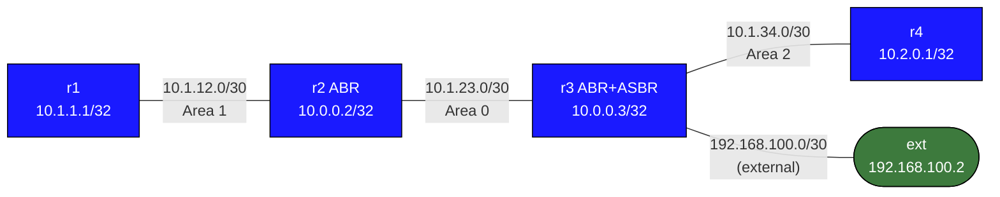

# OSPF Summarization (Inter-Area and External) — Practice Lab

Summarization is OSPF's scaling tool. Without it, redistributing 500 BGP
prefixes into OSPF floods 500 individual Type-5 LSAs to every router in the
domain; with one `summary-address` it becomes a single LSA. In this lab you
build a three-area topology with an external feed, then collapse routes in
two different places — at the ABR (Type-3) and at the ASBR (Type-5) — and
prove the difference in the LSDB.

## Topology



| Segment           | Subnet            | Addresses       | Area   |
|-------------------|-------------------|-----------------|--------|
| r1 -- r2          | 10.1.12.0/30      | r1=.1, r2=.2    | Area 1 |
| r2 -- r3          | 10.1.23.0/30      | r2=.1, r3=.2    | Area 0 |
| r3 -- r4          | 10.1.34.0/30      | r3=.1, r4=.2    | Area 2 |
| r3 -- ext         | 192.168.100.0/30  | r3=.1, ext=.2   | none   |
| r1 loopback (x3)  | 10.1.1.1, 10.1.2.1, 10.1.3.1 /32 | | Area 1 |
| r2 loopback       | 10.0.0.2/32       |                 | Area 0 |
| r3 loopback       | 10.0.0.3/32       |                 | Area 0 |
| r4 loopback       | 10.2.0.1/32       |                 | Area 2 |

**r2** is the ABR between Area 1 and Area 0. **r3** is both the ABR for
Area 2 and the ASBR for external routes.

## How to use this lab

This is a **practice lab**, not a tutorial. Each task gives you an
**objective** and **hints** — your job is to produce the configuration.

- **Predict before you configure.** When a task asks for a prediction,
  commit to an answer before touching the CLI. Being wrong and finding out
  why is the point.
- **Open the hints before the solution.** The solution toggle is the answer
  key — use it to check your work or when genuinely stuck, not as step one.
- **Verify like an operator.** After each task, prove the state is what you
  think it is with `show` commands before moving on.

## Lab Setup

```bash
./scripts/lab.sh deploy ospf-summarization
```

Connect to a router:
```bash
sudo ./scripts/lab.sh cli ospf-summarization r4
```

---

## Task 1 — Build the multi-area baseline

**Objective:** Add two extra addresses to r1's Loopback0 (`10.1.2.1/32`,
`10.1.3.1/32` — these give you something worth summarizing), then bring up
OSPF on all four routers with the area assignments from the topology table.
Success: r3 has two `Full` neighbors and r4 sees three separate `O IA`
routes for r1's loopbacks.

<details markdown="1">
<summary>Hints</summary>

- Secondary addresses on cEOS: just issue additional `ip address x.x.x.x/32`
  lines under `interface Loopback0`.
- Use `network <prefix> area <n>` statements under `router ospf`; r2 and r3
  each straddle two areas, so their `network` statements name different
  areas.
- r3's Ethernet3 (the external link) gets **no** network statement — it
  stays outside OSPF deliberately.

</details>

<details markdown="1">
<summary>Solution</summary>

On **r1**:
```text
configure terminal
interface Loopback0
 ip address 10.1.2.1/32
 ip address 10.1.3.1/32
!
router ospf
 ospf router-id 10.1.1.1
 network 10.1.1.1/32 area 1
 network 10.1.2.1/32 area 1
 network 10.1.3.1/32 area 1
 network 10.1.12.0/30 area 1
 passive-interface Loopback0
```

On **r2**:
```text
configure terminal
router ospf
 ospf router-id 10.0.0.2
 network 10.0.0.2/32 area 0
 network 10.1.12.0/30 area 1
 network 10.1.23.0/30 area 0
 passive-interface Loopback0
```

On **r3**:
```text
configure terminal
router ospf
 ospf router-id 10.0.0.3
 network 10.0.0.3/32 area 0
 network 10.1.23.0/30 area 0
 network 10.1.34.0/30 area 2
 passive-interface Loopback0
```

On **r4**:
```text
configure terminal
router ospf
 ospf router-id 10.2.0.1
 network 10.2.0.1/32 area 2
 network 10.1.34.0/30 area 2
 passive-interface Loopback0
```

</details>

<details markdown="1">
<summary>Check your work</summary>

All adjacencies `Full` (`show ip ospf neighbor` on r2 and r3). On r4,
`show ip ospf database summary` lists a Type-3 LSA per prefix from the
other areas — including **three separate entries** for 10.1.1.1/32,
10.1.2.1/32, 10.1.3.1/32. Note that LSA count; it's your "before" number.
Every one of those /32s crossed two ABRs to reach r4 — this per-prefix
flooding is exactly what summarization removes.

</details>

---

## Task 2 — Redistribute an external route at r3

**Objective:** Make r3 an ASBR: give it a static route for
`192.168.100.0/24` via the `ext` host, redistribute statics into OSPF, and
confirm r4 learns it.

**Predict first:** when the route appears on r4, what route code will it
carry — `O`, `O IA`, or something else — and will its metric grow as it
crosses r3 → r4?

<details markdown="1">
<summary>Hints</summary>

- `ip route <prefix> <next-hop>` then `redistribute static` under
  `router ospf`.
- Inspect with `show ip ospf database external` and `show ip route ospf`
  on r4.

</details>

<details markdown="1">
<summary>Solution</summary>

On **r3**:
```text
configure terminal
ip route 192.168.100.0/24 192.168.100.2
router ospf
 redistribute static
```

</details>

<details markdown="1">
<summary>Check your work</summary>

r4 shows `O E2 192.168.100.0/24`. **E2** (the default) means the metric is
fixed at whatever the ASBR stamped — it does *not* accumulate intra-domain
cost as it traverses the network, so every router in the domain sees the
same value. (E1 would add the internal cost to reach r3; see the reference
section below for when that matters.) The LSA behind this route is a
Type-5, flooded to the entire domain, which is why ASBR-side summarization
in Task 4 matters.

</details>

---

## Task 3 — Summarize Area 1 at the ABR

**Objective:** Configure r2 so r1's three loopbacks cross into the backbone
as a **single** Type-3 LSA covering `10.1.0.0/22`, and verify the collapse
from r4.

**Predict first:** two things. (1) What metric will the summary carry —
the min, max, or sum of the component routes? (2) After summarizing, r2
will install a new route to `10.1.0.0/22` pointing at... where? (Hint:
think about what must happen to traffic for a destination inside the
summary that doesn't actually exist.)

<details markdown="1">
<summary>Hints</summary>

- One command under `router ospf` on r2: `area <id> range <prefix>` — the
  area named is the one the routes come *from*.
- Compare `show ip ospf database summary` on r4 before/after.
- After the change, look at r2's own routing table for 10.1.0.0/22.

</details>

<details markdown="1">
<summary>Solution</summary>

On **r2**:
```text
configure terminal
router ospf
 area 1 range 10.1.0.0/22
```

</details>

<details markdown="1">
<summary>Check your work</summary>

On r4: the three `O IA /32` routes are replaced by a single
`O IA 10.1.0.0/22`, and the summary-LSA count drops accordingly.

Predictions: (1) the summary's metric is the **maximum** cost among the
contributing routes. (2) r2 installs `10.1.0.0/22 → Null0` — a discard
route. That's deliberate: r2 is now claiming reachability for 1024
addresses of which it can really reach three; packets for the nonexistent
ones must be dropped *at the ABR* rather than looping toward a default
route. Summarization always trades routing detail for a black-hole zone
behind the summary.

Also try `area 1 range 10.1.0.0/22 not-advertise` — r4 loses all 10.1.x
routes entirely (the range is suppressed, not summarized). Re-issue the
command without `not-advertise` to restore.

</details>

---

## Task 4 — Summarize the external routes at the ASBR

**Objective:** Collapse r3's redistributed external prefixes into a single
Type-5 LSA for `192.168.100.0/24`.

**Predict first:** Task 3's `area range` was configured on the ABR. Why
can't that same command summarize the external route — what's different
about where Type-5 LSAs enter the network?

<details markdown="1">
<summary>Hints</summary>

- The ASBR-side command is `summary-address <prefix>` under `router ospf`
  on **r3**.
- Verify with `show ip ospf database external` on r4.

</details>

<details markdown="1">
<summary>Solution</summary>

On **r3**:
```text
configure terminal
router ospf
 summary-address 192.168.100.0/24
```

</details>

<details markdown="1">
<summary>Check your work</summary>

`show ip ospf database external` on r4 shows a single Type-5 LSA for the
/24 covering anything redistributed within it.

Prediction answer: `area range` operates on Type-3 LSAs an ABR generates at
an *area boundary* — but Type-5 LSAs don't pass through area boundaries;
they flood domain-wide directly from the ASBR. The only place they can be
compressed is at their source, hence a different command on a different
router. "Which LSA type, generated where" is the question that picks the
tool.

</details>

---

## Verification

```text
show ip ospf neighbor             # all Full
show ip ospf database summary     # one 10.1.0.0/22 entry, no /32s (on r4)
show ip ospf database external    # one Type-5 for 192.168.100.0/24
show ip route ospf                # O IA 10.1.0.0/22 and O E2 192.168.100.0/24 on r4
show ip ospf border-routers       # r2 as ABR; r3 as ABR+ASBR
ping 10.1.2.1 source 10.2.0.1     # reachability through the summary
```

---

## Challenge questions

No answers provided — reason them through.

1. A second link is added from r4 directly to r2, and r3 also starts
   summarizing `10.1.0.0/22` with `area 1 range`. r1's 10.1.2.1 loopback
   then goes down. Trace what happens to a packet from r4 to 10.1.2.1 —
   where exactly is it dropped, and why is that the *good* outcome?
2. You must choose between summarizing at `10.1.0.0/22` and `10.0.0.0/8`.
   Both "work." Rank the risks of the broader summary and name a concrete
   failure it could cause in this topology (look at what else lives in
   10.x).
3. Two ASBRs redistribute the same external prefix, one near r4 and one
   far. With E2 metrics r4 may pick the far one. Explain why, and what
   you'd change (and on which router) so r4 prefers the closer exit.
4. Area 2 could be made a stub area instead of using `summary-address`.
   Compare the two as tools for shrinking r4's table: what does each
   remove, what does each break, and when do you need both?

---

## LSA Type Reference

| LSA Type | Name           | Generated by | Scope              | Purpose                        |
|----------|----------------|--------------|--------------------|--------------------------------|
| Type-1   | Router LSA     | Every router | Within area        | Links and costs within an area |
| Type-2   | Network LSA    | DR           | Within area        | Multi-access segment info      |
| Type-3   | Summary LSA    | ABR          | Other areas        | Inter-area prefix reachability |
| Type-4   | ASBR Summary   | ABR          | Other areas        | Location of ASBR               |
| Type-5   | External LSA   | ASBR         | Entire OSPF domain | Redistributed external routes  |

Key insight: Type-5 LSAs are flooded to the **entire domain** (except stub
areas). This is why external summarization at ASBRs is so important — a
single noisy redistribution source (e.g., partial BGP table) can flood
thousands of Type-5 LSAs to every router.

## Reference — E1 vs E2 External Metrics

**E2 (default):** the cost assigned at the ASBR is the only cost — it does
not increase across the domain. Use when the external path cost dominates.

**E1:** external cost **plus** internal cost to reach the ASBR. Use when
multiple ASBRs redistribute the same prefix and routers should prefer the
topologically closer one.

EOS sets the metric type via a route-map (no inline `metric-type` on
`redistribute`):

<details markdown="1">
<summary>Configuration</summary>

```text
route-map OSPF-E1 permit 10
 set metric-type type-1
!
router ospf 1
 redistribute static route-map OSPF-E1
```

</details>

Observe on r4: `O E2` has a fixed metric; `O E1` varies with distance to r3.

## Troubleshooting Reference

| Command | What to look for |
|---------|-----------------|
| `show ip ospf neighbor` | All neighbors in `Full` state |
| `show ip ospf database` | Total LSA count — compare before/after summarization |
| `show ip ospf database summary` | Type-3 LSAs — should collapse after ABR summarization |
| `show ip ospf database external` | Type-5 LSAs — should collapse after ASBR summarization |
| `show ip route ospf` | `O IA` = inter-area, `O E2` = external type 2 |
| `show ip ospf border-routers` | Lists known ABRs and ASBRs |

## Cleanup

```bash
./scripts/lab.sh destroy ospf-summarization
```

## Extensions

These are optional follow-on ideas to deepen the lab. They are not part of
the validated base workflow.

- Deliberately summarize too broadly and observe the black-hole risk when a
  component subnet disappears behind the summary.
- Redistribute the same routes as E1 and E2 at different times and compare
  how path cost changes downstream.
- Capture OSPF updates during summarization changes and correlate them with
  the shrinking or growing LSDB.
