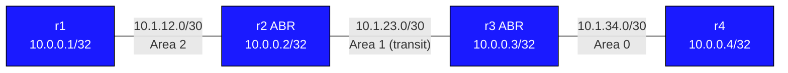

# Lab: OSPF Virtual Links

## Topology



| Link | Subnet | Left | Right | OSPF Area |
|------|--------|------|-------|-----------|
| r1:Ethernet1 - r2:Ethernet1 | 10.1.12.0/30 | r1=.1 | r2=.2 | Area 2 |
| r2:Ethernet2 - r3:Ethernet1 | 10.1.23.0/30 | r2=.1 | r3=.2 | Area 1 (transit) |
| r3:Ethernet2 - r4:Ethernet1 | 10.1.34.0/30 | r3=.1 | r4=.2 | Area 0 |

Loopbacks:
- r1=10.0.0.1/32 (area 2)
- r2=10.0.0.2/32 (area 1 — needed by virtual link peer lookup)
- r3=10.0.0.3/32 (area 0)
- r4=10.0.0.4/32 (area 0)

## The Problem

OSPF requires that **all non-backbone areas must be directly connected to
Area 0 (the backbone)**. All inter-area routing traffic must transit Area 0.

In this topology:
- Area 2 connects to Area 1 via r2 (ABR)
- Area 1 connects to Area 0 via r3 (ABR)
- Area 2 has NO direct connection to Area 0

Without a virtual link:
- r1 and r4 cannot exchange routes
- r2 cannot act as a proper ABR for area 2 because it has no path to area 0
- `show ip ospf database` on r4 will show no area 2 LSAs

## The Solution: Virtual Link

A virtual link is a **logical OSPF adjacency** that extends Area 0 through
a transit area. It makes r2 and r3 behave as if they share a direct Area 0
link, even though they actually communicate through Area 1.

```
[r2] ======== virtual link (area 0) ======== [r3]
     --------- area 1 physical path ---------
```

The virtual link:
- Is established between two ABRs that share a transit area
- Carries OSPF protocol traffic (Hellos, LSAs) over the physical area 1 path
- Appears to OSPF as an unnumbered point-to-point Area 0 link
- Allows area 2 to exchange Type-3 (inter-area summary) LSAs with area 0

## Configuration

### On r2 (ABR between area 2 and area 1):

<details>
<summary>Show configuration</summary>

```
router ospf
 router-id 10.0.0.2
 network 10.0.0.2/32 area 1
 network 10.1.12.0/30 area 2
 network 10.1.23.0/30 area 1
 area 1 virtual-link 10.0.0.3
```
</details>

### On r3 (ABR between area 1 and area 0):

<details>
<summary>Show configuration</summary>

```
router ospf
 router-id 10.0.0.3
 network 10.0.0.3/32 area 0
 network 10.1.23.0/30 area 1
 network 10.1.34.0/30 area 0
 area 1 virtual-link 10.0.0.2
```
</details>

The argument to `area 1 virtual-link` is the **router-id** of the other
endpoint, NOT an IP address. Both routers must be reachable within area 1.

## Deployment

```bash
sudo containerlab deploy -t topology.clab.yml
```

## Tasks

### Step 1: Configure OSPF without virtual link

Configure all four routers with their respective areas. Do NOT add the
virtual-link statement yet.

r1:
<details>
<summary>Show configuration</summary>

```
router ospf
 router-id 10.0.0.1
 network 10.0.0.1/32 area 2
 network 10.1.12.0/30 area 2
```
</details>

r2:
<details>
<summary>Show configuration</summary>

```
router ospf
 router-id 10.0.0.2
 network 10.0.0.2/32 area 1
 network 10.1.12.0/30 area 2
 network 10.1.23.0/30 area 1
```
</details>

r3:
<details>
<summary>Show configuration</summary>

```
router ospf
 router-id 10.0.0.3
 network 10.0.0.3/32 area 0
 network 10.1.23.0/30 area 1
 network 10.1.34.0/30 area 0
```
</details>

r4:
<details>
<summary>Show configuration</summary>

```
router ospf
 router-id 10.0.0.4
 network 10.0.0.4/32 area 0
 network 10.1.34.0/30 area 0
```
</details>

### Step 2: Observe the broken state

From r1:
```
show ip ospf neighbor
show ip route ospf
ping 10.0.0.4 source 10.0.0.1
```

Expected: neighbors form locally, but r1 cannot reach r4. The routing
table on r1 shows area 2 and area 1 routes but nothing from area 0.

From r4:
```
show ip route ospf
```

Expected: only area 0 routes — no visibility of area 2.

### Step 3: Add virtual link on r2 and r3

<details>
<summary>Show configuration</summary>

On r2:
```
router ospf
 area 1 virtual-link 10.0.0.3
```
</details>

<details>
<summary>Show configuration</summary>

On r3:
```
router ospf
 area 1 virtual-link 10.0.0.2
```
</details>

### Step 4: Verify virtual link is up

```
show ip ospf virtual-links
```

Expected on r2:
```
Virtual Link OSPF_VL0 to router 10.0.0.3 is up
  Transit area 1, via interface Ethernet2, Cost of using 10
  Transmit Delay is 1 sec, State Point-to-Point,
  ...
  Adjacency state Full
```

State must be **Full** for the virtual link to function.

### Step 5: Verify full reachability

From r1:
```
ping 10.0.0.4 source 10.0.0.1
show ip route ospf
```

Expected routing table on r1:
```
O IA   10.1.23.0/30 [110/20] via 10.1.12.2, Ethernet1
O IA   10.1.34.0/30 [110/30] via 10.1.12.2, Ethernet1
O IA   10.0.0.3/32  [110/30] via 10.1.12.2, Ethernet1
O IA   10.0.0.4/32  [110/30] via 10.1.12.2, Ethernet1
```

From r4:
```
ping 10.0.0.1 source 10.0.0.4
show ip route ospf
```

## Virtual Link Constraints and Caveats

### Requirements
- Both endpoints must be ABRs
- Both endpoints must share the same transit area
- The transit area must NOT be a stub area (stub areas block virtual links)
- Both routers must be reachable from each other within the transit area
  (OSPF must have converged in the transit area before the VL comes up)

### The transit area and router-id reachability
The virtual link uses the router-id as the peer identifier. The router-id
is announced in LSAs. The transit area must have full LSA exchange before
the VL endpoint can be found. This is why r2's loopback is placed in
area 1 — it must be reachable within the transit area so r3 can find it.

### Virtual links are a design compromise
OSPF RFC 2328 explicitly states virtual links are a workaround, not a
permanent solution. Preferred alternatives:
- Add a physical link from the disconnected area to area 0
- Renumber areas to attach directly to area 0
- Use GRE tunnels if physical redesign is not possible

### Virtual links do NOT support:
- Stub areas as transit (area 1 cannot be stub if used for VL)
- NSSA areas as transit
- Authentication mismatch between VL neighbors (must use same auth)

## Verification Commands

| Command | Where | Expected |
|---------|-------|---------|
| `show ip ospf neighbor` | r2, r3 | Physical + VL neighbors |
| `show ip ospf virtual-links` | r2, r3 | VL to peer, state Full |
| `show ip route ospf` | r1 | O IA routes to area 0 |
| `show ip route ospf` | r4 | O IA routes to area 2 |
| `ping 10.0.0.4 source 10.0.0.1` | r1 | Success after VL up |
| `ping 10.0.0.1 source 10.0.0.4` | r4 | Success after VL up |
| `show ip ospf database` | r2 | Type-1 LSAs from area 0 and area 2 |

## Neighbor Output with Virtual Link

After virtual link is up, r2's neighbor table will show r3 twice:

```
show ip ospf neighbor

Neighbor ID Instance VRF      Pri State                  Dead Time   Address         Interface
10.0.0.3         1 default     1 Full/DR                  00:00:38   10.1.23.2       Ethernet2
10.0.0.3         1 default     0 Full/                    00:00:38   10.1.23.2       OSPF_VL0
```

The first entry is the physical area 1 adjacency. The second entry
(`OSPF_VL0`) is the virtual link — an area 0 adjacency tunneled through
area 1.

## Teardown

```bash
sudo containerlab destroy -t topology.clab.yml
```
