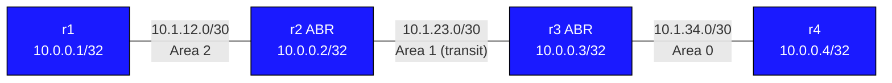

# OSPF Virtual Links — Practice Lab

OSPF's cardinal rule: every non-backbone area must touch Area 0. This
topology violates it on purpose — Area 2 hangs off Area 1, with no backbone
connection. You'll build the broken design, study exactly *how* it fails,
then repair it with a virtual link that extends Area 0 through the transit
area — and understand why RFC 2328 calls that a workaround, not a design.

## Topology



| Link | Subnet | Left | Right | OSPF Area |
|------|--------|------|-------|-----------|
| r1:Ethernet1 - r2:Ethernet1 | 10.1.12.0/30 | r1=.1 | r2=.2 | Area 2 |
| r2:Ethernet2 - r3:Ethernet1 | 10.1.23.0/30 | r2=.1 | r3=.2 | Area 1 (transit) |
| r3:Ethernet2 - r4:Ethernet1 | 10.1.34.0/30 | r3=.1 | r4=.2 | Area 0 |

Loopbacks:
- r1=10.0.0.1/32 (area 2)
- r2=10.0.0.2/32 (**area 1** — the placement matters; you'll see why)
- r3=10.0.0.3/32 (area 0)
- r4=10.0.0.4/32 (area 0)

## How to use this lab

This is a **practice lab**, not a tutorial. Each task gives you an
**objective** and **hints** — your job is to produce the configuration.

- **Predict before you configure.** When a task asks for a prediction,
  commit to an answer before touching the CLI. Being wrong and finding out
  why is the point.
- **Open the hints before the solution.** The solution toggle is the answer
  key — use it to check your work or when genuinely stuck, not as step one.
- **Verify like an operator.** After each task, prove the state is what you
  think it is with `show` commands before moving on.

## Deployment

```bash
sudo containerlab deploy -t topology.clab.yml
```

---

## Task 1 — Build the (deliberately) broken design

**Objective:** Configure OSPF on all four routers exactly per the topology
table — areas 2, 1, 0 in a chain — with **no** virtual link. All physical
adjacencies must reach `Full`.

**Predict first:** every adjacency will come up, yet routing will be
partial. Specifically: which OSPF routes will r1 have, and which will it be
missing? Same question for r4. Commit to an answer per router.

<details>
<summary>Hints</summary>

- Plain `router ospf` + `network ... area ...` statements; r2 and r3 each
  straddle two areas.
- Put r2's loopback in area 1 (per the table).
- Nothing here is exotic — the breakage comes from the *area design*, not
  the config.

</details>

<details>
<summary>Solution</summary>

r1:
```text
router ospf
 router-id 10.0.0.1
 network 10.0.0.1/32 area 2
 network 10.1.12.0/30 area 2
```

r2:
```text
router ospf
 router-id 10.0.0.2
 network 10.0.0.2/32 area 1
 network 10.1.12.0/30 area 2
 network 10.1.23.0/30 area 1
```

r3:
```text
router ospf
 router-id 10.0.0.3
 network 10.0.0.3/32 area 0
 network 10.1.23.0/30 area 1
 network 10.1.34.0/30 area 0
```

r4:
```text
router ospf
 router-id 10.0.0.4
 network 10.0.0.4/32 area 0
 network 10.1.34.0/30 area 0
```

</details>

<details>
<summary>Check your work</summary>

All three physical adjacencies are `Full` — and yet:

- r1 has area 2 routes and (via r2) area 1 routes, but **nothing from
  area 0** — no 10.0.0.4/32, no 10.1.34.0/30.
- r4 has area 0 routes (plus area 1 prefixes via r3, a legal
  area-0-attached ABR), but **no area 2 routes**.
- `ping 10.0.0.4 source 10.0.0.1` fails.

The mechanism: an ABR only generates Type-3 summaries *into and out of*
the backbone. r2 is an "ABR" between areas 1 and 2 — but with no area 0
connection it has no backbone to summarize into, so area 2's prefixes go
nowhere. Inter-area routing in OSPF is hub-and-spoke through Area 0 by
construction; this topology has a spoke hanging off a spoke.

</details>

---

## Task 2 — Repair it with a virtual link

**Objective:** Bring up a virtual link between r2 and r3 across transit
area 1, so that Area 0 logically extends to r2 and full r1 ↔ r4
reachability is restored.

**Predict first:** the virtual-link command takes an identifier for the far
end. Is it the peer's interface IP or something else — and through which
area's LSDB will each router have to *find* that peer for the link to come
up?

<details>
<summary>Hints</summary>

- One command on each ABR, under `router ospf`:
  `area <transit-area> virtual-link <peer>`.
- The `<peer>` is **not** an IP address on the transit link.
- Watch it come up with `show ip ospf virtual-links`; also re-check
  `show ip ospf neighbor` on r2 — count r3's entries.

</details>

<details>
<summary>Solution</summary>

On r2:
```text
router ospf
 area 1 virtual-link 10.0.0.3
```

On r3:
```text
router ospf
 area 1 virtual-link 10.0.0.2
```

</details>

<details>
<summary>Check your work</summary>

`show ip ospf virtual-links` on r2:

```text
Virtual Link OSPF_VL0 to router 10.0.0.3 is up
  Transit area 1, via interface Ethernet2, Cost of using 10
  ... State Point-to-Point,
  Adjacency state Full
```

and r2's neighbor table now lists r3 **twice**:

```text
Neighbor ID  ...  State      Address    Interface
10.0.0.3     ...  Full/DR    10.1.23.2  Ethernet2
10.0.0.3     ...  Full/      10.1.23.2  OSPF_VL0
```

— the physical area 1 adjacency plus a second, *area 0* adjacency tunneled
through it. Prediction answer: the argument is the peer's **router-id**,
and each side locates that router-id through the **transit area's** LSDB —
area 1 must already be converged or the virtual link has no path to form
over. (That's also why r2's loopback lives in area 1: it must be reachable
within the transit area.)

r1 now has `O IA` routes to 10.0.0.4/32 and 10.1.34.0/30, and
`ping 10.0.0.4 source 10.0.0.1` succeeds — verify the reverse from r4 too.

</details>

---

## Task 3 — Break it: stub the transit area

**Objective:** Try to convert area 1 into a stub area (`area 1 stub` on r2
and r3) while the virtual link is running, and explain what you observe
before undoing it.

**Predict first:** will the CLI even accept it? If it does, what dies
first — the physical adjacency or the virtual link?

<details>
<summary>What you should observe</summary>

Depending on platform, the config is either rejected outright or the
virtual link collapses: **a virtual link cannot transit a stub or NSSA
area**. The reason is structural — a virtual link is an Area 0 adjacency,
and stub areas exist precisely to *exclude* backbone-scale information;
RFC 2328 forbids the combination. The transit area must remain a regular
area, which is one of the operational taxes of using virtual links at all.

Undo the stub config and confirm `show ip ospf virtual-links` returns to
`Full` and r1 ↔ r4 pings recover.

</details>

---

## Reference — Virtual link constraints

- Both endpoints must be ABRs sharing the same transit area.
- The transit area must not be stub or NSSA.
- The peer is identified by **router-id**, which must be reachable through
  the transit area's converged LSDB.
- Authentication on the virtual link must match (it's an area 0 interface —
  area 0 auth applies to it).
- RFC 2328 positions virtual links as a temporary workaround. Preferred
  fixes: a real link to area 0, renumbering the area, or a GRE tunnel if
  physical redesign is impossible.

## Verification Commands

| Command | Where | Expected |
|---------|-------|---------|
| `show ip ospf neighbor` | r2, r3 | Physical + VL neighbors (peer listed twice) |
| `show ip ospf virtual-links` | r2, r3 | VL to peer, state Full |
| `show ip route ospf` | r1 | O IA routes to area 0 |
| `show ip route ospf` | r4 | O IA routes to area 2 |
| `ping 10.0.0.4 source 10.0.0.1` | r1 | Success after VL up |
| `ping 10.0.0.1 source 10.0.0.4` | r4 | Success after VL up |
| `show ip ospf database` | r2 | Type-1 LSAs from area 0 and area 2 |

---

## Challenge questions

No answers provided — reason them through.

1. The link r2–r3 flaps frequently. Compare how quickly the *physical*
   adjacency and the *virtual link* each detect and recover, and explain
   why a VL through an unstable transit area multiplies convergence pain.
2. Company A (areas 0,1) acquires Company B (their own area 0). You're
   asked to "just virtual-link the two backbones together through a shared
   area." Does that work? What rule about Area 0 are you actually trying
   to satisfy, and what's the honest fix?
3. MD5 authentication is enabled for area 0 on r3 (`area 0
   authentication message-digest`) but nobody touched r2. The physical
   adjacencies stay up. What happens to the virtual link, and why does an
   *area 1* link care about *area 0* auth settings?
4. Rank the three permanent alternatives to this virtual link (new
   physical r2–r3 area 0 link, renumbering area 1 into area 0, GRE tunnel
   into area 0) by operational risk in a production migration, and justify
   the ordering.

## Teardown

```bash
sudo containerlab destroy -t topology.clab.yml
```
