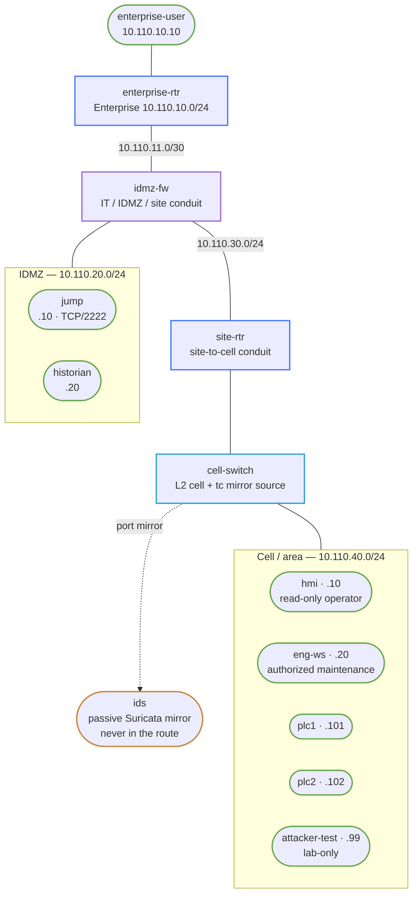

# OT/IoT Zone-and-Conduit Networking — Practice Lab

Build an enterprise-to-industrial-DMZ-to-cell path with explicit conduits,
synthetic Modbus/TCP process data, a two-hop maintenance workflow, passive
protocol visibility, and evidence-driven stale-data diagnosis. Every address,
device, process value, request, and credential is lab-only.

> **Safety boundary:** do not point these tools, rules, or workflows at a real
> industrial system. The live lab has no physical process, safety controller,
> vendor PLC logic, fieldbus, TSN, actuator, or plant authorization.

## Topology



| Zone/link | Prefix | Assets and purpose |
|---|---|---|
| Enterprise | `10.110.10.0/24` | `enterprise-user`, enterprise access |
| Enterprise transit | `10.110.11.0/30` | `enterprise-rtr` to `idmz-fw` |
| IDMZ | `10.110.20.0/24` | `jump`, historian relay |
| Site operations | `10.110.30.0/24` | `idmz-fw` to `site-rtr` |
| Cell/area | `10.110.40.0/24` | HMI, engineering, synthetic PLCs, negative tester |
| Safety fixture | `10.110.50.0/24` | Evidence-only; no live link or write path |

| Node | Address | Role |
|---|---:|---|
| `enterprise-user` | `10.110.10.10` | Business-side maintenance origin |
| `enterprise-rtr` | `.10.1`, `.11.1` | Prebuilt enterprise routing |
| `idmz-fw` | `.11.2`, `.20.1`, `.30.1` | Stateful IT/IDMZ/site conduit enforcement |
| `jump` | `10.110.20.10` | First authenticated maintenance hop, TCP/2222 |
| `historian` | `10.110.20.20` | Two-second synthetic process collector |
| `site-rtr` | `.30.2`, `.40.1` | Site-to-cell conduit enforcement |
| `cell-switch` | none | L2 cell and `tc` mirror source |
| `hmi` | `10.110.40.10` | Read-only operator client |
| `eng-ws` | `10.110.40.20` | Authorized maintenance source |
| `plc1`, `plc2` | `.40.101`, `.40.102` | PyModbus fake-process servers |
| `attacker-test` | `10.110.40.99` | Lab-only unauthorized-write test source |
| `ids` | none | Passive Suricata interface, never in the route |

Register 0 is fake line speed (`420`/`315` RPM); register 1 is fake tank level
(`73`/`61` percent). These are merely integers in a Python process.

## How to use this lab

This is a **practice lab**, not a tutorial. Each task gives you an
**objective** and **hints** — your job is to produce the configuration.

- **Predict before you configure.** When a task asks for a prediction,
  commit to an answer before touching the CLI. Being wrong and finding out
  why is the point.
- **Open the hints before the solution.** The solution toggle is the answer
  key — use it to check your work or when genuinely stuck, not as step one.
- **Verify like an operator.** After each task, prove the state is what you
  think it is with counters, logs, transactions, and captures.

The progression is one guided inventory task (12.5%), five hinted tasks
(62.5%), and two open cases (25%).

## Deploy

```bash
docker build -t ot-zone-tools:1.0.0 labs/ot-zone-conduit/
./scripts/lab.sh deploy ot-zone-conduit

# Readiness: both synthetic servers listen and the HMI sees its local cell.
./scripts/lab.sh cmd ot-zone-conduit plc1 "nc -z -w1 127.0.0.1 502"
./scripts/lab.sh cmd ot-zone-conduit hmi \
  "/opt/ot/modbus-client read 10.110.40.101"
```

Routes, addresses, fake process state, polling processes, clocks, and the mirror
plumbing are prebuilt. Conduit policy, PLC authorization, jump access, historian
delivery, and IDS rules are deliberately withheld.

## Task 1 — Inventory assets and reject broad flows (Guided)

**Objective:** classify owners and criticality, then reduce every requirement to
an explicit source, destination, direction, and port.

```bash
column -s, -t < labs/ot-zone-conduit/artifacts/communication-matrix.csv
```

Reject a proposed `Enterprise -> Cell ANY/ANY` requirement. Record which rows
replace it and who must approve the maintenance window.

<details markdown="1">
<summary>Check your work</summary>

The matrix has five narrowly permitted workflows and three explicit denials.
Remote maintenance is two distinct conduits: enterprise-to-jump TCP/2222 and
jump-to-engineering TCP/22. No row permits enterprise-to-PLC or PLC-initiated
enterprise traffic.

</details>

## Task 2 — Build default-deny conduits (Hinted)

**Objective:** enforce enterprise→IDMZ, IDMZ→site, and site→cell policy with
state, exact sources/ports, named counters, rule IDs, and a default deny.

**Predict first:** will a correct forward permit work if the return packet is
not accepted by state?

<details markdown="1">
<summary>Hints</summary>

- Use `inet` forward chains with `policy drop`.
- Put `ct state established,related` before new-flow permits.
- Match the interface pair as well as source, destination, and port.
- Give each conduit a named counter and NFLOG prefix such as `OT-RULE-210`.

</details>

<details markdown="1">
<summary>Solution</summary>

The validated answer loads the exact per-boundary nftables files, starts
NFLOG/ulogd, and completes the still-withheld operations components:

```bash
./labs/ot-zone-conduit/solution.sh
```

The full rule definitions are
`configs/solution/idmz-fw.nft`, `site-rtr.nft`, and `plc-input.nft`. Use them
as the answer key only after attempting the policy from the matrix.

</details>

<details markdown="1">
<summary>Check your work</summary>

```bash
./scripts/lab.sh cmd ot-zone-conduit idmz-fw "nft list ruleset"
./scripts/lab.sh cmd ot-zone-conduit site-rtr "nft list ruleset"
./scripts/lab.sh cmd ot-zone-conduit idmz-fw "tail /run/ot/firewall.log"
```

Named counters prove which conduit carried the flow; `OT-RULE-999` and
`OT-RULE-499` identify default denies. A static route alone cannot increment
the intended policy counter.

</details>

## Task 3 — Restore HMI and historian reads (Hinted)

**Objective:** prove local HMI reads and IDMZ historian collection while direct
enterprise Modbus remains denied.

**Predict first:** which reader crosses both stateful boundaries?

<details markdown="1">
<summary>Hints</summary>

- HMI and PLCs share the cell; historian traffic enters from `10.110.20.20`.
- Inspect last-good timestamps, not only process/container health.
- Compare `historian_to_plc` and `idmz_historian_to_cell`.

</details>

<details markdown="1">
<summary>Solution</summary>

Task 2's solution installs the read conduits. Generate evidence:

```bash
./scripts/lab.sh cmd ot-zone-conduit hmi \
  "/opt/ot/modbus-client read 10.110.40.101"
./scripts/lab.sh cmd ot-zone-conduit historian \
  "tail -2 /run/ot/historian.jsonl"
./scripts/lab.sh cmd ot-zone-conduit enterprise-user \
  "nc -z -w2 10.110.40.101 502"
```

</details>

<details markdown="1">
<summary>Check your work</summary>

The HMI decodes `[420,73]`; historian records both PLCs every two seconds; the
enterprise TCP attempt times out and increments the IDMZ default-deny counter.
The historian, unlike the HMI, depends on stateful return policy.

</details>

## Task 4 — Authorize time-bounded engineering (Hinted)

**Objective:** require two separately authenticated hops and permit a synthetic
register write only during a source-scoped maintenance window.

**Predict first:** should opening the engineering window make `attacker-test`
equally able to write?

<details markdown="1">
<summary>Hints</summary>

- The first hop uses `LAB-ONLY-enterprise-to-jump`; the second uses a different
  lab-only credential, `LAB-ONLY-jump-to-engineering`.
- The PLC simulator rejects function 6 while its maintenance flag is absent.
- During the window, an nftables source guard still denies `10.110.40.99`.

</details>

<details markdown="1">
<summary>Solution</summary>

```bash
./scripts/lab.sh cmd ot-zone-conduit enterprise-user \
  "sshpass -p LAB-ONLY-enterprise-to-jump ssh -o StrictHostKeyChecking=no \
   -o UserKnownHostsFile=/dev/null -p 2222 otmaint@10.110.20.10 \
   \"sshpass -p LAB-ONLY-jump-to-engineering ssh \
   -o StrictHostKeyChecking=no -o UserKnownHostsFile=/dev/null \
   maint@10.110.40.20 'echo ENG_OK'\""

./labs/ot-zone-conduit/enable-maintenance.sh 60
./scripts/lab.sh cmd ot-zone-conduit eng-ws \
  "/opt/ot/modbus-client write 10.110.40.101 --address 1 --value 77"
./labs/ot-zone-conduit/disable-maintenance.sh
```

</details>

<details markdown="1">
<summary>Check your work</summary>

`jump` and `eng-ws` each record an accepted password in separate logs. The
engineering write succeeds only while enabled; an attacker-test write is denied
both outside the window by the application interlock and inside it by the
source guard. Restore register 1 to `73` before closing the window.

</details>

## Task 5 — Make industrial activity visible (Hinted)

**Objective:** enable passive protocol detection, distinguish function 3 reads
from function 6 writes, and correlate firewall, IDS, HMI, historian, and PLC
timestamps.

**Predict first:** if the IDS container stops, should HMI reads fail?

<details markdown="1">
<summary>Hints</summary>

- `cell-switch` clones ingress traffic to `eth7`; that port is not in `br-cell`.
- Enable Suricata's Modbus parser explicitly; Ubuntu disables it by default.
- Match `modbus: function 6` and source `10.110.40.99`.

</details>

<details markdown="1">
<summary>Solution</summary>

Task 2's solution starts Suricata with
`configs/solution/ot.rules`. Generate a safe denied event:

```bash
./scripts/lab.sh cmd ot-zone-conduit attacker-test \
  "/opt/ot/modbus-client write 10.110.40.101 --address 1 --value 99"
./scripts/lab.sh cmd ot-zone-conduit ids \
  "jq -c 'select(.event_type==\"alert\") |
   {timestamp,app_proto,signature:.alert.signature}' /run/ot/eve.json"
```

</details>

<details markdown="1">
<summary>Check your work</summary>

Suricata reports `app_proto:"modbus"` and the lab unauthorized-write
signature. The PLC application log records the closed maintenance window.
Pausing `ids` does not interrupt the HMI because mirror traffic is cloned,
not forwarded through the sensor.

</details>

## Task 6 — Add a sensor gateway without flattening zones (Hinted)

**Objective:** treat `10.110.40.150` as a proposed read-only gateway, update
flow ownership/rollback, permit only function-3-style client use, and preserve
all existing denies.

**Predict first:** does adding an address and route create an authorized
conduit, or must the intended policy counter also move?

<details markdown="1">
<summary>Hints</summary>

- Start with a new matrix row and a named owner; do not reuse `ANY/ANY`.
- Use `attacker-test` only as the lab namespace hosting the temporary gateway IP.
- Add a source-specific PLC TCP/502 permit, observe reads, then remove both the
  rule and address as rollback.

</details>

<details markdown="1">
<summary>Solution</summary>

```bash
./scripts/lab.sh cmd ot-zone-conduit attacker-test \
  "ip addr add 10.110.40.150/24 dev eth1"
./scripts/lab.sh cmd ot-zone-conduit plc1 \
  "nft insert rule inet plc_guard input ip saddr 10.110.40.150 \
   tcp dport 502 counter accept comment OT-CHANGE-610"
./scripts/lab.sh cmd ot-zone-conduit attacker-test \
  "/opt/ot/modbus-client read 10.110.40.101"

# Roll back after capturing the counter/evidence.
./scripts/lab.sh cmd ot-zone-conduit plc1 \
  "handle=\$(nft -a list chain inet plc_guard input |
   awk '/OT-CHANGE-610/{print \$NF}'); nft delete rule inet plc_guard input handle \$handle"
./scripts/lab.sh cmd ot-zone-conduit attacker-test \
  "ip addr del 10.110.40.150/24 dev eth1"
```

</details>

<details markdown="1">
<summary>Check your work</summary>

The temporary address reads register values only after the exact permit. Rollback
removes the rule and address; enterprise direct access, attacker-test writes, and
PLC-initiated enterprise remain denied. In a real design, protocol-aware write
prevention would require an enforcing proxy/device capability, not faith in a
read-only client.

</details>

## Task 7 — Diagnose stale historian data (Open / Break-It)

**Objective:** diagnose why historian timestamps stop while HMI reads stay green,
repair only the broken conduit, and prove unauthorized enterprise access is
still denied.

**Predict first:** does a healthy HMI exonerate the PLC process, the network, or
only the local cell path?

<details markdown="1">
<summary>Hint</summary>

Start with last-good timestamps, then compare the cell mirror and both firewall
counters before changing routes or the PLC.

</details>

<details markdown="1">
<summary>Solution</summary>

```bash
./labs/ot-zone-conduit/break-it.sh
./labs/ot-zone-conduit/check.sh --break-it   # expected: three Break-It checks pass
./scripts/lab.sh cmd ot-zone-conduit idmz-fw \
  "nft -a list chain inet ot_conduits forward"
./labs/ot-zone-conduit/repair-break-it.sh
./labs/ot-zone-conduit/check.sh
```

`OT-BREAK-900` drops PLC TCP/502 return traffic only when it leaves site toward
the IDMZ historian. Remove that rule by handle; do not broaden the forward chain.

</details>

<details markdown="1">
<summary>Check your work</summary>

Historian last-good time advances again within its cadence, HMI remains current,
and the intended named conduit counters increment. Direct enterprise Modbus and
PLC-initiated enterprise still fail.

</details>

## Task 8 — Decide whether a network fix authorizes recovery (Open)

**Objective:** use the supplied request and safety-boundary case to decide what
evidence is sufficient for network repair and what still requires process/safety
owner authorization.

**Predict first:** can a green network check, by itself, authorize resumption of
a physical process?

<details markdown="1">
<summary>Hint</summary>

Separate technical success (route, counter, timestamp, restored synthetic value)
from authority to change or restart a physical process.

</details>

<details markdown="1">
<summary>Solution</summary>

Review `artifacts/maintenance-request.md` and
`artifacts/safety-boundary-case.md`. A complete response names the stop
conditions, evidence to preserve, rollback, process-owner approval, safety-owner
approval, and why the unconnected `10.110.50.0/24` fixture cannot be treated as a
tested SIS boundary.

</details>

<details markdown="1">
<summary>Check your work</summary>

Your decision explicitly says that a passing network check is necessary but not
sufficient authority for real process recovery. It does not claim the lab tested
fail-safe behavior.

</details>

## Verification

```bash
./labs/ot-zone-conduit/check.sh
```

The check covers HMI/historian reads, maintenance enable/disable, jump scoping,
enterprise/PLC deny paths, IDS alerting and independence, two-second time
correlation, rule IDs/counters, and intended routes.

## Challenge questions

1. Which availability risk grows if the historian and jump share one IDMZ bridge,
   and how would you reduce it without making a direct enterprise-to-cell path?
2. How would you distinguish a stale historian caused by time skew from one caused
   by return policy using only the evidence exposed here?
3. If a vendor requires one broad outbound cloud session from the cell, which
   owners, limits, and rollback evidence would you demand before adding it?
4. Which part of maintenance authorization belongs in a network policy engine,
   and which part must remain outside it?

## Troubleshooting

| Symptom | Likely cause | Minimal fix |
|---|---|---|
| HMI works; historian is stale | `OT-BREAK-900` or intended return state missing | Inspect timestamps/counters; remove only the break rule |
| Both HMI and historian fail | PLC service/cell path, not the IDMZ-only return fault | Check port 502 and `br-cell` before editing conduits |
| IDS has no EVE events | Modbus parser/rules not started or mirror port is down | Re-run the IDS portion of `solution.sh`; inspect `tc filter show` |
| Engineering SSH works but write fails | Maintenance flag absent/expired | Reauthorize a bounded window; do not leave it permanently enabled |
| Counter stays zero despite a route | Traffic bypassed or did not match the intended source/interface | Correct the conduit; do not accept a host-file/static-route workaround |

## Reading and fidelity

- [NIST SP 800-82 Rev. 3](https://csrc.nist.gov/pubs/sp/800/82/r3/final)
  discusses OT security while accounting for reliability and safety.
- [ISA/IEC 62443 series overview](https://www.isa.org/standards-and-publications/isa-standards/isa-iec-62443-series-of-standards)
  provides the standards context for zones, conduits, and lifecycle governance.

The lab runs real Linux forwarding, nftables/conntrack/NFLOG, PyModbus
transactions, OpenSSH authentication, `tc` mirroring, and Suricata DPI. It does
not emulate real PLC logic, deterministic networks, SIS behavior, field hazards,
vendor tools, hardware timestamping, or plant change control.

## Cleanup

```bash
./labs/ot-zone-conduit/disable-maintenance.sh || true
./scripts/lab.sh destroy ot-zone-conduit
```

Destroying removes all runtime logs, synthetic register changes, and policy state;
redeploy restores `plc1` to `[420,73]` and `plc2` to `[315,61]`.
