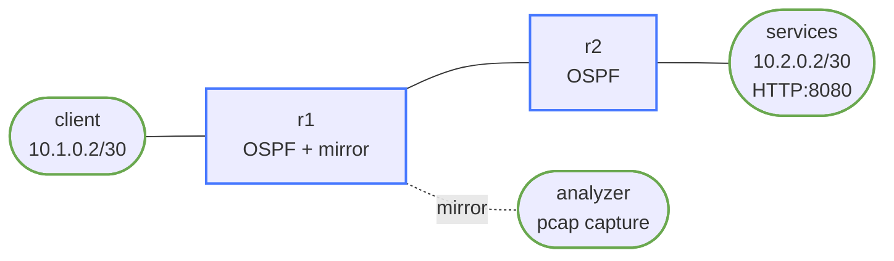

# packet-analysis-basics

This lab turns packet capture into a first-class workflow instead of a side note.
You will capture packets in three places:

- on a host to see ARP and first-hop behavior
- on a mirrored transit link to see OSPF, ICMP, and TCP between routers
- in a saved pcap so you can inspect it with `tshark` or Wireshark later

## How to use this lab

This is a **practice lab**, not a tutorial. The environment is pre-built;
you produce the configuration or the diagnosis from the objectives.
**Predict each result before you verify**, and treat the challenge
questions as the real test.

## Topology



## Build and Deploy

```bash
docker build -t frr-lab:local images/frr/
./scripts/lab.sh deploy packet-analysis-basics
```

## What Is Prebuilt

- routed reachability between `client` and `services`
- OSPF adjacency between `r1` and `r2`
- a traffic mirror from `r1:eth2` to `analyzer:eth1`
- a Python HTTP service on `services:8080`
- a simple `healthz` endpoint at `http://10.2.0.2:8080/healthz`

## Workflow

### 1. Capture ARP on the host edge

On `client`, start a short capture and then ping the default gateway:

```bash
./scripts/lab.sh cmd packet-analysis-basics client -- \
  tcpdump -ni eth1 -c 6 arp or icmp

./scripts/lab.sh cmd packet-analysis-basics client -- ping -c 2 10.1.0.1
```

You should see:

- ARP request for `10.1.0.1`
- ARP reply from `r1`
- ICMP echo request/reply after the MAC lookup completes

### 2. Capture OSPF hellos on the transit link

The analyzer receives mirrored frames from the `r1` to `r2` link:

```bash
./scripts/lab.sh cmd packet-analysis-basics analyzer -- \
  tcpdump -ni eth1 -vv proto ospf
```

Look for:

- multicast destination `224.0.0.5`
- Hello packets sent every 10 seconds
- router IDs `10.0.0.1` and `10.0.0.2`

### 3. Capture ICMP across the routed path

Start a filtered capture on `analyzer`, then generate ICMP from `client` toward `r2`:

```bash
./scripts/lab.sh cmd packet-analysis-basics analyzer -- \
  tcpdump -ni eth1 -vv icmp

./scripts/lab.sh cmd packet-analysis-basics client -- ping -c 3 10.2.0.1
```

Notice:

- TTL is one hop lower on the mirrored transit link than on the originating host
- the analyzer sees routed ICMP, not the client-side ARP exchange

### 4. Capture a TCP three-way handshake

On `analyzer`, capture just TCP port 8080:

```bash
./scripts/lab.sh cmd packet-analysis-basics analyzer -- \
  tcpdump -ni eth1 -vv tcp port 8080
```

Then generate an HTTP request from `client`:

```bash
./scripts/lab.sh cmd packet-analysis-basics client -- \
  bash -lc 'printf "GET / HTTP/1.0\r\n\r\n" | nc 10.2.0.2 8080'
```

Identify:

- SYN
- SYN/ACK
- ACK
- HTTP payload packets
- FIN/ACK teardown

### 5. Use tshark to read a saved capture

Start a short background capture on `analyzer`, then create one healthy probe and one HTTP transaction:

```bash
docker exec -d clab-packet-analysis-basics-analyzer \
  sh -lc "tshark -ni eth1 -a duration:15 -f 'icmp or tcp port 8080' \
  -w /tmp/packet-analysis-basics.pcap >/tmp/tshark-basic.log 2>&1"

sleep 1
./scripts/lab.sh cmd packet-analysis-basics client -- ping -c 2 10.2.0.1
./scripts/lab.sh cmd packet-analysis-basics client -- \
  bash -lc 'printf "GET /healthz HTTP/1.0\r\n\r\n" | nc 10.2.0.2 8080'

sleep 16
```

Now summarize the pcap without opening a GUI:

```bash
./scripts/lab.sh cmd packet-analysis-basics analyzer -- \
  tshark -r /tmp/packet-analysis-basics.pcap -q -z io,phs

./scripts/lab.sh cmd packet-analysis-basics analyzer -- \
  tshark -r /tmp/packet-analysis-basics.pcap \
  -Y 'icmp or http' \
  -T fields \
  -e frame.number -e ip.src -e ip.dst -e _ws.col.Protocol \
  -e icmp.type -e http.request.method -e http.request.uri -e http.response.code
```

Use that output to answer:

- which frames are ICMP and which are HTTP
- which URI was requested
- whether the HTTP exchange completed successfully

### 6. Engineer Scenario: Prove It Is Not the Network

An application team says "the network is dropping our API calls." Your job is to pull a packet capture and decide whether the problem is path reachability, TCP session setup, or the HTTP transaction itself.

Start a background capture on `analyzer`:

```bash
docker exec -d clab-packet-analysis-basics-analyzer \
  sh -lc "tshark -ni eth1 -a duration:20 -f 'tcp port 8080' \
  -w /tmp/app-triage.pcap >/tmp/tshark-triage.log 2>&1"
```

While that runs, generate one known-good request and one failing request from `client`:

```bash
sleep 1
./scripts/lab.sh cmd packet-analysis-basics client -- \
  bash -lc 'printf "GET /healthz HTTP/1.0\r\n\r\n" | nc 10.2.0.2 8080'

./scripts/lab.sh cmd packet-analysis-basics client -- \
  bash -lc 'printf "GET /api/status HTTP/1.0\r\n\r\n" | nc 10.2.0.2 8080'

sleep 21
```

Use `tshark` to inspect the resulting pcap:

```bash
./scripts/lab.sh cmd packet-analysis-basics analyzer -- \
  tshark -r /tmp/app-triage.pcap -q -z conv,tcp

./scripts/lab.sh cmd packet-analysis-basics analyzer -- \
  tshark -r /tmp/app-triage.pcap \
  -Y 'http.request or http.response' \
  -T fields \
  -e tcp.stream -e ip.src -e ip.dst -e http.request.method \
  -e http.request.uri -e http.response.code -e http.response.phrase

./scripts/lab.sh cmd packet-analysis-basics analyzer -- \
  tshark -r /tmp/app-triage.pcap -Y 'http.response.code == 404' -V | sed -n '1,120p'
```

What you should conclude:

- TCP setup succeeds in both streams
- the network path is healthy enough for a full request and response
- `/healthz` returns `200`
- `/api/status` returns `404`, which is an application or URL problem, not a routing problem

### 7. Save a pcap for Wireshark

Copy either capture to your workstation if you want to inspect the same packets in Wireshark:

```bash
docker cp clab-packet-analysis-basics-analyzer:/tmp/packet-analysis-basics.pcap /tmp/
docker cp clab-packet-analysis-basics-analyzer:/tmp/app-triage.pcap /tmp/
```

Open the pcaps in Wireshark and compare:

- OSPF control-plane packets
- ICMP reachability tests
- TCP session setup and teardown
- HTTP status codes and URIs from the engineer triage scenario

## Verification Commands

```bash
./scripts/lab.sh cmd packet-analysis-basics r1 -- vtysh -c "show ip ospf neighbor"
./scripts/lab.sh cmd packet-analysis-basics r1 -- ip route
./scripts/lab.sh cmd packet-analysis-basics client -- ping -c 2 10.2.0.1
./scripts/lab.sh cmd packet-analysis-basics client -- \
  bash -lc 'printf "GET /healthz HTTP/1.0\r\n\r\n" | nc 10.2.0.2 8080'
./scripts/lab.sh cmd packet-analysis-basics services -- ss -ltn
```

## What This Lab Teaches

- packet capture location changes what story you can tell
- mirrored transit traffic is useful for routing and application forensics
- `tshark` is fast for answering targeted questions from a saved pcap
- packet analysis is not separate from routing knowledge; it proves whether a problem is network, transport, or application

## Challenge questions

No answers provided — reason them through.

1. Capturing at the wrong point hides the problem. For a client→server flow
   through two routers, where would you capture to prove (a) the client
   sent, (b) the server received, (c) where a drop occurred?
2. A TCP connection is "slow." From a capture, what distinguishes loss
   (retransmits) from latency (RTT) from a small window — and the fix each
   implies?
3. Encryption hides payload but not metadata. List what you can still infer
   about a TLS flow from the capture alone, and why that matters for both
   ops and privacy.
4. Display vs. capture filters in tshark/tcpdump: when does the distinction
   change *what you can see at all*, and how would using the wrong one make
   you miss the bug?

## Extensions

These are optional follow-on ideas to deepen the lab. They are not part of the validated base workflow.

- Add DNS lookups and DHCP renewal traffic so the saved pcaps include common client bootstrap protocols.
- Compare a healthy HTTP flow to one with retransmissions or delayed responses and quantify the difference with `tshark`.
- Capture a TLS handshake to see what remains visible in encrypted application traffic.
- Build your own short incident scenario where reachability is fine but the failure is in name resolution, service binding, or application response codes.
