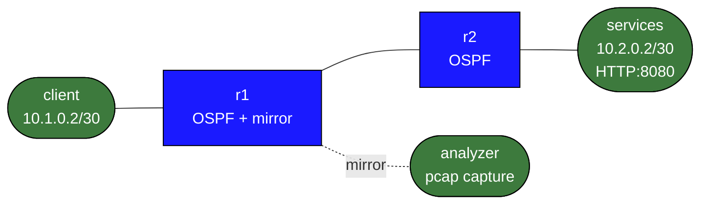

# packet-analysis-basics

This lab turns packet capture into a first-class workflow instead of a side note.
You will capture packets in three places:

- on a host to see ARP and first-hop behavior
- on a mirrored transit link to see OSPF, ICMP, and TCP between routers
- in a saved pcap so you can open the trace in Wireshark later

## Topology



## Build and Deploy

```bash
docker build -t frr-lab:local images/frr/
sudo containerlab deploy -t labs/packet-analysis-basics/topology.clab.yml
```

## What Is Prebuilt

- routed reachability between `client` and `services`
- OSPF adjacency between `r1` and `r2`
- a traffic mirror from `r1:eth2` to `analyzer:eth1`
- a Python HTTP service on `services:8080`

## Workflow

### 1. Capture ARP on the host edge

On `client`, start a short capture and then ping the default gateway:

```bash
docker exec clab-packet-analysis-basics-client \
  tcpdump -ni eth1 -c 6 arp or icmp

docker exec clab-packet-analysis-basics-client ping -c 2 10.1.0.1
```

You should see:

- ARP request for `10.1.0.1`
- ARP reply from `r1`
- ICMP echo request/reply after the MAC lookup completes

### 2. Capture OSPF hellos on the transit link

The analyzer receives mirrored frames from the `r1` to `r2` link:

```bash
docker exec clab-packet-analysis-basics-analyzer \
  tcpdump -ni eth1 -vv proto ospf
```

Look for:

- multicast destination `224.0.0.5`
- Hello packets sent every 10 seconds
- router IDs `10.0.0.1` and `10.0.0.2`

### 3. Capture ICMP across the routed path

Start a filtered capture on `analyzer`, then generate ICMP from `client` toward `r2`:

```bash
docker exec clab-packet-analysis-basics-analyzer \
  tcpdump -ni eth1 -vv icmp

docker exec clab-packet-analysis-basics-client ping -c 3 10.2.0.1
```

Notice:

- TTL is one hop lower on the mirrored transit link than on the originating host
- the analyzer sees routed ICMP, not the client-side ARP exchange

### 4. Capture a TCP three-way handshake

Generate an HTTP request from `client`:

```bash
docker exec clab-packet-analysis-basics-client \
  bash -lc 'printf "GET / HTTP/1.0\r\n\r\n" | nc 10.2.0.2 8080'
```

On `analyzer`, capture just TCP port 8080:

```bash
docker exec clab-packet-analysis-basics-analyzer \
  tcpdump -ni eth1 -vv tcp port 8080
```

Identify:

- SYN
- SYN/ACK
- ACK
- HTTP payload packets
- FIN/ACK teardown

### 5. Save a pcap for Wireshark

```bash
docker exec clab-packet-analysis-basics-analyzer \
  tcpdump -ni eth1 -w /tmp/packet-analysis-basics.pcap -c 100

docker cp clab-packet-analysis-basics-analyzer:/tmp/packet-analysis-basics.pcap /tmp/
```

Open `/tmp/packet-analysis-basics.pcap` in Wireshark and compare:

- OSPF control-plane packets
- ICMP reachability tests
- TCP session setup and teardown

## Verification Commands

```bash
docker exec clab-packet-analysis-basics-r1 vtysh -c "show ip ospf neighbor"
docker exec clab-packet-analysis-basics-r1 ip route
docker exec clab-packet-analysis-basics-client ping -c 2 10.2.0.1
docker exec clab-packet-analysis-basics-services ss -ltn
```

## What This Lab Teaches

- packet capture location changes what story you can tell
- mirrored transit traffic is useful for routing and application forensics
- packet analysis is not separate from routing knowledge; it proves what the control plane is doing
