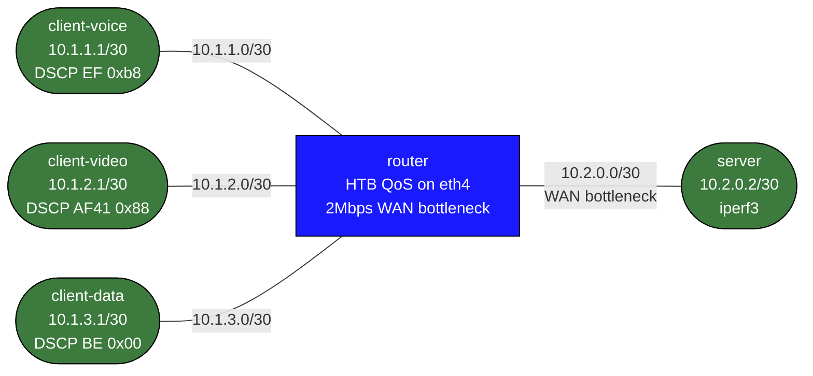

# qos-enterprise — Linux tc QoS Lab

Demonstrates enterprise traffic classification and scheduling using Linux `tc`:
DSCP marking, HTB (Hierarchical Token Bucket) scheduling, WRED (Weighted Random
Early Detection), and SFQ (Stochastic Fair Queuing).

## Build the image first

```bash
docker build -t qos-lab:local labs/qos-enterprise/
```

## How to use this lab

This is a **practice lab**, not a tutorial. The environment is pre-built;
you produce the configuration or the diagnosis from the objectives.
**Predict each result before you verify**, and treat the challenge
questions as the real test.

## Topology



The router's `eth4` is the WAN bottleneck — all three client streams converge
here and compete for 2Mbps. QoS shapes and prioritizes this egress queue.

## DSCP / PHB Reference

| Class | PHB | DSCP Value | ToS Byte | Traffic Type         | Behavior                       |
|-------|-----|-----------|----------|----------------------|--------------------------------|
| EF    | 46  | DSCP 46   | 0xb8     | VoIP / real-time     | Strict priority, low latency   |
| AF41  | 34  | DSCP 34   | 0x88     | Video streaming      | Assured bandwidth, WRED        |
| CS3   | 24  | DSCP 24   | 0x60     | Call signaling       | (not used in this lab)         |
| AF11  | 10  | DSCP 10   | 0x28     | Data (high-priority) | (not used in this lab)         |
| BE    |  0  | DSCP  0   | 0x00     | Default / bulk data  | Best effort, no guarantees     |

DSCP is encoded in the upper 6 bits of the IP ToS byte:
`ToS = DSCP << 2`. The lower 2 bits are ECN and are masked out during
classification (`mask 0xfc`).

## HTB Class Hierarchy on router eth4

```
root (1:) HTB — default class 1:30 (unclassified → data)
└── 1:1   total 2Mbps ceiling
    ├── 1:10  Voice  EF   DSCP 46  rate 800kbps  ceil 2Mbps  prio 1
    │         leaf: prio (single-band FIFO, lowest latency)
    │
    ├── 1:20  Video  AF41 DSCP 34  rate 600kbps  ceil 2Mbps  prio 2
    │         leaf: GRED (WRED AQM — early drop before queue fills)
    │           min=5000B  max=40000B  prob=10%  limit=50000B
    │
    └── 1:30  Data   BE   DSCP  0  rate 600kbps  ceil 2Mbps  prio 3
              leaf: SFQ  (stochastic fair queuing between flows)
```

Borrowing: each class can borrow bandwidth up to 2Mbps (its `ceil`). HTB
grants borrows in priority order — voice borrows first, then video, then data.

## Node Reference

| Node         | Interface | IP Address   | Traffic                        |
|--------------|-----------|--------------|--------------------------------|
| client-voice | eth1      | 10.1.1.1/30  | UDP 500kbps, DSCP EF (0xb8)   |
| router       | eth1      | 10.1.1.2/30  | —                              |
| client-video | eth1      | 10.1.2.1/30  | UDP 1Mbps, DSCP AF41 (0x88)   |
| router       | eth2      | 10.1.2.2/30  | —                              |
| client-data  | eth1      | 10.1.3.1/30  | TCP flood (4 streams), DSCP BE |
| router       | eth3      | 10.1.3.2/30  | —                              |
| router       | eth4      | 10.2.0.1/30  | QoS enforcement point          |
| server       | eth1      | 10.2.0.2/30  | iperf3 server                  |

## Lab Tasks

### Task 1 — Deploy and observe congestion WITHOUT QoS

```bash
# Deploy the lab
sudo containerlab deploy -t labs/qos-enterprise/topology.clab.yml

# Wait ~15 seconds for iperf3 clients to start, then watch the server logs
docker exec -it clab-qos-enterprise-server tail -f /tmp/iperf3-server.log
```

The data client floods the 2Mbps WAN link with TCP. Without QoS, voice and
video are crowded out by the bulk data stream. You will see the voice client
reporting packet loss and jitter.

Check voice client stats:
```bash
docker exec -it clab-qos-enterprise-client-voice tail -f /tmp/iperf3-voice.log
```

Look for `lost/total` in the UDP report — high loss means voice is unprotected.

### Task 2 — Apply QoS and observe protection

```bash
# Enable the HTB QoS policy on the router's WAN interface (eth4)
docker exec -it clab-qos-enterprise-router bash /qos-apply.sh
```

After applying QoS, watch the voice client log again. The voice stream should
now show very low or zero packet loss because it is guaranteed 800kbps and gets
strict priority over video and data.

### Task 3 — Inspect QoS statistics

```bash
# View class hierarchy, byte counts, and drop counters
docker exec -it clab-qos-enterprise-router bash /qos-show.sh
```

Key fields to observe:
- **Sent bytes/packets**: cumulative traffic forwarded by this class
- **dropped**: packets discarded (congestion — class is full)
- **overlimits**: times the class tried to exceed its guaranteed rate
- **tokens**: HTB token bucket level (higher = more burst capacity)
- **lended/borrowed**: inter-class bandwidth sharing

For class 1:20 (video, GRED), look for `early` drops — these are packets RED
discarded proactively before the queue was full. This is AQM working correctly.

### Task 4 — Run individual test streams

You can also fire one-off iperf3 streams to test specific DSCP classes:

```bash
# Voice-class test: UDP 800kbps, DSCP EF
docker exec -it clab-qos-enterprise-client-voice \
    iperf3 -c 10.2.0.2 -u -b 800k -t 30 -S 0xb8

# Video-class test: UDP 1.5Mbps, DSCP AF41 (above guarantee — tests borrowing)
docker exec -it clab-qos-enterprise-client-video \
    iperf3 -c 10.2.0.2 -u -b 1500k -t 30 -S 0x88

# Data-class test: TCP, DSCP BE
docker exec -it clab-qos-enterprise-client-data \
    iperf3 -c 10.2.0.2 -b 0 -t 30 -S 0x00
```

### Task 5 — Observe DSCP classification with tcpdump

Capture packets on the router's WAN interface and verify DSCP markings:

```bash
# Open a bash shell on the router
docker exec -it clab-qos-enterprise-router bash

# Capture and display DSCP (ToS) field for traffic leaving toward the server
tcpdump -i eth4 -v ip | grep -E 'tos|length' | head -40
```

Look for:
- `tos 0xb8` — voice traffic (EF)
- `tos 0x88` — video traffic (AF41)
- `tos 0x0`  — data traffic (Best Effort)

### Task 6 — Remove QoS and compare

```bash
# Remove QoS to return to uncontrolled best-effort
docker exec -it clab-qos-enterprise-router bash /qos-remove.sh

# Watch voice degrade again as data floods the link
docker exec -it clab-qos-enterprise-client-voice tail -f /tmp/iperf3-voice.log
```

### Task 7 — Experiment: Change class rates

Edit `/qos-apply.sh` inside the router container and re-apply:

```bash
docker exec -it clab-qos-enterprise-router bash

# Edit directly (vi is not installed — use cat/echo or re-bind from host)
# Remove current QoS
bash /qos-remove.sh

# Or modify the script on the host and re-bind by destroying/redeploying
# Try lowering voice guarantee to 400kbps and see when loss starts:
tc class change dev eth4 parent 1:1 classid 1:10 htb rate 400kbit ceil 2mbit burst 15k prio 1

# Check effect
bash /qos-show.sh
```

### Task 8 — Add a policing rule (rate limiting)

Policers enforce a hard cap (drop above rate) vs. shapers (delay above rate).
Add a police action to the data class to hard-limit it at 600kbps:

```bash
docker exec -it clab-qos-enterprise-router bash

# Add ingress policing on the data client's ingress interface (eth3)
tc qdisc add dev eth3 handle ffff: ingress

# Police: allow 600kbps burst 10k, drop excess
tc filter add dev eth3 parent ffff: protocol ip prio 1 \
    u32 match ip src 10.1.3.1/32 \
    police rate 600kbit burst 10k drop flowid :1

# Now run the data flood and verify it is capped
```

## Key tc Commands Reference

```bash
# Show all qdiscs on eth4
tc qdisc show dev eth4

# Show all classes with statistics
tc -s class show dev eth4

# Show all filters
tc -s filter show dev eth4

# Show a specific class (1:10 = voice)
tc -s class show dev eth4 classid 1:10

# Watch stats live (refresh every 1 second)
watch -n1 'tc -s class show dev eth4'

# Delete root qdisc (removes everything below it)
tc qdisc del dev eth4 root

# HTB: add a root qdisc with default class
tc qdisc add dev eth4 root handle 1: htb default 30

# HTB: add a parent class (aggregate 2Mbps)
tc class add dev eth4 parent 1: classid 1:1 htb rate 2mbit burst 15k

# HTB: add a leaf class
tc class add dev eth4 parent 1:1 classid 1:10 htb rate 800kbit ceil 2mbit burst 15k prio 1

# u32 filter: match DSCP 46 (EF) and send to class 1:10
tc filter add dev eth4 parent 1: protocol ip prio 10 \
    u32 match ip dsfield 0xb8 0xfc classid 1:10

# SFQ leaf qdisc (fair queuing)
tc qdisc add dev eth4 parent 1:30 handle 30: sfq perturb 10

# GRED setup (WRED)
tc qdisc add dev eth4 parent 1:20 handle 20: gred setup DPs 1 default 0 grio
tc qdisc change dev eth4 handle 20: gred \
    limit 50000 min 5000 max 40000 avpkt 1000 burst 10 probability 0.1 DP 0 prio 0

# Ingress policing
tc qdisc add dev eth3 handle ffff: ingress
tc filter add dev eth3 parent ffff: protocol ip prio 1 \
    u32 match ip src 0.0.0.0/0 \
    police rate 1mbit burst 10k drop flowid :1
```

## Destroy the lab

```bash
sudo containerlab destroy -t labs/qos-enterprise/topology.clab.yml --cleanup
```

## Challenge questions

No answers provided — reason them through.

1. Classification, marking, queuing, and policing/shaping are distinct
   stages. Trace a voice packet through all four and explain what each does
   to it (or doesn't).
2. Trust boundaries: why do you re-mark (or not trust) DSCP at the access
   edge, and what attack does trusting endpoint markings enable?
3. Policing drops; shaping buffers. For a bursty TCP application crossing a
   slow WAN link, which behaves better and why — and what's the cost of the
   one that's better?
4. Under congestion, your priority queue starves best-effort traffic. Show
   how that happens and the mechanism (queue limits / bandwidth guarantees)
   that prevents starvation while still protecting voice.
