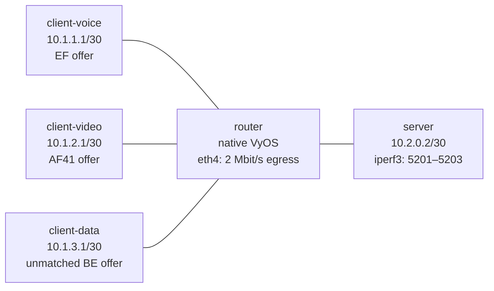

# Enterprise QoS — Practice Lab

Build a native VyOS WAN egress policy that turns one undifferentiated 2 Mbit/s
bottleneck into three measurable traffic treatments. You will replace a
classless baseline with an HTB shaper, classify EF and AF41 by DSCP, select
drop-tail, SFQ, and RED queues, and prove what the software scheduler actually
does under repeatable contention.

| Lab contract | Value |
|--------------|-------|
| Type | **Build** |
| Learned platform | Native VyOS `vyos:local` |
| Incidental platform | `qos-lab:local` Linux traffic endpoints |
| Learner-produced outcome | A saved three-treatment VyOS HTB policy on `router` `eth4` |
| Deliberate fault | One live classifier changes while the saved healthy policy remains intact |

This is a software QoS reference. VyOS renders the policy into Linux `tc`; the
lab does not emulate Cisco MQC, an ASIC, hardware queues, or hardware strict
priority.

## Topology



| Link | Endpoint A | Endpoint B | Purpose |
|------|------------|------------|---------|
| Voice | `client-voice eth1` — `10.1.1.1/30` | `router eth1` — `10.1.1.2/30` | EF source path |
| Video | `client-video eth1` — `10.1.2.1/30` | `router eth2` — `10.1.2.2/30` | AF41 source path |
| Data | `client-data eth1` — `10.1.3.1/30` | `router eth3` — `10.1.3.2/30` | Unmatched bulk path |
| WAN | `router eth4` — `10.2.0.1/30` | `server eth1` — `10.2.0.2/30` | Shaped egress |

| Node | Role | Image | Preconfigured state |
|------|------|-------|---------------------|
| `router` | Learned WAN scheduler | `vyos:local` | Addresses and an undifferentiated 2 Mbit/s TBF baseline |
| `client-voice` | Incidental generator | `qos-lab:local` | Address and default route |
| `client-video` | Incidental generator | `qos-lab:local` | Address and default route |
| `client-data` | Incidental generator | `qos-lab:local` | Address and default route |
| `server` | Incidental receiver | `qos-lab:local` | Address, default route, and iperf3 listeners on ports 5201–5203 |

The bounded offer is always the same: 500 kbit/s EF, 1 Mbit/s AF41, and
4 Mbit/s unmatched BE, all concurrently for eight seconds. Three distinct
server ports are essential: one iperf3 server process cannot service three
simultaneous tests on the same port.

## How to use this lab

This is a **practice lab**, not a tutorial. Each task gives you an
**objective** and **hints** — your job is to produce the configuration.

- **Predict before you configure.** When a task asks for a prediction,
  commit to an answer before touching the CLI. Being wrong and finding out
  why is the point.
- **Open the hints before the solution.** The solution toggle is the answer
  key — use it to check your work or when genuinely stuck, not as step one.
- **Verify like an operator.** After each task, prove the state is what you
  think it is with `show` commands before moving on.

## Prerequisites and deploy

Prepare `vyos:local` once using the
[VyOS platform notes](../../docs/platforms/vyos.md). The tested image is a
local amd64 VyOS rolling build; your ISO determines the architecture and exact
release of your local image.

Build the incidental endpoint image from the pinned Debian base and exact
direct package versions. Packages resolved transitively by `apt` remain
repository-time-dependent; the validation inventory records the set resolved
during the tested build.

```bash
docker build -t qos-lab:local labs/qos-enterprise/
```

The Dockerfile base is
`debian@sha256:7b140f374b289a7c2befc338f42ebe6441b7ea838a042bbd5acbfca6ec875818`.
It directly pins `iproute2=6.1.0-3`, `iperf3=3.12-1+deb12u2`,
`iputils-ping=3:20221126-1+deb12u1`, and `tcpdump=4.99.3-1`.

Deploy from the repository root:

```bash
./scripts/lab.sh deploy qos-enterprise
./scripts/lab.sh list qos-enterprise
```

The deploy is intentionally not the solved state. Addresses, routes, three
receivers, and a native VyOS `rate-control` policy named `QOS-BASELINE` are
preconfigured. That policy creates a 2 Mbit/s TBF on `eth4`; it shapes the
aggregate but has no traffic classes or DSCP-aware scheduling.

## Task 1 — Measure the undifferentiated baseline

**Objective:** Prove that the startup TBF limits the aggregate offer without
providing differentiated treatment, then preserve the result as your baseline.

**Predict first:** The three packets carry different DSCP values. Will any one
class have a guaranteed loss outcome while all packets share one TBF queue?
Write down your predicted loss ordering before testing.

Confirm the startup policy and the kernel mechanism:

```bash
./scripts/lab.sh cli qos-enterprise router
show configuration commands | match qos
run sudo tc -s qdisc show dev eth4
exit
```

Run the bounded offer from the host:

```bash
./labs/qos-enterprise/traffic-test.sh
```

<details markdown="1">
<summary>Hints</summary>

- Separate aggregate shaping from classification. A TBF has tokens and one
  queue, but no EF, AF41, or default child classes.
- Look for `tbf` in kernel output and add the three receiver rates reported by
  the helper.
- Do not treat one run's ordering as a class guarantee; repeat the same bounded
  test and ask whether DSCP changed the mechanism.

</details>

<details markdown="1">
<summary>Solution</summary>

No configuration is required in this task. Save the three loss percentages and
aggregate receiver throughput reported by:

```bash
./labs/qos-enterprise/traffic-test.sh
```

The validated probe offered 5.5 Mbit/s to a 2 Mbit/s TBF and observed severe
loss in every stream. Its particular loss ordering is an observation, not a QoS
contract, because the baseline has no DSCP classifiers or per-class scheduler.

</details>

<details markdown="1">
<summary>Check your work</summary>

The three receiver rates should total roughly 2 Mbit/s, well below the
5.5 Mbit/s offer, and `tc` should show a TBF rather than HTB child classes.
This resolves the prediction: DSCP bits alone do not create differentiated
treatment. A classifier must place packets into scheduler classes before the
markings affect the queue decision.

</details>

## Task 2 — Replace TBF with a native VyOS HTB shaper

**Objective:** Remove only the startup rate-control policy and build a native
VyOS shaper named `WAN-QOS` on `eth4`. The total must be 2 Mbit/s, divided into
800 kbit/s, 600 kbit/s, and 600 kbit/s guaranteed shares.

**Predict first:** Immediately after creating bandwidth classes—but before
adding DSCP matchers—which class will receive EF and AF41 traffic, and why?

<details markdown="1">
<summary>Hints</summary>

- Enter `configure` and explore `set qos policy shaper ?` completion.
- Define the policy bandwidth first, then class `10`, class `20`, and the
  `default` treatment. Their guaranteed rates must sum to the parent rate.
- Detach and delete `QOS-BASELINE`; attach the new shaper to `eth4` egress.
- Commit only after the complete candidate configuration passes validation.

</details>

<details markdown="1">
<summary>Solution</summary>

```vyos
configure
delete qos interface eth4 egress
delete qos policy rate-control QOS-BASELINE
set qos policy shaper WAN-QOS bandwidth 2mbit
set qos policy shaper WAN-QOS class 10 bandwidth 800kbit
set qos policy shaper WAN-QOS class 20 bandwidth 600kbit
set qos policy shaper WAN-QOS default bandwidth 600kbit
set qos interface eth4 egress WAN-QOS
commit
```

Do not save yet; Task 3 completes the policy first.

</details>

<details markdown="1">
<summary>Check your work</summary>

```vyos
run show configuration commands | match '^set qos'
run sudo tc -s qdisc show dev eth4
run sudo tc -s class show dev eth4
```

The kernel should now have an HTB root and three child rates totaling
2 Mbit/s. EF and AF41 still fall into the default class because no filter maps
either DSCP value yet. This resolves the prediction and separates the scheduler
hierarchy from classification.

</details>

## Task 3 — Classify and choose truthful queue treatments

**Objective:** Map EF to class 10 and AF41 to class 20, leave unmatched traffic
in the default class, then apply drop-tail to voice, SFQ to video, and RED to
bulk data. Save the complete healthy policy.

**Predict first:** The bounded AF41 source offers 1 Mbit/s to a class with a
600 kbit/s bandwidth and a 2 Mbit/s ceiling. Will the current VyOS renderer
queue all 1 Mbit/s in class 20 and borrow there, or can its generated
classifier admit traffic differently? What evidence distinguishes the two?

<details markdown="1">
<summary>Hints</summary>

- Each explicit class uses a named `match` with `ip dscp`.
- Class 10 has no explicitly configured borrowing ceiling, so its effective
  ceiling remains its 800 kbit/s bandwidth. Class 20 and default may borrow up
  to the 2 Mbit/s parent, but a ceiling establishes eligibility rather than
  proving that a particular matched flow will borrow.
- Use `queue-type drop-tail`, `queue-type fair-queue`, and
  `queue-type random-detect` once each.
- Inspect the complete u32 rule, including `police`, its rate, and its action.
  HTB priority matters only among traffic actually queued in eligible classes;
  it does not create hardware or absolute strict priority.

</details>

<details markdown="1">
<summary>Solution</summary>

Continue in configuration mode:

```vyos
set qos policy shaper WAN-QOS class 10 match VOICE ip dscp EF
set qos policy shaper WAN-QOS class 10 priority 1
set qos policy shaper WAN-QOS class 10 queue-type drop-tail
set qos policy shaper WAN-QOS class 20 ceiling 2mbit
set qos policy shaper WAN-QOS class 20 match VIDEO ip dscp AF41
set qos policy shaper WAN-QOS class 20 priority 2
set qos policy shaper WAN-QOS class 20 queue-type fair-queue
set qos policy shaper WAN-QOS default ceiling 2mbit
set qos policy shaper WAN-QOS default priority 7
set qos policy shaper WAN-QOS default queue-type random-detect
commit
save
exit
```

</details>

<details markdown="1">
<summary>Check your work</summary>

```bash
./scripts/lab.sh cmd qos-enterprise router -- tc qdisc show dev eth4
./scripts/lab.sh cmd qos-enterprise router -- tc class show dev eth4
./scripts/lab.sh cmd qos-enterprise router -- tc filter show dev eth4
```

VyOS should render class 10 as `1:a`, class 20 as `1:14`, and default as
`1:15`. Their leaves are PFIFO (drop-tail), SFQ, and RED respectively; the
filter table matches ToS `0xb8`/EF toward `1:a` with an 800 Kbit/s admission
policer and ToS `0x88`/AF41 toward `1:14` with a 600 Kbit/s admission policer.
Both use `action reclassify`: conforming packets enter the explicit class while
excess packets continue toward the default path.

This resolves the prediction for the tested renderer. During the 1 Mbit/s
AF41 offer, class `1:14` admitted its conforming share and its `borrowed`
counter stayed unchanged; reclassified excess reached default `1:15`, whose
`borrowed` counter increased. The configured class-20 ceiling makes borrowing
possible for traffic actually queued there, but does not prove this flow
borrows. Voice has no explicitly configured borrowing ceiling, so its effective
ceiling remains 800 kbit/s. HTB priority matters only among traffic actually
queued in eligible classes and is not strict priority.

</details>

## Task 4 — Prove markings, counters, shaping, and loss

**Objective:** Correlate packet markings with filter/class counter changes and
bounded loss. Distinguish evidence of a RED queue from evidence of an early RED
drop.

**Predict first:** Which `tc` class counters should increment for ToS `0xb8`,
`0x88`, and `0x00`, and should the three receiver rates exceed 2 Mbit/s in
aggregate?

Start these three simultaneous one-packet WAN captures in one host terminal:

```bash
docker exec clab-qos-enterprise-router timeout 15 \
  tcpdump -lnni eth4 -vv -c 1 \
  'udp and src host 10.1.1.1 and ip[1] = 0xb8' & ef_capture=$!
docker exec clab-qos-enterprise-router timeout 15 \
  tcpdump -lnni eth4 -vv -c 1 \
  'udp and src host 10.1.2.1 and ip[1] = 0x88' & af41_capture=$!
docker exec clab-qos-enterprise-router timeout 15 \
  tcpdump -lnni eth4 -vv -c 1 \
  'udp and src host 10.1.3.1 and ip[1] = 0x00' & be_capture=$!
wait "$ef_capture" "$af41_capture" "$be_capture"
```

While all three captures wait, run the offer in another terminal:

```bash
./labs/qos-enterprise/traffic-test.sh
./scripts/lab.sh cmd qos-enterprise router -- tc -s class show dev eth4
./scripts/lab.sh cmd qos-enterprise router -- tc -s filter show dev eth4
./scripts/lab.sh cmd qos-enterprise router -- tc -s qdisc show dev eth4
```

<details markdown="1">
<summary>Hints</summary>

- `tcpdump -vv` renders the IP ToS byte. Expect `0xb8`, `0x88`, and `0x0`.
- Compare `Sent` bytes for classes `1:a`, `1:14`, and `1:15` before and after
  the bounded offer.
- Compare `borrowed` for `1:14` and `1:15`, and inspect the admission policer
  plus `action reclassify` in each explicit u32 rule.
- The aggregate receiver rate is the sum of all three rows, not one row.
- Compare the RED leaf's total `dropped` value before and after. The checker
  requires a fresh increase but does not grade an exact `early` delta.

</details>

<details markdown="1">
<summary>Solution</summary>

Run the capture and traffic commands above, then use the automated correlation:

```bash
./labs/qos-enterprise/check.sh
```

The checker compares `tc -s qdisc` before and after its own bounded run and
requires the RED leaf under parent `1:15` to add total drops. You may separately
inspect `early`, but the grading contract does not require an exact early-drop
delta because queue averaging and timing make that value non-deterministic.

</details>

<details markdown="1">
<summary>Check your work</summary>

The captures resolve the packet-marking prediction: one source-specific packet
with each ECN-zero ToS byte reaches the WAN. Fresh class counters increase in
`1:a`, `1:14`, and `1:15`; class-20 borrowing stays unchanged while default
borrowing and RED total drops increase; receiver throughput remains near
2 Mbit/s; EF loss stays at or below 5%; and oversubscribed video and data lose
more traffic in that order. Together, this proves the renderer's admission,
reclassification, queueing, and aggregate-shaping behavior.

The generated u32 masks observed here are `00ff0000`, which match the complete
ToS byte. This validation proves only ECN-zero `0xb8` and `0x88`; it does not
claim that ECN-marked variants enter the same explicit classes.

VyOS `random-detect` renders RED for the unmatched bulk treatment. This lab
uses one BE treatment and does not claim WRED differentiation among multiple
drop precedences.

</details>

## Task 5 — Diagnose and repair live classifier drift

**Objective:** Diagnose an opaque, deterministic live-policy fault from
configuration, filter, counter, and traffic evidence; repair it without
changing the saved healthy configuration.

**Predict first:** If one marked stream stops reaching its intended class but
addresses, routes, HTB rates, and the other classifier remain healthy, which
evidence source will isolate the fault fastest?

Inject the scenario and gather evidence before opening hints:

```bash
./labs/qos-enterprise/break.sh
./labs/qos-enterprise/check.sh
./scripts/lab.sh cmd qos-enterprise router -- tc -s filter show dev eth4
./scripts/lab.sh cmd qos-enterprise router -- tc -s class show dev eth4
```

<details markdown="1">
<summary>Hints</summary>

1. Compare the DSCP values from the packet capture with the live VyOS matchers
   and kernel filter table. Do not change addressing, routes, rates, or queues.
2. The saved configuration is the healthy reference. Find the single live
   classifier whose DSCP no longer agrees with the offered marking.

</details>

<details markdown="1">
<summary>Solution</summary>

The live voice matcher accepts CS6 instead of EF, so correctly marked EF
packets fall into the default treatment. Restore only that matcher with the
idempotent repair helper:

```bash
./labs/qos-enterprise/solution.sh
./labs/qos-enterprise/check.sh
```

The helper commits the live repair but deliberately does not save; the saved
healthy configuration is unchanged throughout the fault and repair.

</details>

<details markdown="1">
<summary>Check your work</summary>

The focused revalidation target is **26 passed, 0 failed**. The EF u32 filter
and class-10 counter delta reappear, the bounded EF loss returns to its healthy
envelope, and unrelated routes, HTB rates, AF41 classification, SFQ, and RED
remain unchanged. That isolates the failure to classification—not marking,
routing, aggregate shaping, or queue selection—and resolves the prediction.

</details>

## Verification

From the repository root, verify the saved end state:

```bash
./labs/qos-enterprise/check.sh
./labs/qos-enterprise/break.sh
./labs/qos-enterprise/check.sh || true
./labs/qos-enterprise/solution.sh
./labs/qos-enterprise/check.sh
```

The healthy checker covers exact inventory and images, all link addresses and
endpoint routes, three receiver ports, the exact native VyOS learned policy,
absence of the TBF baseline, the exact saved healthy policy, HTB/class/filter/
leaf kernel state, explicit admission policers and reclassification, fresh
per-class and borrowing-counter behavior, RED total-drop growth, bounded loss,
aggregate shaping, and routed health.
Failure messages are intentionally generic and do not print the hidden answer.

## Challenge questions

1. A fourth real-time class needs 300 kbit/s. Redesign the guarantees without
   exceeding the 2 Mbit/s parent, and justify which existing class gives up
   bandwidth.
2. The same policy moves to a 100 Mbit/s physical circuit with a 20 Mbit/s
   provider policer. Where should shaping occur, and what rate/burst evidence
   would you collect before choosing parameters?
3. An application re-marks every flow EF at the endpoint. Design a trust-boundary
   policy that protects legitimate voice without accepting arbitrary endpoint
   markings.
4. Replace the video UDP offer with several TCP flows. Predict how SFQ and RED
   would change fairness, loss signaling, and throughput, then define an
   experiment that distinguishes those mechanisms.
5. Explain which results from this software HTB lab transfer to an IOS-XE MQC
   policy and which must be revalidated on the target platform and hardware.

## Troubleshooting

| Symptom | Likely cause | Recovery |
|---------|--------------|----------|
| Deploy reports missing `vyos:local` | No architecture-matched VyOS image is installed | Build it using the platform notes, then redeploy |
| A client cannot reach `10.2.0.2` | Endpoint setup is incomplete or its default route is missing | Inspect `ip -br address` and `ip route`; redeploy from a clean state if setup failed |
| Traffic helper says receivers are not ready | One or more of ports 5201–5203 is not listening | Inspect `ss -lnt` and `/tmp/iperf3-*.log` on `server`; redeploy to rerun bounded setup |
| `commit` rejects the shaper | Candidate rates, policy attachment, or queue syntax is incomplete | Use VyOS `?` completion, compare the objectives, discard the candidate, and retry |
| HTB exists but all marked traffic uses default | The DSCP matchers do not agree with packet ToS values | Correlate bounded capture and `tc -s filter`; repair only the inconsistent matcher |
| Loss percentages vary between runs | UDP timing and software scheduling vary on a shared host | Use the validated envelopes and counter deltas; do not grade an exact percentage |
| RED exists but `early` does not increment | The bounded run did not cross RED's averaged threshold | Treat qdisc presence and total drops as evidence; extend only in a controlled experiment |

## Platform and image limits

- The learned node is native VyOS and the scheduler is real Linux-kernel HTB,
  PFIFO, SFQ, RED, and u32 behavior rendered by VyOS.
- This is not Cisco MQC syntax and makes no ASIC, hardware queue, hardware
  strict-priority, scale, latency-SLA, or production-capacity claim.
- HTB priority affects borrowing only among traffic actually queued in
  eligible classes; it is not absolute strict priority. The voice class has no
  explicitly configured borrowing ceiling, so its effective ceiling remains
  800 kbit/s.
- The traffic test is IPv4 and uses synthetic UDP offers. It does not validate
  IPv6 classification, TCP application quality, or a production codec.
- The base and four direct endpoint package versions are pinned. Transitive
  packages resolved by `apt` remain repository-time-dependent; review the
  resolved inventory and advisory status in the
  [validation record](https://github.com/jschless/networkingLabs/blob/main/labs/qos-enterprise/VALIDATION.md);
  pinned versions still need periodic security review.

Destroy and remove generated artifacts when finished:

```bash
./scripts/lab.sh destroy qos-enterprise
```
